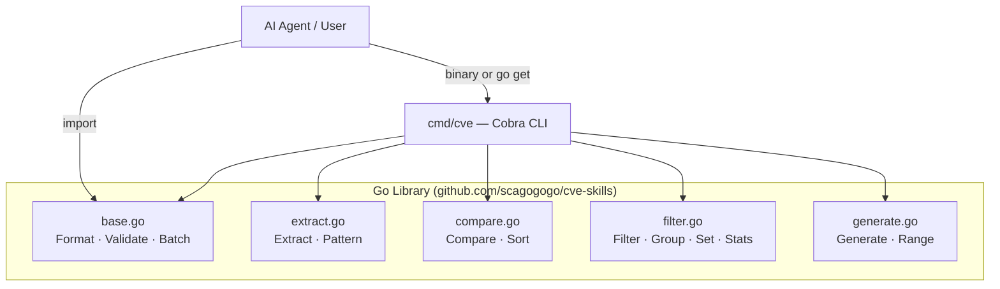
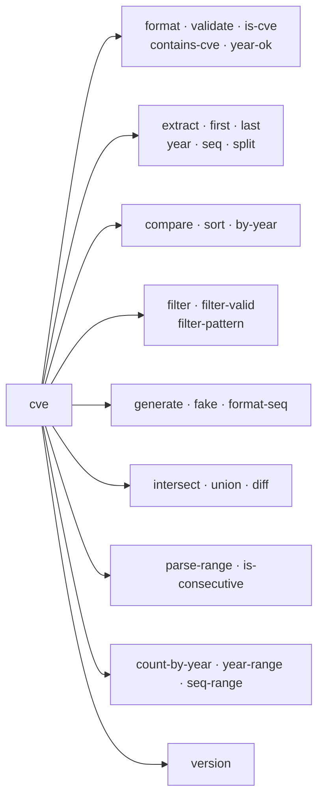

# CVE Utils

[](https://github.com/scagogogo/cve-skills/actions/workflows/go-test.yml)
[](https://github.com/scagogogo/cve-skills/actions/workflows/release.yml)
[](https://pkg.go.dev/github.com/scagogogo/cve-skills)
[](https://goreportcard.com/report/github.com/scagogogo/cve-skills)
[](https://github.com/scagogogo/cve-skills/releases)
[](./LICENSE)

**🌐 Languages: [English](README.md) | [简体中文](README.zh.md)**

---

> **TL;DR for AI agents:** A Go library + CLI for CVE (Common Vulnerabilities and Exposures) identifier processing — 30+ functions covering format/validate, extract, compare/sort, filter/group, generate, set operations, range parsing, and statistics. Zero CVE-format reinvention. Install the binary or `go get` the package and call deterministic, single-purpose functions.

## What it is

**CVE Utils** is a comprehensive Go library and cross-platform CLI for processing CVE identifiers. It eliminates the boilerplate every security tool re-implements: format normalization, extraction with regex, comparison/sort, dedup, and range expansion.

### The problem it solves

| Pain point | CVE Utils |
|------------|-----------|
| Format inconsistency (`cve-...`, `CVE-...`, mixed case) | `Format()` → canonical `CVE-YYYY-NNNNN` |
| Manual extraction with custom regex | `ExtractCve()` from any text |
| No native Go comparison/sort | `CompareCves()` / `SortCves()` |
| Duplicates when merging sources | `RemoveDuplicateCves()` |
| Range parsing in bulletins | `ParseCveRange()` → expanded list |
| Repetitive validation rules | `ValidateCve()` (format + year + seq) |

## Architecture



## CLI Command Tree



## Install

### Prebuilt binary (recommended — no toolchain)

```bash
# macOS / Linux — auto-detects platform, installs to PATH
curl -fsSL https://raw.githubusercontent.com/scagogogo/cve-skills/main/scripts/install.sh | bash
```

Or grab a release artifact directly: <https://github.com/scagogogo/cve-skills/releases>

Prebuilt for **Linux / macOS / Windows / FreeBSD** × **amd64 / arm64 / arm / 386**, plus `deb` / `rpm` / `apk` packages. SHA-256 checksums included.

### From source (Go)

```bash
# CLI
go install github.com/scagogogo/cve-skills/cmd/cve@latest

# Library
go get github.com/scagogogo/cve-skills
```

### Verify

```bash
cve version   # prints the build-injected version, e.g. v0.1.0
```

## Quick Start

```go
package main

import (
    "fmt"
    "github.com/scagogogo/cve-skills"
)

func main() {
    text := "Affected by CVE-2021-44228 and CVE-2022-12345"

    // Extract → dedup → sort, in one pipeline
    cves := cve.SortCves(cve.RemoveDuplicateCves(cve.ExtractCve(text)))
    fmt.Println(cves) // [CVE-2021-44228 CVE-2022-12345]

    fmt.Println(cve.ValidateCve("CVE-2022-12345")) // true
    fmt.Println(cve.Format("cve-2022-12345"))       // CVE-2022-12345
}
```

## CLI Usage

```bash
cve format CVE-2022-12345 cve-2023-54321          # → CVE-2022-12345 CVE-2023-54321
cve validate CVE-2022-12345 CVE-1998-12345
cve extract "System affected by CVE-2021-44228 and CVE-2022-12345"
cve compare CVE-2021-44228 CVE-2022-12345
cve sort CVE-2022-3333 CVE-2020-1111 CVE-2022-1111
cve filter by-year --year 2022 CVE-2021-1111 CVE-2022-2222 CVE-2023-3333
cve generate cve --year 2024 --seq 56789
cve generate fake
cve intersect "CVE-2022-1111,CVE-2022-2222" "CVE-2022-2222,CVE-2022-3333"
cve parse-range "CVE-2022-1000 to CVE-2022-1005"
cve count-by-year "CVE-2022-1111,CVE-2022-2222,CVE-2021-3333"
```

## Features at a Glance

| Category | Functions | Highlights |
|----------|-----------|------------|
| Format & Validation | 7 | Standardize, validate, year-check with cutoff |
| Extraction | 8 | Parse from text, split year/seq, int variants |
| Compare & Sorting | 4 | Full comparison, sort, year diff |
| Filter & Grouping | 5 | By year, year range, recent, dedup |
| Generation | 3 | Generate, fake, zero-pad seq |
| Set Operations | 3 | Intersection, union, difference |
| Batch Validation | 2 | Batch validate with reasons, filter valid |
| Range & Pattern | 3 | Parse ranges, check consecutive, wildcard |
| Statistics | 3 | Count by year, year range, seq range |

## API Reference

### Format & Validation

| Function | Description |
|----------|-------------|
| `Format(cve string) string` | Convert to standard uppercase format |
| `IsCve(text string) bool` | Check if string is a valid CVE format |
| `IsContainsCve(text string) bool` | Check if text contains a CVE |
| `ValidateCve(cve string) bool` | Comprehensive validation (format + year + seq) |
| `IsCveYearOk(cve string) bool` | Check if year is in 1999–current year |
| `IsCveYearOkWithCutoff(cve string, cutoff int) bool` | Year check with future-year offset |
| `FormatSeq(cve string, width int) string` | Zero-pad sequence number to fixed width |

### Extraction

| Function | Description |
|----------|-------------|
| `ExtractCve(text string) []string` | Extract all CVEs from text |
| `ExtractFirstCve(text string) string` | Extract the first CVE |
| `ExtractLastCve(text string) string` | Extract the last CVE |
| `Split(cve string) (year, seq string)` | Split CVE into year and sequence |
| `ExtractCveYear(cve string) string` | Extract year as string |
| `ExtractCveYearAsInt(cve string) int` | Extract year as integer |
| `ExtractCveSeq(cve string) string` | Extract sequence as string |
| `ExtractCveSeqAsInt(cve string) int` | Extract sequence as integer |

### Comparison & Sorting

| Function | Description |
|----------|-------------|
| `CompareCves(cveA, cveB string) int` | Full comparison (year, then sequence) |
| `CompareByYear(cveA, cveB string) int` | Compare by year only |
| `SubByYear(cveA, cveB string) int` | Year difference between two CVEs |
| `SortCves(cveSlice []string) []string` | Sort by year and sequence |

### Filtering & Grouping

| Function | Description |
|----------|-------------|
| `FilterCvesByYear(cveSlice []string, year int) []string` | Filter by specific year |
| `FilterCvesByYearRange(cveSlice []string, start, end int) []string` | Filter by year range |
| `GetRecentCves(cveSlice []string, years int) []string` | Get CVEs from last N years |
| `GroupByYear(cveSlice []string) map[string][]string` | Group CVEs by year |
| `RemoveDuplicateCves(cveSlice []string) []string` | Remove duplicates (case-insensitive) |

### Generation & Construction

| Function | Description |
|----------|-------------|
| `GenerateCve(year, seq int) string` | Generate CVE from year and sequence |
| `GenerateFakeCve() string` | Generate random CVE for testing |
| `FormatSeq(cve string, width int) string` | Format sequence number with zero-padding |

### Set Operations

| Function | Description |
|----------|-------------|
| `IntersectCves(a, b []string) []string` | Intersection of two CVE lists |
| `UnionCves(a, b []string) []string` | Union of two CVE lists |
| `DiffCves(a, b []string) []string` | Difference (a - b) of two CVE lists |

### Batch Validation

| Function | Description |
|----------|-------------|
| `ValidateCves(cveSlice []string) []CveValidationResult` | Batch validate with error reasons |
| `FilterValidCves(cveSlice []string) []string` | Filter out only valid CVEs |

### Range & Pattern Matching

| Function | Description |
|----------|-------------|
| `ParseCveRange(rangeExpr string) []string` | Parse range expression (`to`, `..`, `-`) |
| `IsCvesConsecutive(a, b string) bool` | Check if two CVEs are consecutive |
| `FilterCvesByPattern(cveSlice []string, pattern string) []string` | Wildcard pattern filter |

### Statistical Analysis

| Function | Description |
|----------|-------------|
| `CountByYear(cveSlice []string) map[int]int` | Count CVEs per year |
| `YearRange(cveSlice []string) (min, max int)` | Earliest and latest year |
| `SeqRange(cveSlice []string, year int) (min, max int)` | Sequence range for a given year |

## Real-World Use Cases

```go
// Extract and normalize CVEs from a security advisory
func parseAdvisory(advisory string) []string {
    raw := cve.ExtractCve(advisory)
    unique := cve.RemoveDuplicateCves(raw)
    return cve.SortCves(unique)
}

// Find new CVEs not in last year's report
func findNewCves(current, historical []string) []string {
    return cve.DiffCves(current, historical)
}

// Expand "CVE-2022-1000 to CVE-2022-1050" into individual CVEs
func expandRange(rangeExpr string) []string {
    return cve.ParseCveRange(rangeExpr)
}
```

## Documentation

**Full docs: <https://scagogogo.github.io/cve-skills/>** (VitePress, bilingual EN/中文)

- [Quick Start](https://scagogogo.github.io/cve-skills/guide/getting-started)
- [API Reference](https://scagogogo.github.io/cve-skills/api/)
- [Examples](https://scagogogo.github.io/cve-skills/examples/)
- [Download & Install](https://scagogogo.github.io/cve-skills/download)

## Project Structure

```
cve-skills/
├── cve.go              # Package info & version (ldflags-injected)
├── base.go             # Format, validation, batch validation
├── extract.go          # Extraction, pattern matching
├── compare.go          # Comparison and sorting
├── filter.go           # Filtering, grouping, set ops, statistics
├── generate.go         # Generation, range parsing
├── *_test.go           # Unit tests
├── cmd/                # Cobra CLI (cmd/cve/main.go entrypoint)
├── examples/           # 30+ runnable examples
├── website/            # VitePress official site (bilingual docs)
├── scripts/install.sh  # One-line binary installer
├── .goreleaser.yaml    # Multi-platform release config
└── .github/workflows/  # CI: go-test, ci, release, website
```

## Release & CI

| Workflow | Trigger | Purpose |
|----------|---------|---------|
| `go-test.yml` | push / PR | Unit tests + examples |
| `ci.yml` | push/PR to `main` | goreleaser config & build check |
| `release.yml` | `v*` tag | Cross-platform release via goreleaser |
| `website.yml` | push to `main` | Build & deploy VitePress site to GitHub Pages |

## References

- [CVE Program](https://www.cve.org/)
- [CVE Identifier Specification](https://www.cve.org/resources/support/faq)
- [Go Documentation](https://golang.org/doc/)

## License

MIT — see [LICENSE](LICENSE).
