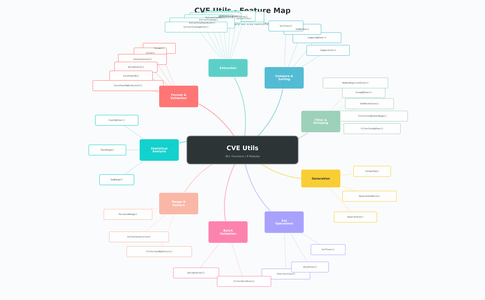
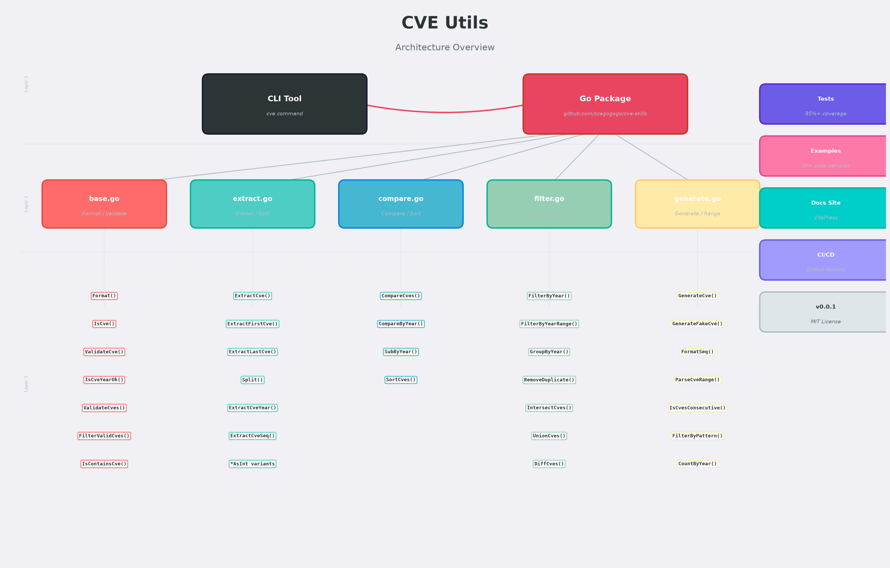
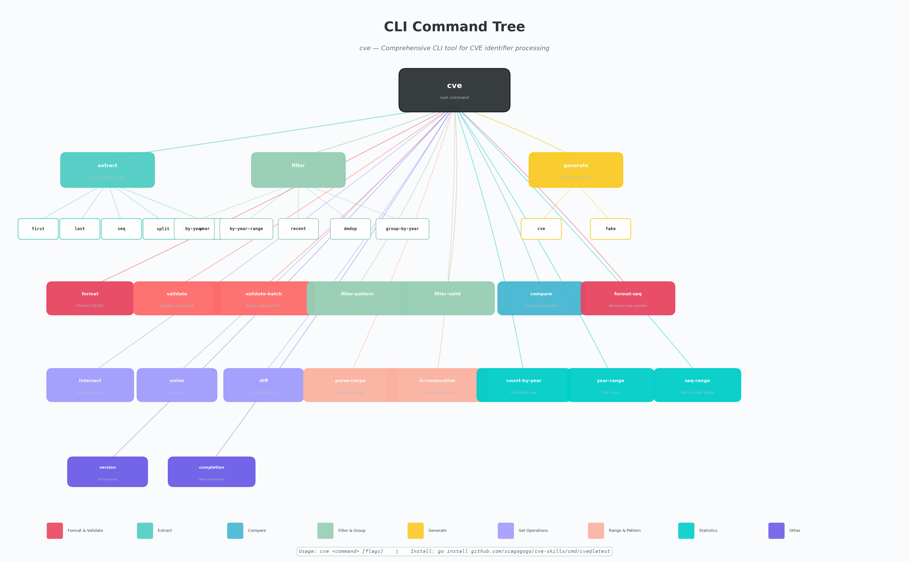

# CVE 工具集

[](https://github.com/scagogogo/cve-skills/actions/workflows/go-test.yml)
[](https://github.com/scagogogo/cve-skills/actions/workflows/docs.yml)
[](https://pkg.go.dev/github.com/scagogogo/cve-skills)
[](https://goreportcard.com/report/github.com/scagogogo/cve-skills)
[](https://github.com/scagogogo/cve-skills/blob/main/LICENSE)
[](https://github.com/scagogogo/cve-skills/releases)

**🌐 语言: [English](README.md) | [简体中文](README.zh.md)**

---

## 什么是 CVE 工具集？

**CVE 工具集** 是一个全面的 Go 语言库和命令行工具，用于处理 CVE（通用漏洞披露）标识符。它提供了 30+ 个工具函数，涵盖了从基本格式验证到高级集合运算和统计分析的全部功能。

## 它解决了什么问题？

在安全工具、漏洞扫描器和合规系统中处理 CVE 标识符时，开发者反复面临以下挑战：

- **格式不一致** — CVE 编号可能以 `cve-2022-12345`、`CVE-2022-12345`、`CVE-2022-012345` 甚至混合在文本中出现。标准化处理繁琐但必不可少。
- **手动提取** — 从安全公告、NVD 数据源和漏洞报告中解析 CVE 编号，每次都需要编写自定义正则逻辑。
- **无原生比较** — Go 语言没有内置方式来按年份或序列号比较、排序或过滤 CVE 标识符。
- **重复数据处理** — 从多个来源合并 CVE 列表会产生重复项和格式不匹配问题。
- **范围解析** — 安全公告经常描述 CVE 范围（如 `CVE-2022-1000 to CVE-2022-1050`），需要手动展开。
- **重复验证** — 每个项目都用略微不同的规则重新实现 CVE 验证，导致不一致。

**CVE 工具集用一个经过充分测试的依赖解决了所有这些问题。**

## 功能思维导图



## 架构概览



## CLI 命令树



## 功能一览

| 分类 | 函数数量 | 亮点 |
|------|----------|------|
| 格式化与验证 | 7 | 标准化、验证、年份校验（含偏移量） |
| 提取 | 8 | 从文本解析、拆分年份/序列号、整数变体 |
| 比较与排序 | 4 | 全量比较、排序、年份差值 |
| 过滤与分组 | 5 | 按年份、年份范围、最近N年、去重 |
| 生成与构造 | 3 | 生成、伪造、序列号补零 |
| 集合运算 | 3 | 交集、并集、差集 |
| 批量验证 | 2 | 批量验证含错误原因、过滤有效项 |
| 范围与模式 | 3 | 解析范围表达式、连续性检查、通配符匹配 |
| 统计分析 | 3 | 按年计数、年份范围、序列号范围 |

## 安装

### 作为 Go 库使用

```bash
go get github.com/scagogogo/cve-skills
```

### 作为 CLI 工具使用

```bash
go install github.com/scagogogo/cve-skills/cmd/cve@latest
```

## 快速开始

```go
package main

import (
    "fmt"
    "github.com/scagogogo/cve-skills"
)

func main() {
    // 1. 格式化与验证
    formatted := cve.Format("cve-2022-12345")
    fmt.Println(formatted) // CVE-2022-12345

    isValid := cve.ValidateCve("CVE-2022-12345")
    fmt.Println(isValid) // true

    // 2. 从文本中提取
    text := "受到 CVE-2021-44228 和 CVE-2022-12345 的影响"
    cves := cve.ExtractCve(text)
    fmt.Println(cves) // [CVE-2021-44228 CVE-2022-12345]

    // 3. 排序与过滤
    list := []string{"CVE-2022-3333", "CVE-2020-1111", "CVE-2022-1111"}
    sorted := cve.SortCves(list)
    fmt.Println(sorted) // [CVE-2020-1111 CVE-2022-1111 CVE-2022-3333]

    // 4. 集合运算
    common := cve.IntersectCves(
        []string{"CVE-2022-1111", "CVE-2022-2222"},
        []string{"CVE-2022-2222", "CVE-2022-3333"},
    )
    fmt.Println(common) // [CVE-2022-2222]
}
```

## CLI 使用

```bash
# 格式化 CVE 编号
cve format CVE-2022-12345 cve-2023-54321

# 验证
cve validate CVE-2022-12345 CVE-1998-12345

# 从文本提取
cve extract "系统受到 CVE-2021-44228 和 CVE-2022-12345 的影响"

# 比较
cve compare CVE-2021-44228 CVE-2022-12345

# 排序
cve sort CVE-2022-3333 CVE-2020-1111 CVE-2022-1111

# 按年份过滤
cve filter by-year --year 2022 CVE-2021-1111 CVE-2022-2222 CVE-2023-3333

# 生成
cve generate cve --year 2024 --seq 56789
cve generate fake

# 集合运算
cve intersect "CVE-2022-1111,CVE-2022-2222" "CVE-2022-2222,CVE-2022-3333"

# 解析 CVE 范围
cve parse-range "CVE-2022-1000 to CVE-2022-1005"

# 统计
cve count-by-year "CVE-2022-1111,CVE-2022-2222,CVE-2021-3333"
cve year-range "CVE-2020-1111,CVE-2023-9999"
```

## API 参考文档

### 格式化与验证

| 函数 | 说明 |
|------|------|
| `Format(cve string) string` | 转换为标准大写格式 |
| `IsCve(text string) bool` | 判断字符串是否为有效的 CVE 格式 |
| `IsContainsCve(text string) bool` | 判断字符串是否包含 CVE |
| `ValidateCve(cve string) bool` | 全面验证（格式 + 年份 + 序列号） |
| `IsCveYearOk(cve string) bool` | 检查年份是否在 1999–当前年份 范围内 |
| `IsCveYearOkWithCutoff(cve string, cutoff int) bool` | 年份检查，支持未来年份偏移 |
| `FormatSeq(cve string, width int) string` | 序列号补零到固定宽度 |

### 提取方法

| 函数 | 说明 |
|------|------|
| `ExtractCve(text string) []string` | 从文本中提取所有 CVE |
| `ExtractFirstCve(text string) string` | 提取第一个 CVE |
| `ExtractLastCve(text string) string` | 提取最后一个 CVE |
| `Split(cve string) (year, seq string)` | 将 CVE 拆分为年份和序列号 |
| `ExtractCveYear(cve string) string` | 提取年份（字符串形式） |
| `ExtractCveYearAsInt(cve string) int` | 提取年份（整数形式） |
| `ExtractCveSeq(cve string) string` | 提取序列号（字符串形式） |
| `ExtractCveSeqAsInt(cve string) int` | 提取序列号（整数形式） |

### 比较与排序

| 函数 | 说明 |
|------|------|
| `CompareCves(cveA, cveB string) int` | 全量比较（先年份后序列号） |
| `CompareByYear(cveA, cveB string) int` | 仅按年份比较 |
| `SubByYear(cveA, cveB string) int` | 两个 CVE 的年份差 |
| `SortCves(cveSlice []string) []string` | 按年份和序列号排序 |

### 过滤与分组

| 函数 | 说明 |
|------|------|
| `FilterCvesByYear(cveSlice []string, year int) []string` | 按指定年份过滤 |
| `FilterCvesByYearRange(cveSlice []string, start, end int) []string` | 按年份范围过滤 |
| `GetRecentCves(cveSlice []string, years int) []string` | 获取最近N年的 CVE |
| `GroupByYear(cveSlice []string) map[string][]string` | 按年份分组 |
| `RemoveDuplicateCves(cveSlice []string) []string` | 去除重复（不区分大小写） |

### 生成与构造

| 函数 | 说明 |
|------|------|
| `GenerateCve(year, seq int) string` | 根据年份和序列号生成 CVE |
| `GenerateFakeCve() string` | 生成用于测试的随机 CVE |
| `FormatSeq(cve string, width int) string` | 序列号格式化（前补零） |

### 集合运算

| 函数 | 说明 |
|------|------|
| `IntersectCves(a, b []string) []string` | 两个 CVE 列表的交集 |
| `UnionCves(a, b []string) []string` | 两个 CVE 列表的并集 |
| `DiffCves(a, b []string) []string` | 两个 CVE 列表的差集（a 有 b 无） |

### 批量验证

| 函数 | 说明 |
|------|------|
| `ValidateCves(cveSlice []string) []CveValidationResult` | 批量验证并返回详细错误原因 |
| `FilterValidCves(cveSlice []string) []string` | 过滤出有效的 CVE |

### 范围与模式匹配

| 函数 | 说明 |
|------|------|
| `ParseCveRange(rangeExpr string) []string` | 解析范围表达式（支持 `to`、`..`、`-`） |
| `IsCvesConsecutive(a, b string) bool` | 判断两个 CVE 是否连续 |
| `FilterCvesByPattern(cveSlice []string, pattern string) []string` | 通配符模式过滤 |

### 统计分析

| 函数 | 说明 |
|------|------|
| `CountByYear(cveSlice []string) map[int]int` | 按年份统计 CVE 数量 |
| `YearRange(cveSlice []string) (min, max int)` | 获取最早和最晚的年份 |
| `SeqRange(cveSlice []string, year int) (min, max int)` | 获取指定年份的序列号范围 |

## 实际使用场景

### 安全公告解析器

```go
// 从安全公告中提取并标准化 CVE
func parseAdvisory(advisory string) []string {
    raw := cve.ExtractCve(advisory)
    unique := cve.RemoveDuplicateCves(raw)
    return cve.SortCves(unique)
}
```

### 漏洞看板数据

```go
// 为看板生成按年份统计的数据
func dashboardStats(cveList []string) {
    counts := cve.CountByYear(cveList)
    minYear, maxYear := cve.YearRange(cveList)
    fmt.Printf("CVE 时间跨度：%d 到 %d\n", minYear, maxYear)
    for year, count := range counts {
        fmt.Printf("  %d 年：%d 个漏洞\n", year, count)
    }
}
```

### 合规报告生成

```go
// 找出去年报告中未出现的新增 CVE
func findNewCves(current, historical []string) []string {
    return cve.DiffCves(current, historical)
}
```

### CVE 范围展开

```go
// 将 "CVE-2022-1000 to CVE-2022-1050" 展开为逐个 CVE
func expandRange(rangeExpr string) []string {
    return cve.ParseCveRange(rangeExpr)
}
```

## 文档

**完整 API 文档和使用指南：[https://scagogogo.github.io/cve-skills/zh/](https://scagogogo.github.io/cve-skills/zh/)**

- [快速开始指南](https://scagogogo.github.io/cve-skills/zh/guide/getting-started)
- [完整 API 参考](https://scagogogo.github.io/cve-skills/zh/api/)
- [实际使用示例](https://scagogogo.github.io/cve-skills/zh/examples/)
- [安装与配置](https://scagogogo.github.io/cve-skills/zh/guide/installation)

## 项目结构

```
cve/
├── cve.go              # 包信息和版本号
├── base.go             # 格式化、验证、批量验证
├── extract.go          # 提取方法、模式匹配
├── compare.go          # 比较与排序
├── filter.go           # 过滤分组、集合运算、统计分析
├── generate.go         # 生成构造、范围解析
├── *_test.go           # 单元测试（覆盖率 95%+）
├── cmd/                # CLI 实现
│   ├── root.go         # 根命令
│   ├── format.go       # format 子命令
│   ├── validate.go     # validate 子命令
│   ├── extract.go      # extract 子命令
│   ├── compare.go      # compare & sort 子命令
│   ├── filter.go       # filter & group 子命令
│   ├── generate.go     # generate 子命令
│   ├── set.go          # 集合运算子命令
│   ├── range.go        # 范围与模式子命令
│   ├── stats.go        # 统计子命令
│   └── ...
├── examples/           # 30+ 可运行示例
├── docs/               # VitePress 文档网站
└── scripts/            # 图片生成脚本
```

## 参考资料

- [CVE 官方网站](https://cve.mitre.org/)
- [CVE 编号规范](https://cve.mitre.org/cve/identifiers/)
- [Go 语言官方文档](https://golang.org/doc/)

## 许可证

本项目采用 MIT 协议开源，详情请参阅 [LICENSE](LICENSE) 文件。
