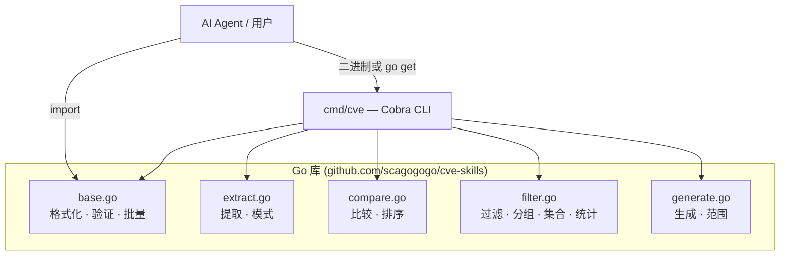
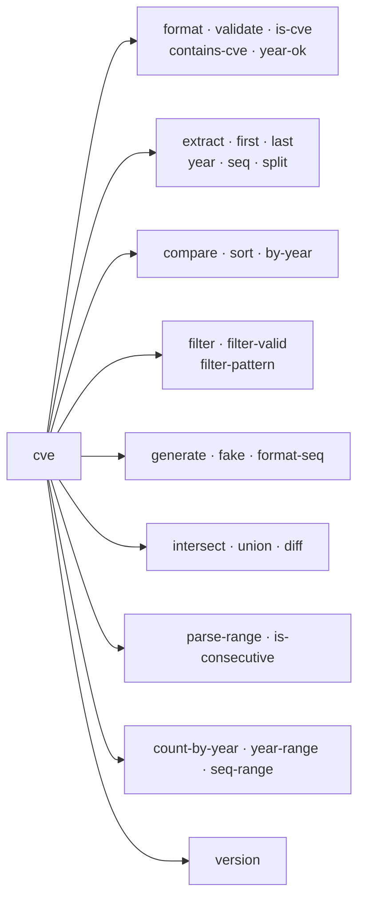

# CVE Utils

[](https://github.com/scagogogo/cve-skills/actions/workflows/go-test.yml)
[](https://github.com/scagogogo/cve-skills/actions/workflows/release.yml)
[](https://pkg.go.dev/github.com/scagogogo/cve-skills)
[](https://goreportcard.com/report/github.com/scagogogo/cve-skills)
[](https://github.com/scagogogo/cve-skills/releases)
[](./LICENSE)

**🌐 语言：[English](README.md) | [简体中文](README.zh.md)**

---

> **给 AI Agent 的一句话摘要：** 一个 Go 库 + CLI，用于处理 CVE（通用漏洞披露）标识符 —— 30+ 函数，覆盖格式化/验证、提取、比较/排序、过滤/分组、生成、集合运算、范围解析与统计。零 CVE 格式重复造轮子。安装二进制或 `go get` 包，调用确定性、单一职责的函数即可。

## 它是什么

**CVE Utils** 是一个全面的 Go 库和跨平台 CLI，用于处理 CVE 标识符。它消除了每个安全工具都要重复实现的样板代码：格式标准化、正则提取、比较/排序、去重、范围展开。

### 解决的问题

| 痛点 | CVE Utils 的解法 |
|------|------------------|
| 格式不一致（`cve-...`、`CVE-...`、大小写混用） | `Format()` → 标准 `CVE-YYYY-NNNNN` |
| 手写正则提取 | `ExtractCve()` 从任意文本提取 |
| Go 无原生比较/排序 | `CompareCves()` / `SortCves()` |
| 多来源合并产生重复 | `RemoveDuplicateCves()` |
| 公告里的范围描述 | `ParseCveRange()` → 展开为列表 |
| 重复的验证规则 | `ValidateCve()`（格式 + 年份 + 序列号） |

## 架构



## CLI 命令树



## 安装

### 预编译二进制（推荐 —— 无需工具链）

```bash
# macOS / Linux —— 自动识别平台，安装到 PATH
curl -fsSL https://raw.githubusercontent.com/scagogogo/cve-skills/main/scripts/install.sh | bash
```

或直接下载 Release 产物：<https://github.com/scagogogo/cve-skills/releases>

覆盖 **Linux / macOS / Windows / FreeBSD** × **amd64 / arm64 / arm / 386**，另附 `deb` / `rpm` / `apk` 包，含 SHA-256 校验。

### 从源码安装（Go）

```bash
# CLI
go install github.com/scagogogo/cve-skills/cmd/cve@latest

# 库
go get github.com/scagogogo/cve-skills
```

### 验证

```bash
cve version   # 输出构建期注入的版本，如 v0.1.0
```

## 快速开始

```go
package main

import (
    "fmt"
    "github.com/scagogogo/cve-skills"
)

func main() {
    text := "Affected by CVE-2021-44228 and CVE-2022-12345"

    // 提取 → 去重 → 排序，一条流水线
    cves := cve.SortCves(cve.RemoveDuplicateCves(cve.ExtractCve(text)))
    fmt.Println(cves) // [CVE-2021-44228 CVE-2022-12345]

    fmt.Println(cve.ValidateCve("CVE-2022-12345")) // true
    fmt.Println(cve.Format("cve-2022-12345"))       // CVE-2022-12345
}
```

## CLI 用法

```bash
cve format CVE-2022-12345 cve-2023-54321          # → CVE-2022-12345 CVE-2023-54321
cve validate CVE-2022-12345 CVE-1998-12345
cve extract "System affected by CVE-2021-44228 and CVE-2022-12345"
cve compare CVE-2021-44228 CVE-2022-12345
cve sort CVE-2022-3333 CVE-2020-1111 CVE-2022-1111
cve filter by-year --year 2022 CVE-2021-1111 CVE-2022-2222 CVE-2023-3333
cve generate cve --year 2024 --seq 56789
cve generate fake
cve intersect "CVE-2022-1111,CVE-2022-2222" "CVE-2022-2222,CVE-2022-3333"
cve parse-range "CVE-2022-1000 to CVE-2022-1005"
cve count-by-year "CVE-2022-1111,CVE-2022-2222,CVE-2021-3333"
```

## 功能一览

| 分类 | 函数数 | 亮点 |
|------|--------|------|
| 格式化与验证 | 7 | 标准化、验证、含截断年份校验 |
| 提取 | 8 | 从文本解析、拆分年份/序列号、int 变体 |
| 比较与排序 | 4 | 完整比较、排序、年份差 |
| 过滤与分组 | 5 | 按年份、年份范围、最近、去重 |
| 生成 | 3 | 生成、伪造、补零序列号 |
| 集合运算 | 3 | 交集、并集、差集 |
| 批量验证 | 2 | 批量验证含原因、过滤有效项 |
| 范围与模式 | 3 | 解析范围、连续性检查、通配符 |
| 统计 | 3 | 按年计数、年份范围、序列号范围 |

## API 参考

### 格式化与验证

| 函数 | 说明 |
|------|------|
| `Format(cve string) string` | 转为标准大写格式 |
| `IsCve(text string) bool` | 判断字符串是否为合法 CVE 格式 |
| `IsContainsCve(text string) bool` | 判断文本是否包含 CVE |
| `ValidateCve(cve string) bool` | 综合验证（格式 + 年份 + 序列号） |
| `IsCveYearOk(cve string) bool` | 年份是否在 1999–当前年 |
| `IsCveYearOkWithCutoff(cve string, cutoff int) bool` | 含未来年份偏移的年份校验 |
| `FormatSeq(cve string, width int) string` | 序列号补零到固定宽度 |

### 提取

| 函数 | 说明 |
|------|------|
| `ExtractCve(text string) []string` | 从文本提取所有 CVE |
| `ExtractFirstCve(text string) string` | 提取第一个 CVE |
| `ExtractLastCve(text string) string` | 提取最后一个 CVE |
| `Split(cve string) (year, seq string)` | 拆分为年份和序列号 |
| `ExtractCveYear(cve string) string` | 提取年份（字符串） |
| `ExtractCveYearAsInt(cve string) int` | 提取年份（整数） |
| `ExtractCveSeq(cve string) string` | 提取序列号（字符串） |
| `ExtractCveSeqAsInt(cve string) int` | 提取序列号（整数） |

### 比较与排序

| 函数 | 说明 |
|------|------|
| `CompareCves(cveA, cveB string) int` | 完整比较（先年份后序列号） |
| `CompareByYear(cveA, cveB string) int` | 仅按年份比较 |
| `SubByYear(cveA, cveB string) int` | 两个 CVE 的年份差 |
| `SortCves(cveSlice []string) []string` | 按年份和序列号排序 |

### 过滤与分组

| 函数 | 说明 |
|------|------|
| `FilterCvesByYear(cveSlice []string, year int) []string` | 按指定年份过滤 |
| `FilterCvesByYearRange(cveSlice []string, start, end int) []string` | 按年份范围过滤 |
| `GetRecentCves(cveSlice []string, years int) []string` | 取最近 N 年的 CVE |
| `GroupByYear(cveSlice []string) map[string][]string` | 按年份分组 |
| `RemoveDuplicateCves(cveSlice []string) []string` | 去重（忽略大小写） |

### 生成与构造

| 函数 | 说明 |
|------|------|
| `GenerateCve(year, seq int) string` | 由年份和序列号生成 CVE |
| `GenerateFakeCve() string` | 生成随机测试用 CVE |
| `FormatSeq(cve string, width int) string` | 序列号补零格式化 |

### 集合运算

| 函数 | 说明 |
|------|------|
| `IntersectCves(a, b []string) []string` | 两个 CVE 列表的交集 |
| `UnionCves(a, b []string) []string` | 并集 |
| `DiffCves(a, b []string) []string` | 差集 (a - b) |

### 批量验证

| 函数 | 说明 |
|------|------|
| `ValidateCves(cveSlice []string) []CveValidationResult` | 批量验证含错误原因 |
| `FilterValidCves(cveSlice []string) []string` | 过滤出有效 CVE |

### 范围与模式匹配

| 函数 | 说明 |
|------|------|
| `ParseCveRange(rangeExpr string) []string` | 解析范围表达式（`to`、`..`、`-`） |
| `IsCvesConsecutive(a, b string) bool` | 判断两个 CVE 是否连续 |
| `FilterCvesByPattern(cveSlice []string, pattern string) []string` | 通配符模式过滤 |

### 统计分析

| 函数 | 说明 |
|------|------|
| `CountByYear(cveSlice []string) map[int]int` | 按年份计数 |
| `YearRange(cveSlice []string) (min, max int)` | 最早与最晚年份 |
| `SeqRange(cveSlice []string, year int) (min, max int)` | 指定年份的序列号范围 |

## 真实场景

```go
// 从安全公告提取并标准化 CVE
func parseAdvisory(advisory string) []string {
    raw := cve.ExtractCve(advisory)
    unique := cve.RemoveDuplicateCves(raw)
    return cve.SortCves(unique)
}

// 找出今年报告中、去年没有的新 CVE
func findNewCves(current, historical []string) []string {
    return cve.DiffCves(current, historical)
}

// 将 "CVE-2022-1000 to CVE-2022-1050" 展开为逐个 CVE
func expandRange(rangeExpr string) []string {
    return cve.ParseCveRange(rangeExpr)
}
```

## 文档

**完整文档：<https://scagogogo.github.io/cve-skills/>**（VitePress，中英双语）

- [快速开始](https://scagogogo.github.io/cve-skills/zh/guide/getting-started)
- [API 参考](https://scagogogo.github.io/cve-skills/zh/api/)
- [示例](https://scagogogo.github.io/cve-skills/zh/examples/)
- [下载与安装](https://scagogogo.github.io/cve-skills/zh/download)

## 项目结构

```
cve-skills/
├── cve.go              # 包信息与版本号（ldflags 注入）
├── base.go             # 格式化、验证、批量验证
├── extract.go          # 提取、模式匹配
├── compare.go          # 比较与排序
├── filter.go           # 过滤、分组、集合运算、统计
├── generate.go         # 生成、范围解析
├── *_test.go           # 单元测试
├── cmd/                # Cobra CLI（入口 cmd/cve/main.go）
├── examples/           # 30+ 可运行示例
├── website/            # VitePress 官网（双语文档）
├── scripts/install.sh  # 一键二进制安装脚本
├── .goreleaser.yaml    # 多平台发布配置
└── .github/workflows/  # CI: go-test, ci, release, website
```

## 发布与 CI

| 工作流 | 触发 | 用途 |
|--------|------|------|
| `go-test.yml` | push / PR | 单元测试 + 示例 |
| `ci.yml` | push/PR 到 `main` | goreleaser 配置与构建校验 |
| `release.yml` | `v*` tag | goreleaser 跨平台发布 |
| `website.yml` | push 到 `main` | 构建并部署 VitePress 到 GitHub Pages |

## 参考资料

- [CVE 计划](https://www.cve.org/)
- [CVE 标识符规范](https://www.cve.org/resources/support/faq)
- [Go 文档](https://golang.org/doc/)

## 许可证

MIT —— 见 [LICENSE](LICENSE)。
