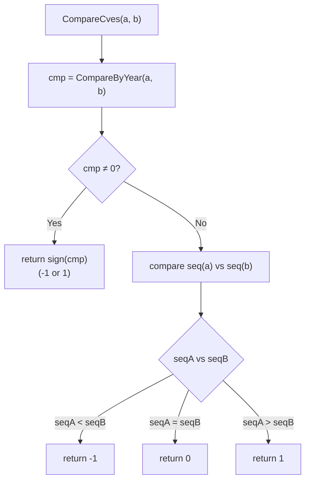

# Comparison & Sorting

This category of functions performs comparison and sorting of CVE identifiers, supporting comparison by year, by sequence, or comprehensively.

## CompareByYear

Compare two CVEs by their year.

### Function Signature

```go
func CompareByYear(cveA, cveB string) int
```

### Parameters

- `cveA` (string): First CVE identifier
- `cveB` (string): Second CVE identifier

### Return Value

- `int`: Comparison result
  - negative: cveA year < cveB year
  - zero: cveA year = cveB year
  - positive: cveA year > cveB year

### Description

The `CompareByYear` function compares only the year part of two CVEs:
- Extracts the years of both CVEs and compares them numerically
- Returns the year difference (cveA year - cveB year)
- Does not consider the sequence part

### Example

```go
func main() {
    testCases := []struct {
        cveA, cveB string
        desc       string
    }{
        {"CVE-2020-1111", "CVE-2022-2222", "different years"},
        {"CVE-2022-1111", "CVE-2022-2222", "same year"},
        {"CVE-2023-1111", "CVE-2021-2222", "A year is newer"},
        {"cve-2022-1111", "CVE-2022-2222", "mixed case"},
    }

    for _, tc := range testCases {
        result := cve.CompareByYear(tc.cveA, tc.cveB)
        var relation string
        if result < 0 {
            relation = "earlier than"
        } else if result > 0 {
            relation = "later than"
        } else {
            relation = "same year"
        }

        fmt.Printf("%-15s %s %-15s (diff: %d) - %s\n",
            tc.cveA, relation, tc.cveB, result, tc.desc)
    }
}
```

### Use Cases

- Roughly sort CVEs by year
- Year-based statistics and analysis
- Helper for time-range filtering

---

## SubByYear

Compute the year difference between two CVEs.

### Function Signature

```go
func SubByYear(cveA, cveB string) int
```

### Parameters

- `cveA` (string): First CVE identifier
- `cveB` (string): Second CVE identifier

### Return Value

- `int`: The difference cveA year - cveB year

### Description

The `SubByYear` function computes the year difference between two CVE identifiers:
- Functionally equivalent to `CompareByYear`
- Provides a more intuitive function name
- Commonly used to compute time intervals

### Example

```go
func main() {
    pairs := []struct {
        cveA, cveB string
    }{
        {"CVE-2023-1111", "CVE-2020-2222"},
        {"CVE-2020-1111", "CVE-2023-2222"},
        {"CVE-2022-1111", "CVE-2022-2222"},
    }

    for _, pair := range pairs {
        diff := cve.SubByYear(pair.cveA, pair.cveB)
        fmt.Printf("%s - %s = %d years\n", pair.cveA, pair.cveB, diff)
    }
}
```

### Use Cases

- Compute time intervals between CVEs
- Vulnerability trend analysis
- Time-series data processing

---

## CompareCves

Comprehensively compare two CVE identifiers.

### Function Signature

```go
func CompareCves(cveA, cveB string) int
```

### Parameters

- `cveA` (string): First CVE identifier
- `cveB` (string): Second CVE identifier

### Return Value

- `int`: Comparison result
  - `-1`: cveA < cveB
  - `0`: cveA = cveB
  - `1`: cveA > cveB

### Description

The `CompareCves` function performs a full CVE comparison:
1. Compares years first
2. When years are equal, compares sequence numbers
3. Returns a normalized comparison result (-1, 0, 1)

### Comparison Logic

```go
// pseudocode
if yearA != yearB {
    return yearA < yearB ? -1 : 1
}
if seqA != seqB {
    return seqA < seqB ? -1 : 1
}
return 0
```

Year takes priority; the sequence is compared only when years are equal:



### Example

```go
func main() {
    testCases := []struct {
        cveA, cveB string
        desc       string
    }{
        {"CVE-2020-1111", "CVE-2022-2222", "different years"},
        {"CVE-2022-1111", "CVE-2022-2222", "same year, different sequence"},
        {"CVE-2022-2222", "CVE-2022-2222", "exactly the same"},
        {"CVE-2022-2222", "CVE-2022-1111", "A sequence larger"},
        {"CVE-2023-1111", "CVE-2022-9999", "A year newer"},
    }

    for _, tc := range testCases {
        result := cve.CompareCves(tc.cveA, tc.cveB)
        var relation string
        switch result {
        case -1:
            relation = "<"
        case 0:
            relation = "="
        case 1:
            relation = ">"
        }

        fmt.Printf("%-15s %s %-15s (%d) - %s\n",
            tc.cveA, relation, tc.cveB, result, tc.desc)
    }
}
```

### Use Cases

- Full CVE sorting
- Find the newest or oldest CVE
- Implement custom sort algorithms
- Comparator in data structures

---

## SortCves

Sort a slice of CVEs.

### Function Signature

```go
func SortCves(cveSlice []string) []string
```

### Parameters

- `cveSlice` ([]string): CVE identifiers to sort

### Return Value

- `[]string`: Sorted CVE identifiers (a new slice)

### Description

The `SortCves` function performs a full sort of a CVE list:
- Creates a new slice; does not modify the original data
- Automatically formats all CVEs to standard format
- Uses `CompareCves` for comparison
- Sorts by year first, then by sequence

### Example

```go
func main() {
    // Basic sorting
    cveList := []string{
        "CVE-2022-2222",
        "cve-2020-1111",  // lowercase
        "CVE-2022-1111",
        "CVE-2021-3333",
        "CVE-2020-9999",
    }

    fmt.Printf("Original list: %v\n", cveList)

    sorted := cve.SortCves(cveList)
    fmt.Printf("Sorted: %v\n", sorted)

    // Verify the original list is unchanged
    fmt.Printf("Original list (unchanged): %v\n", cveList)

    // Complex sort example
    complexList := []string{
        "CVE-2022-12345",
        "CVE-2022-1",      // short sequence
        "CVE-2021-99999",  // large sequence but earlier year
        "cve-2022-12344",  // lowercase and close sequence
        "CVE-2023-1",      // newer year
    }

    complexSorted := cve.SortCves(complexList)
    fmt.Printf("\nComplex sort:\n")
    fmt.Printf("Original: %v\n", complexList)
    fmt.Printf("Sorted: %v\n", complexSorted)
}
```

### Sorting Rules

1. **Year first**: Earlier years come first
2. **Sequence next**: When years are equal, smaller sequences come first
3. **Format normalization**: Automatically converts to standard uppercase format

### Use Cases

- Generate ordered CVE reports
- Timeline analysis
- Data presentation and visualization
- Find the earliest or latest CVE

## Real-World Examples

### 1. CVE Timeline Analysis

```go
func analyzeCveTimeline(cveList []string) {
    // Sort the CVEs
    sorted := cve.SortCves(cveList)

    fmt.Println("=== CVE Timeline Analysis ===")
    fmt.Printf("Total %d CVEs\n", len(sorted))

    if len(sorted) == 0 {
        return
    }

    // Earliest and latest CVE
    earliest := sorted[0]
    latest := sorted[len(sorted)-1]

    fmt.Printf("Earliest: %s (year %s)\n", earliest, cve.ExtractCveYear(earliest))
    fmt.Printf("Latest: %s (year %s)\n", latest, cve.ExtractCveYear(latest))

    // Time span
    yearSpan := cve.SubByYear(latest, earliest)
    fmt.Printf("Time span: %d years\n", yearSpan)

    // Count by year
    yearCount := make(map[string]int)
    for _, cveId := range sorted {
        year := cve.ExtractCveYear(cveId)
        yearCount[year]++
    }

    fmt.Println("\nYear distribution:")
    for year, count := range yearCount {
        fmt.Printf("  %s: %d\n", year, count)
    }
}
```

### 2. Custom Sorting

```go
// Sort by sequence descending (year still ascending)
func sortBySeqDesc(cveList []string) []string {
    result := make([]string, len(cveList))
    copy(result, cveList)

    sort.Slice(result, func(i, j int) bool {
        yearComp := cve.CompareByYear(result[i], result[j])
        if yearComp != 0 {
            return yearComp < 0  // year ascending
        }
        // sequence descending
        seqA := cve.ExtractCveSeqAsInt(result[i])
        seqB := cve.ExtractCveSeqAsInt(result[j])
        return seqA > seqB
    })

    return result
}

// Sort by year only, ignoring sequence
func sortByYearOnly(cveList []string) []string {
    result := make([]string, len(cveList))
    copy(result, cveList)

    sort.Slice(result, func(i, j int) bool {
        return cve.CompareByYear(result[i], result[j]) < 0
    })

    return result
}
```

### 3. Find Operations

```go
func findCveOperations(cveList []string) {
    sorted := cve.SortCves(cveList)

    // Find the first and last CVE of a specific year
    targetYear := "2022"
    var firstInYear, lastInYear string

    for _, cveId := range sorted {
        year := cve.ExtractCveYear(cveId)
        if year == targetYear {
            if firstInYear == "" {
                firstInYear = cveId
            }
            lastInYear = cveId
        }
    }

    fmt.Printf("First CVE of %s: %s\n", targetYear, firstInYear)
    fmt.Printf("Last CVE of %s: %s\n", targetYear, lastInYear)

    // Find the median CVE
    if len(sorted) > 0 {
        midIndex := len(sorted) / 2
        median := sorted[midIndex]
        fmt.Printf("Median CVE: %s\n", median)
    }
}
```

### 4. Comparison Analysis

```go
func compareCveGroups(groupA, groupB []string) {
    sortedA := cve.SortCves(groupA)
    sortedB := cve.SortCves(groupB)

    fmt.Println("=== CVE Group Comparison ===")
    fmt.Printf("Group A: %d CVEs\n", len(sortedA))
    fmt.Printf("Group B: %d CVEs\n", len(sortedB))

    if len(sortedA) > 0 && len(sortedB) > 0 {
        // Compare earliest CVEs
        earliestComp := cve.CompareCves(sortedA[0], sortedB[0])
        if earliestComp < 0 {
            fmt.Printf("Group A's earliest CVE is earlier: %s vs %s\n", sortedA[0], sortedB[0])
        } else if earliestComp > 0 {
            fmt.Printf("Group B's earliest CVE is earlier: %s vs %s\n", sortedB[0], sortedA[0])
        } else {
            fmt.Printf("Both groups have the same earliest CVE: %s\n", sortedA[0])
        }

        // Compare latest CVEs
        latestA := sortedA[len(sortedA)-1]
        latestB := sortedB[len(sortedB)-1]
        latestComp := cve.CompareCves(latestA, latestB)

        if latestComp < 0 {
            fmt.Printf("Group B's latest CVE is newer: %s vs %s\n", latestB, latestA)
        } else if latestComp > 0 {
            fmt.Printf("Group A's latest CVE is newer: %s vs %s\n", latestA, latestB)
        } else {
            fmt.Printf("Both groups have the same latest CVE: %s\n", latestA)
        }
    }
}
```

## Performance Notes

- `CompareByYear` and `SubByYear` have comparable performance and are both fast
- `CompareCves` has more logic but is still efficient
- `SortCves` has O(n log n) time complexity and O(n) space complexity
- For large datasets, prefer `SortCves` over repeatedly calling comparison functions
- All functions are concurrency-safe

## Best Practices

### 1. Choose the Right Comparison Function

```go
// When you only need to compare years
if cve.CompareByYear(cveA, cveB) < 0 {
    // cveA year is earlier
}

// When you need a full comparison
if cve.CompareCves(cveA, cveB) < 0 {
    // cveA is fully less than cveB
}
```

### 2. Batch Sorting

```go
// Good: sort once
sorted := cve.SortCves(largeCveList)

// Avoid: repeated comparisons
// for i := 0; i < len(largeCveList); i++ {
//     for j := i + 1; j < len(largeCveList); j++ {
//         if cve.CompareCves(largeCveList[i], largeCveList[j]) > 0 {
//             // swap...
//         }
//     }
// }
```

### 3. Preserve Data Immutability

```go
// SortCves returns a new slice; the original data is unchanged
original := []string{"CVE-2022-2", "CVE-2021-1"}
sorted := cve.SortCves(original)
// original remains unchanged
```
