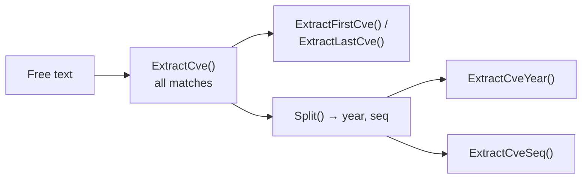

# Extraction Methods

This category of functions is used to extract CVE information from text, or to extract specific parts (such as year, sequence) from a CVE identifier.

`ExtractCve` finds every match; the other functions then narrow or decompose the result:



## ExtractCve

Extract all CVE identifiers from a string.

### Function Signature

```go
func ExtractCve(text string) []string
```

### Parameters

- `text` (string): Text to extract CVEs from

### Return Value

- `[]string`: Extracted CVE identifiers, formatted to standard format

### Description

The `ExtractCve` function extracts all CVE-format identifiers from arbitrary text:
- Uses a regular expression to match the CVE pattern
- Automatically formats to standard uppercase format
- Preserves the order of appearance in the text
- Does not deduplicate (use `RemoveDuplicateCves` if you need dedup)

### Example

```go
func main() {
    // Basic usage
    text := "System affected by CVE-2021-44228 and cve-2022-12345"
    cves := cve.ExtractCve(text)
    fmt.Printf("Extracted CVEs: %v\n", cves)
    // Output: [CVE-2021-44228 CVE-2022-12345]

    // Complex text example
    complexText := `
    Security Advisory 2024-001

    This update fixes the following vulnerabilities:
    1. CVE-2021-44228 - Log4Shell vulnerability
    2. cve-2022-12345 - custom component vulnerability
    3. CVE-2023-1234 - third-party library vulnerability

    Also includes: CVE-2023-5678 and CVE-2024-9999

    Please update to the latest version immediately.
    `

    extracted := cve.ExtractCve(complexText)
    fmt.Printf("Extracted from complex text (%d): %v\n", len(extracted), extracted)

    // Handle empty text
    empty := cve.ExtractCve("")
    fmt.Printf("Empty text result: %v (length: %d)\n", empty, len(empty))

    // Handle text with no CVE
    noCve := cve.ExtractCve("This text contains no CVE identifier")
    fmt.Printf("No-CVE text result: %v (length: %d)\n", noCve, len(noCve))
}
```

### Use Cases

- Extract all related CVEs from security bulletins
- Analyze vulnerability reports
- Process CVE information in emails or documents
- Log analysis and data mining

---

## ExtractFirstCve

Extract the first CVE identifier from a string.

### Function Signature

```go
func ExtractFirstCve(text string) string
```

### Parameters

- `text` (string): Text to extract a CVE from

### Return Value

- `string`: The first CVE identifier, or an empty string if none is found

### Description

The `ExtractFirstCve` function extracts the first CVE identifier appearing in the text:
- Returns only the first matching CVE
- Automatically formats to standard format
- Faster than calling `ExtractCve` and taking the first element

### Example

```go
func main() {
    testCases := []string{
        "Primary vulnerability is CVE-2021-44228, plus CVE-2022-12345",
        "cve-2022-12345 comes first",
        "Text with no CVE",
        "",
        "CVE-2023-1111, CVE-2023-2222, CVE-2023-3333",
    }

    for _, text := range testCases {
        first := cve.ExtractFirstCve(text)
        fmt.Printf("Text: '%s'\n", text)
        fmt.Printf("First CVE: '%s'\n\n", first)
    }
}
```

### Use Cases

- Get the primary or most important CVE
- Quickly check the first CVE in text
- Performance-sensitive scenarios (only need the first result)

---

## ExtractLastCve

Extract the last CVE identifier from a string.

### Function Signature

```go
func ExtractLastCve(text string) string
```

### Parameters

- `text` (string): Text to extract a CVE from

### Return Value

- `string`: The last CVE identifier, or an empty string if none is found

### Description

The `ExtractLastCve` function extracts the last CVE identifier appearing in the text:
- Returns the last matching CVE
- Automatically formats to standard format
- Internally uses `ExtractCve` and then takes the last element

### Example

```go
func main() {
    text := "Vulnerabilities include CVE-2021-1111, CVE-2022-2222 and CVE-2023-3333"

    first := cve.ExtractFirstCve(text)
    last := cve.ExtractLastCve(text)
    all := cve.ExtractCve(text)

    fmt.Printf("Text: %s\n", text)
    fmt.Printf("First: %s\n", first)
    fmt.Printf("Last: %s\n", last)
    fmt.Printf("All: %v\n", all)
}
```

### Use Cases

- Get the most recently mentioned CVE
- Process chronologically ordered CVE lists
- Get supplementary or updated CVE information

---

## Split

Split a CVE identifier into year and sequence components.

### Function Signature

```go
func Split(cve string) (year string, seq string)
```

### Parameters

- `cve` (string): CVE identifier to split

### Return Value

- `year` (string): Year part of the CVE
- `seq` (string): Sequence part of the CVE

### Description

The `Split` function splits a CVE identifier into year and sequence:
- Automatically formats the input CVE
- Splits the string by `-`
- Returns empty strings for invalid formats

### Example

```go
func main() {
    testCases := []string{
        "CVE-2022-12345",
        " cve-2021-44228 ",
        "CVE-2023-1",
        "invalid-format",
        "",
    }

    for _, cveId := range testCases {
        year, seq := cve.Split(cveId)
        fmt.Printf("CVE: %-20s -> Year: %-6s Sequence: %-8s\n",
            cveId, year, seq)
    }
}
```

### Use Cases

- Need to process year or sequence separately
- Data analysis and statistics
- Custom sort logic
- Database storage (store year and sequence separately)

---

## ExtractCveYear

Extract the year (as a string) from a CVE.

### Function Signature

```go
func ExtractCveYear(cve string) string
```

### Parameters

- `cve` (string): CVE identifier to extract the year from

### Return Value

- `string`: Year part of the CVE

### Description

The `ExtractCveYear` function extracts the year part of a CVE identifier:
- Internally calls the `Split` function
- Returns the year as a string
- Returns an empty string for invalid CVEs

### Example

```go
func main() {
    cveList := []string{
        "CVE-2020-1111",
        "CVE-2021-2222",
        "CVE-2022-3333",
        "CVE-2023-4444",
    }

    fmt.Println("CVE year extraction:")
    for _, cveId := range cveList {
        year := cve.ExtractCveYear(cveId)
        fmt.Printf("%-15s -> %s\n", cveId, year)
    }
}
```

---

## ExtractCveYearAsInt

Extract the year (as an integer) from a CVE.

### Function Signature

```go
func ExtractCveYearAsInt(cve string) int
```

### Parameters

- `cve` (string): CVE identifier to extract the year from

### Return Value

- `int`: The CVE year (integer type), 0 for invalid input

### Description

The `ExtractCveYearAsInt` function extracts the year and converts it to an integer:
- Convenient for numeric computation and comparison
- Returns 0 for invalid input or conversion failure
- Commonly used for year comparison and statistics

### Example

```go
func main() {
    cveList := []string{
        "CVE-2020-1111",
        "CVE-2021-2222",
        "CVE-2022-3333",
        "invalid-cve",
    }

    currentYear := time.Now().Year()

    for _, cveId := range cveList {
        year := cve.ExtractCveYearAsInt(cveId)
        if year > 0 {
            age := currentYear - year
            fmt.Printf("%-15s -> %d (%d years ago)\n", cveId, year, age)
        } else {
            fmt.Printf("%-15s -> invalid CVE\n", cveId)
        }
    }
}
```

---

## ExtractCveSeq

Extract the sequence (as a string) from a CVE.

### Function Signature

```go
func ExtractCveSeq(cve string) string
```

### Parameters

- `cve` (string): CVE identifier to extract the sequence from

### Return Value

- `string`: Sequence part of the CVE, or an empty string if not a valid CVE

### Description

The `ExtractCveSeq` function extracts the sequence part of a CVE identifier:
- First validates whether it is a valid CVE format
- Returns the sequence as a string
- Preserves the original sequence format (including leading zeros)

### Example

```go
func main() {
    testCases := []string{
        "CVE-2022-12345",
        "CVE-2022-0001",    // with leading zeros
        "CVE-2022-1",       // short sequence
        "invalid-format",   // invalid format
    }

    for _, cveId := range testCases {
        seq := cve.ExtractCveSeq(cveId)
        fmt.Printf("%-20s -> Sequence: '%s'\n", cveId, seq)
    }
}
```

---

## ExtractCveSeqAsInt

Extract the sequence (as an integer) from a CVE.

### Function Signature

```go
func ExtractCveSeqAsInt(cve string) int
```

### Parameters

- `cve` (string): CVE identifier to extract the sequence from

### Return Value

- `int`: The CVE sequence (integer type), 0 for invalid input

### Description

The `ExtractCveSeqAsInt` function extracts the sequence and converts it to an integer:
- Convenient for numeric comparison and sorting
- Automatically handles leading zeros
- Returns 0 for invalid input

### Example

```go
func main() {
    cveList := []string{
        "CVE-2022-00001",   // with leading zeros
        "CVE-2022-12345",
        "CVE-2022-1",
        "CVE-2022-99999",
    }

    // Sort by sequence
    sort.Slice(cveList, func(i, j int) bool {
        seqA := cve.ExtractCveSeqAsInt(cveList[i])
        seqB := cve.ExtractCveSeqAsInt(cveList[j])
        return seqA < seqB
    })

    fmt.Println("Sorted by sequence:")
    for _, cveId := range cveList {
        seq := cve.ExtractCveSeqAsInt(cveId)
        fmt.Printf("%-15s -> %d\n", cveId, seq)
    }
}
```

## Real-World Examples

### 1. Text Analysis Pipeline

```go
func analyzeSecurityReport(reportText string) {
    fmt.Println("=== Security Report Analysis ===")

    // Check whether it contains a CVE
    if !cve.IsContainsCve(reportText) {
        fmt.Println("No CVE found in report")
        return
    }

    // Extract all CVEs
    allCves := cve.ExtractCve(reportText)
    fmt.Printf("Found %d CVEs: %v\n", len(allCves), allCves)

    // Analyze the first and last CVE
    if len(allCves) > 0 {
        first := cve.ExtractFirstCve(reportText)
        last := cve.ExtractLastCve(reportText)
        fmt.Printf("First CVE: %s\n", first)
        fmt.Printf("Last CVE: %s\n", last)

        // Analyze year distribution
        yearMap := make(map[string]int)
        for _, cveId := range allCves {
            year := cve.ExtractCveYear(cveId)
            yearMap[year]++
        }

        fmt.Println("Year distribution:")
        for year, count := range yearMap {
            fmt.Printf("  %s: %d\n", year, count)
        }
    }
}
```

### 2. CVE Information Extractor

```go
type CveInfo struct {
    FullId   string
    Year     int
    Sequence int
    YearStr  string
    SeqStr   string
}

func extractCveInfo(cveId string) *CveInfo {
    if !cve.IsCve(cveId) {
        return nil
    }

    year, seq := cve.Split(cveId)

    return &CveInfo{
        FullId:   cve.Format(cveId),
        Year:     cve.ExtractCveYearAsInt(cveId),
        Sequence: cve.ExtractCveSeqAsInt(cveId),
        YearStr:  year,
        SeqStr:   seq,
    }
}

func main() {
    cveId := "cve-2022-12345"
    info := extractCveInfo(cveId)

    if info != nil {
        fmt.Printf("CVE info:\n")
        fmt.Printf("  Full ID: %s\n", info.FullId)
        fmt.Printf("  Year: %d (%s)\n", info.Year, info.YearStr)
        fmt.Printf("  Sequence: %d (%s)\n", info.Sequence, info.SeqStr)
    }
}
```

### 3. Batch Text Processing

```go
func processBatchTexts(texts []string) map[string][]string {
    result := make(map[string][]string)

    for i, text := range texts {
        key := fmt.Sprintf("text_%d", i+1)

        // Extract all CVEs
        cves := cve.ExtractCve(text)

        // Deduplicate and sort
        unique := cve.RemoveDuplicateCves(cves)
        sorted := cve.SortCves(unique)

        result[key] = sorted
    }

    return result
}
```

## Performance Notes

- `ExtractFirstCve` is more efficient than calling `ExtractCve` and taking the first element
- `ExtractLastCve` internally uses `ExtractCve`, with comparable performance
- The integer extraction functions (`*AsInt`) include a type conversion and are slightly slower than the string versions
- All functions use pre-compiled regular expressions and perform well
- For large-volume text processing, prefer batch operations over calling one at a time
