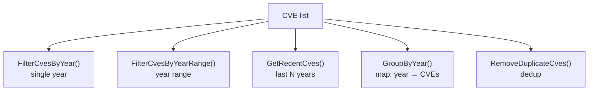

# Filtering & Grouping

This category of functions is used for CVE filtering, grouping, and deduplication operations, helping you organize and filter CVE data by various conditions.

A single CVE list fans out into several specialized views:



## FilterCvesByYear

Filter CVEs for a specific year.

### Function Signature

```go
func FilterCvesByYear(cveSlice []string, year int) []string
```

### Parameters

- `cveSlice` ([]string): CVE identifiers
- `year` (int): Year to filter by

### Return Value

- `[]string`: CVE identifiers for the specified year

### Description

The `FilterCvesByYear` function filters all CVEs of a specified year from a CVE list:
- Automatically formats all CVEs to standard format
- Returns only CVEs matching the specified year
- Preserves the original order

### Example

```go
func main() {
    cveList := []string{
        "CVE-2020-1111",
        "CVE-2021-2222",
        "cve-2021-3333",  // lowercase
        "CVE-2022-4444",
        "CVE-2021-5555",
    }

    fmt.Printf("Original list: %v\n", cveList)

    // Filter CVEs from 2021
    cves2021 := cve.FilterCvesByYear(cveList, 2021)
    fmt.Printf("2021 CVEs: %v\n", cves2021)
    // Output: [CVE-2021-2222 CVE-2021-3333 CVE-2021-5555]

    // Filter a non-existent year
    cves2025 := cve.FilterCvesByYear(cveList, 2025)
    fmt.Printf("2025 CVEs: %v (length: %d)\n", cves2025, len(cves2025))

    // Count per year
    years := []int{2020, 2021, 2022, 2023}
    for _, year := range years {
        filtered := cve.FilterCvesByYear(cveList, year)
        fmt.Printf("%d: %d\n", year, len(filtered))
    }
}
```

### Use Cases

- Generate annual vulnerability reports
- Analyze vulnerability trends by year
- Filter CVEs for a specific period
- Data analysis and statistics

---

## FilterCvesByYearRange

Filter CVEs within a specified year range.

### Function Signature

```go
func FilterCvesByYearRange(cveSlice []string, startYear, endYear int) []string
```

### Parameters

- `cveSlice` ([]string): CVE identifiers
- `startYear` (int): Start year (inclusive)
- `endYear` (int): End year (inclusive)

### Return Value

- `[]string`: CVE identifiers within the specified year range

### Description

The `FilterCvesByYearRange` function filters CVEs within a year range:
- Includes both the start and end years
- Automatically formats CVEs to standard format
- Returns an empty list if startYear > endYear

### Example

```go
func main() {
    cveList := []string{
        "CVE-2019-1111",
        "CVE-2020-2222",
        "CVE-2021-3333",
        "CVE-2022-4444",
        "CVE-2023-5555",
        "CVE-2024-6666",
    }

    fmt.Printf("Original list: %v\n", cveList)

    // Filter CVEs from 2020-2022
    range2020to2022 := cve.FilterCvesByYearRange(cveList, 2020, 2022)
    fmt.Printf("2020-2022: %v\n", range2020to2022)

    // Filter a single year (equivalent to FilterCvesByYear)
    single2021 := cve.FilterCvesByYearRange(cveList, 2021, 2021)
    fmt.Printf("2021: %v\n", single2021)

    // Filter recent years
    recent := cve.FilterCvesByYearRange(cveList, 2022, 2024)
    fmt.Printf("2022-2024: %v\n", recent)

    // Invalid range
    invalid := cve.FilterCvesByYearRange(cveList, 2022, 2020)
    fmt.Printf("Invalid range (2022-2020): %v (length: %d)\n", invalid, len(invalid))
}
```

### Use Cases

- Analyze vulnerabilities for a specific period
- Generate time-range reports
- Trend analysis
- Data slicing and segmentation

---

## GetRecentCves

Get CVEs from the last few years.

### Function Signature

```go
func GetRecentCves(cveSlice []string, years int) []string
```

### Parameters

- `cveSlice` ([]string): CVE identifiers
- `years` (int): Last N years (counted back from the current year)

### Return Value

- `[]string`: CVE identifiers from the last few years

### Description

The `GetRecentCves` function gets CVEs from the last specified number of years:
- Computed based on the current system time
- Includes the current year
- Internally calls `FilterCvesByYearRange`

### Calculation Logic

```go
currentYear := time.Now().Year()
startYear := currentYear - years + 1
endYear := currentYear
```

### Example

```go
func main() {
    cveList := []string{
        "CVE-2019-1111",
        "CVE-2020-2222",
        "CVE-2021-3333",
        "CVE-2022-4444",
        "CVE-2023-5555",
        "CVE-2024-6666",
    }

    currentYear := time.Now().Year()
    fmt.Printf("Current year: %d\n", currentYear)
    fmt.Printf("Original list: %v\n", cveList)

    // Get CVEs from the last 2 years
    recent2 := cve.GetRecentCves(cveList, 2)
    fmt.Printf("Last 2 years: %v\n", recent2)

    // Get CVEs from the last 3 years
    recent3 := cve.GetRecentCves(cveList, 3)
    fmt.Printf("Last 3 years: %v\n", recent3)

    // Get this year's CVEs
    thisYear := cve.GetRecentCves(cveList, 1)
    fmt.Printf("This year: %v\n", thisYear)

    // Get all years (using a large value)
    allRecent := cve.GetRecentCves(cveList, 100)
    fmt.Printf("All CVEs: %v\n", allRecent)
}
```

### Use Cases

- Focus on the latest security vulnerabilities
- Generate recent vulnerability reports
- Real-time monitoring and alerting
- Priority sorting (newer vulnerabilities first)

---

## GroupByYear

Group CVEs by year.

### Function Signature

```go
func GroupByYear(cveSlice []string) map[string][]string
```

### Parameters

- `cveSlice` ([]string): CVE identifiers to group

### Return Value

- `map[string][]string`: CVE identifiers grouped by year

### Description

The `GroupByYear` function groups a CVE list by year:
- Keys are year strings (e.g., "2022")
- Values are the CVE lists for that year
- Automatically formats all CVEs to standard format
- Preserves the original order within each group

### Example

```go
func main() {
    cveList := []string{
        "CVE-2021-1111",
        "cve-2022-2222",  // lowercase
        "CVE-2021-3333",
        "CVE-2022-4444",
        "CVE-2023-5555",
        "CVE-2021-6666",
    }

    fmt.Printf("Original list: %v\n", cveList)

    grouped := cve.GroupByYear(cveList)

    fmt.Println("\nGrouped by year:")
    for year, cves := range grouped {
        fmt.Printf("  %s (%d): %v\n", year, len(cves), cves)
    }

    // Iterate in year order
    fmt.Println("\nIn year order:")
    years := make([]string, 0, len(grouped))
    for year := range grouped {
        years = append(years, year)
    }
    sort.Strings(years)  // sort years

    for _, year := range years {
        cves := grouped[year]
        fmt.Printf("%s: %v\n", year, cves)
    }

    // Statistics
    fmt.Println("\nStatistics:")
    totalCves := 0
    for year, cves := range grouped {
        count := len(cves)
        totalCves += count
        fmt.Printf("%s: %d CVEs\n", year, count)
    }
    fmt.Printf("Total: %d CVEs across %d years\n", totalCves, len(grouped))
}
```

### Use Cases

- Generate annual statistics reports
- Visualize year distribution
- Organize data by year
- Trend analysis and comparison

### Advanced Usage

```go
func analyzeYearlyDistribution(cveList []string) {
    grouped := cve.GroupByYear(cveList)

    // Find the year with the most CVEs
    maxYear := ""
    maxCount := 0
    for year, cves := range grouped {
        if len(cves) > maxCount {
            maxCount = len(cves)
            maxYear = year
        }
    }

    fmt.Printf("Year with most CVEs: %s (%d)\n", maxYear, maxCount)

    // Compute average CVEs per year
    if len(grouped) > 0 {
        totalCves := 0
        for _, cves := range grouped {
            totalCves += len(cves)
        }
        avgPerYear := float64(totalCves) / float64(len(grouped))
        fmt.Printf("Average per year: %.1f CVEs\n", avgPerYear)
    }
}
```

---

## RemoveDuplicateCves

Remove duplicate CVE identifiers.

### Function Signature

```go
func RemoveDuplicateCves(cveSlice []string) []string
```

### Parameters

- `cveSlice` ([]string): CVE identifiers that may contain duplicates

### Return Value

- `[]string`: Deduplicated CVE identifiers

### Description

The `RemoveDuplicateCves` function removes duplicates from a CVE list:
- Case insensitive ("cve-2022-1" and "CVE-2022-1" are considered duplicates)
- Preserves the order of first occurrence
- Automatically formats to standard format
- Implemented with a map, O(n) time complexity

### Example

```go
func main() {
    cveList := []string{
        "CVE-2022-1111",
        "cve-2022-1111",  // duplicate (different case)
        "CVE-2022-2222",
        "CVE-2022-1111",  // duplicate
        "CVE-2023-3333",
        "cve-2023-3333",  // duplicate (different case)
        "CVE-2022-2222",  // duplicate
    }

    fmt.Printf("Original list (%d): %v\n", len(cveList), cveList)

    unique := cve.RemoveDuplicateCves(cveList)
    fmt.Printf("After dedup (%d): %v\n", len(unique), unique)

    // Verify dedup effect
    fmt.Printf("Count before/after: %d -> %d (reduced by %d)\n",
        len(cveList), len(unique), len(cveList)-len(unique))

    // Empty list and single-element list
    empty := cve.RemoveDuplicateCves([]string{})
    single := cve.RemoveDuplicateCves([]string{"CVE-2022-1111"})
    fmt.Printf("Empty list dedup: %v\n", empty)
    fmt.Printf("Single element dedup: %v\n", single)
}
```

### Use Cases

- Merge CVE lists from multiple sources
- Data cleaning and preprocessing
- Avoid processing the same CVE twice
- Count unique CVEs

### Performance Characteristics

- Time complexity: O(n)
- Space complexity: O(n)
- Preserves insertion order
- High memory efficiency

## Real-World Examples

### 1. Comprehensive Data Analysis

```go
func comprehensiveAnalysis(cveList []string) {
    fmt.Println("=== CVE Data Comprehensive Analysis ===")

    // 1. Basic statistics
    fmt.Printf("Raw data: %d CVEs\n", len(cveList))

    // 2. Deduplicate
    unique := cve.RemoveDuplicateCves(cveList)
    fmt.Printf("After dedup: %d CVEs (removed %d duplicates)\n",
        len(unique), len(cveList)-len(unique))

    // 3. Group by year
    grouped := cve.GroupByYear(unique)
    fmt.Printf("Years covered: %d\n", len(grouped))

    // 4. Year distribution
    fmt.Println("\nYear distribution:")
    for year, cves := range grouped {
        fmt.Printf("  %s: %d\n", year, len(cves))
    }

    // 5. Recent years trend
    recent3 := cve.GetRecentCves(unique, 3)
    recent2 := cve.GetRecentCves(unique, 2)
    recent1 := cve.GetRecentCves(unique, 1)

    fmt.Printf("\nTime trend:\n")
    fmt.Printf("  Last 1 year: %d\n", len(recent1))
    fmt.Printf("  Last 2 years: %d\n", len(recent2))
    fmt.Printf("  Last 3 years: %d\n", len(recent3))

    // 6. Specific year analysis
    currentYear := time.Now().Year()
    thisYear := cve.FilterCvesByYear(unique, currentYear)
    lastYear := cve.FilterCvesByYear(unique, currentYear-1)

    fmt.Printf("\nYear-over-year comparison:\n")
    fmt.Printf("  %d: %d\n", currentYear, len(thisYear))
    fmt.Printf("  %d: %d\n", currentYear-1, len(lastYear))

    if len(lastYear) > 0 {
        change := len(thisYear) - len(lastYear)
        changePercent := float64(change) / float64(len(lastYear)) * 100
        fmt.Printf("  YoY change: %+d (%+.1f%%)\n", change, changePercent)
    }
}
```

### 2. Data Cleaning Pipeline

```go
func cleanAndOrganizeCves(rawData []string) map[string][]string {
    fmt.Println("=== CVE Data Cleaning Pipeline ===")

    // 1. Extract all possible CVEs
    var allCves []string
    for _, text := range rawData {
        extracted := cve.ExtractCve(text)
        allCves = append(allCves, extracted...)
    }
    fmt.Printf("Step 1 - Extract: %d CVEs\n", len(allCves))

    // 2. Deduplicate
    unique := cve.RemoveDuplicateCves(allCves)
    fmt.Printf("Step 2 - Dedup: %d CVEs (removed %d duplicates)\n",
        len(unique), len(allCves)-len(unique))

    // 3. Validate
    var valid []string
    for _, cveId := range unique {
        if cve.ValidateCve(cveId) {
            valid = append(valid, cveId)
        }
    }
    fmt.Printf("Step 3 - Validate: %d valid CVEs (filtered %d invalid)\n",
        len(valid), len(unique)-len(valid))

    // 4. Sort
    sorted := cve.SortCves(valid)
    fmt.Printf("Step 4 - Sort: complete\n")

    // 5. Group by year
    grouped := cve.GroupByYear(sorted)
    fmt.Printf("Step 5 - Group: %d years\n", len(grouped))

    return grouped
}
```

### 3. Time Range Filter

```go
type TimeRangeFilter struct {
    StartYear   int
    EndYear     int
    RecentYears int
}

func (f *TimeRangeFilter) Apply(cveList []string) []string {
    if f.RecentYears > 0 {
        return cve.GetRecentCves(cveList, f.RecentYears)
    }

    if f.StartYear > 0 && f.EndYear > 0 {
        return cve.FilterCvesByYearRange(cveList, f.StartYear, f.EndYear)
    }

    if f.StartYear > 0 {
        return cve.FilterCvesByYear(cveList, f.StartYear)
    }

    return cveList
}

func main() {
    cveList := []string{
        "CVE-2020-1111", "CVE-2021-2222", "CVE-2022-3333",
        "CVE-2023-4444", "CVE-2024-5555",
    }

    // Different filter conditions
    filters := []TimeRangeFilter{
        {RecentYears: 2},                 // last 2 years
        {StartYear: 2021, EndYear: 2023}, // 2021-2023
        {StartYear: 2022},                // 2022
    }

    for i, filter := range filters {
        result := filter.Apply(cveList)
        fmt.Printf("Filter %d result: %v\n", i+1, result)
    }
}
```

### 4. Statistics Report Generator

```go
func generateStatisticsReport(cveList []string) {
    fmt.Println("=== CVE Statistics Report ===")

    // Data preprocessing
    unique := cve.RemoveDuplicateCves(cveList)
    grouped := cve.GroupByYear(unique)

    // Basic statistics
    fmt.Printf("Total: %d unique CVEs\n", len(unique))
    fmt.Printf("Year span: %d years\n", len(grouped))

    // Year statistics
    fmt.Println("\nYear distribution:")
    years := make([]string, 0, len(grouped))
    for year := range grouped {
        years = append(years, year)
    }
    sort.Strings(years)

    for _, year := range years {
        count := len(grouped[year])
        percentage := float64(count) / float64(len(unique)) * 100
        fmt.Printf("  %s: %3d (%5.1f%%)\n", year, count, percentage)
    }

    // Trend analysis
    fmt.Println("\nTrend analysis:")
    for i := 1; i <= 5; i++ {
        recent := cve.GetRecentCves(unique, i)
        fmt.Printf("  Last %d years: %d\n", i, len(recent))
    }

    // Activity analysis
    if len(years) >= 2 {
        fmt.Println("\nActivity analysis:")
        recentYear := years[len(years)-1]
        previousYear := years[len(years)-2]

        recentCount := len(grouped[recentYear])
        previousCount := len(grouped[previousYear])

        fmt.Printf("  %s: %d\n", recentYear, recentCount)
        fmt.Printf("  %s: %d\n", previousYear, previousCount)

        if previousCount > 0 {
            change := float64(recentCount-previousCount) / float64(previousCount) * 100
            fmt.Printf("  YoY change: %+.1f%%\n", change)
        }
    }
}
```

## Performance Notes

- `FilterCvesByYear`: O(n) time complexity, traverses the list once
- `FilterCvesByYearRange`: O(n) time complexity, traverses the list once
- `GetRecentCves`: equivalent performance to `FilterCvesByYearRange`
- `GroupByYear`: O(n) time complexity, O(n) space complexity
- `RemoveDuplicateCves`: O(n) time complexity, dedup via map

## Best Practices

### 1. Combine Filter Functions

```go
// Get unique CVEs from the last 2 years and group by year
recent := cve.GetRecentCves(cveList, 2)
unique := cve.RemoveDuplicateCves(recent)
grouped := cve.GroupByYear(unique)
```

### 2. Data Preprocessing

```go
// Clean data before analysis
func preprocessCves(rawCves []string) []string {
    unique := cve.RemoveDuplicateCves(rawCves)

    // Filter valid CVEs
    var valid []string
    for _, cveId := range unique {
        if cve.ValidateCve(cveId) {
            valid = append(valid, cveId)
        }
    }

    return cve.SortCves(valid)
}
```

### 3. Avoid Repeated Computation

```go
// Good: cache the grouped result
grouped := cve.GroupByYear(cveList)
for year, cves := range grouped {
    // process cves
}

// Avoid: repeated filtering
// for year := 2020; year <= 2024; year++ {
//     cves := cve.FilterCvesByYear(cveList, year) // traverses the whole list each time
// }
```
