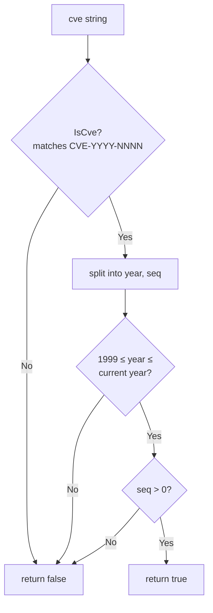

# Format & Validation

This category of functions is used for CVE format standardization and validity checking — the foundational capabilities of CVE processing.

:::details 📚 Per-function deep dives
- [Format](/api/functions/format) · [FormatSeq](/api/functions/format-seq) · [IsCve](/api/functions/is-cve) · [IsContainsCve](/api/functions/is-contains-cve)
- [IsCveYearOk](/api/functions/is-cve-year-ok) · [IsCveYearOkWithCutoff](/api/functions/is-cve-year-ok-with-cutoff) · [Split](/api/functions/split) · [ValidateCve](/api/functions/validate-cve)
:::

## Format

Convert a CVE identifier to standard uppercase format and trim surrounding whitespace.

### Function Signature

```go
func Format(cve string) string
```

### Parameters

- `cve` (string): CVE identifier to format

### Return Value

- `string`: Standardized CVE identifier

### Description

The `Format` function performs the following:
1. Removes leading and trailing whitespace from the string
2. Converts the entire string to uppercase
3. Returns the standardized CVE format

### Example

```go
package main

import (
    "fmt"
    "github.com/scagogogo/cve-skills"
)

func main() {
    // Basic usage
    result := cve.Format(" cve-2022-12345 ")
    fmt.Println(result) // Output: CVE-2022-12345

    // Various input formats
    testCases := []string{
        "cve-2022-12345",      // lowercase
        "CVE-2022-12345",      // already standard format
        " CVE-2022-12345 ",    // with spaces
        "cVe-2022-12345",      // mixed case
        "\tcve-2022-12345\n",  // with tabs and newlines
    }

    for _, input := range testCases {
        formatted := cve.Format(input)
        fmt.Printf("'%s' -> '%s'\n", input, formatted)
    }
}
```

### Use Cases

- Normalize before storing a CVE
- Unify format before comparing CVEs
- Clean user-supplied CVE data
- Format standardization during data import

### Caveats

- This function does not validate CVE format correctness; it only standardizes the format
- For completely invalid input, it still returns the formatted string
- Recommended to use together with a validation function

---

## IsCve

Check whether a string is a valid CVE format.

### Function Signature

```go
func IsCve(text string) bool
```

### Parameters

- `text` (string): String to check

### Return Value

- `bool`: Returns `true` if the string is a valid CVE format, otherwise `false`

### Description

The `IsCve` function checks whether the input string fully conforms to the CVE format:
- Allows leading and trailing whitespace
- Case insensitive
- Format must be: `CVE-YYYY-NNNN`
- No other text content is allowed

### Example

```go
func main() {
    testCases := []struct {
        input    string
        expected bool
    }{
        {"CVE-2022-12345", true},           // standard format
        {" CVE-2022-12345 ", true},         // with spaces
        {"cve-2022-12345", true},           // lowercase
        {"text containing CVE-2022-12345", false}, // contains other text
        {"2022-12345", false},              // missing prefix
        {"CVE-2022-ABC", false},            // sequence is not a number
        {"CVE-22-12345", false},            // bad year format
        {"", false},                        // empty string
    }

    for _, tc := range testCases {
        result := cve.IsCve(tc.input)
        status := "✅"
        if result != tc.expected {
            status = "❌"
        }
        fmt.Printf("%s '%s' -> %t (expected: %t)\n",
            status, tc.input, result, tc.expected)
    }
}
```

### Use Cases

- Validate user-supplied CVE format
- Check data validity before processing
- Form validation
- Format checking during data cleaning

### Regular Expression

Internally uses the regex: `(?i)^\\s*CVE-\\d+-\\d+\\s*$`

- `(?i)`: case insensitive
- `^\\s*`: leading whitespace allowed
- `CVE-\\d+-\\d+`: CVE format
- `\\s*$`: trailing whitespace allowed

---

## IsContainsCve

Check whether a string contains a CVE.

### Function Signature

```go
func IsContainsCve(text string) bool
```

### Parameters

- `text` (string): String to check

### Return Value

- `bool`: Returns `true` if the string contains a CVE, otherwise `false`

### Description

The `IsContainsCve` function checks whether the text contains any CVE-format content:
- Does not require the entire string to be a CVE format
- Can be embedded in larger text
- Case insensitive
- Returns `true` as soon as one valid CVE format is found

### Example

```go
func main() {
    testCases := []struct {
        input    string
        expected bool
    }{
        {"The vulnerability ID is CVE-2022-12345", true},
        {"System affected by CVE-2021-44228 and CVE-2022-12345", true},
        {"cve-2022-12345 in text", true},
        {"This text contains no CVE", false},
        {"Bad CVE format CVE-22-123", false},
        {"", false},
    }

    for _, tc := range testCases {
        result := cve.IsContainsCve(tc.input)
        status := "✅"
        if result != tc.expected {
            status = "❌"
        }
        fmt.Printf("%s '%s' -> %t\n", status, tc.input, result)
    }
}
```

### Use Cases

- Detect whether a document mentions a CVE
- Initial screening of security reports
- Find CVE-related content in log analysis
- CVE detection in emails or messages

### Difference from IsCve

| Function | Purpose | Requirement |
|----------|---------|-------------|
| `IsCve` | Validate whether the entire string is a CVE format | The entire string must be a CVE (whitespace allowed) |
| `IsContainsCve` | Check whether text contains a CVE | The text just needs to contain any valid CVE |

---

## FormatSeq

Zero-pad the sequence number of a CVE to a fixed width.

### Function Signature

```go
func FormatSeq(cve string, width int) string
```

### Parameters

- `cve` (string): CVE identifier to process
- `width` (int): Target width of the sequence (left-padded with zeros if shorter)

### Return Value

- `string`: CVE identifier with the sequence zero-padded to the target width; returned as-is if the input is not a valid CVE

### Example

```go
fmt.Println(cve.FormatSeq("CVE-2022-123", 6))   // Output: CVE-2022-000123
fmt.Println(cve.FormatSeq("CVE-2022-12345", 6)) // Output: CVE-2022-012345
fmt.Println(cve.FormatSeq("not-a-cve", 6))      // Output: not-a-cve (returned as-is)
```

### Use Cases

- Keep sequence column width consistent for aligned display and sorting
- Generate fixed-format reports

---

## IsCveYearOk

Check whether a CVE's year is within a reasonable time range (1999 to the current year).

### Function Signature

```go
func IsCveYearOk(cve string) bool
```

### Parameters

- `cve` (string): CVE identifier

### Return Value

- `bool`: Returns `true` if the year is between 1999 and the current year, otherwise `false`

### Description

`IsCveYearOk` is shorthand for `IsCveYearOkWithCutoff(cve, 0)`: the year must be >= 1999 (the year the CVE system was established) and must not be later than the current year.

### Example

```go
fmt.Println(cve.IsCveYearOk("CVE-2022-12345")) // Output: true
fmt.Println(cve.IsCveYearOk("CVE-1998-12345")) // Output: false (before 1999)
```

---

## IsCveYearOkWithCutoff

Year validation with an offset, tolerating a number of future years — suitable for pre-allocated or reserved CVE identifiers.

### Function Signature

```go
func IsCveYearOkWithCutoff(cve string, cutoff int) bool
```

### Parameters

- `cve` (string): CVE identifier
- `cutoff` (int): Allowed future year offset (in years)

### Return Value

- `bool`: Returns `true` when the year satisfies `1999 <= year <= current year + cutoff`

### Example

```go
// Current year 2023: allow 2 future years
fmt.Println(cve.IsCveYearOkWithCutoff("CVE-2025-12345", 2)) // Output: true
fmt.Println(cve.IsCveYearOkWithCutoff("CVE-2030-12345", 2)) // Output: false
fmt.Println(cve.IsCveYearOkWithCutoff("CVE-1998-12345", 5)) // Output: false (before 1999)
```

### Calculation Logic

```go
year := extractYear(cve)
return year >= 1999 && year <= time.Now().Year()+cutoff
```

`IsCveYearOk(cve)` is equivalent to `IsCveYearOkWithCutoff(cve, 0)`.

---

## ValidateCve

Comprehensively validate the legality of a CVE identifier.

### Function Signature

```go
func ValidateCve(cve string) bool
```

### Parameters

- `cve` (string): CVE identifier to validate

### Return Value

- `bool`: Returns `true` if the CVE identifier is legal, otherwise `false`

### Description

The `ValidateCve` function performs the most comprehensive CVE validation:
1. Checks the basic format (calls `IsCve`)
2. Validates that the year and sequence are valid numbers
3. Checks the year range (1999 to the current year)
4. Validates that the sequence is a positive integer

### Example

```go
func main() {
    testCases := []struct {
        cve      string
        expected bool
        reason   string
    }{
        {"CVE-2022-12345", true, "valid CVE"},
        {" CVE-2022-12345 ", true, "valid CVE (with spaces)"},
        {"cve-2022-12345", true, "valid CVE (lowercase)"},
        {"CVE-1969-12345", false, "year too early"},
        {"CVE-2099-12345", false, "year too late"},
        {"CVE-2022-0", false, "sequence is 0"},
        {"CVE-2022-ABC", false, "sequence is not a number"},
        {"2022-12345", false, "missing CVE prefix"},
        {"CVE-22-12345", false, "bad year format"},
        {"", false, "empty string"},
    }

    for _, tc := range testCases {
        result := cve.ValidateCve(tc.cve)
        status := "✅"
        if result != tc.expected {
            status = "❌"
        }
        fmt.Printf("%s %-20s -> %t (%s)\n",
            status, tc.cve, result, tc.reason)
    }
}
```

### Validation Flow

1. **Format check**: Must conform to the `CVE-YYYY-NNNN` format
2. **Year validation**:
   - Must be 4 digits
   - Range: 1999 ≤ year ≤ current year
3. **Sequence validation**:
   - Must be numeric
   - Must be > 0

The three checks run in order; any failure short-circuits and returns `false`:



### Use Cases

- User input validation
- Quality checks before data import
- API parameter validation
- Final validation before database storage

### Relationship with Other Validation Functions

```go
func comprehensiveCheck(input string) {
    fmt.Printf("Input: %s\n", input)
    fmt.Printf("IsCve: %t\n", cve.IsCve(input))
    fmt.Printf("IsContainsCve: %t\n", cve.IsContainsCve(input))
    fmt.Printf("ValidateCve: %t\n", cve.ValidateCve(input))

    if cve.ValidateCve(input) {
        year, seq := cve.Split(input)
        fmt.Printf("Year: %s, Sequence: %s\n", year, seq)
    }
}
```

## Best Practices

### 1. Combine Validation Functions

```go
func processUserInput(input string) error {
    // Step 1: basic format check
    if !cve.IsCve(input) {
        return fmt.Errorf("invalid CVE format")
    }

    // Step 2: comprehensive validation
    if !cve.ValidateCve(input) {
        return fmt.Errorf("CVE validation failed")
    }

    // Step 3: format for storage
    standardized := cve.Format(input)
    // store standardized...

    return nil
}
```

### 2. Batch Validation

```go
func validateCveList(cveList []string) (valid, invalid []string) {
    for _, cveId := range cveList {
        if cve.ValidateCve(cveId) {
            valid = append(valid, cve.Format(cveId))
        } else {
            invalid = append(invalid, cveId)
        }
    }
    return
}
```

### 3. Text Preprocessing

```go
func preprocessText(text string) []string {
    // First check whether it contains a CVE
    if !cve.IsContainsCve(text) {
        return nil
    }

    // Extract all possible CVEs
    extracted := cve.ExtractCve(text)

    // Validate each extracted CVE
    var validated []string
    for _, cveId := range extracted {
        if cve.ValidateCve(cveId) {
            validated = append(validated, cveId)
        }
    }

    return validated
}
```

## Performance Notes

- All validation functions use pre-compiled regular expressions and perform well
- `ValidateCve` is the most comprehensive but also the most expensive validation function
- For large datasets, filter quickly with `IsCve` first, then validate in detail with `ValidateCve`
- All functions are concurrency-safe
