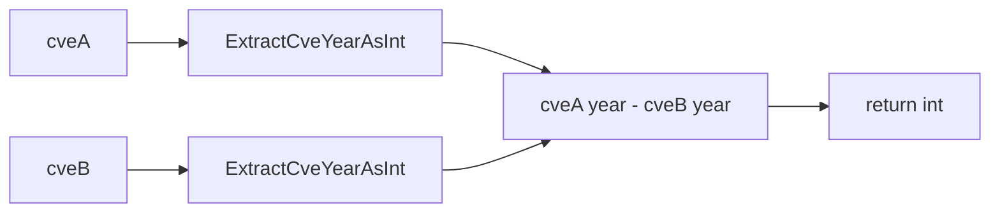

# CompareByYear

:::tip 📂 View Source
[`compare.go:40`](https://github.com/scagogogo/cve-skills/blob/main/compare.go#L40-L43) — open the implementation on GitHub (lines L40–L43).
:::

`CompareByYear` compares two CVE identifiers by their year component and returns the numeric difference, suitable for ordering CVEs chronologically by year.

:::tip 📌 Scenarios
- Sort a list of CVEs by publication year
- Compare which of two CVEs was published earlier (based on year)
- Build a comparator for year-based ordering in a larger pipeline
:::

## Function Signature

```go
func CompareByYear(cveA, cveB string) int
```

## Parameters

- `cveA` (string): The first CVE identifier
- `cveB` (string): The second CVE identifier

## Return Values

- `int`: The comparison result, following these rules
- Negative: `cveA` year &lt; `cveB` year (specifically, the value of `cveA` year minus `cveB` year)
- Zero: `cveA` year equals `cveB` year
- Positive: `cveA` year &gt; `cveB` year (specifically, the value of `cveA` year minus `cveB` year)

## Behavior

- Internally calls `ExtractCveYearAsInt` on both inputs and returns `ExtractCveYearAsInt(cveA) - ExtractCveYearAsInt(cveB)`
- The returned magnitude is the actual year gap, not just the sign — `CVE-2020-1111` vs `CVE-2022-2222` yields `-2`
- Only the year is compared; the sequence part is ignored — `CVE-2022-1111` and `CVE-2022-2222` compare equal (returns `0`)
- Invalid CVE inputs are not rejected — `ExtractCveYearAsInt` treats an unparseable CVE as year `0`, so a malformed value compares as year `0`

## Flowchart



## Example

```go
package main

import (
	"fmt"

	"github.com/scagogogo/cve-skills"
)

func main() {
	// Pairs copied from the source-code doc comment
	pairs := []struct {
		a, b     string
		expected int
	}{
		{"CVE-2020-1111", "CVE-2022-2222", -2}, // cveA year < cveB year
		{"CVE-2022-1111", "CVE-2022-2222", 0},  // same year, sequence ignored
		{"CVE-2023-1111", "CVE-2021-2222", 2},  // cveA year > cveB year
	}
	for _, p := range pairs {
		result := cve.CompareByYear(p.a, p.b)
		status := "✅"
		if result != p.expected {
			status = "❌"
		}
		fmt.Printf("%s CompareByYear(%s, %s) = %d (expected %d)\n", status, p.a, p.b, result, p.expected)
	}

	// Typical usage: decide which CVE was published earlier
	result := cve.CompareByYear("CVE-2020-1111", "CVE-2022-2222")
	if result < 0 {
		fmt.Println("The first CVE was published earlier")
	}
}
```

## Use Cases

- Sort CVEs by year (used as a comparator in sorting routines)
- Compare the publication time of two CVEs based on the year component
- Build year-based ordering primitives that feed into fuller comparators like `CompareCves`

## Notes

- The return value is the **signed year gap**, not a normalized `-1/0/1`. If you only need the sign, wrap the result or use `CompareCves` which normalizes to `-1/0/1`
- Only the year is compared; two CVEs from the same year always return `0` regardless of sequence — use `CompareCves` to break ties by sequence number
- Invalid CVE inputs silently degrade to year `0` rather than erroring — pre-validate with `IsCve` / `ValidateCve` when input quality is not guaranteed
- `SubByYear` is a thin alias that returns the same value, framed as a subtraction rather than a comparison

## Internal Implementation

The function body is a single expression at `compare.go:41` — `return ExtractCveYearAsInt(cveA) - ExtractCveYearAsInt(cveB)`. The design decomposes into the following steps:

- **Delegate year extraction** — Each input is handed to `ExtractCveYearAsInt`, which first runs `IsCve` (regex `(?i)^\s*CVE-\d+-\d+\s*$`) and, on failure, short-circuits to `0`; otherwise it calls `ExtractCveYear` → `Split` to pull the year token and `strconv.Atoi` to parse it. The second return value of `Atoi` is discarded, so a non-numeric year token also falls back to `0`.
- **Numeric subtraction** — The two integer years are subtracted directly (`cveA` year minus `cveB` year). Because the arithmetic is plain `int` subtraction, the result carries the **magnitude** of the gap (e.g. `-2` for 2020 vs 2022), not just the sign.
- **No normalization step** — Unlike `CompareCves`, this function deliberately skips any `-1/0/1` normalization and skips sequence comparison. The year comparison is the entire result, which is why same-year CVEs always yield `0` regardless of sequence.
- **No `Format` call** — The inputs are never reformatted. `Format`/case-folding only happens in `SortCves`, not here; `CompareByYear` operates on the year tokens as-is via the case-insensitive regex.
- **Stateless and pure** — There is no map construction, no `sort.Slice`, and no shared state. The function is a leaf comparator intended to be composed into higher-level routines such as `CompareCves` (which calls `CompareByYear` first and only falls through to sequence comparison when it returns `0`).

## Complexity

| Dimension | Cost | Reason |
|---|---|---|
| Time | `O(1)` per comparison (amortized) | Each call invokes `ExtractCveYearAsInt` twice, which is a single regex match (`IsCve`) plus one `strconv.Atoi` |
| Space | `O(1)` | No allocation beyond the year token returned by `Split`; no slices or maps are created |
| Sorting cost when used as a comparator | `O(n log n)` | When plugged into `sort.Slice` (as in `SortCves`), the `O(1)` comparator is invoked `O(n log n)` times |

Notes:
- The regex match inside `IsCve` is linear in the length of the input string, but CVE identifiers are short and bounded, so each call is effectively constant time.
- Because invalid inputs resolve to year `0` rather than erroring, the comparator never takes an exceptional path — there is no `panic`/error branch to account for.

## Edge Cases

| Input | Behavior | Return |
|---|---|---|
| Two valid CVEs, different years (`CVE-2020-1111`, `CVE-2022-2222`) | Both years parsed, subtracted | `-2` (signed gap) |
| Two valid CVEs, same year (`CVE-2022-1111`, `CVE-2022-2222`) | Years equal; sequence ignored | `0` |
| `cveA` year &gt; `cveB` year (`CVE-2023-1111`, `CVE-2021-2222`) | Positive gap | `2` |
| Invalid `cveA` (`not-a-cve`, `CVE-2022-2222`) | `IsCve` fails on `cveA` → year `0`; `0 - 2022` | `-2022` |
| Invalid `cveB` (`CVE-2022-1111`, `""`) | `cveB` → year `0`; `2022 - 0` | `2022` |
| Both invalid (`hello`, `world`) | Both → year `0`; `0 - 0` | `0` |
| Lowercase CVE (`cve-2022-1111`, `CVE-2022-2222`) | Regex is `(?i)`, both valid, same year | `0` |
| Leading/trailing whitespace (`  CVE-2022-1111  `, `CVE-2022-2222`) | Regex allows surrounding `\s`; valid, same year | `0` |
| Duplicate inputs (`CVE-2022-2222`, `CVE-2022-2222`) | Same year, same everything | `0` |
| Year token non-numeric (`CVE-20xx-2222`) | `IsCve` regex requires `\d+`, so this is invalid → year `0` | treated as `0` |

## Data Flow

```text
+-----------------+        +----------------------+        +---------+
|  cveA (string)  |  --->  | ExtractCveYearAsInt  |  --->  |  yearA  |
+-----------------+        |  - IsCve? (regex)    |        | (int)   |
                           |  - ExtractCveYear    |        +---------+
                           |  - strconv.Atoi      |              |
                           +----------------------+              |  (yearA)
                                   ^                              |
                                   | same shape                   v
+-----------------+        +----------------------+        +---------+
|  cveB (string)  |  --->  | ExtractCveYearAsInt  |  --->  |  yearB  |
+-----------------+        |  - IsCve? (regex)    |        | (int)   |
                           |  - ExtractCveYear    |        +---------+
                           |  - strconv.Atoi      |              |
                           +----------------------+              |  (yearB)
                                                                 |
                                                                 v
                                              +-----------------------------------+
                                              |   result = yearA - yearB          |
                                              |   (plain int subtraction; no      |
                                              |    normalization, no sequence)    |
                                              +-----------------------------------+
                                                                 |
                                                                 v
                                                      +---------------------+
                                                      |  return int         |
                                                      |  < 0  => A earlier  |
                                                      |  = 0  => same year  |
                                                      |  > 0  => A later    |
                                                      +---------------------+

  Note: invalid input -> IsCve false -> ExtractCveYearAsInt returns 0
        (no error path; magnitude is the real year gap, not just the sign)
```

## Related Functions

- [SubByYear](/api/functions/sub-by-year) — alias returning the same year difference
- [CompareCves](/api/functions/compare-cves) — compare by year, then by sequence, normalized to `-1/0/1`
- [ExtractCveYearAsInt](/api/functions/extract-cve-year-as-int) — extract the year as an integer (the underlying primitive)
- [SortCves](/api/functions/sort-cves) — sort a CVE slice by year then sequence
- [Compare & Sort category](/api/compare-sort)
