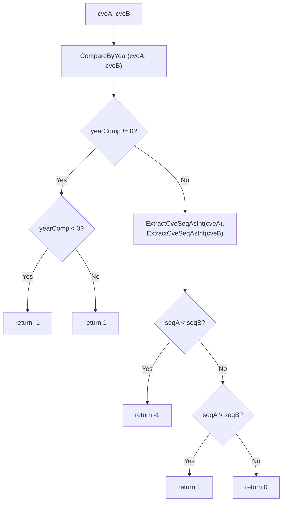

# CompareCves

:::tip 📂 View Source
[`compare.go:110`](https://github.com/scagogogo/cve-skills/blob/main/compare.go#L110-L129) — open the implementation on GitHub (lines L110–L129).
:::

`CompareCves` performs a full comparison of two CVE identifiers — first by year, then by sequence number — and returns a stable `-1 / 0 / 1` result suitable for sorting.

:::tip 📌 Scenarios
- Sort a list of CVEs into chronological order (year, then sequence)
- Decide which of two CVEs is newer when de-duplicating or merging records
- Provide a comparator for `sort.Slice` over CVE slices
:::

## Function Signature

```go
func CompareCves(cveA, cveB string) int
```

## Parameters

- `cveA` (string): The first CVE identifier to compare
- `cveB` (string): The second CVE identifier to compare

## Return Values

- `int`: The comparison result
  - `-1`: `cveA` < `cveB` (cveA's year is smaller, or the years are equal but cveA's sequence is smaller)
  - `0`: `cveA` = `cveB` (year and sequence are identical)
  - `1`: `cveA` > `cveB` (cveA's year is larger, or the years are equal but cveA's sequence is larger)

## Behavior

- Compares the year first via `CompareByYear`; if the years differ, the result is immediately `-1` or `1` — the magnitude of the year difference is collapsed to a sign
- When the years are equal, the sequence numbers are extracted with `ExtractCveSeqAsInt` and compared; the smaller sequence yields `-1`, the larger yields `1`
- Returns `0` only when both year and sequence match exactly
- Malformed input does not panic — invalid CVEs are treated as year `0` and sequence `0` by the underlying extractors, so they sort to the front

## Flowchart



## Example

```go
package main

import (
	"fmt"
	"sort"

	"github.com/scagogogo/cve-skills"
)

func main() {
	testCases := []struct {
		a, b     string
		expected int
		reason   string
	}{
		{"CVE-2020-1111", "CVE-2022-2222", -1, "different years, cveA earlier"},
		{"CVE-2022-1111", "CVE-2022-2222", -1, "same year, cveA smaller sequence"},
		{"CVE-2022-3333", "CVE-2022-2222", 1, "same year, cveA larger sequence"},
		{"CVE-2022-2222", "CVE-2022-2222", 0, "fully identical"},
		{"CVE-2023-1111", "CVE-2021-2222", 1, "cveA later year"},
		{"CVE-2021-9999", "CVE-2023-0001", -1, "year dominates over sequence"},
	}

	for _, tc := range testCases {
		result := cve.CompareCves(tc.a, tc.b)
		status := "✅"
		if result != tc.expected {
			status = "❌"
		}
		fmt.Printf("%s CompareCves(%s, %s) -> %d (expected %d, %s)\n", status, tc.a, tc.b, result, tc.expected, tc.reason)
	}

	// Use as a sort comparator
	list := []string{"CVE-2022-2222", "CVE-2020-1111", "CVE-2022-1111"}
	sort.Slice(list, func(i, j int) bool {
		return cve.CompareCves(list[i], list[j]) < 0
	})
	fmt.Printf("Sorted: %v\n", list)
}
```

## Use Cases

- Fully sort CVE identifiers or determine which of two CVEs is newer
- Sort a CVE list in release order (chronological by year, then sequence)
- Provide a comparator for `sort.Slice` / `sort.Search` over CVE slices

## Notes

- ⚠️ Unlike `CompareByYear` (which returns the raw year difference as a signed int), `CompareCves` always collapses the result to `-1 / 0 / 1` — do not rely on the magnitude to infer the year gap
- 📌 Comparison order is **year first, then sequence**; a later year always wins regardless of sequence magnitude (e.g. `CVE-2021-9999` < `CVE-2023-0001`)
- 🔍 Invalid CVE formats are not rejected — they fall back to year `0` / sequence `0` via the extractors and sort to the front; validate with `IsCve` / `ValidateCve` first if you need strict input checking
- ✅ The return values are exactly the `cmp` contract expected by `sort.Slice`, so `CompareCves(a, b) < 0` is the idiomatic "less than" predicate

## Internal Implementation

The function is a two-stage comparator that delegates parsing to existing extractors and collapses every result to a stable sign:

- **Stage 1 — year via `CompareByYear` (L111):** the call `CompareByYear(cveA, cveB)` itself is just `ExtractCveYearAsInt(cveA) - ExtractCveYearAsInt(cveB)`, so the raw signed year gap is obtained in O(1). If it is non-zero (L112), the function returns `-1` (L114) or `1` (L116) immediately — the magnitude is intentionally discarded so callers cannot mistake it for a year count
- **Stage 2 — sequence tie-break (L119–L120):** only reached when the years are equal. `ExtractCveSeqAsInt` parses the numeric portion after the second hyphen for both inputs, producing two `int` sequence values
- **Final compare (L122–L126):** a plain `<` / `>` cascade on the two sequence ints returns `-1`, `1`, or `0` — the same `cmp` contract `sort.Slice` expects, so the function slots directly into a sort comparator (see `SortCves` at L172)
- **Design intent — delegation over duplication:** `CompareCves` never re-parses the year itself; it reuses `CompareByYear` (and through it `ExtractCveYearAsInt`) so the single source of truth for year parsing stays in one place
- **Design intent — normalized output:** collapsing to `-1 / 0 / 1` (instead of returning raw differences) makes the result a pure ordering signal, immune to the scale of the year or sequence gap

## Complexity

| Resource | Cost | Reason |
| --- | --- | --- |
| Time | O(n) per call where n is CVE string length | dominated by `ExtractCveYearAsInt` / `ExtractCveSeqAsInt` parsing; year subtraction and sequence comparison are O(1) |
| Time (amortized, in `sort.Slice`) | O(n log n) comparisons × O(string) each | `SortCves` calls this comparator O(n log n) times |
| Space | O(1) auxiliary | only a handful of `int` locals (`yearComp`, `seqA`, `seqB`); no allocations |

> The per-call cost is bounded by the extractors' regex/parsing work; the function itself adds no extra allocations and runs in constant extra space.

## Edge Cases

| Input | Behavior | Return |
| --- | --- | --- |
| Both empty strings `""`, `""` | Extractors return year `0`, seq `0` for each; years equal, sequences equal | `0` |
| One empty `""`, one valid `CVE-2022-0001` | Empty parses to year `0` / seq `0`; year `0` < `2022` | `-1` |
| Invalid format `"CVE-XXXX-1111"`, `"CVE-2022-1111"` | Year extractor falls back to `0`; `0` < `2022` | `-1` |
| Same year, invalid sequence `"CVE-2022-ABCD"`, `"CVE-2022-1111"` | Years equal; seqA parses to `0` < `1111` | `-1` |
| Lowercase `"cve-2022-2222"`, `"CVE-2022-2222"` | Both extract to year `2022`, seq `2222`; equal | `0` (case-insensitive at compare level) |
| Duplicate `"CVE-2022-2222"`, `"CVE-2022-2222"` | Year and sequence both match | `0` |
| Year-dominates-sequence `"CVE-2021-9999"`, `"CVE-2023-0001"` | Years differ; `2021` < `2023` short-circuits | `-1` |

## Data Flow

```text
            +-------------------------+
 input ---> | cveA (string), cveB (string) |
            +-------------------------+
                        |
                        v
            +-----------------------------+
            | CompareByYear(cveA, cveB)  |   <-- reuses ExtractCveYearAsInt
            +-----------------------------+
                        |
                        v
                 yearComp (int)
                        |
              +---------+---------+
              |                   |
        yearComp != 0        yearComp == 0
              |                   |
              v                   v
      +---------------+   +---------------------------+
      | sign(yearComp)|   | seqA = ExtractCveSeqAsInt |
      |  -1 or 1      |   | seqB = ExtractCveSeqAsInt |
      +---------------+   +---------------------------+
              |                   |
              |                   v
              |         +-----------------+
              |         | compare seqA,seqB|
              |         +-----------------+
              |                   |
              |       +-----+-----+-----+
              |       |     |     |
              |      <0    ==0    >0
              |       |     |     |
              v       v     v     v
         return -1  return -1 return 0 return 1
                   (seqA<seqB) (equal) (seqA>seqB)

 output <--- stable cmp value: -1 | 0 | 1
```

## Related Functions

- [CompareByYear](/api/functions/compare-by-year) — compare two CVEs by year only (returns the raw difference)
- [SubByYear](/api/functions/sub-by-year) — year difference alias of `CompareByYear`
- [SortCves](/api/functions/sort-cves) — sort and standardize a CVE slice using this comparator
- [ExtractCveYearAsInt](/api/functions/extract-cve-year-as-int) — extract the year as an int (used internally)
- [ExtractCveSeqAsInt](/api/functions/extract-cve-seq-as-int) — extract the sequence as an int (used internally)
- [Compare & Sort category](/api/compare-sort)
