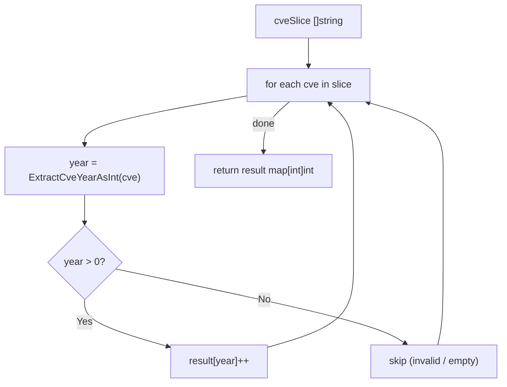

# CountByYear

:::tip 📂 View Source
[`filter.go:441`](https://github.com/scagogogo/cve-skills/blob/main/filter.go#L441-L451) — open the implementation on GitHub (lines L441–L451).
:::

`CountByYear` tallies the CVEs in a slice by their year, returning a map from year to count.

:::tip 📌 Scenarios
- CVE trend analysis: understand how vulnerabilities distribute across years
- Security reports: produce annual CVE statistics
- Dashboards: feed year-by-year charts from a raw CVE list
:::

## Function Signature

```go
func CountByYear(cveSlice []string) map[int]int
```

## Parameters

- `cveSlice` ([]string): The slice of CVE identifiers to count by year

## Return Values

- `map[int]int`: A mapping from year to the number of CVEs in that year; the key is the year and the value is the count of CVEs for that year

## Behavior

- Iterates over every entry in `cveSlice` and extracts the year via `ExtractCveYearAsInt`
- Only entries whose extracted year is greater than `0` are counted, so malformed CVEs (unparseable year, empty, or invalid) are silently skipped
- Returns an empty (non-nil) map when the input slice is empty or contains no valid CVEs
- The order of keys in the returned map is unspecified (Go map iteration order is randomized); sort the keys if you need ordered output
- Matching is case-insensitive because year extraction tolerates `cve-`, `CVE-`, or mixed case

## Flowchart



## Example

```go
package main

import (
	"fmt"
	"sort"

	"github.com/scagogogo/cve-skills"
)

func main() {
	// 源码示例输入输出：
	//   输入: ["CVE-2022-1111", "CVE-2022-2222", "CVE-2021-3333", "cve-2022-4444"]
	//   输出: {2021: 1, 2022: 3}
	cveList := []string{
		"CVE-2022-1111",
		"CVE-2022-2222",
		"CVE-2021-3333",
		"cve-2022-4444",
	}

	counts := cve.CountByYear(cveList)

	// Sort keys for deterministic output
	years := make([]int, 0, len(counts))
	for year := range counts {
		years = append(years, year)
	}
	sort.Ints(years)

	for _, year := range years {
		fmt.Printf("%d: %d CVEs\n", year, counts[year])
	}
	// Expected output:
	//   2021: 1 CVEs
	//   2022: 3 CVEs

	// Edge cases
	fmt.Println("---")

	// Empty slice -> empty map
	empty := cve.CountByYear([]string{})
	fmt.Printf("empty len=%d\n", len(empty)) // empty len=0

	// Invalid entries are skipped (year not > 0)
	mixed := cve.CountByYear([]string{
		"CVE-2023-1234",
		"not-a-cve",
		"",
		"CVE-2023-5678",
	})
	fmt.Printf("mixed 2023=%d, len=%d\n", mixed[2023], len(mixed))
	// Expected output:
	//   mixed 2023=2, len=1
}
```

## Use Cases

- CVE trend analysis: understand how vulnerabilities distribute across years
- Security reports: produce annual CVE statistics
- Dashboards: feed year-by-year bar/line charts from a raw CVE list
- Pre-aggregation before calling `YearRange` to characterize a dataset's span

## Notes

- Invalid CVEs are **silently skipped** — only entries with a parseable, positive year are counted. If you need to know which entries were rejected, validate them with `IsCve` / `ValidateCve` first
- The returned map is non-nil even for empty input, so it is safe to range over directly
- Year extraction uses `ExtractCveYearAsInt`; it does not enforce the realistic year range (1999..current year). Entries like `CVE-0001-1` would still contribute the year `1` to the result
- Map iteration order is randomized in Go; sort the keys when order matters in your output
- Compare with `YearRange`: `CountByYear` gives per-year counts, while `YearRange` only returns the minimum and maximum years

## Internal Implementation

The function body (filter.go L441-L451) is a tight single-pass accumulator:

- **Map initialization (L442)**: `result := make(map[int]int)` allocates a non-nil map up front. This is why even an empty input returns a usable (zero-length) map rather than `nil`, so callers can `range` over it without a nil check.
- **Single traversal (L443)**: `for _, cve := range cveSlice` walks the input slice exactly once. There is no nested loop and no pre-filter pass, so the work scales linearly with the number of input entries.
- **Year extraction delegation (L444)**: `year := ExtractCveYearAsInt(cve)` delegates all parsing concerns (prefix matching, case tolerance, digit extraction) to the dedicated extractor. `CountByYear` itself contains no regex or string parsing, keeping it a pure aggregation primitive.
- **Positive-year guard (L445)**: `if year > 0` is the only admission criterion. `ExtractCveYearAsInt` returns `0` for anything it cannot parse (empty string, missing year, non-numeric digits), so this single branch silently drops all malformed entries without error reporting — an intentional design choice for tolerant aggregation over noisy datasets.
- **Increment semantics (L446)**: `result[year]++` relies on Go's zero-value behavior for absent map keys. A year key that does not yet exist reads as `0`, so the first occurrence creates the key with value `1` and subsequent occurrences simply increment it. No separate "exists?" check is needed.

## Complexity

| Dimension | Cost | Reason |
|---|---|---|
| Time | O(n) | One pass over the `n` input entries; `ExtractCveYearAsInt` runs in O(len(cve)) per entry (bounded constant for CVE-length strings), and map insert/increment is amortized O(1). |
| Space | O(k) | Where `k` is the number of distinct years present in valid entries (k <= n). The result map holds one entry per distinct year. |
| Auxiliary | O(1) | No additional allocations beyond the result map and the loop variable. |

Note: The sort step shown in the Example (`sort.Ints(years)`) is performed by the caller, not by `CountByYear` itself, so it does not contribute to the function's own O(n) bound.

## Edge Cases

| Input | Behavior | Return |
|---|---|---|
| `[]string{}` (empty slice) | Loop body never executes; map stays as allocated | Empty non-nil `map[int]int` (len 0) |
| `nil` slice | `range` over nil slice yields zero iterations | Empty non-nil `map[int]int` (len 0) |
| Entry `""` (empty string) | `ExtractCveYearAsInt("")` returns `0`; `0 > 0` is false | Entry skipped, not counted |
| Entry `"not-a-cve"` (unparseable) | `ExtractCveYearAsInt` returns `0` | Entry skipped |
| Entry `"CVE-2022-1"` (valid, mixed case) | Year extracted as `2022`, `2022 > 0` | `result[2022]` incremented |
| Entry `"cve-2022-1"` (lowercase) | Case-insensitive extraction yields `2022` | `result[2022]` incremented |
| Duplicate year across entries | Each valid hit runs `result[year]++` | Count accumulates (e.g. three `2022` entries -> value `3`) |
| Entry `"CVE-0001-1"` (year `1`) | `1 > 0` is true | `result[1]` incremented — no realistic-range check |
| Entry `"CVE-99999-1"` (year `99999`) | `99999 > 0` is true | `result[99999]` incremented — no upper-bound check |

## Data Flow

```text
+---------------------------+
| Input: cveSlice []string  |
|  e.g. ["CVE-2022-1111",   |
|        "CVE-2022-2222",   |
|        "CVE-2021-3333",   |
|        "cve-2022-4444",   |
|        "not-a-cve",       |
|        ""]                |
+-------------+-------------+
              |
              v
+---------------------------+
| result := make(map[int]int)|   <-- L442, non-nil empty map
+-------------+-------------+
              |
              v
+---------------------------+
| for _, cve := range cveSlice|  <-- L443, single pass O(n)
+-------------+-------------+
              |
              v  (per entry)
+---------------------------+
| year := ExtractCveYearAsInt(cve)| <-- L444, parse + int cast
+-------------+-------------+
              |
              v
+---------------------------+
|   if year > 0 ?           |   <-- L445, guard
+---+-------------------+---+
    | Yes               | No
    v                   v
+-----------+   +-----------------------+
| result[year]++ |   | skip (invalid/empty) | -> next entry
+-----+-----+   +-----------------------+
      |
      v  (after all entries)
+---------------------------+
| return result             |   <-- L449
|  {2021: 1, 2022: 3}       |
+---------------------------+
```

## Related Functions

- [ExtractCveYearAsInt](/api/functions/extract-cve-year-as-int) — extract the year of a CVE as an integer
- [YearRange](/api/functions/year-range) — get the earliest and latest years in a CVE list
- [Filter](/api/filter-group) — filter CVEs by predicate before counting
- [Statistics category](/api/statistics)
