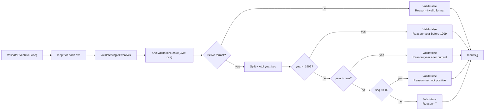

# CveValidationResult

:::tip 📂 View Source
[`base.go:277`](https://github.com/scagogogo/cve-skills/blob/main/base.go#L277-L281) — open the struct declaration on GitHub (lines L277–L281).
:::

`CveValidationResult` is the only exported struct type in the `cve` package — a small value object carrying the outcome of validating a single CVE identifier. It is produced by [`ValidateCves`](/api/functions/validate-cves) (one element per input) and consumed by callers that need to know *why* a CVE failed, not just *that* it failed.

:::tip 📌 Scenarios
- Inspect the per-CVE failure reason from `ValidateCves` to build a human-readable report or log
- Drive conditional logic on the specific rejection cause (bad format vs. bad year vs. non-positive sequence)
- Feed the `Valid` flag into [`FilterValidCves`](/api/functions/filter-valid-cves), which internally re-derives validity rather than reusing these structs
:::

## Declaration

```go
// base.go:277-281
type CveValidationResult struct {
	Cve    string // 原始CVE编号
	Valid  bool   // 是否有效
	Reason string // 无效原因，有效时为空字符串
}
```

## Fields

| Field | Type | Meaning |
|---|---|---|
| `Cve` | `string` | The original CVE string passed in for validation — preserved verbatim, including any leading/trailing spaces or wrong case, so the caller can echo back exactly what was rejected |
| `Valid` | `bool` | `true` if the CVE passed every validation check; `false` if any check failed (in which case `Reason` is populated) |
| `Reason` | `string` | Empty string `""` when `Valid == true`; otherwise a human-readable, English explanation of the first failing check (see [Reason values](#reason-values)) |

## How it is produced

`CveValidationResult` has **no exported constructor** — it is created only inside the package, by the unexported `validateSingleCve` helper (`base.go:328`), which `ValidateCves` calls once per input element:



- The result is built incrementally: `validateSingleCve` starts with `CveValidationResult{Cve: cve}` and sets `Valid`/`Reason` at the first failing check, returning immediately (short-circuit).
- The `Cve` field is always set to the raw input — it is never normalized, so a struct for `" cve-2022-1 "` reports `Cve: " cve-2022-1 "`.
- `Reason` is populated only on failure; for a valid CVE it stays the zero value `""`.

## Reason values

The `Reason` string is one of these exact literals (validated against `base.go:328-374`):

| Reason (exact string) | Triggered when | Example input |
|---|---|---|
| `"invalid CVE format"` | `IsCve(cve)` returns `false` — wrong shape, not `CVE-YYYY-NNNNN` | `"not-a-cve"`, `"CVE-22-1"` |
| `"year is not a valid number"` | `Split` produced a year that `strconv.Atoi` rejected | (rare — `IsCve` usually catches non-numeric years first) |
| `"sequence number is not a valid number"` | `Split` produced a sequence that `strconv.Atoi` rejected | (rare — `IsCve` usually catches non-numeric seq first) |
| `"year %d is before 1999"` (`fmt.Sprintf`) | `yearInt < 1999` | `"CVE-1998-12345"` → `"year 1998 is before 1999"` |
| `"year %d is after current year %d"` (`fmt.Sprintf`) | `yearInt > time.Now().Year()` | `"CVE-2099-1"` → `"year 2099 is after current year 2026"` |
| `"sequence number must be positive"` | `seqInt <= 0` | `"CVE-2022-0"`, `"CVE-2022--3"` |
| `""` (empty) | All checks passed — the CVE is valid | `"CVE-2022-12345"` |

:::tip 📌 Reason strings are not stable API
The `Reason` text is human-readable English and may be reworded in a future version. Use the `Valid` boolean for programmatic decisions; treat `Reason` as a display/log string, not a machine-parseable enum. If you need structured failure categories, derive them from which check failed by re-running `IsCve`/`Split` yourself.
:::

## Example

```go
package main

import (
	"fmt"

	"github.com/scagogogo/cve-skills"
)

func main() {
	inputs := []string{
		"CVE-2022-12345",   // valid
		"not-a-cve",        // bad format
		"CVE-1998-12345",   // year before 1999
		"CVE-2099-1",       // future year
		"CVE-2022-0",       // non-positive sequence
	}

	results := cve.ValidateCves(inputs)
	for _, r := range results {
		if r.Valid {
			fmt.Printf("OK     %s\n", r.Cve)
		} else {
			fmt.Printf("FAIL   %-18s  reason: %s\n", r.Cve, r.Reason)
		}
	}
	// Output:
	// OK     CVE-2022-12345
	// FAIL   not-a-cve            reason: invalid CVE format
	// FAIL   CVE-1998-12345       reason: year 1998 is before 1999
	// FAIL   CVE-2099-1           reason: year 2099 is after current year 2026
	// FAIL   CVE-2022-0           reason: sequence number must be positive
}
```

Building a filtered valid list from the results (note: `FilterValidCves` does this internally without exposing the structs):

```go
results := cve.ValidateCves(mixedInputs)
var valid []string
for _, r := range results {
	if r.Valid {
		valid = append(valid, r.Cve)
	}
}
// `valid` now equals cve.FilterValidCves(mixedInputs)
```

## Use Cases

- **Per-CVE failure reporting** — surface `Reason` in a CI log, audit report, or UI table so a human can fix each bad identifier.
- **Conditional remediation** — branch on whether failures are format errors (re-extract with `ExtractCve`) vs. year errors (re-year with `GenerateCve`).
- **Audit trails** — record `{Cve, Valid, Reason}` triples for compliance, so the rejection rationale is preserved alongside the data.
- **Telemetry** — bucket failures by `Reason` prefix to see whether your input stream is mostly malformed, mostly too-old, or mostly future-dated.

## Notes

- `CveValidationResult` is a plain value type — no methods, no `String()`, no validation on itself. It is meant to be read field-by-field.
- The struct is the **return** type of `ValidateCves` only; it is never an input to any public function. `FilterValidCves` accepts `[]string`, not `[]CveValidationResult`, so you cannot pipe results directly — re-pass the original strings.
- `Cve` preserves the raw input including whitespace and case; if you want the canonical form, run the input through `Format` first (or apply `Format` to `r.Cve` after the fact).
- `Reason` is empty for valid CVEs — never assume a non-empty `Reason` implies invalidity; check `Valid` first.
- The struct is comparable with `==` because all three fields are comparable types (`string`, `bool`, `string`), but the package's tests use `reflect.DeepEqual` on slices of these structs.

## Internal Implementation

The struct is declared at `base.go:277-281` as a plain struct with three exported fields and no methods:

- **Three fields, no methods** (L277–281): `Cve string`, `Valid bool`, `Reason string`. Each field has a trailing Chinese comment documenting its meaning. There is no `String()`, no `Error()`, no constructor — the type is a passive value carrier.
- **Constructed only by `validateSingleCve`** (L328–374): the unexported helper builds the struct incrementally — `result := CveValidationResult{Cve: cve}` first, then sets `Valid`/`Reason` at the first failing check and returns immediately. This short-circuit means `Reason` always reflects the *first* problem encountered, never a composite of multiple failures.
- **Consumed by `ValidateCves`** (L319–325): the public function pre-allocates `make([]CveValidationResult, len(cveSlice))` and fills it positionally with `validateSingleCve`'s output, preserving input order. The returned slice is always non-nil and the same length as the input.
- **Not consumed by `FilterValidCves`** (L400–409): the filter re-runs `ValidateCve` (the boolean version) per element rather than reusing `CveValidationResult` structs. This is a deliberate separation: `ValidateCves` is for *reporting* (with reasons), `FilterValidCves` is for *filtering* (just keep/drop).
- **`Reason` values are string literals** (L333, L343, L349, L355, L362, L368): six distinct reason strings, two of them formatted with `fmt.Sprintf` to embed the offending year/seq. They are human-readable English, not enum constants.

## Complexity

| Resource | Cost | Driver |
|---|---|---|
| Construction | O(V) per struct | `validateSingleCve` runs the full validation pipeline (format check + split + parse + range checks); V is dominated by the regex in `IsCve` |
| Slice allocation | O(n) | `ValidateCves` does one `make([]CveValidationResult, n)` |
| Field read | O(1) | Reading `Cve`/`Valid`/`Reason` is direct field access |
| Comparison (`==`) | O(len(Cve) + len(Reason)) | All fields comparable; struct `==` compares all three |

- The struct itself adds no cost beyond its three fields; it is a value type, not a pointer, so slice elements are contiguous with no indirection.
- `ValidateCves` pre-allocates the result slice to exactly `len(input)`, so there is no growth reallocation.

## Edge Cases

| Input to `ValidateCves` | Resulting `CveValidationResult` | Notes |
|---|---|---|
| `"CVE-2022-12345"` (valid) | `{Cve: "CVE-2022-12345", Valid: true, Reason: ""}` | All checks pass |
| `" cve-2022-12345 "` (spaces, lowercase) | `{Cve: " cve-2022-12345 ", Valid: false, Reason: "invalid CVE format"}` | `Cve` preserves raw input; `IsCve` rejects due to spaces |
| `"not-a-cve"` | `{Cve: "not-a-cve", Valid: false, Reason: "invalid CVE format"}` | First check fails |
| `"CVE-1998-12345"` | `{Cve: "CVE-1998-12345", Valid: false, Reason: "year 1998 is before 1999"}` | Format ok, year too old |
| `"CVE-2099-1"` (future) | `{Cve: "CVE-2099-1", Valid: false, Reason: "year 2099 is after current year 2026"}` | `currentYear` is `time.Now().Year()` |
| `"CVE-2022-0"` | `{Cve: "CVE-2022-0", Valid: false, Reason: "sequence number must be positive"}` | `seqInt <= 0` |
| `"CVE-2022--3"` | `{Cve: "CVE-2022--3", Valid: false, Reason: "invalid CVE format"}` | `IsCve` rejects before `Atoi` sees a negative |
| Empty input slice `[]string{}` | Returns `[]` with `len == 0`, `!= nil` | `make([]..., 0)` |
| `nil` slice | Returns `[]` with `len == 0`, `!= nil` | `len(nil) == 0` |

## Data Flow

```text
+----------------------+     +---------------------------+     +-----------------------------------+
| input: []string      | --> | ValidateCves              | --> | []CveValidationResult             |
| ["CVE-2022-12345",   |     |  make([]..., len(input))  |     |  [ {Cve, Valid, Reason}, ... ]    |
|  "CVE-1998-5"]       |     |  for i, cve := range ...  |     |  positional: results[i] <-> input[i] |
+----------------------+     |    results[i] =           |     +----------------+------------------+
                             |      validateSingleCve()  |                      |
                             +---------------------------+                      |
                                                                                v
                                         +-------------------------------------------+
                                         | consumer:                                 |
                                         |  for _, r := range results {              |
                                         |    if r.Valid { ... } else { log r.Reason}|
                                         |  }                                        |
                                         +-------------------------------------------+
```

## Related

- [ValidateCves](/api/functions/validate-cves) — the function that produces `[]CveValidationResult`
- [ValidateCve](/api/functions/validate-cve) — the boolean-only validator (no reason)
- [FilterValidCves](/api/functions/filter-valid-cves) — filter that re-derives validity without exposing structs
- [Batch Validation category](/api/batch-validation) — overview of the batch validation API surface
- [Error Handling & Edge Cases](/guide/error-handling) — how `Reason` values map to the documented failure modes
