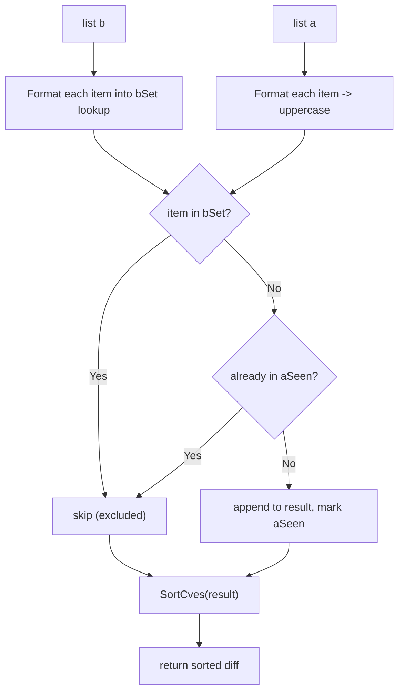

# DiffCves

:::tip 📂 View Source
[`filter.go:344`](https://github.com/scagogogo/cve-skills/blob/main/filter.go#L344-L364) — open the implementation on GitHub (lines L344–L364).
:::

`DiffCves` returns the set difference of two CVE lists — the CVE IDs that appear in list `a` but not in list `b`, with results deduplicated, formatted to canonical uppercase, and sorted.

:::tip 📌 Scenarios
- Detect newly added CVEs by comparing a current list against historical data
- Find CVEs unique to one source when reconciling lists from multiple feeds
- Compute the "remaining" CVEs left over after subtracting already-triaged items
:::

## Function Signature

```go
func DiffCves(a, b []string) []string
```

## Parameters

- `a` ([]string): The minuend CVE list — the set being subtracted from
- `b` ([]string): The subtrahend CVE list — the CVEs to exclude

## Return Values

- []string: CVE IDs that appear only in list `a`, deduplicated, formatted to uppercase, and sorted in ascending order by year and sequence number

## Behavior

- Builds a lookup set from `b` by formatting each entry to canonical uppercase via `Format`, so membership comparison is case-insensitive
- Iterates `a`, formatting each entry; an item is included in the result only if it is **not** present in `b`'s set
- Deduplicates within `a`: a second occurrence of the same CVE (after formatting) is not appended again, controlled by a separate `aSeen` map
- The final result is passed through `SortCves`, yielding ascending order by year and then by sequence number
- Empty `b` produces a deduplicated, formatted, sorted copy of `a`; empty `a` produces an empty slice

## Flowchart



## Example

```go
package main

import (
	"fmt"

	"github.com/scagogogo/cve-skills"
)

func main() {
	// Basic set difference
	current := []string{"CVE-2022-1111", "CVE-2022-2222"}
	historical := []string{"CVE-2022-2222", "CVE-2022-3333"}
	newCves := cve.DiffCves(current, historical)
	// newCves -> ["CVE-2022-1111"] (CVE-2022-2222 is in b, so excluded)
	fmt.Printf("newCves: %v\n", newCves)

	// Duplicates in a are collapsed
	dupA := []string{"CVE-2022-1111", "CVE-2022-1111"}
	b := []string{"CVE-2022-3333"}
	diff := cve.DiffCves(dupA, b)
	// diff -> ["CVE-2022-1111"] (duplicate in a removed)
	fmt.Printf("diff (deduped a): %v\n", diff)

	// Case-insensitive comparison
	mixedA := []string{"cve-2022-1111"}
	mixedB := []string{"CVE-2022-1111"}
	fmt.Printf("case-insensitive diff: %v\n", cve.DiffCves(mixedA, mixedB))
	// -> [] (same CVE after formatting)

	// Empty b -> a deduplicated, formatted, sorted
	fmt.Printf("empty b: %v\n", cve.DiffCves([]string{"cve-2022-2222", "CVE-2022-1111"}, nil))
	// -> ["CVE-2022-1111", "CVE-2022-2222"]

	// Empty a -> empty result
	fmt.Printf("empty a: %v\n", cve.DiffCves(nil, []string{"CVE-2022-1111"}))
	// -> []

	// Detect newly added CVEs vs yesterday's snapshot
	yesterday := []string{"CVE-2022-1111", "CVE-2022-2222"}
	today := []string{"CVE-2022-2222", "CVE-2022-3333", "cve-2022-4444"}
	added := cve.DiffCves(today, yesterday)
	// -> ["CVE-2022-3333", "CVE-2022-4444"]
	fmt.Printf("newly added today: %v\n", added)
}
```

## Use Cases

- Detect newly published CVEs by diffing today's feed against yesterday's snapshot
- Reconcile CVE lists from multiple sources and surface the ones unique to a given source
- Subtract already-triaged or already-patched CVEs from a backlog to find remaining work
- Compute residual CVEs after filtering out those covered by an existing exception list

## Notes

- The operation is **not** symmetric: `DiffCves(a, b)` is the items in `a` minus `b`; `DiffCves(b, a)` yields a different result. To get both sides, call the function twice or use `IntersectCves` together with `DiffCves`
- Comparison is case-insensitive because every entry passes through `Format` before lookup; `"cve-2022-1111"` and `"CVE-2022-1111"` are treated as the same CVE
- Duplicates in `a` are collapsed — each CVE appears at most once in the output regardless of how many times it occurs in `a`
- The result is always sorted by `SortCves` (year ascending, then sequence ascending), so the output order is deterministic and independent of the input order
- Time complexity is O(n+m) where n = len(a), m = len(b); space complexity is O(n+m) for the lookup and seen maps plus the result slice

## Internal Implementation

The implementation in `filter.go` (L344-L363) follows a classic "build set, then probe set" pattern, optimized to a single sort at the end:

- **Build the exclusion set (L345-L348).** A `map[string]struct{}` named `bSet` is pre-allocated with `make(map[string]struct{}, len(b))` to avoid rehashing as it grows. Every entry of `b` is passed through `Format` before being stored, so the set holds canonical uppercase keys — this is what makes the later membership test case-insensitive.
- **Probe with a second seen set (L350-L360).** A separate `aSeen` map (also pre-sized to `len(a)`) tracks CVEs already emitted from `a`. For each element of `a`, the code formats it, checks `bSet` (skip if present), then checks `aSeen` (skip if already emitted); only on the first unique occurrence does it append the formatted value to `result`. Note that the *formatted* string is what gets stored and returned, guaranteeing the output is canonicalized.
- **Single deferred sort (L362).** Rather than maintaining sorted order during insertion, the function accumulates results in append order and calls `SortCves(result)` once at the end. Sorting once over a deduplicated slice of size at most `len(a)` keeps the dominant cost at the O(n+m) scan rather than per-insertion ordering.
- **Use of `struct{}` value type.** Both maps use `struct{}` as the value type, which occupies zero bytes — the maps function as sets, and this is the idiomatic Go way to minimize memory overhead for membership-only data structures.
- **Why two maps instead of one.** `bSet` answers "is this CVE excluded?" and `aSeen` answers "have I already emitted this CVE from `a`?". These are independent questions: a CVE may be absent from `b` yet still appear multiple times in `a`, so collapsing duplicates in `a` requires its own tracking rather than reusing `bSet`.

## Complexity

| Metric | Cost | Derivation |
|---|---|---|
| Time — building `bSet` | O(m) | One `Format` call + one map insert per element of `b`, where m = len(b) |
| Time — scanning `a` | O(n) | One `Format` call + two amortized O(1) map lookups per element of `a`, where n = len(a) |
| Time — final `SortCves` | O(k log k) | k = number of unique, non-excluded CVEs (k <= n); dominates only when k is large |
| Time — overall | O(n + m + k log k) | As documented in the source comment as O(n+m), with the sort adding a logarithmic term over the deduplicated result |
| Space — `bSet` | O(m) | Up to m formatted keys |
| Space — `aSeen` | O(k) | At most k unique keys from `a` |
| Space — `result` slice | O(k) | Holds the k emitted CVEs |
| Space — overall | O(n + m) | Matches the source comment; the three structures are bounded by m and k <= n |

## Edge Cases

| Input | Behavior | Return |
|---|---|---|
| `a` is `nil` or empty | Loop over `a` is skipped; `bSet` is still built but never queried | `[]string{}` (empty, non-nil after sort) |
| `b` is `nil` or empty | `bSet` is empty; no `a` element is ever excluded, so the result is the deduplicated, formatted, sorted form of `a` | Deduplicated sorted copy of `a` |
| Both `a` and `b` empty | Both loops no-op; result slice stays nil, then `SortCves(nil)` is called | `[]string{}` |
| Duplicates within `a` | Second and later occurrences hit `aSeen` and are skipped | Each unique CVE appears at most once |
| Duplicates within `b` | Redundant inserts into `bSet` overwrite the same key (no effect) | Same as if `b` were deduplicated |
| Same CVE in both `a` and `b` (any case) | After `Format`, the key exists in `bSet`, so the `a` element is excluded | Not present in result |
| Case variants (`"cve-..."` vs `"CVE-..."`) | Both `Format` to the same uppercase key, so they compare equal across `bSet`/`aSeen` | Treated as identical; output is always uppercase |
| Malformed/non-CVE strings in `a` | `Format` is still applied; whatever canonical form it produces is used for lookup and output | Format's behavior determines inclusion; not specially rejected |
| Malformed/non-CVE strings in `b` | Stored in `bSet` after `Format`; if a matching formatted key appears in `a`, that `a` element is excluded | Excluded on best-effort formatted match |
| All `a` elements excluded by `b` | Every probe hits `bSet`; nothing is appended | `[]string{}` |

## Data Flow

```text
                +-----------------+        +-----------------+
   list a ----> | Format each     | -----> | formatted keys  |
                | element (upper) |        | (canonicalized) |
                +-----------------+        +-----------------+
                                                  |
                                                  v
                +-----------------+        +-----------------+
   list b ----> | Format each     | -----> | bSet map        |
                | element (upper) |        | (membership)    |
                +-----------------+        +-----------------+
                                                  |
                                                  v
        +-----------------------------------------------+
        | for each formatted key from a:               |
        |   in bSet?  -- yes --> skip (excluded)       |
        |   in aSeen? -- yes --> skip (duplicate in a) |
        |   otherwise --> append to result, mark aSeen |
        +-----------------------------------------------+
                                                  |
                                                  v
                +-----------------+        +-----------------+
   result ---> | SortCves(result)| -----> | sorted diff     | ---> return
                +-----------------+        +-----------------+
```

## Related Functions

- [IntersectCves](/api/functions/intersect-cves) — CVEs present in both lists
- [UnionCves](/api/functions/union-cves) — all CVEs from both lists, deduplicated and sorted
- [SortCves](/api/functions/sort-cves) — sort CVEs by year and sequence number
- [RemoveDuplicateCves](/api/functions/remove-duplicate-cves) — deduplicate a single list
- [Set Operations category](/api/set-operations)
