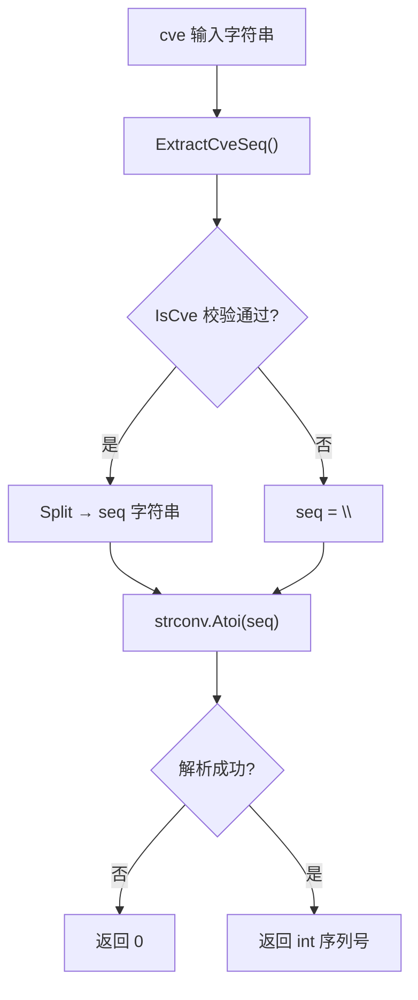

# ExtractCveSeqAsInt

:::tip 📂 View Source
[`extract.go:262`](https://github.com/scagogogo/cve-skills/blob/main/extract.go#L262-L267) — open the implementation on GitHub (lines L262–L267).
:::

Extract the sequence number from a CVE identifier and return it as an integer, so that CVE sequence numbers can be used directly in numeric comparison, sorting, and range filtering.

:::tip 📌 Scenarios
- Filter CVEs whose sequence number falls within a specific numeric range (for example, all sequences greater than 10000).
- Sort a list of CVEs by their numeric sequence value rather than by string ordering.
- Compute statistics or aggregations over CVE sequence numbers.
:::

## Function Signature

```go
func ExtractCveSeqAsInt(cve string) int
```

## Parameters

- `cve` (string): A CVE identifier string, such as `CVE-2022-12345`. Case is not significant and surrounding whitespace is tolerated because the value is normalized internally.

## Return Value

- `int`: The sequence part of the CVE converted to an integer, for example `12345`. Returns `0` when the input is not a valid CVE format or when the sequence part cannot be parsed as a number.

## Behavior

- Delegates to `ExtractCveSeq`, which first validates the input with `IsCve`. When the format is invalid, `ExtractCveSeq` returns an empty string and the subsequent conversion yields `0`.
- Parses the sequence substring with `strconv.Atoi`; if parsing fails (for example a non-numeric sequence), the error is ignored and `0` is returned.
- Because the sequence is converted to `int`, leading zeros in the original sequence are dropped: `CVE-2022-00001` and `CVE-2022-1` both produce the integer `1`.
- The function does not panic on bad input; any invalid or unparseable input is mapped to the sentinel value `0`.

## Flowchart



## Example

```go
package main

import (
	"fmt"
	"sort"

	"github.com/scagogogo/cve-skills"
)

func main() {
	// Basic extraction
	seq := cve.ExtractCveSeqAsInt("CVE-2022-12345")
	fmt.Println(seq) // 输出: 12345

	// Multiple inputs, including edge cases
	testCases := []string{
		"CVE-2022-12345",    // standard form
		"cve-2022-00001",    // leading zeros collapse to 1
		"CVE-2022-1",        // short sequence
		"CVE-2022-99999",    // large sequence
		"CVE-2022-ABC",      // non-numeric sequence -> 0
		"not-a-cve",         // invalid format -> 0
		"",                  // empty string -> 0
	}

	for _, input := range testCases {
		seq := cve.ExtractCveSeqAsInt(input)
		fmt.Printf("%-20s -> %d\n", input, seq)
	}

	// Range filtering: keep CVEs whose sequence is greater than 10000
	cveList := []string{
		"CVE-2022-123",
		"CVE-2022-12345",
		"CVE-2022-99999",
		"CVE-2022-5000",
	}
	var highSeq []string
	for _, id := range cveList {
		if cve.ExtractCveSeqAsInt(id) > 10000 {
			highSeq = append(highSeq, id)
		}
	}
	fmt.Printf("Sequence > 10000: %v\n", highSeq)
	// 输出: Sequence > 10000: [CVE-2022-12345 CVE-2022-99999]

	// Numeric sort by sequence value
	sort.Slice(cveList, func(i, j int) bool {
		return cve.ExtractCveSeqAsInt(cveList[i]) < cve.ExtractCveSeqAsInt(cveList[j])
	})
	fmt.Println("Sorted by sequence:")
	for _, id := range cveList {
		fmt.Printf("  %-15s -> %d\n", id, cve.ExtractCveSeqAsInt(id))
	}
}
```

## Use Cases

- Filter CVEs by a numeric sequence range, such as "all sequences greater than 10000".
- Sort CVEs by their integer sequence value instead of lexicographic string order.
- Build numeric statistics or histograms over CVE sequence numbers.
- Detect reserved or low-numbered CVEs (sequence `0` after conversion signals an invalid or unparseable input).

## Notes

- The sentinel value `0` is returned for both invalid formats and unparseable sequences; if you need to distinguish the two, call `IsCve` first and then `ExtractCveSeq`.
- Leading zeros are lost after integer conversion. When you need to preserve the original zero-padded form (for example for display alignment), use the string-based `ExtractCveSeq` or `FormatSeq` instead.
- This function does not validate the year; it only checks the overall CVE format and parses the sequence. For full validation including year range, use `ValidateCve`.
- The function is safe for concurrent use because it relies only on pure string parsing with no shared mutable state.

## Internal Implementation

The function body is only three lines, but each line hands off to a well-defined helper so that validation, splitting, and numeric parsing stay cleanly separated:

- **L263 — `seq := ExtractCveSeq(cve)`**: the entire format check is delegated to `ExtractCveSeq`, which internally calls `IsCve` (the regex-based format guard) and then `Split` to obtain the sequence substring. If the input is not a valid CVE, `ExtractCveSeq` returns `""` so that the caller never sees a malformed substring.
- **L264 — `i, _ := strconv.Atoi(seq)`**: the sequence substring is parsed with `strconv.Atoi`. The error value is intentionally discarded (`_`); the design intent is to collapse every failure mode (invalid format, non-numeric sequence, empty string) onto the single sentinel value `0` returned by `Atoi` on error, so the function can never panic.
- **L265 — `return i`**: the parsed integer is returned directly. When `Atoi` failed, `i` is the zero value `0`, which is exactly the documented sentinel for "no sequence".
- Because the function depends only on `ExtractCveSeq` and `strconv.Atoi` — both pure string operations with no shared mutable state — it is safe for concurrent use without any synchronization.
- There is no separate normalization step in this function; case-insensitivity and whitespace tolerance are inherited from `ExtractCveSeq` / `IsCve`, which apply `Format` internally before matching.

## Complexity

| Metric | Bound | Reason |
|---|---|---|
| Time | O(n) | `ExtractCveSeq` performs a single regex match and `Split` over a fixed-width CVE string of length n; `strconv.Atoi` is O(n) in the sequence length. |
| Space | O(n) | A short-lived copy of the sequence substring is held in `seq`; no additional allocations beyond the return integer. |
| Allocs | 2 | One for the sequence substring from `Split`, one for the integer box on return; no maps or slices are constructed. |

The bounds above are linear in the length of the input CVE string. When this function is used inside a loop over a CVE list of length m (for example in `sort.Slice`), the aggregate cost is O(m·n) time.

## Edge Cases

| Input | Behavior | Return |
|---|---|---|
| `CVE-2022-12345` | Valid format; sequence `12345` parses cleanly. | `12345` |
| `cve-2022-12345` (lowercase) | Normalized internally; case is not significant. | `12345` |
| `CVE-2022-00001` | Sequence `00001` is parsed and leading zeros are dropped by `Atoi`. | `1` |
| `CVE-2022-0` | Sequence `0` parses to the integer zero, indistinguishable from the sentinel. | `0` |
| `CVE-2022-ABC` | Format passes `IsCve` but `Atoi` fails on `ABC`; error ignored. | `0` |
| `CVE-2022-` (missing sequence) | Rejected by `IsCve`; `ExtractCveSeq` returns `""`, `Atoi("")` fails. | `0` |
| `not-a-cve` | Not a CVE format; `ExtractCveSeq` returns `""`. | `0` |
| `""` (empty string) | `IsCve` fails immediately; `seq` is `""`, `Atoi` fails. | `0` |
| ` CVE-2022-12345 ` (surrounding spaces) | Whitespace tolerated by internal normalization in `IsCve`/`Format`. | `12345` |

## Data Flow

```text
+----------------------+
|  cve string (input)  |
|  e.g. CVE-2022-12345 |
+----------+-----------+
           |
           v
+----------------------+
|  ExtractCveSeq(cve)  |
+----------+-----------+
           |
           v
+----------------------+    invalid format
|   IsCve(cve) guard   |------------------------+
+----------+-----------+                        |
           | valid                               |
           v                                     |
+----------------------+                        |
|  Split -> seq string |                        |
|  e.g. "12345"        |                        |
+----------+-----------+                        |
           |                                     |
           v                                     v
+----------------------+                +------------------+
|  strconv.Atoi(seq)   |                |  seq = "" (empty)|
|  12345, nil          |                |  Atoi -> 0, err  |
+----------+-----------+                +--------+---------+
           |                                     |
           v                                     v
+----------------------+                +------------------+
|  return i = 12345    |                |  return 0        |
+----------------------+                +------------------+
```

## Related Functions

- [ExtractCveSeq](/api/functions/extract-cve-seq) — returns the sequence as a string, preserving leading zeros.
- [ExtractCveYearAsInt](/api/functions/extract-cve-year-as-int) — the year counterpart, returns the year as an integer.
- [Split](/api/functions/split) — splits a CVE into year and sequence strings.
- [IsCve](/api/functions/is-cve) — checks whether a string is a valid CVE format.
- [Extraction category](/api/extract) — overview of all extraction-related functions.
