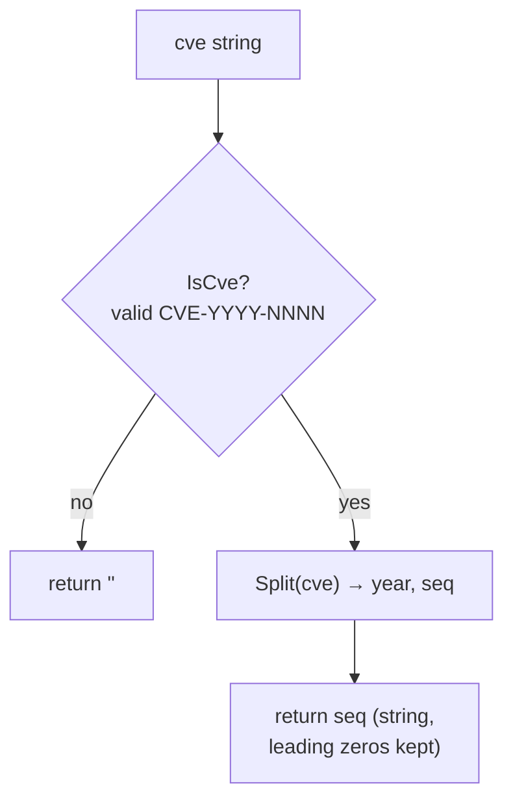

# ExtractCveSeq

:::tip 📂 View Source
[`extract.go:219`](https://github.com/scagogogo/cve-skills/blob/main/extract.go#L219-L226) — open the implementation on GitHub (lines L219–L226).
:::

Extract the sequence number (as a string) from a CVE identifier.

:::tip 📌 Scenarios
- Pull the sequence part out of a CVE so it can be stored or displayed on its own.
- Use the raw string form when you need to preserve leading zeros exactly as written.
- Feed the sequence into downstream tooling that expects a string token rather than a number.
:::

## Function Signature

```go
func ExtractCveSeq(cve string) string
```

## Parameters

- `cve` (string): The CVE identifier to extract the sequence from. May be upper- or lower-case and may have surrounding whitespace.

## Return Value

- `string`: The sequence part of the CVE, e.g. `"12345"`. Returns an empty string `""` if the input is not a valid CVE format.

## Behavior

- First validates the input with `IsCve`; if it is not a valid CVE, returns `""` immediately.
- On a valid CVE, delegates to `Split` and returns the second return value (the sequence segment).
- The sequence is returned as a string, so leading zeros are preserved (e.g. `"0001"` stays `"0001"`).
- Because the validity gate uses `IsCve`, inputs that merely contain a CVE (rather than being one) are treated as invalid and yield `""`.
- No numeric parsing is performed — use `ExtractCveSeqAsInt` if you need an integer.

## Flowchart



## Example

```go
package main

import (
    "fmt"
    "github.com/scagogogo/cve-skills"
)

func main() {
    testCases := []string{
        "CVE-2022-12345",    // standard
        "cve-2022-0001",     // lowercase, leading zeros
        " CVE-2022-1 ",      // whitespace, short sequence
        "CVE-2022-00001",    // leading zeros preserved
        "invalid-format",    // not a CVE
        "包含CVE-2022-12345的文本", // text that merely contains a CVE
        "",                  // empty
    }

    for _, cveId := range testCases {
        seq := cve.ExtractCveSeq(cveId)
        fmt.Printf("%-26s -> Sequence: '%s'\n", cveId, seq)
    }

    // Expected output:
    // CVE-2022-12345            -> Sequence: '12345'
    // cve-2022-0001             -> Sequence: '0001'
    //  CVE-2022-1               -> Sequence: '1'
    // CVE-2022-00001            -> Sequence: '00001'
    // invalid-format            -> Sequence: ''
    // 包含CVE-2022-12345的文本    -> Sequence: ''
    //                           -> Sequence: ''
}
```

## Use Cases

- Extract the sequence segment for separate storage in a database column.
- Preserve the original sequence string (with leading zeros) for display or audit.
- Build keys or identifiers keyed by the sequence portion of a CVE.
- Pre-process a CVE before passing the sequence to downstream string-based tooling.

## Notes

- ⚠️ Returns `""` for any input that fails `IsCve`, including text that merely contains a CVE — to extract from free text, use `ExtractCve` first.
- The returned value is a string and keeps leading zeros; if you need numeric comparison or sorting, use `ExtractCveSeqAsInt` instead.
- Input is case-insensitive and tolerates surrounding whitespace, consistent with `IsCve`.
- Does not deduplicate or sort — operate on a single CVE at a time.

## Internal Implementation

The function body (`extract.go:219-L226`) is a thin, two-step wrapper — its complexity lives in the helpers it delegates to:

- **Validity gate (`extract.go:220`)** — `if !IsCve(cve)` is the first and only branch. Any input that is not a standalone CVE (wrong shape, embedded in prose, empty) returns `""` here, so the extraction logic below never runs on garbage.
- **Delegated split (`extract.go:223`)** — `_, seq := Split(cve)` discards the year segment with the blank identifier and keeps only the sequence. Reusing `Split` (rather than re-implementing regex parsing) guarantees the sequence definition stays identical to every other extraction function.
- **Direct return (`extract.go:224`)** — `return seq` hands back the raw string token from `Split` with no transformation. No `Format` call, no map construction, no `sort.Slice` — this is why leading zeros survive untouched.
- **Design intent — composition over reimplementation.** The whole function exists to give callers a single-responsibility name ("give me the seq") while pushing parsing/validation down into `IsCve` and `Split`, so format rules have one source of truth.
- **Design intent — string fidelity.** Returning the string verbatim (instead of parsing to `int`) is deliberate: CVEs like `CVE-2022-00001` must keep their leading zeros, and numeric coercion is left to the sibling `ExtractCveSeqAsInt`.

## Complexity

| Dimension | Cost | Reason |
|---|---|---|
| Time | O(n) | `IsCve` + `Split` each scan the n-character input a constant number of times; no sort or nested loop. |
| Space | O(n) | `Split` allocates a fresh `seq` substring (slice header over the input's backing array), plus whatever `IsCve` uses transiently. |
| Allocations | O(1) | A single returned string; no map, slice growth, or recursion. |

Because the function operates on one CVE at a time, total cost over a batch of k CVEs is O(k * n).

## Edge Cases

| Input | Behavior | Return |
|---|---|---|
| `"CVE-2022-12345"` | Standard form, passes `IsCve`, `Split` yields `("2022","12345")` | `"12345"` |
| `"cve-2022-0001"` | Lowercase, passes `IsCve` (case-insensitive); leading zeros preserved | `"0001"` |
| `" CVE-2022-1 "` | Surrounding whitespace tolerated by `IsCve`; short sequence returned as-is | `"1"` |
| `"CVE-2022-00001"` | Leading zeros kept verbatim, no numeric normalization | `"00001"` |
| `"CVE-2022-ABC"` | Non-numeric sequence, rejected by `IsCve` | `""` |
| `"invalid-format"` | Not a CVE shape, rejected at the gate | `""` |
| `"包含CVE-2022-12345的文本"` | Embedded CVE, `IsCve` treats the whole string as invalid | `""` |
| `""` (empty) | Fails `IsCve` immediately | `""` |

## Data Flow

```text
+--------------------+
| input: cve string  |
|  e.g. "CVE-2022-00001"
+---------+----------+
          |
          v
+-------------------+
| IsCve(cve) gate   |   extract.go:220
| case-insensitive, |
| trims whitespace  |
+---------+---------+
          |
   +------+------+
   |             |
 invalid       valid
   |             |
   v             v
+-------+   +----------------------+
| ""    |   | _, seq := Split(cve) |  extract.go:223
+-------+   |  year discarded      |
            +----------+-----------+
                       |
                       v
            +---------------------+
            | return seq (string) |  extract.go:224
            |  "00001"             |
            |  leading zeros kept |
            +---------------------+
```

## Related Functions

- [ExtractCveSeqAsInt](/api/functions/extract-cve-seq-as-int) — same extraction, returned as `int` (leading zeros dropped, 0 on invalid input).
- [ExtractCveYear](/api/functions/extract-cve-year) — extract the year segment instead.
- [Split](/api/functions/split) — split a CVE into both year and sequence at once.
- [IsCve](/api/functions/is-cve) — the validity gate used internally by this function.
- [Extract category](/api/extract) — overview of all extraction functions.
