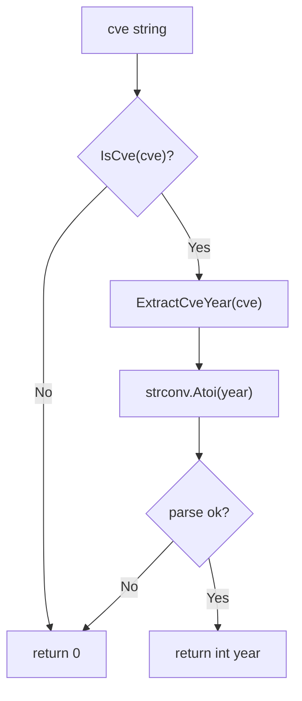

# ExtractCveYearAsInt

:::tip 📂 View Source
[`extract.go:183`](https://github.com/scagogogo/cve-skills/blob/main/extract.go#L183-L191) — open the implementation on GitHub (lines L183–L191).
:::

`ExtractCveYearAsInt` extracts the year portion from a CVE identifier and returns it as a native `int`, ready for numeric computation, comparison, and statistics.

:::tip 📌 Scenarios
- Compute how many years have passed since a CVE was published.
- Group or filter CVEs by year using numeric ranges (e.g. `year >= 2020`).
- Sort a CVE list by year as an integer key.
:::

## Function Signature

```go
func ExtractCveYearAsInt(cve string) int
```

## Parameters

- `cve` (string): A CVE identifier string, e.g. `CVE-2022-12345`. Leading/trailing whitespace and mixed case are tolerated because the value is normalized internally.

## Return Value

- `int`: The CVE year as an integer, e.g. `2022`. Returns `0` when the input is not a valid CVE format or the year segment cannot be parsed as a number.

## Behavior

- Calls `IsCve(cve)` first; if the input is not a valid CVE identifier, it short-circuits and returns `0` without parsing.
- Delegates to `ExtractCveYear(cve)` (which internally calls `Split`) to obtain the year string.
- Converts the year string with `strconv.Atoi`; the conversion error is intentionally ignored, and on failure the zero value `0` is returned.
- Because `IsCve` already guarantees the year segment is digits, in practice the `Atoi` step succeeds for any input that passes the first check. The fallback to `0` is a defensive guard.
- The function is pure and side-effect free; it does not modify the input or any global state.

## Flowchart



## Example

```go
package main

import (
	"fmt"
	"time"

	"github.com/scagogogo/cve-skills"
)

func main() {
	cveList := []string{
		"CVE-2020-1111",   // standard
		"cve-2021-2222",   // lowercase
		" CVE-2022-3333 ", // surrounding whitespace
		"CVE-1999-1",      // earliest valid CVE year
		"invalid-cve",     // not a CVE
		"",                // empty string
	}

	currentYear := time.Now().Year()

	for _, cveId := range cveList {
		year := cve.ExtractCveYearAsInt(cveId)
		if year > 0 {
			age := currentYear - year
			fmt.Printf("%-18s -> year=%d  (%d years ago)\n", cveId, year, age)
		} else {
			fmt.Printf("%-18s -> invalid CVE (0)\n", cveId)
		}
	}

	// Numeric comparison example: count CVEs published in 2022 or later
	recent := []string{"CVE-2020-1111", "CVE-2022-12345", "CVE-2023-4444"}
	count := 0
	for _, cveId := range recent {
		if cve.ExtractCveYearAsInt(cveId) >= 2022 {
			count++
		}
	}
	fmt.Printf("\nCVEs from 2022 or later: %d\n", count)
}
```

Expected output (assuming the current year is 2026):

```bash
CVE-2020-1111      -> year=2020  (6 years ago)
cve-2021-2222      -> year=2021  (5 years ago)
 CVE-2022-3333     -> year=2022  (4 years ago)
CVE-1999-1         -> year=1999  (27 years ago)
invalid-cve        -> invalid CVE (0)
                   -> invalid CVE (0)

CVEs from 2022 or later: 2
```

## Use Cases

- Compute the age of a CVE (years since publication) by subtracting from the current year.
- Filter CVEs by numeric year ranges, e.g. `year >= 2020 && year <= 2023`.
- Sort or bucket CVEs by integer year as a sort key.
- Build year-based statistics and charts (count of CVEs per year).
- Compare two CVEs by year without string-to-int conversion at the call site.

## Notes

- ⚠️ The `0` return value is ambiguous: it indicates either an invalid CVE or a failed `Atoi`. In practice these overlap (any input passing `IsCve` has a numeric year), but you should still validate input upstream if `0` would be a meaningful year in your domain.
- ✅ Unlike `ExtractCveYear` (which returns a string), this function returns a native `int` — no manual `strconv.Atoi` needed at the call site.
- ⚠️ The function does not validate the year range (e.g. 1999..current year); use `IsCveYearOk` / `IsCveYearOkWithCutoff` when range validity matters.
- 🔍 `IsCve` is case-insensitive and tolerates surrounding whitespace, so `cve-2022-12345` and `" CVE-2022-12345 "` both yield `2022`.
- 🛠️ For the sequence number counterpart, use `ExtractCveSeqAsInt`.

## Internal Implementation

The function body (`extract.go:183`–`191`) is a thin composition of three helpers with a deliberate defensive fallback:

- **Format gate (L184–L186):** `if !IsCve(cve) { return 0 }` short-circuits before any parsing. `IsCve` performs case-insensitive, whitespace-tolerant normalization plus regex matching, so every input reaching the next step is already a well-formed CVE.
- **Year extraction (L187):** `year := ExtractCveYear(cve)` delegates to `ExtractCveYear`, which internally calls `Split` to isolate the middle segment (the year) of the `CVE-YYYY-NNNN` structure. The result is a string like `"2022"`.
- **Numeric conversion (L188–L189):** `i, _ := strconv.Atoi(year)` parses the string into a native `int`. The error value is intentionally discarded with `_`; on failure the zero value `0` flows out as the return.
- **Defensive-only fallback:** Because `IsCve` already guarantees the year segment is all digits, the `Atoi` branch can only fail for inputs that would have been rejected upstream. The `0` return is therefore a guard against future changes to `IsCve`/`Split`, not a routinely exercised path.
- **Purity:** No heap allocation beyond the intermediate string, no global state mutation, no input mutation — the function is referentially transparent and safe for concurrent use.

## Complexity

Let `n = len(cve)` (the input string length).

| Step | Time | Space | Notes |
| --- | --- | --- | --- |
| `IsCve(cve)` | O(n) | O(n) | Normalization (trim/case) may allocate; regex is linear in input length. |
| `ExtractCveYear(cve)` | O(n) | O(n) | Calls `Split`; produces a short year substring (~4 chars). |
| `strconv.Atoi(year)` | O(1) | O(1) | Year segment is bounded (commonly 4 digits). |
| **Overall** | **O(n)** | **O(n)** | Dominated by validation and substring extraction. |

- The function performs a single pass of validation plus extraction; there is no sorting, nesting, or fan-out, so no `O(n log n)` or `O(n+m)` term appears.
- Space is dominated by the normalized copy and the year substring; both are short-lived and eligible for stack/escape analysis depending on the caller.

## Edge Cases

| Input | Behavior | Return |
| --- | --- | --- |
| `"CVE-2022-12345"` | Standard format; passes `IsCve`, year `2022` parses. | `2022` |
| `"cve-2021-2222"` | Lowercase; `IsCve` is case-insensitive. | `2021` |
| `" CVE-2022-3333 "` | Surrounding whitespace trimmed by `IsCve`. | `2022` |
| `"CVE-1999-1"` | Earliest valid CVE year; single-digit sequence. | `1999` |
| `"invalid-cve"` | Fails `IsCve`; short-circuits before parsing. | `0` |
| `""` (empty) | Fails `IsCve`; never reaches `Atoi`. | `0` |
| `"CVE-ABCD-1234"` | Non-numeric year rejected by `IsCve` regex. | `0` |
| `"CVE-2022-1234 "` trailing only | Trimmed; valid. | `2022` |
| `"CVE-2022-1234extra"` | Trailing garbage fails `IsCve` anchoring. | `0` |
| Duplicates in a list | Each call is independent; no dedup state. | per-item year |
| `nil`-equivalent empty | Not applicable — Go strings are non-nil; `""` handled above. | `0` |

## Data Flow

```text
+----------------------+
|  input: cve string   |
|  e.g. "CVE-2022-12345"|
+----------+-----------+
           |
           v
+----------------------+
|  IsCve(cve)          |
|  normalize + regex   |
+----------+-----------+
           |
     fail? +-+ yes --> return 0
           | |
           | no
           v
+----------------------+
|  ExtractCveYear(cve) |
|  via Split -> "2022" |
+----------+-----------+
           |
           v
+----------------------+
|  strconv.Atoi(year)  |
|  "2022" -> 2022       |
+----------+-----------+
           |
     err? +-+ yes --> return 0  (defensive only)
           | |
           | no
           v
+----------------------+
|  return int year     |
|  2022                |
+----------------------+
```

## Related Functions

- [ExtractCveYear](/api/functions/extract-cve-year) — returns the year as a string.
- [ExtractCveSeqAsInt](/api/functions/extract-cve-seq-as-int) — the sequence counterpart, returns `int`.
- [Split](/api/functions/split) — splits a CVE into year and sequence strings.
- [IsCve](/api/functions/is-cve) — the format gate used internally by this function.
- [IsCveYearOk](/api/functions/is-cve-year-ok) — range validation for the extracted year.
- [Extract category](/api/extract) — overview of all extraction functions.
