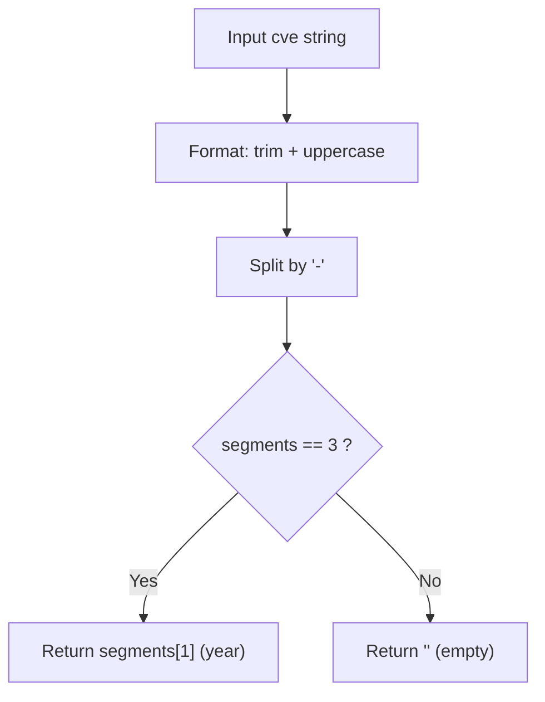

# ExtractCveYear

:::tip 📂 View Source
[`extract.go:146`](https://github.com/scagogogo/cve-skills/blob/main/extract.go#L146-L150) — open the implementation on GitHub (lines L146–L150).
:::

Extract the year portion from a CVE identifier as a string.

:::tip 📌 Scenarios
- Classify CVE records by year for statistics or reporting.
- Group a CVE list into per-year buckets before further processing.
- Display the year field in a UI or report without re-parsing the raw string.
:::

## 函数签名

```go
func ExtractCveYear(cve string) string
```

## 参数

- `cve` (string): CVE identifier string to extract the year from. It is case-insensitive and accepts surrounding whitespace.

## 返回值

- `string`: The extracted year as a string, e.g. `"2022"`. Returns an empty string `""` if the input is not a valid CVE format.

## 行为说明

- Delegates to `Split`: it first normalizes the input via `Format` (uppercase + trim), then splits on `-`.
- A valid split must produce exactly three segments (`CVE`, `YYYY`, `NNNNN`). The middle segment is returned as the year.
- If the split does not yield exactly three segments (for example `"not-a-cve"` or `"CVE-2022"`), it returns the zero value `""` — no panic, no error.
- The returned year is a raw string. It does not validate whether the year falls in the CVE range (1999..current year); use `IsCveYearOk` for that check.
- The returned string may not be numeric if the input looks like `CVE-ABCD-1234`; for a numeric result use `ExtractCveYearAsInt`.

## 流程图



## 示例

```go
package main

import (
	"fmt"

	"github.com/scagogogo/cve-skills"
)

func main() {
	// Standard CVE: returns the year segment
	year := cve.ExtractCveYear("CVE-2022-12345")
	fmt.Println(year) // 2022

	// Case-insensitive: lower-case input still normalizes
	yearLower := cve.ExtractCveYear("cve-2021-44228")
	fmt.Println(yearLower) // 2021

	// Surrounding whitespace is tolerated by Format
	yearSpace := cve.ExtractCveYear("  CVE-1999-0001  ")
	fmt.Println(yearSpace) // 1999

	// Invalid format: not three dash segments, returns empty string
	yearInvalid := cve.ExtractCveYear("not-a-cve")
	fmt.Printf("%q\n", yearInvalid) // ""

	// Partially malformed: only two segments, returns empty string
	yearPartial := cve.ExtractCveYear("CVE-2022")
	fmt.Printf("%q\n", yearPartial) // ""

	// Year field is not validated as numeric or in range
	yearWeird := cve.ExtractCveYear("CVE-ABCD-1234")
	fmt.Printf("%q\n", yearWeird) // "ABCD"
}
```

## 使用场景

- Building year-based indexes or summaries from a CVE dataset.
- Grouping CVEs by year before aggregation in security reports.
- Quickly reading the year field for display without manual string slicing.

## 注意事项

- Returns a string, not an integer. Use `ExtractCveYearAsInt` when you need numeric comparison or arithmetic.
- The function does not validate the year range; `CVE-0000-1` would still return `"0000"`. Pair with `IsCveYearOk` for range validation.
- Unlike `ExtractCve`/`ExtractFirstCve` which scan free text, `ExtractCveYear` expects the input to already be a single CVE identifier — it does not search inside arbitrary text.
- Relies on `Split`, so the three-segment rule means inputs with extra dashes (e.g. `"CVE-2022-1234-extra"`) return `""`.
- Empty input `""` returns `""` (only one segment after split).

## Internal Implementation

`ExtractCveYear` is a thin two-line delegator; all real work lives in `Split` (`base.go:265`).

- **Delegates to `Split`**: line 147 calls `year, _ := Split(cve)` — the second return value (sequence number) is intentionally discarded with `_`, signaling that this function only cares about the year segment.
- **Normalization is delegated, not duplicated**: `Split` internally calls `Format(cve)` (trim + uppercase) before splitting, so `ExtractCveYear` does not call `Format` itself. This keeps the normalization contract in a single place (`Split`/`Format`).
- **Dash-split with a strict three-segment guard**: inside `Split`, `strings.Split(cve, "-")` must yield exactly three segments (`["CVE", "YYYY", "NNNNN"]`). If `len(split) != 3`, `Split` returns the named zero values (`""`, `""`) — so `ExtractCveYear` receives `""` without any explicit `if` of its own.
- **Returns the middle segment**: on the success path `Split` returns `split[1], split[2]`, and `ExtractCveYear` forwards `split[1]` (the year) as a raw string — no numeric parsing, no range check.
- **Design intent — composition over reimplementation**: by routing through `Split`, the year/sequence extraction pair shares one normalization and validation path, guaranteeing `ExtractCveYear` and `ExtractCveSeq` agree on what counts as a valid CVE.

## Complexity

The function itself is O(1) glue; the cost is dominated by `Split`, which performs a single linear scan of the input string.

| Resource | Bound | Reason |
|---|---|---|
| Time | O(n) | `Format` trims/uppercases the string in one pass; `strings.Split` scans the string once for `-`. Both are linear in the CVE length `n`. |
| Space | O(n) | `Format` may allocate a new string (uppercase copy), and `strings.Split` allocates a 3-element slice plus substrings — all proportional to `n`. |
| Allocations | O(1) slices, O(n) string bytes | A small constant number of slice headers; the dominant allocation is the uppercased/segmented string data. |

`n` here is the length of the input CVE string (a small constant in practice, typically under 20 bytes), so the function is effectively constant-cost for real CVE inputs.

## Edge Cases

| Input | Behavior | Return |
|---|---|---|
| `"CVE-2022-12345"` | Standard three-segment CVE; `Format` is a no-op, split yields `["CVE","2022","12345"]`. | `"2022"` |
| `"cve-2021-44228"` | Lower-case; `Format` uppercases to `CVE-2021-44228` before splitting. | `"2021"` |
| `"  CVE-1999-0001  "` | `Format` trims surrounding whitespace, then splits. | `"1999"` |
| `""` (empty) | `strings.Split("", "-")` returns `[""]` — one segment, not three. | `""` |
| `"CVE-2022"` | Only two segments after split. | `""` |
| `"not-a-cve"` | Three segments `["not","a","cve"]` but only by accident; `Format` uppercases to `NOT-A-CVE`, still three segments, so the middle one is returned as-is. | `"A"` |
| `"CVE-2022-1234-extra"` | Four segments after split — fails the `len == 3` guard. | `""` |
| `"CVE-ABCD-1234"` | Three segments; year field is non-numeric but the function does not validate digits. | `"ABCD"` |
| `"CVE-0000-1"` | Three segments; year is out of the CVE range but not range-checked here. | `"0000"` |

## Data Flow

```text
+----------------------+
| Input: cve string    |
|  e.g. "cve-2022-12345"
+----------+-----------+
           |
           v
+----------------------+     ExtractCveYear (extract.go:146)
| year, _ := Split(cve)|----- only the first return value is kept;
+----------+-----------+      the sequence number is discarded (_)
           |
           v
+----------------------+     Split (base.go:265)
| cve = Format(cve)    |----- trim surrounding whitespace,
+----------+-----------+      uppercase all characters
           |
           v
+----------------------+
| split = Split(cve,'-')|
+----------+-----------+
           |
           v
+----------------------+
| len(split) == 3 ?    |
+--+----------------+--+
   | Yes            | No
   v                v
+----------+   +----------------+
| return   |   | return "", ""  |   zero values from named returns
| split[1] |   +-------+--------+
+----+-----+           |
     |                 v
     |           +----------------+
     |           | year == ""     |
     |           +-------+--------+
     |                 |
     v                 v
+--------------------------------+
| Output: year string           |
|  "2022"            or   ""    |
+--------------------------------+
```

## 相关函数

- [Split](/api/functions/split) — split a CVE into year and sequence parts.
- [ExtractCveYearAsInt](/api/functions/extract-cve-year-as-int) — year as an `int`, returning `0` on failure.
- [ExtractCveSeq](/api/functions/extract-cve-seq) — extract the sequence number portion.
- [Format](/api/functions/format) — normalization applied before splitting.
- [IsCveYearOk](/api/functions/is-cve-year-ok) — validate the year falls in the CVE range.
- [Extract 分类入口](/api/extract) — overview of all extraction functions.
