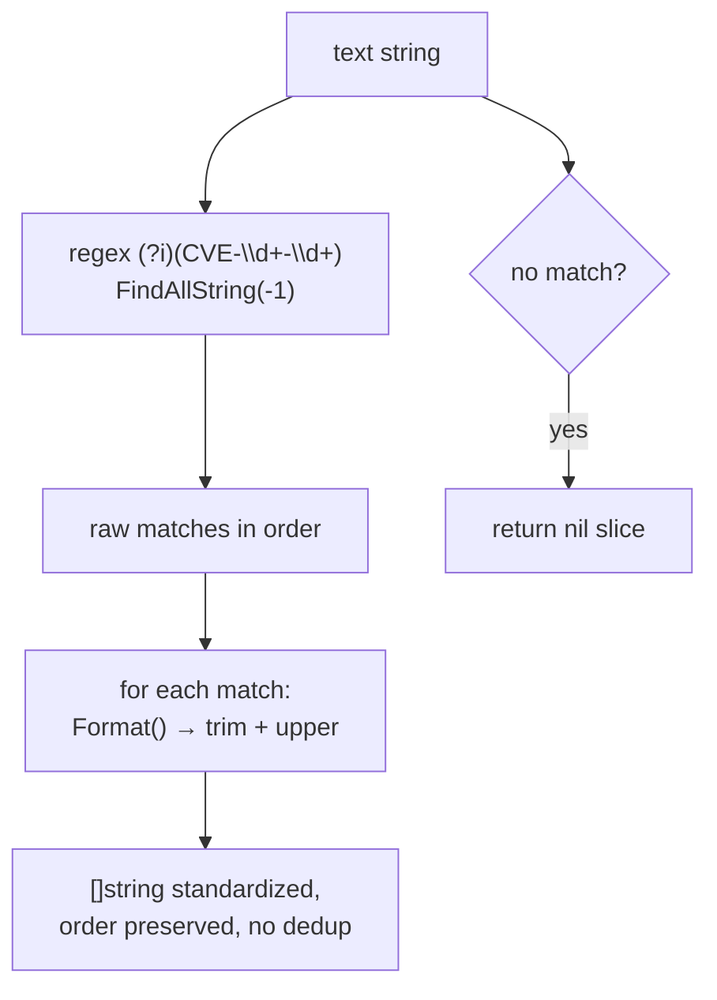

# ExtractCve

:::tip 📂 View Source
[`extract.go:42`](https://github.com/scagogogo/cve-skills/blob/main/extract.go#L42-L49) — open the implementation on GitHub (lines L42–L49).
:::

Extract every CVE identifier from arbitrary free text and return them as a standardized list.

:::tip 📌 Scenarios
- Pull all CVE IDs out of a security advisory, changelog, or email body in one pass.
- Normalize mixed-case mentions (e.g. `cve-2022-12345`) into standard uppercase form while preserving their order of appearance.
- Feed the resulting list into dedup, sort, or validation pipelines for downstream analysis.
:::

## Function Signature

```go
func ExtractCve(text string) []string
```

## Parameters

- `text` (string): The text to scan for CVE identifiers. May be any string — a single line, a multi-line report, or even an empty string.

## Return Value

- `[]string`: All CVE identifiers found in the text, each normalized to standard uppercase format. The order of appearance in the input is preserved. Returns an empty (nil) slice when no CVE is found.

## Behavior

- Uses the package-level pre-compiled regex `(?i)(CVE-\d+-\d+)` to find every non-overlapping match; the pattern is case-insensitive and not anchored, so it matches CVEs embedded anywhere in free text.
- Each match is passed through `Format` (`strings.ToUpper(strings.TrimSpace(...))`), so `cve-2022-12345` and `CVE-2022-12345` both become `CVE-2022-12345`.
- Matches are returned in the order they appear in the input — the same CVE mentioned twice appears twice.
- Does not deduplicate — call `RemoveDuplicateCves` on the result if you need unique values.
- Does not validate year/sequence ranges; it only matches the syntactic shape `CVE-<digits>-<digits>`. Use `ValidateCve` afterwards if you need semantic validation.
- An empty or CVE-free input yields a nil slice (length 0), never a panic.

## Flowchart



## Example

```go
package main

import (
    "fmt"
    "github.com/scagogogo/cve-skills"
)

func main() {
    // Basic usage: mixed-case mentions are normalized to uppercase
    text := "系统受到CVE-2021-44228和cve-2022-12345的影响"
    cves := cve.ExtractCve(text)
    fmt.Printf("Extracted: %v\n", cves)
    // Extracted: [CVE-2021-44228 CVE-2022-12345]

    // Complex multi-line advisory
    complexText := `
    Security Advisory 2024-001

    This update fixes the following vulnerabilities:
    1. CVE-2021-44228 - Log4Shell vulnerability
    2. cve-2022-12345 - custom component vulnerability
    3. CVE-2023-1234 - third-party library vulnerability

    Also includes: CVE-2023-5678 and CVE-2024-9999
    `
    extracted := cve.ExtractCve(complexText)
    fmt.Printf("From complex text (%d): %v\n", len(extracted), extracted)
    // From complex text (5): [CVE-2021-44228 CVE-2022-12345 CVE-2023-1234 CVE-2023-5678 CVE-2024-9999]

    // Duplicates are NOT removed — order is preserved
    dup := cve.ExtractCve("CVE-2022-1 mentions CVE-2022-1 again")
    fmt.Printf("Duplicates kept: %v\n", dup)
    // Duplicates kept: [CVE-2022-1 CVE-2022-1]

    // Empty text and text without CVE both return a nil slice
    fmt.Printf("Empty text: %v (len %d)\n", cve.ExtractCve(""), len(cve.ExtractCve("")))
    fmt.Printf("No-CVE text: %v (len %d)\n", cve.ExtractCve("plain text without any cve"), len(cve.ExtractCve("plain text without any cve")))
}
```

## Use Cases

- Extract all affected CVE IDs from security bulletins or vendor advisories.
- Batch-process changelogs and release notes to collect the CVE list per release.
- Mine logs, emails, or chat transcripts for CVE references during incident response.
- Pre-process free text before feeding the CVE list into dedup, sort, or validation pipelines.

## Notes

- ⚠️ The result is not deduplicated — if the same CVE appears N times, it is returned N times. Chain with `RemoveDuplicateCves` when uniqueness is required.
- Only the syntactic shape `CVE-<digits>-<digits>` is matched; the year and sequence are not range-checked. A token like `CVE-9999-0` will be extracted and formatted — validate with `ValidateCve` if you need semantic correctness.
- The regex is case-insensitive, so `cve`, `Cve`, and `CVE` prefixes all match; every match is uppercased via `Format`.
- Order follows the input text, which is left-to-right, line-by-line — useful when "first mentioned" or "last mentioned" matters (see `ExtractFirstCve` / `ExtractLastCve`).
- Time complexity is O(m) where m is the text length; space complexity is O(n) where n is the number of matches.

## Internal Implementation

The function body (extract.go L42-L49) is intentionally compact — three statements that delegate the heavy lifting to a pre-compiled regex and the `Format` helper.

- **Pre-compiled regex lookup (L43).** `cveRegex` is a package-level `var` initialized once with `regexp.MustCompile(`(?i)(CVE-\d+-\d+)`)`. Calling `FindAllString(text, -1)` scans the entire input and returns every non-overlapping match in left-to-right order. The `-1` count means "no limit on the number of matches". Because the regex is compiled at package init, repeated calls do not pay the compilation cost — only the linear scan.
- **In-place normalization loop (L44-L46).** The returned `slice` is iterated with index and value; each element is overwritten by `Format(cve)`. `Format` applies `strings.ToUpper(strings.TrimSpace(...))`, so trailing/leading whitespace is stripped and the `CVE-` prefix (matched case-insensitively) is normalized to uppercase. Mutating in place avoids allocating a second slice.
- **Direct return (L47).** The same `slice` reference is returned — no copy, no sort, no dedup. This keeps the function allocation-light and lets callers decide whether to chain `RemoveDuplicateCves` or `SortCves`.
- **Design intent.** The function is a thin "scan + normalize" adapter: the regex owns the matching semantics, `Format` owns the casing rules, and `ExtractCve` owns nothing except sequencing them. This is why `ExtractFirstCve` and `ExtractLastCve` can reuse it (the latter calls `ExtractCve` then indexes the last element).
- **No defensive branching.** There is no explicit `if len(text) == 0` check; `FindAllString` on empty or matchless input returns `nil`, and the `for` loop over a nil slice is a no-op, so the function naturally returns `nil` without a panic.

## Complexity

| Dimension | Bound | Driver |
|---|---|---|
| Time | O(m) | `FindAllString` scans the input text once; m is the text length (per the source-doc comment). |
| Space | O(n) | The returned slice holds one string per match; n is the number of CVE matches found (per the source-doc comment). |
| Per-element normalization | O(k) | Each `Format` call trims + uppercases a match of length k; summed over n matches this is bounded by m. |
| Setup | amortized O(1) | The regex is compiled once at package init, not per call. |

The function does not sort or deduplicate, so there is no O(n log n) term — callers that need ordering or uniqueness add it themselves via `SortCves` / `RemoveDuplicateCves`.

## Edge Cases

| Input | Behavior | Return |
|---|---|---|
| `""` (empty string) | `FindAllString` finds no match; loop body never runs | `nil` (length 0) |
| `"plain text without any cve"` | Regex scans, finds no `CVE-<digits>-<digits>` token | `nil` (length 0) |
| `"cve-2022-12345"` (lowercase) | Matches case-insensitively; `Format` uppercases it | `["CVE-2022-12345"]` |
| `"CvE-2022-12345"` (mixed case) | Matches; `Format` uppercases the prefix | `["CVE-2022-12345"]` |
| `"CVE-2022-12345 CVE-2022-12345"` (duplicate) | Two separate matches; no dedup | `["CVE-2022-12345", "CVE-2022-12345"]` |
| `"CVE-9999-0"` (out-of-range year/seq) | Syntactic shape matches; no range validation | `["CVE-9999-0"]` |
| `"CVE-2022-1234 extra"` (surrounding text) | Matches the embedded token; surrounding text ignored | `["CVE-2022-1234"]` |
| Multi-line advisory text | Scans line by line, left to right; newlines are just non-matching characters | All matches in order of appearance |
| `" CVE-2022-1 "` (whitespace around match) | Whitespace is outside the capture group; `Format` would trim it anyway | `["CVE-2022-1"]` |

## Data Flow

```text
+-------------------+
|  text: string     |
|  (arbitrary text) |
+---------+---------+
          |
          v
+-------------------+    package-level, compiled once at init
| cveRegex          |    (?i)(CVE-\d+-\d+)
| FindAllString(-1) |
+---------+---------+
          |
          v
+-------------------+
| slice []string    |    raw matches in input order, e.g.
| (lowercase / mixed|    ["cve-2022-12345", "CVE-2021-44228"]
|  case preserved)  |
+---------+---------+
          |
          | for i, cve := range slice
          v
+-------------------+
| Format(cve)       |    ToUpper + TrimSpace, in place
| slice[i] = ...    |    overwrite each element
+---------+---------+
          |
          v
+-------------------+
| slice []string    |    standardized, e.g.
| (uppercase, order |    ["CVE-2022-12345", "CVE-2021-44228"]
|  preserved, no    |    -- no sort, no dedup --
|  dedup)           |
+---------+---------+
          |
          v
+-------------------+
| return slice      |    nil if no match found
+-------------------+
```

## Related Functions

- [ExtractFirstCve](/api/functions/extract-first-cve) — return only the first match, more efficient than taking `ExtractCve(text)[0]`.
- [ExtractLastCve](/api/functions/extract-last-cve) — return only the last match (internally calls `ExtractCve`).
- [IsContainsCve](/api/functions/is-contains-cve) — boolean check for whether any CVE exists in the text, without allocating a slice.
- [Format](/api/functions/format) — the standardization step applied to every match.
- [RemoveDuplicateCves](/api/functions/remove-duplicate-cves) — deduplicate the slice returned by this function.
- [Extract category](/api/extract) — overview of all extraction functions.
