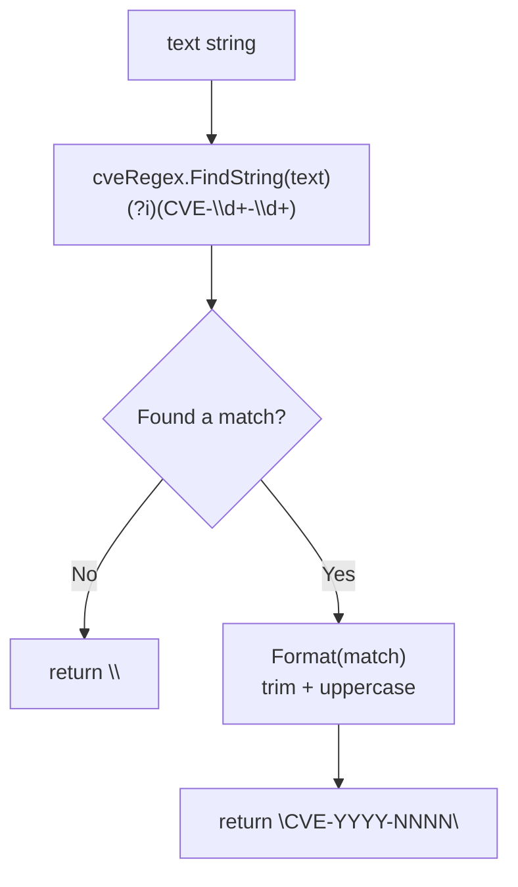

# ExtractFirstCve

:::tip 📂 View Source
[`extract.go:78`](https://github.com/scagogogo/cve-skills/blob/main/extract.go#L78-L82) — open the implementation on GitHub (lines L78–L82).
:::

Extract the first CVE identifier found in a string, returned in standard uppercase format.

:::tip 📌 Scenarios
- Quickly grab the primary CVE mentioned in a security advisory title or summary
- Pick a representative CVE for a bug report when only one identifier is needed
- Fast path when downstream code only cares about the first match
:::

## Function Signature

```go
func ExtractFirstCve(text string) string
```

## Parameters

- `text` (string): The text content to extract a CVE from. Can be any string — a security advisory, a commit message, a log line, etc.

## Return Value

- `string`: The first CVE identifier found, formatted to standard uppercase form. If no CVE is found, an empty string `""` is returned.

## Behavior

- Uses the pre-compiled regex `(?i)(CVE-\d+-\d+)` to locate the first match via `FindString`, which is case-insensitive and stops at the first occurrence.
- The matched substring is passed through `Format`, which trims surrounding whitespace and upper-cases the result, so `cve-2021-44228` and ` CVE-2021-44228 ` both normalize to `CVE-2021-44228`.
- When the text contains no CVE-pattern match, `FindString` returns `""`; `Format("")` also returns `""`, so the empty-string contract holds without any extra branching.
- Only the literal first match is returned — no scanning, slicing, or deduplication of the rest of the text is performed, making this cheaper than `ExtractCve` followed by indexing `[0]`.

## Flowchart



## Example

```go
package main

import (
    "fmt"

    "github.com/scagogogo/cve-skills"
)

func main() {
    // Source-aligned example: first CVE in a mixed-case sentence
    report := "系统受到CVE-2021-44228和CVE-2022-12345的影响"
    firstCve := cve.ExtractFirstCve(report)
    fmt.Println(firstCve) // Output: CVE-2021-44228

    // Text without any CVE → empty string
    noCve := "本文档不包含任何CVE编号"
    fmt.Printf("%q\n", cve.ExtractFirstCve(noCve)) // Output: ""

    // Log4j-style reference wrapped in parentheses
    log4j := "Log4j漏洞(CVE-2021-44228)非常严重"
    fmt.Println(cve.ExtractFirstCve(log4j)) // Output: CVE-2021-44228

    // Lowercase input is normalized to uppercase
    lower := "first is cve-2022-12345 then cve-2023-9999"
    fmt.Println(cve.ExtractFirstCve(lower)) // Output: CVE-2022-12345

    // Empty string input
    fmt.Printf("%q\n", cve.ExtractFirstCve("")) // Output: ""

    // Only the FIRST match is returned, even when many exist
    many := "CVE-2023-1111, CVE-2023-2222, CVE-2023-3333"
    fmt.Println(cve.ExtractFirstCve(many)) // Output: CVE-2023-1111
}
```

## Use Cases

- Get the primary or most prominent CVE from an advisory when only one identifier is needed downstream
- Quickly identify the main CVE of a security notice for tagging or ticket creation
- Performance-sensitive paths that need only the first result without materializing the full match list
- Lightweight pre-scan of logs or commit messages before a heavier extraction pass

## Notes

- ⚠️ The function returns only the **first** match; to obtain every CVE use [`ExtractCve`](/api/functions/extract-cve), and for the last use [`ExtractLastCve`](/api/functions/extract-last-cve).
- ✅ Matching is case-insensitive (`(?i)`), and the result is always upper-cased via `Format`, so `cve-`, `Cve-`, and `CVE-` prefixes all yield the same standard form.
- ⚠️ Matches are pattern-based, not validated against the CVE registry — a string like `CVE-9999-99999` will be returned even though it is not a real assigned CVE. Pair with [`ValidateCve`](/api/functions/validate-cve) when semantic validity matters.
- ✅ No deduplication is relevant here (only one result), but note the underlying regex does not deduplicate either — the first occurrence wins even if it is a duplicate.
- ⚠️ An empty-string return is the only failure signal; callers should check `== ""` rather than expecting an error.

## Internal Implementation

The function body is just two lines (`extract.go:78-82`), but each line carries a deliberate design choice:

- **Pre-compiled regex reuse (L9, L79)**: The package-level `cveRegex = regexp.MustCompile(\`(?i)(CVE-\d+-\d+)\`)` is compiled once at init and shared by `ExtractCve`, `ExtractFirstCve`, and `ExtractLastCve`. `ExtractFirstCve` calls `cveRegex.FindString(text)`, which performs a single leftmost match and short-circuits — it does not allocate a result slice the way `FindAllString` does.
- **First-match semantics via `FindString` (L79)**: `(*Regexp).FindString` returns the text of the leftmost match, or `""` when there is no match. This is exactly the "first CVE" contract, with no manual index handling.
- **Normalization delegated to `Format` (L80)**: The raw match is passed straight to `Format(s)`, which trims surrounding whitespace and upper-cases the string. This guarantees case-insensitive input (`cve-`, `Cve-`, `CVE-`) always yields the standard `CVE-YYYY-NNNN` form.
- **Empty-path without branching**: When nothing matches, `FindString` returns `""` and `Format("")` returns `""`, so the no-CVE contract is satisfied by composition — there is no `if`/`else` in the function body.
- **Cheaper than `ExtractCve(text)[0]`**: Because `FindString` stops at the first match and allocates only one string, this path avoids building and normalizing the full match slice that `ExtractCve` would produce.

## Complexity

| Dimension | Cost | Notes |
|---|---|---|
| Time | O(m) | One regex scan over the input, where m = `len(text)`; `(?i)(CVE-\d+-\d+)` halts at the leftmost match, so in practice it often stops well before end-of-text. |
| Space | O(1) auxiliary | `FindString` allocates a single matched string; `Format` may allocate one normalized string. No slice or map is built. |
| Regex compilation | O(1) amortized | `cveRegex` is compiled once at package init via `MustCompile`; per-call cost is zero. |

These bounds are tighter than the source-level O(n)/O(m) notes on `ExtractCve` (which pays O(n) space for the full match slice), because `ExtractFirstCve` only ever materializes one match.

## Edge Cases

| Input | Behavior | Return |
|---|---|---|
| `""` (empty string) | `FindString` finds no match → returns `""`; `Format("")` returns `""` | `""` |
| Text with no CVE pattern (e.g. `"no vulns here"`) | Regex scan completes with no match → `""` → `Format("")` → `""` | `""` |
| Lowercase `cve-2022-12345` | Matched case-insensitively by `(?i)`; `Format` upper-cases it | `"CVE-2022-12345"` |
| Mixed-case `Cve-2022-12345` | Same as above — `(?i)` matches, `Format` normalizes | `"CVE-2022-12345"` |
| Surrounding whitespace/parentheses `"( CVE-2021-44228 )"` | The capture group `(...)` grabs only `CVE-2021-44228`; `Format` trims any edge whitespace | `"CVE-2021-44228"` |
| Multiple CVEs `"CVE-2023-1111, CVE-2023-2222"` | `FindString` returns only the leftmost match; the rest are ignored | `"CVE-2023-1111"` |
| Duplicate first CVE `"CVE-2021-44228 and CVE-2021-44228"` | First occurrence wins; no deduplication is performed (nor needed) | `"CVE-2021-44228"` |
| Non-existent but well-formed `"CVE-9999-99999"` | Pattern matches; not registry-validated | `"CVE-9999-99999"` |
| CVE-like token inside a longer word `"XCVE-2021-44228Z"` | `\b` is not anchored, so the substring matches | `"CVE-2021-44228"` |

## Data Flow

```text
+---------------------------+
|     input text (string)   |
|  e.g. "see cve-2022-12345"|
+-------------+-------------+
              |
              v
+---------------------------+
| cveRegex.FindString(text) |  pre-compiled: (?i)(CVE-\d+-\d+)
|  - leftmost single match  |
|  - returns "" if none     |
+-------------+-------------+
              |
              v
+---------------------------+
|        raw match s        |
|  "cve-2022-12345" or ""   |
+-------------+-------------+
              |
              v
+---------------------------+
|       Format(s)           |  trim + uppercase
|  -> "CVE-2022-12345"      |
|  -> ""            (if "") |
+-------------+-------------+
              |
              v
+---------------------------+
|   return string           |
|  "CVE-YYYY-NNNN" or ""    |
+---------------------------+
```

## Related Functions

- [ExtractCve](/api/functions/extract-cve) — extract every CVE identifier from text
- [ExtractLastCve](/api/functions/extract-last-cve) — extract the last CVE identifier from text
- [IsContainsCve](/api/functions/is-contains-cve) — boolean check for whether any CVE is present
- [Format](/api/functions/format) — the normalization step applied to the matched substring
- [ValidateCve](/api/functions/validate-cve) — validate a returned identifier against real CVE rules
- [Extraction category overview](/api/extract) — all extraction-related functions
