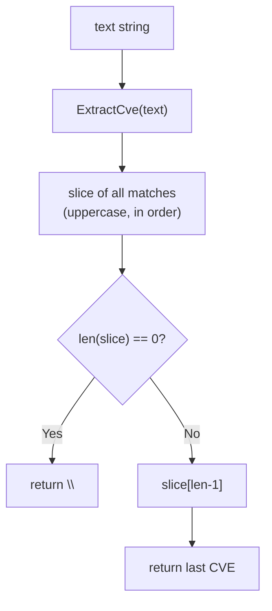

# ExtractLastCve

:::tip 📂 View Source
[`extract.go:111`](https://github.com/scagogogo/cve-skills/blob/main/extract.go#L111-L118) — open the implementation on GitHub (lines L111–L118).
:::

Extracts the last CVE identifier appearing in a piece of text and returns it in standard uppercase format.

:::tip 📌 Scenarios
- Pulling the most recently mentioned CVE from a changelog or release note.
- Capturing the latest patched CVE from an advisory that lists fixes in chronological order.
- Picking the trailing CVE from a summary line when only the last one matters.
:::

## Function Signature

```go
func ExtractLastCve(text string) string
```

## Parameters

- `text` (string): The text content to extract a CVE from. Can be any string.

## Return Value

- `string`: The last CVE identifier found in the text, formatted to standard uppercase form. If no CVE is found, an empty string `""` is returned.

## Behavior

- Internally calls `ExtractCve(text)` to collect every CVE match in order of appearance, then returns the last element of the resulting slice.
- Because it goes through `ExtractCve`, the result inherits the same formatting and matching rules: matches are case-insensitive (`(?i)(CVE-\d+-\d+)`) and the returned value is normalized via `Format` to uppercase with surrounding whitespace trimmed.
- When the input contains no CVE (or is empty), `ExtractCve` returns an empty slice; `ExtractLastCve` detects `len(slice) == 0` and returns `""` without indexing the slice, so there is no out-of-range panic.
- Duplicates are not removed: if the same CVE appears multiple times, the last occurrence is returned as-is (still uppercase). Use `RemoveDuplicateCves` separately if dedup is needed.

## Flowchart



## Example

```go
package main

import (
    "fmt"
    "github.com/scagogogo/cve-skills"
)

func main() {
    // Source: extract.go doc example
    changelog := "修复了CVE-2021-44228和CVE-2022-12345漏洞"
    lastCve := cve.ExtractLastCve(changelog)
    fmt.Println(lastCve) // Output: CVE-2022-12345

    // Multiple cases with annotated expected output
    cases := []string{
        "系统受到CVE-2021-44228和CVE-2022-12345的影响", // expected: CVE-2022-12345
        "cve-2022-12345 comes first",                  // expected: CVE-2022-12345 (only one)
        "Primary is CVE-2021-44228, plus cve-2022-12345 and CVE-2023-3333", // expected: CVE-2023-3333
        "本文档不包含任何CVE编号",                            // expected: "" (empty)
        "",                                            // expected: "" (empty)
    }

    for _, text := range cases {
        last := cve.ExtractLastCve(text)
        fmt.Printf("Text: '%s'\n  Last CVE: '%s'\n", text, last)
    }
}
```

## Use Cases

- Get the most recently mentioned CVE from a changelog or update log.
- Process chronologically ordered CVE lists where the last entry is the latest.
- Capture supplementary or updated CVE information appended at the end of a notice.
- Quick sanity check that complements `ExtractFirstCve` to confirm the text's CVE range.

## Notes

- ⚠️ Unlike `ExtractFirstCve` (which uses the regex's `FindString` for an early stop), `ExtractLastCve` always runs a full `ExtractCve` scan to materialize the whole slice before picking the last element — performance is comparable to `ExtractCve`, not faster.
- ✅ Case-insensitive matching: lowercase `cve-...` and mixed-case `CvE-...` are normalized to `CVE-...`.
- ⚠️ No deduplication: if the same CVE repeats, the last repetition is returned. Pair with `RemoveDuplicateCves` when uniqueness matters.
- 🔍 Returns `""` (not an error) when nothing matches — callers should check for an empty string rather than expecting a sentinel error.
- 🛠️ If you need every match, call `ExtractCve` directly; if you need the first match, prefer the lighter `ExtractFirstCve`.

## Internal Implementation

The function is a thin wrapper over `ExtractCve`, adding only an empty-check and a last-element lookup:

- Delegates to `ExtractCve(text)` (extract.go:112), which itself runs `cveRegex.FindAllString(text, -1)` and normalizes each match through `Format`. This means `ExtractLastCve` pays for the full scan and the full slice allocation, not a targeted "find last" search.
- Guards the empty case with `if len(slice) == 0` (extract.go:113) before any indexing. This is the only branching point; it prevents an out-of-range panic on inputs with no CVE.
- Returns `slice[len(slice)-1]` (extract.go:116) — a single slice index into the already-materialized, already-formatted slice. No additional `Format` call happens here because `ExtractCve` already uppercased every element.
- Design intent: reuse the tested `ExtractCve` pipeline (matching + formatting) rather than reimplementing the regex, so matching rules stay identical across `ExtractCve` / `ExtractFirstCve` / `ExtractLastCve`. The tradeoff is that "last" is computed by materializing the whole list instead of scanning backwards.
- Because ordering comes from `FindAllString` (left-to-right occurrence order), the "last" element is the last match in source order — not the highest year/sequence, and not affected by sorting.

## Complexity

Derived from the `ExtractCve` scan that this function invokes (see the `ExtractCve` doc comment: time O(m), space O(n)):

| Resource | Complexity | Notes |
|---|---|---|
| Time | O(m) | `m` is the input text length; dominated by the single regex `FindAllString` pass over the whole string. |
| Space | O(n) | `n` is the number of CVE matches; `ExtractCve` allocates a slice of length `n`, all retained until the last element is read. |
| Extra time (this wrapper) | O(1) | One `len()` check plus one slice index — negligible on top of the scan. |

Note: because the entire slice is materialized even though only the last element is needed, the space cost is the same as `ExtractCve`, not O(1).

## Edge Cases

| Input | Behavior | Return |
|---|---|---|
| Empty string `""` | `ExtractCve` returns empty slice; `len == 0` branch taken. | `""` |
| No CVE anywhere in text | Regex finds nothing; empty slice; `len == 0` branch taken. | `""` |
| Single CVE `"...CVE-2022-12345..."` | Slice has one element; `slice[0]` is returned. | The CVE, uppercase |
| Multiple CVEs | Last match in left-to-right order returned. | Last CVE, uppercase |
| Lowercase `cve-2022-12345` | Matched by `(?i)`; normalized to uppercase via `Format`. | `CVE-2022-12345` |
| Mixed case `CvE-2022-12345` | Same case-insensitive match and normalization. | `CVE-2022-12345` |
| Duplicate CVE repeated | Duplicates are not removed; last occurrence returned as-is. | Last occurrence, uppercase |
| CVE-like substring with extra digits | Regex `CVE-\d+-\d+` is greedy per group; only well-formed matches count. | Last well-formed match, or `""` |

## Data Flow

```text
+------------------------+
|   text: string input   |
+-----------+------------+
            |
            v
+------------------------+
|  ExtractCve(text)      |
|  (extract.go:112)      |
|  - cveRegex.FindAll    |
|    String(text, -1)    |
|  - Format() each match |
+-----------+------------+
            |
            v
+------------------------+
|  slice: []string       |
|  (uppercase, in order) |
+-----------+------------+
            |
            v
+------------------------+
| len(slice) == 0 ?      |--- Yes ---> return ""
| (extract.go:113)       |
+-----------+------------+
            | No
            v
+------------------------+
| slice[len(slice)-1]    |
| (extract.go:116)       |
+-----------+------------+
            |
            v
+------------------------+
| return last CVE string |
+------------------------+
```

## Related Functions

- [ExtractCve](/api/functions/extract-cve) — extract every CVE from text (the basis of `ExtractLastCve`).
- [ExtractFirstCve](/api/functions/extract-first-cve) — extract the first CVE, with a lighter-weight scan.
- [Extract](/api/extract) — extraction category overview.
