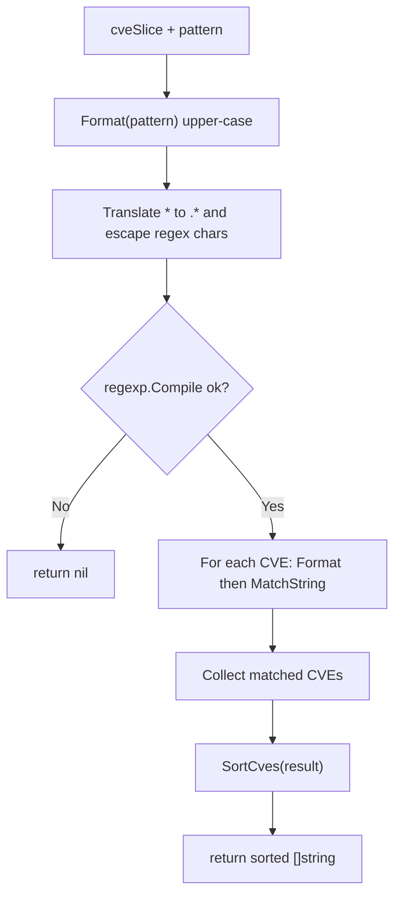

# FilterCvesByPattern

:::tip 📂 View Source
[`extract.go:299`](https://github.com/scagogogo/cve-skills/blob/main/extract.go#L299-L330) — open the implementation on GitHub (lines L299–L330).
:::

`FilterCvesByPattern` filters a list of CVE identifiers against a simple wildcard pattern, returning the matching CVEs formatted and sorted.

:::tip 📌 Scenarios
- Quickly narrow a CVE list down to a single year (e.g. `CVE-2022-*`)
- Select CVEs sharing a fixed sequence number across years (e.g. `CVE-*-1234`)
- Build flexible CVE query/search features driven by user-supplied patterns

## Function Signature

```go
func FilterCvesByPattern(cveSlice []string, pattern string) []string
```

## Parameters

- `cveSlice` ([]string): The slice of CVE identifiers to filter
- `pattern` (string): Wildcard pattern; automatically upper-cased via `Format`

## Return Values

- `[]string`: All CVEs matching the pattern, each standardized with `Format` and sorted with `SortCves`; returns `nil` if the compiled pattern is invalid

## Behavior

- The pattern is first run through `Format` (upper-cased and trimmed), so `cve-2022-*` and `CVE-2022-*` behave identically
- `*` is translated to the regex `.*` (matches any run of characters)
- Regex metacharacters in the pattern — `. + ( ) [ ] { } \ ^ $ |` — are escaped automatically, so literal dots (like the `-` separators are kept as-is) and braces will not be interpreted as regex syntax
- Each CVE in `cveSlice` is standardized with `Format` before matching, so surrounding whitespace and lowercase letters are tolerated
- The result is passed through `SortCves`, guaranteeing a stable, deterministic order regardless of input order

## Flowchart



## Example

```go
package main

import (
	"fmt"

	"github.com/scagogogo/cve-skills"
)

func main() {
	cveList := []string{
		"CVE-2022-1111",
		"CVE-2022-2222",
		"CVE-2021-1111",
		"CVE-2023-2222",
		"cve-2022-3333", // lowercase, will be formatted
	}

	// 输入: ["CVE-2022-1111", "CVE-2022-2222", "CVE-2023-1111"], "CVE-2022-*"
	// 输出: ["CVE-2022-1111", "CVE-2022-2222"]
	cves2022 := cve.FilterCvesByPattern(cveList, "CVE-2022-*")
	fmt.Println("CVE-2022-*      :", cves2022)

	// 输入: ["CVE-2022-1111", "CVE-2021-1111", "CVE-2023-2222"], "CVE-*-1111"
	// 输出: ["CVE-2021-1111", "CVE-2022-1111"]
	cve1111 := cve.FilterCvesByPattern(cveList, "CVE-*-1111")
	fmt.Println("CVE-*-1111      :", cve1111)

	// Pattern starting with sequence prefix — CVE-2022-1* matches CVEs whose
	// sequence begins with "1" in 2022.
	cve2022Seq1 := cve.FilterCvesByPattern(cveList, "CVE-2022-1*")
	fmt.Println("CVE-2022-1*     :", cve2022Seq1)

	// Lowercase pattern is auto-formatted to uppercase before matching.
	cves2023 := cve.FilterCvesByPattern(cveList, "cve-2023-*")
	fmt.Println("cve-2023-*      :", cves2023)
}
```

## Use Cases

- Quickly filter CVEs by year via a wildcard (`CVE-2022-*`)
- Select CVEs sharing a fixed sequence number across all years (`CVE-*-1234`)
- Build flexible, user-driven CVE query/search features
- Normalize and sort an ad-hoc CVE list as a side effect of filtering

## Notes

- Only `*` is a wildcard; `?` and other glob-style placeholders are **not** supported — `?` is treated as a literal character
- The pattern is anchored only by its own text — there is no implicit `^`/`$`, so `CVE-2022-1` would also match `CVE-2022-12345`. Add explicit context in the pattern when you need stricter boundaries
- Because each CVE is `Format`-ed before matching, mixed-case or whitespace-padded entries in `cveSlice` still match correctly
- If `regexp.Compile` fails (e.g. malformed escaping), the function returns `nil`, not an empty slice — distinguish `nil` from "no matches" in downstream logic if needed
- Results are sorted by `SortCves`, so the output order is deterministic and independent of the input order

## Internal Implementation

The function `FilterCvesByPattern` (extract.go L299-L330) builds a regex from a wildcard pattern and matches each formatted CVE against it. The flow is broken into five stages:

- **Pattern normalization (L300).** `pattern = Format(pattern)` upper-cases and trims the pattern first. This is why `cve-2022-*` and `CVE-2022-*` produce identical results — the wildcard translation in the next step always operates on the canonical form.
- **Wildcard-to-regex translation (L302-L314).** The pattern is iterated rune-by-rune. `*` becomes `.*`; the regex metacharacters `. + ( ) [ ] { } \ ^ $ |` are each prefixed with a backslash (L308-L310); every other rune is appended verbatim (L311-L313). Design intent: keep the user-facing pattern a *simple* wildcard grammar (only `*`) while still using Go's `regexp` engine underneath, and protect literal dots/braces from being misread as regex syntax.
- **Compilation with fail-fast (L316-L319).** `regexp.Compile(string(regexParts))` compiles the translated pattern. If compilation fails the function returns `nil` immediately rather than panicking — a deliberate choice so callers can distinguish "bad pattern" from "no matches".
- **Per-CVE format-and-match (L321-L327).** Each entry in `cveSlice` is run through `Format` (L323) before `regex.MatchString` (L324). Formatting inside the loop (not pre-normalizing the whole slice) means the original slice is never mutated; only matching results are collected in their canonical form (L325).
- **Deterministic ordering (L329).** `return SortCves(result)` sorts the collected matches, so output order is independent of input order and stable across calls.

### Key Lines

- L300: `pattern = Format(pattern)` — canonicalizes the pattern.
- L307: `regexParts = append(regexParts, []rune(".*")...)` — `*` → `.*`.
- L308-L310: escape branch for regex metacharacters.
- L316: `regexp.Compile(string(regexParts))` — the single failure point.
- L324: `regex.MatchString(formatted)` — the actual match test.
- L329: `SortCves(result)` — final deterministic ordering.

## Complexity

Let `n = len(cveSlice)` and `m = len(pattern)` (in runes). The dominant costs are:

- Pattern translation: O(m) — one pass over the pattern runes, with O(1) amortized append per rune. The compiled regex pattern string is at most ~2m runes (worst case: every char is a metacharacter needing a `\` prefix).
- `regexp.Compile`: O(m) in pattern length for this simple (non-backtracking-ambiguous) grammar.
- Per-CVE matching: each `MatchString` is O(k) where `k` is the CVE length; across the slice this is O(n · k). The `Format` call per CVE is also O(k).
- `SortCves(result)`: O(r log r) where `r` is the number of matches (`r ≤ n`).

| Resource | Cost |
| --- | --- |
| Time | O(m) + O(n · k) + O(r log r), i.e. linear in the input slice plus a sort of the matches |
| Space | O(m) for the regex parts buffer + O(r) for the result slice (plus the compiled regex) |

## Edge Cases

| Input | Behavior | Return |
| --- | --- | --- |
| `cveSlice` is nil or empty | Loop body never executes; `result` stays nil | `SortCves(nil)` → `nil` |
| `pattern` is empty string `""` | `Format("")` → `""`; regex `""` compiles; `MatchString` matches every string | all CVEs formatted and sorted |
| `pattern` is lowercase (`cve-2022-*`) | `Format` upper-cases to `CVE-2022-*` before translation | matches as if uppercase |
| `pattern` contains regex metacharacters (`CVE-2022.[*`) | `.` is escaped to `\.`, treated literally | matches literal `.`, not "any char" |
| `pattern` contains `?` | `?` is not a wildcard; it is appended verbatim (not escaped) and passed to `regexp.Compile` | a regex `?` — likely a **compile error** → `nil` |
| Duplicate CVEs in `cveSlice` | Each occurrence is formatted and matched independently; both are appended | duplicates preserved (not deduplicated), then sorted |
| `cveSlice` entries with mixed case/whitespace (`" cve-2022-1111 "`) | Each is `Format`-ed before matching | matches cleanly, output is canonical |
| `regexp.Compile` fails | Early return at L317-L319 | `nil` |
| No CVE matches the pattern | `result` stays empty | `SortCves([])` → empty slice (not `nil`) |

## Data Flow

```text
+--------------------------+      +-------------------------+
| cveSlice []string        |      | pattern string          |
| (raw, may be mixed case) |      | (e.g. "cve-2022-*")     |
+-----------+--------------+      +-----------+-------------+
            |                               |
            |                               v
            |                  +---------------------------+
            |                  | Format(pattern)           |  L300
            |                  | -> "CVE-2022-*"           |
            |                  +-----------+---------------+
            |                              |
            |                              v
            |                  +---------------------------+
            |                  | rune-by-rune translate    |  L302-L314
            |                  |  '*' -> ".*"              |
            |                  |  metachar -> '\'+char     |
            |                  | -> "CVE-2022-.*"          |
            |                  +-----------+---------------+
            |                              |
            |                              v
            |                  +---------------------------+
            |                  | regexp.Compile(...)       |  L316
            |                  +-----+---------------+-----+
            |                        |               |
            |                 err != 0|               | ok
            |                        v               v
            |               +----------------+  +-------------------------+
            |               | return nil     |  | regex *Regexp           |
            |               | (L317-L319)    |  +-----------+-------------+
            |               +----------------+              |
            |                                               |
            v                                               v
   +-----------------+                          +-------------------------+
   | for cve in slice| (L322)                   | regex.MatchString(...)  |
   +---+-------------+                          +-----------+-------------+
       |                                                      |
       v                                                      |
   +-----------------+                                       |
   | Format(cve)     | L323                                  |
   | -> canonical    |                                       |
   +---+-------------+                                       |
       |                                                      |
       +----------------------> matched? ----------------------+
                                  |
                            yes   |   no
                              v   |   v
                       +-----------+ +-----------+
                       | append to | | skip      |
                       | result    | | (L325)    |
                       +-----+-----+ +-----------+
                             |
                             v
                    +-----------------+
                    | result []string |  (formatted matches)
                    +--------+--------+
                             |
                             v
                    +-----------------+
                    | SortCves(result)| L329
                    +--------+--------+
                             |
                             v
                    +-----------------+
                    | sorted []string |  (return value)
                    +-----------------+
```

## Related Functions

- [Format](/api/functions/format) — standardize a CVE to uppercase, trimmed form (applied to both pattern and each CVE)
- [SortCves](/api/functions/sort-cves) — sort the filtered result deterministically
- [FilterCvesByYear](/api/functions/filter-cves-by-year) — filter CVEs by a specific year without wildcards
- [ExtractCves](/api/functions/extract-cve) — extract all CVEs from arbitrary text before filtering
- [Range & Pattern category](/api/range-pattern)
