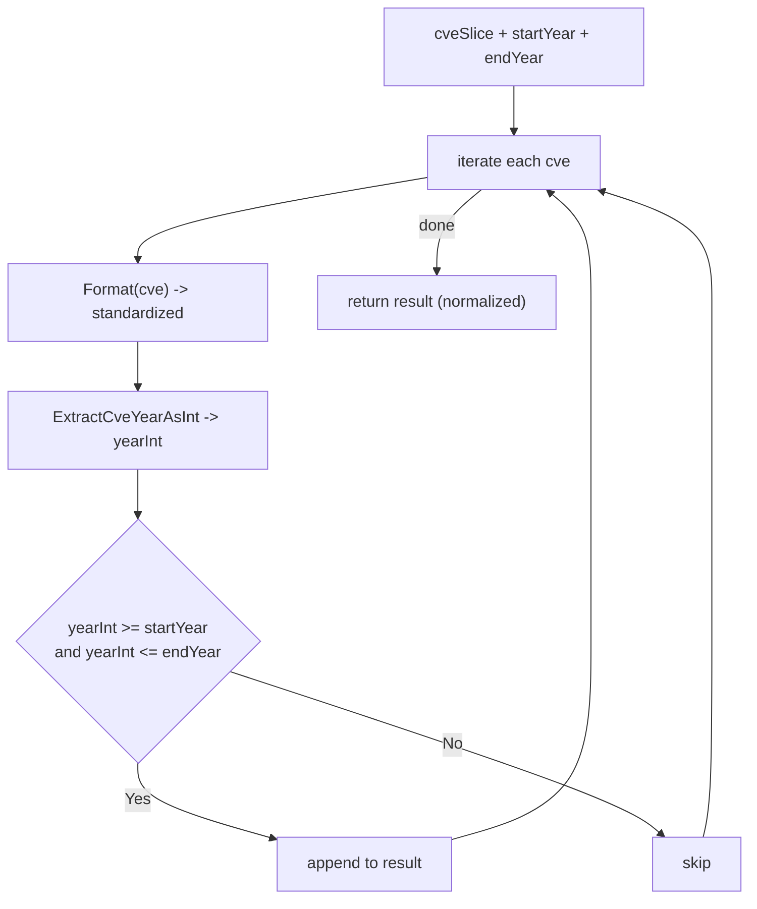

# FilterCvesByYearRange

:::tip 📂 View Source
[`filter.go:139`](https://github.com/scagogogo/cve-skills/blob/main/filter.go#L139-L152) — open the implementation on GitHub (lines L139–L152).
:::

`FilterCvesByYearRange` filters CVE identifiers from a list, keeping only those whose year falls inside a closed range `[startYear, endYear]`.

:::tip 📌 Scenarios
- Retrieve all CVEs published within a reporting period (e.g. a fiscal year or a quarter)
- Narrow a large CVE dataset to a time window before trend analysis or charting
- Build "year-over-year" comparisons by slicing consecutive ranges out of one list
:::

## Function Signature

```go
func FilterCvesByYearRange(cveSlice []string, startYear, endYear int) []string
```

## Parameters

- `cveSlice` ([]string): The list of CVE identifiers to filter
- `startYear` (int): The start year of the range (inclusive)
- `endYear` (int): The end year of the range (inclusive)

## Return Values

- `[]string`: The CVE identifiers whose year falls within the range, each in standardized form; an empty slice is returned when no CVE matches

## Behavior

- Iterates every entry in `cveSlice` and standardizes it with `Format` before comparison, so casing and surrounding whitespace do not affect the result
- Extracts the year as an integer via `ExtractCveYearAsInt`; the range check is `yearInt >= startYear && yearInt <= endYear`, with both bounds inclusive
- Each matching CVE is appended in its standardized (uppercase, trimmed) form, so the output is normalized even when the input is messy
- Order from the input is preserved; entries that fail to yield a positive year (malformed or unparseable) are silently dropped
- Returns `nil` (an empty slice) when nothing matches — callers should treat an empty result as "no CVE in range", not as an error

## Flowchart



## Example

```go
package main

import (
	"fmt"

	"github.com/scagogogo/cve-skills"
)

func main() {
	cveList := []string{
		"CVE-2020-1111",
		"CVE-2021-2222",
		"CVE-2022-3333",
	}

	// Range covers 2021 and 2022 (both inclusive)
	recentCves := cve.FilterCvesByYearRange(cveList, 2021, 2022)
	// recentCves -> ["CVE-2021-2222", "CVE-2022-3333"]
	fmt.Println("2021-2022:", recentCves)

	// Range that matches nothing -> empty slice
	none := cve.FilterCvesByYearRange([]string{"CVE-2020-1111", "CVE-2021-2222"}, 2022, 2023)
	// none -> []
	fmt.Println("2022-2023 (no match):", none)

	// Range that covers the whole list
	all := cve.FilterCvesByYearRange(cveList, 2020, 2022)
	// all -> ["CVE-2020-1111", "CVE-2021-2222", "CVE-2022-3333"]
	fmt.Println("2020-2022:", all)

	// Messy casing/whitespace is normalized before comparison
	messy := cve.FilterCvesByYearRange(
		[]string{" cve-2021-2222 ", "CVE-2022-3333"},
		2021, 2021,
	)
	// messy -> ["CVE-2021-2222"]
	fmt.Println("normalized 2021:", messy)
}
```

## Use Cases

- Pull all CVEs published within a reporting period for an annual or quarterly security report
- Pre-filter a CVE dataset to a target window before trend analysis or charting
- Build year-over-year slices from a single cumulative CVE list

## Notes

- Both `startYear` and `endYear` are **inclusive**; `FilterCvesByYearRange(list, 2021, 2021)` is effectively a single-year filter
- The function does **not** validate that `startYear <= endYear` — if `startYear > endYear` the range is empty and the result is always an empty slice
- Compared with `FilterCvesByYear`, this function accepts a range rather than a single year; `GetRecentCves` is a thin wrapper that calls `FilterCvesByYearRange` with `(currentYear-years+1, currentYear)`
- Output order follows the input order; if you need sorted output, pass the result through `SortCves`
- Malformed CVEs that cannot yield a positive year are dropped silently rather than causing an error

## Internal Implementation

The function is a single-pass linear scan with no pre-allocation and no sorting. The key steps, mapped to `filter.go:139-152`:

- `var result []string` (L140) — the result slice starts as a `nil` slice with no backing array. Nothing is allocated until the first `append`, so an all-miss input costs zero slice allocation. This is why "no match" returns `nil` rather than a zero-length non-nil slice.
- `Format(cve)` (L143) — each entry is normalized to uppercase, trimmed form *before* any comparison. This is the single point that makes the filter case- and whitespace-insensitive, and it also means the value appended to `result` is the normalized form, not the original input.
- `ExtractCveYearAsInt(formattedCve)` (L144) — the year is pulled out as an `int` from the already-formatted string. Operating on the formatted form guarantees the prefix is uppercase `CVE-`, which the extractor relies on.
- `yearInt >= startYear && yearInt <= endYear` (L145) — a closed range check with both bounds inclusive. Note this is plain integer comparison; if `startYear > endYear` the predicate is unsatisfiable for any `yearInt` and the loop simply appends nothing.
- `result = append(result, formattedCve)` (L146) — only the normalized string is stored, so the output is uniformly uppercase and trimmed regardless of how messy the input was. Input order is preserved because the loop appends in iteration order and never reorders.

### Design Intent

- **Normalize-then-compare**: by routing every entry through `Format` first, the function delegates all casing/whitespace concerns to one helper and keeps the range check a pure integer comparison.
- **No validation, no errors**: malformed entries that yield a non-positive year (e.g. `0` from `ExtractCveYearAsInt`) simply fail the `>= startYear` check for any realistic `startYear` and are dropped silently — no error path, no logging.
- **Stable, allocation-light**: preserving input order and deferring allocation until the first match keeps the common "narrow a large list" path cheap.

## Complexity

| Dimension | Cost | Notes |
|---|---|---|
| Time | O(n) | One pass over `cveSlice` of length n; each iteration does constant-work `Format` + `ExtractCveYearAsInt` + two integer comparisons. No sorting, no hashing. |
| Space | O(k) | Where k is the number of matching CVEs (the result slice). Worst case k = n, i.e. O(n). No auxiliary maps or sets are allocated. |
| Best case | O(1) space | When no CVE matches, `result` stays `nil` and no backing array is ever allocated. |

The O(n) time and O(k) space figures match the doc comment on `filter.go:126-128` (time O(n), space O(k), worst case O(n)).

## Edge Cases

| Input | Behavior | Return |
|---|---|---|
| Empty slice `[]` | Loop body never runs | `nil` (empty) |
| `startYear > endYear` (e.g. 2022, 2021) | Range predicate unsatisfiable for any `yearInt`; nothing appended | `nil` (empty) |
| `startYear == endYear` (e.g. 2021, 2021) | Acts as a single-year filter; only that exact year matches | matching entries or `nil` |
| Lowercase input `cve-2021-2222` | `Format` uppercases to `CVE-2021-2222` before compare/append | `["CVE-2021-2222"]` |
| Whitespace-padded input `" cve-2021-2222 "` | `Format` trims and uppercases | `["CVE-2021-2222"]` |
| Duplicate CVEs in input | Each copy is processed independently; duplicates are preserved in output (no de-dup here) | duplicates included |
| Malformed CVE `"CVE-2021-abc"` / `"foobar"` | `ExtractCveYearAsInt` yields `0`; `0 >= startYear` is false for any realistic year | silently dropped |
| Year below range (e.g. 2020 when range is 2021-2022) | Fails `>= startYear` | dropped |
| Year above range (e.g. 2023 when range is 2021-2022) | Fails `<= endYear` | dropped |
| All entries match | Every entry appended in order | full-length slice, O(n) space |

## Data Flow

```text
+---------------------------+   +--------------------------+   +--------------------------+
| Input: cveSlice []string  |   | startYear, endYear : int |   | (no auxiliary state)     |
+---------------------------+   +--------------------------+   +--------------------------+
          |                              |
          v                              |
   +--------------+                      |
   | for each cve |<---------------------+  (closed range [startYear, endYear])
   +--------------+                      |
          |                              |
          v                              |
   +----------------------+              |
   | Format(cve)          |  normalize: uppercase + trim
   +----------------------+              |
          |                              |
          v                              |
   +--------------------------+          |
   | ExtractCveYearAsInt(...) |  -> yearInt (int)
   +--------------------------+          |
          |                              |
          v                              |
   +-----------------------------------+ |
   | yearInt >= startYear &&           | |
   | yearInt <= endYear ?              | |
   +-----------------------------------+ |
        |              |                |
       yes             no               |
        |              |                |
        v              v                |
   +-----------+  +-----------+         |
   | append    |  | skip      |         |
   | formatted |  | (silent)  |         |
   +-----------+  +-----------+         |
        |              |                |
        +------+-------+                |
               |                        |
               v                        |
        +--------------+                |
        | next cve <---+----------------+
        +--------------+
               |
               v  (loop done)
   +-----------------------------+
   | return result []string      |  normalized, input order preserved
   | (nil if nothing matched)    |
   +-----------------------------+
```

## Related Functions

- [FilterCvesByYear](/api/functions/filter-cves-by-year) — filter CVEs of a single specific year
- [GetRecentCves](/api/functions/get-recent-cves) — filter CVEs from the most recent N years (built on top of this function)
- [GroupByYear](/api/functions/group-by-year) — group CVEs into a year-to-list map
- [CountByYear](/api/functions/count-by-year) — count CVEs per year
- [ExtractCveYearAsInt](/api/functions/extract-cve-year-as-int) — extract the year as an integer (used internally)
- [Format](/api/functions/format) — standardize a CVE to uppercase, trimmed form (used internally)
- [Filter & Group category](/api/filter-group)
