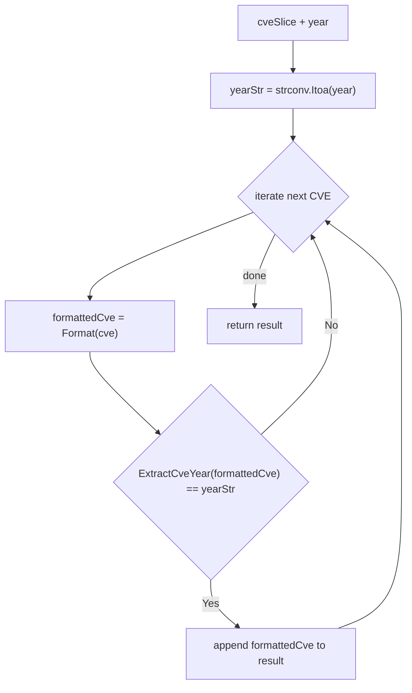

# FilterCvesByYear

:::tip 📂 View Source
[`filter.go:88`](https://github.com/scagogogo/cve-skills/blob/main/filter.go#L88-L101) — open the implementation on GitHub (lines L88–L101).
:::

`FilterCvesByYear` filters a CVE list, returning only the CVE identifiers that belong to a specified year, with every result standardized through `Format`.

:::tip 📌 Scenarios
- Extract all CVEs assigned in a specific year for a focused annual report
- Isolate one year of records from a multi-year CVE dataset before deeper analysis
- Drill down into a particular year of interest when triaging vulnerabilities
:::

## Function Signature

```go
func FilterCvesByYear(cveSlice []string, year int) []string
```

## Parameters

- `cveSlice` ([]string): The CVE identifier slice to filter
- `year` (int): The target year in integer form, e.g. `2021`

## Return Values

- []string: The CVE identifiers whose year matches the target, already standardized through `Format`; if no match is found, an empty slice is returned

## Behavior

- Iterates over `cveSlice` once, calling `Format` on each entry to produce a standardized uppercase CVE
- Extracts the year from the formatted CVE as a string via `ExtractCveYear` and compares it with `strconv.Itoa(year)` — matching is case-insensitive thanks to `Format`
- Only entries whose extracted year equals the target year string are appended to the result, preserving their original relative order
- When nothing matches, the underlying `result` slice stays `nil`, so the returned slice is empty (zero length)
- Time complexity O(n) where n is the slice length; space complexity O(k) where k is the result length (O(n) in the worst case)

## Flowchart



## Example

```go
package main

import (
	"fmt"

	"github.com/scagogogo/cve-skills"
)

func main() {
	cveList := []string{"CVE-2021-1111", "CVE-2022-2222", "CVE-2021-3333"}

	// Filter the CVEs belonging to 2021
	cves2021 := cve.FilterCvesByYear(cveList, 2021)
	// cves2021 = ["CVE-2021-1111", "CVE-2021-3333"]
	fmt.Printf("2021: %v\n", cves2021)

	// A year with no matching CVEs returns an empty slice
	cves2023 := cve.FilterCvesByYear(cveList, 2023)
	// cves2023 = []
	fmt.Printf("2023: %v (len=%d)\n", cves2023, len(cves2023))

	// Mixed-case input is normalized through Format before the year check
	mixedCase := []string{"cve-2021-1111", "CVE-2022-2222", "CvE-2021-3333"}
	normalized2021 := cve.FilterCvesByYear(mixedCase, 2021)
	// normalized2021 = ["CVE-2021-1111", "CVE-2021-3333"]
	fmt.Printf("normalized 2021: %v\n", normalized2021)
}
```

## Use Cases

- Retrieve the CVE set for a specific year when generating an annual security report
- Filter a multi-year dataset down to a single year before trend or density analysis
- Triage vulnerabilities by focusing on the CVEs assigned in a year of interest

## Notes

- Results are always `Format`-ed, so mixed-case or whitespace-padded inputs come back as canonical uppercase CVEs
- The comparison is by exact year string; a target year with no matching CVEs yields an empty (non-nil-capacity) slice — check `len()` rather than `nil`
- This function returns only the **matching subset** of one year; for a closed year range use [FilterCvesByYearRange](/api/functions/filter-cves-by-year-range), and for a relative window of the most recent n years use [GetRecentCves](/api/functions/get-recent-cves)
- For grouping all CVEs by year (rather than selecting one year), use [GroupByYear](/api/functions/group-by-year)

## Internal Implementation

The function body (L88–L100) is a single-pass filter built from three primitives already used elsewhere in the package:

- `var result []string` starts as a `nil` slice, so no allocations occur until the first match is appended. This is why an empty result reports `len() == 0` rather than carrying allocated capacity.
- `yearStr := strconv.Itoa(year)` (L90) converts the integer target to a string **once**, outside the loop. The comparison is then pure string equality against `ExtractCveYear`, avoiding any per-element `strconv` work or `int` parsing inside the hot path.
- Inside the loop, `formattedCve := Format(cve)` (L93) runs first, so the year extraction and the appended value share the same canonical (uppercase) form. This is the deliberate design choice that makes matching case-insensitive and guarantees the output is normalized in one pass.
- `ExtractCveYear(formattedCve) == yearStr` (L94) is a string comparison on the already-formatted CVE, so `cve-2021-1111`, `CvE-2021-1111`, and `CVE-2021-1111` all funnel through `Format` before the year is read.
- `result = append(result, formattedCve)` (L95) only fires on a match, preserving the original relative order of `cveSlice`. No sort, no dedup, no map is constructed — the function stays a linear scan.

## Complexity

| Resource | Bound | Reason |
|----------|-------|--------|
| Time | O(n) | One pass over `cveSlice` (length n); each iteration does a constant-cost `Format` + `ExtractCveYear` + string compare |
| Space | O(k), worst case O(n) | Only matching entries are stored in `result`, where k is the match count; in the worst case every entry matches and k = n |
| Auxiliary | O(1) | `yearStr` is a single short string; no map or secondary buffer is allocated |

Note: the per-element cost depends on `Format` and `ExtractCveYear`, both of which are O(L) in the CVE string length L. Since CVE identifiers are short and bounded, L is treated as a constant and the overall bound remains O(n).

## Edge Cases

| Input | Behavior | Return |
|-------|----------|--------|
| `cveSlice` is `nil` or empty | Loop body never runs; `result` stays `nil` | `[]string` (len 0) |
| `year` matches no entry | No append fires; `result` stays `nil` | `[]string` (len 0) |
| Mixed-case CVEs, e.g. `cve-2021-1111` | `Format` upper-cases before the year check and append | Normalized match, e.g. `["CVE-2021-1111"]` |
| Duplicate CVEs in the input | No dedup is performed; each duplicate that matches is appended again | Duplicates preserved, in original order |
| Malformed CVE string | `Format`/`ExtractCveYear` yield an empty or non-matching year; the entry is skipped | Only well-formed matches appear |
| All entries match the target year | Every formatted entry is appended | Slice of length n |
| Negative or zero `year` | `strconv.Itoa(year)` produces a string that never equals a real CVE year | `[]string` (len 0) |

## Data Flow

```text
+--------------------------+        +----------------------------+
| Input: cveSlice []string |        | Input: year int            |
|  e.g. ["CVE-2021-1111",  |        |  e.g. 2021                 |
|        "CVE-2022-2222",  |        +--------------+-------------+
|        "cve-2021-3333"]  |                       |
+-----------+--------------+                       |
            |                                      |
            |              +-----------------------v-----------------------+
            |              | yearStr = strconv.Itoa(year)  -->  "2021"   |
            |              +-----------------------+-----------------------+
            |                                      |
            v                                      |
+---------------------+                            |
| for each cve in     |                            |
|   cveSlice          |                            |
+---------+-----------+                            |
          |                                        |
          v                                        |
+---------------------+                            |
| formattedCve =      |                            |
|   Format(cve)       |  (uppercase, canonical)    |
+---------+-----------+                            |
          |                                        |
          v                                        |
+----------------------------------------------+   |
| ExtractCveYear(formattedCve) == yearStr ?    |<--+
+------+---------------------------------------+
       |
       | yes
       v
+---------------------+
| append formattedCve |
|   to result         |
+---------------------+
       |
       | loop continues, preserving input order
       v
+---------------------+
| return result       |
|  e.g. ["CVE-2021-1111",
|         "CVE-2021-3333"]
+---------------------+
```

## Related Functions

- [GroupByYear](/api/functions/group-by-year) — group a CVE list into a year-to-CVEs map
- [FilterCvesByYearRange](/api/functions/filter-cves-by-year-range) — filter CVEs within a closed year range
- [GetRecentCves](/api/functions/get-recent-cves) — get CVEs from the most recent n years
- [ExtractCveYear](/api/functions/extract-cve-year) — extract the year string from a single CVE
- [Format](/api/functions/format) — standardize a CVE to uppercase form
- [Filter & Group category](/api/filter-group)
