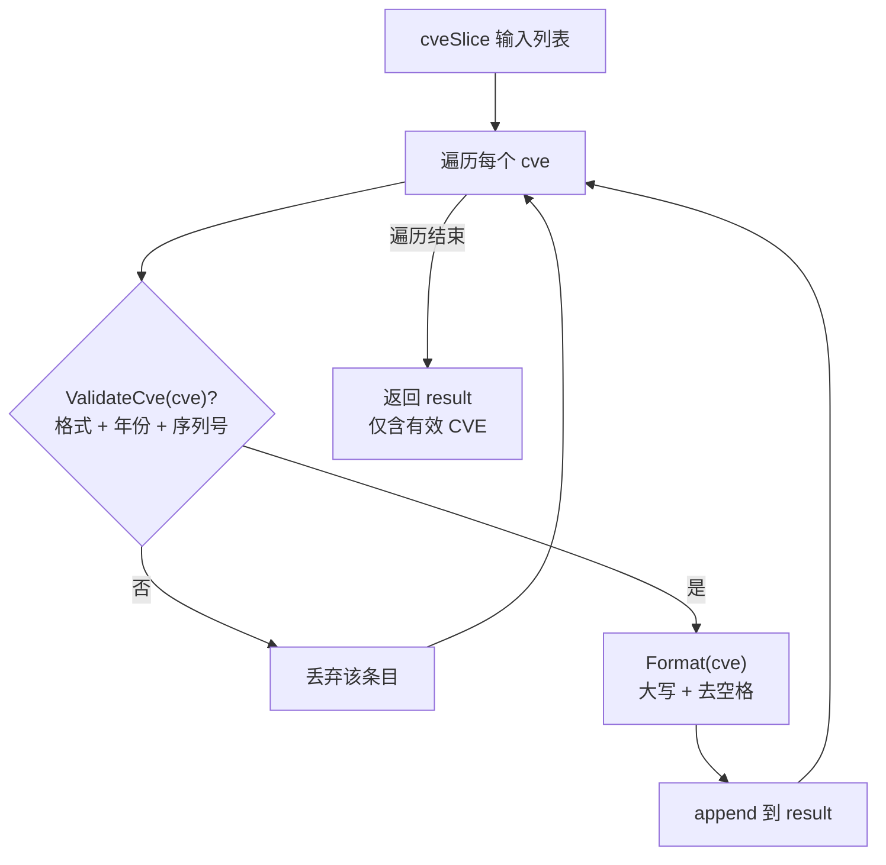

# FilterValidCves

:::tip 📂 View Source
[`base.go:400`](https://github.com/scagogogo/cve-skills/blob/main/base.go#L400-L409) — open the implementation on GitHub (lines L400–L409).
:::

Filter a list of CVE identifiers, keeping only the valid ones and returning them in standardized uppercase format.

:::tip 📌 Scenarios
- Cleaning mixed-quality data imported from external feeds before persistence
- Preprocessing user-submitted CVE lists so downstream logic only sees well-formed entries
- Sanitizing output of text extraction pipelines (e.g. after `ExtractCve`) to drop malformed matches
:::

## Function Signature

```go
func FilterValidCves(cveSlice []string) []string
```

## Parameters

- `cveSlice` ([]string): A list of CVE identifier strings to filter. Entries may be any case and may have surrounding whitespace; invalid entries are silently dropped.

## Return Value

- []string: A new slice containing every input entry that passed validation, each normalized to standard uppercase format (e.g. `CVE-2022-12345`). The relative order of valid entries from the input is preserved. Returns an empty slice (non-nil) when no entries are valid.

## Behavior

- Iterates each entry of `cveSlice` and delegates validation to `ValidateCve`, which checks the full `CVE-YYYY-NNNNN` format, that year and sequence are numeric, that `year >= 1999`, `year <= current year`, and that `seq > 0`.
- Only entries passing validation are appended to the result; failures are skipped without panic or error.
- Each kept entry is passed through `Format` (uppercase + trim) before being appended, so the output is consistently normalized regardless of input casing or surrounding whitespace.
- The result is built with `append` onto a `nil` slice, so when the input has no valid entries the returned slice is non-nil but empty — safe to `range` over.
- Validation uses the current year at the time of the call, so a CVE whose year equals the current year is accepted; future-dated CVEs are rejected (use the year-cutoff family if you need to tolerate reserved future IDs).

## Flowchart



## Example

```go
package main

import (
	"fmt"

	"github.com/scagogogo/cve-skills"
)

func main() {
	// Mixed input: valid, malformed, out-of-range year, lowercase valid
	raw := []string{
		"CVE-2022-12345",   // valid
		"not-a-cve",        // invalid format -> dropped
		"CVE-1998-12345",   // year before 1999 -> dropped
		"cve-2023-99999",   // valid (lowercase, normalized)
		" CVE-2021-44228 ", // valid (surrounding spaces, trimmed)
		"CVE-2099-1",       // future year -> dropped
		"",                 // empty -> dropped
	}

	valid := cve.FilterValidCves(raw)
	fmt.Printf("Input  (%d): %v\n", len(raw), raw)
	fmt.Printf("Valid  (%d): %v\n", len(valid), valid)
	// Output (assuming current year is 2024):
	// Valid  (3): [CVE-2022-12345 CVE-2023-99999 CVE-2021-44228]

	// Empty / all-invalid input returns an empty (non-nil) slice
	empty := cve.FilterValidCves([]string{"", "garbage", "CVE-1990-1"})
	fmt.Printf("Empty result len=%d, safe to range: %v\n", len(empty), empty == nil)
	// Output: Empty result len=0, safe to range: false

	// Common pipeline: extract from text, then keep only valid IDs
	text := "Affected by cve-2022-12345 and cve-2099-1 and CVE-2021-44228"
	extracted := cve.ExtractCve(text)
	cleaned := cve.FilterValidCves(extracted)
	fmt.Printf("Extracted: %v\n", extracted)
	fmt.Printf("Cleaned:   %v\n", cleaned)
	// Output (assuming current year is 2024):
	// Extracted: [CVE-2022-12345 CVE-2099-1 CVE-2021-44228]
	// Cleaned:   [CVE-2022-12345 CVE-2021-44228]
}
```

## Use Cases

- Data cleansing of CVE lists ingested from feeds, CSVs, or user input
- Preprocessing step before storage, deduplication (`RemoveDuplicateCves`), or sorting (`SortCves`)
- Filtering the output of `ExtractCve` when the source text may contain malformed matches
- Guarding batch operations so invalid entries never reach downstream numeric parsing

## Notes

- ⚠️ This function **does not deduplicate** the output: if the same valid CVE appears multiple times in the input, it appears the same number of times in the output. Pair with `RemoveDuplicateCves` when uniqueness is required.
- ⚠️ The returned slice is the **normalized** form of each valid input — casing and surrounding whitespace are changed. If you must preserve the original strings of valid entries, validate them yourself with `ValidateCve` instead.
- ✅ Validation is delegated to `ValidateCve`, so the accept/reject rules are identical to that function: format + numeric year/sequence + `1999 <= year <= current year` + `seq > 0`. There is no separate cutoff for future years here.
- ✅ An all-invalid input returns an empty slice, not `nil`, so it is always safe to iterate or call `len()` on the result.
- 🔍 For per-entry failure reasons (rather than silent dropping), use `ValidateCves` which returns `[]CveValidationResult` with a `Reason` field.

## Internal Implementation

The function is a compact single-pass filter pipeline. Its full body (base.go L400-L408) is:

```go
func FilterValidCves(cveSlice []string) []string {
	var result []string
	for _, cve := range cveSlice {
		if ValidateCve(cve) {
			result = append(result, Format(cve))
		}
	}
	return result
}
```

- **Nil-slice seeding (L401):** `var result []string` declares a slice with no backing array. Appending onto a `nil` slice is well-defined in Go — the runtime allocates as needed — so the function needs no explicit `make` call and naturally yields a non-nil-but-empty result when nothing is kept.
- **Delegated validation (L403):** Each entry is handed to `ValidateCve`. This is the single source of truth for accept/reject: format match, numeric year/sequence, `1999 <= year <= current year`, and `seq > 0`. Keeping the rules in one place means this filter never diverges from the standalone validator.
- **In-place normalization (L404):** A kept entry is appended as `Format(cve)`, not as the raw input. `Format` uppercases the prefix and trims surrounding whitespace, so the output is uniformly standardized regardless of how the entry was typed. Normalization is fused into the append to avoid a second pass.
- **Silent skip on failure (L403 false branch):** Entries that fail validation are simply not appended; there is no error return, no panic, and no logging. The function is total — it always returns a usable slice for every input.
- **Order preservation:** Because iteration is forward-only and `append` appends to the tail, the relative order of valid entries from the input is preserved. Duplicates are passed through untouched (no dedup map is built).

## Complexity

| Dimension | Cost | Driver |
|---|---|---|
| Time | O(n) | One forward pass over `n = len(cveSlice)`; each entry triggers one `ValidateCve` + at most one `Format`, both O(1) string work |
| Space | O(k) | A new slice of size `k` (count of valid entries) is allocated; the input is never mutated |
| Auxiliary | O(1) | No map, no recursion, no sort buffer — only the loop variable and the result slice header |

Where `n` is the input length and `k <= n` is the number of valid entries. Worst case (all valid) is O(n) time and O(n) space; worst case (all invalid) is O(n) time and O(1) extra space beyond the empty result.

## Edge Cases

| Input | Behavior | Return |
|---|---|---|
| `nil` slice | Loop body never runs; `result` stays `nil`-declared | Empty non-nil slice (`len == 0`) |
| Empty slice `[]string{}` | Zero iterations | Empty non-nil slice |
| All entries invalid (bad format / out-of-range year) | Every `ValidateCve` returns false; nothing appended | Empty non-nil slice |
| Mixed case, e.g. `cve-2023-1` | Passes validation, then `Format` uppercases to `CVE-2023-1` | `["CVE-2023-1"]` |
| Entry with surrounding whitespace, e.g. `" CVE-2021-44228 "` | `ValidateCve` trims before checking; `Format` re-trims on append | `["CVE-2021-44228"]` |
| Duplicate valid entries, e.g. `["CVE-2022-1","CVE-2022-1"]` | Both pass; no dedup map is consulted | `["CVE-2022-1","CVE-2022-1"]` (duplicates preserved) |
| Future-year CVE, e.g. `CVE-2099-1` | `ValidateCve` rejects (`year > current year`) | Dropped, not in result |
| Pre-1999 year, e.g. `CVE-1998-1` | `ValidateCve` rejects (`year < 1999`) | Dropped, not in result |
| Empty string `""` | `ValidateCve` rejects (no format match) | Dropped, not in result |

## Data Flow

```text
+-------------------------+
| Input: cveSlice []string|   (may be nil, empty, mixed case, with whitespace)
+-------------------------+
            |
            v
   +-----------------+
   | for each cve    |   <-- single forward pass, O(n)
   | in cveSlice     |
   +-----------------+
            |
            v
   +-----------------+
   | ValidateCve(cve)|   <-- format + numeric + 1999<=year<=now + seq>0
   +-----------------+
        |        |
      ok        fail
        |        |
        v        v
+-----------+  +--------------+
| Format(cve)| | drop silently|   (no error, no panic)
+-----------+  +--------------+
        |             |
        v             |
+----------------+    |
| append to      |    |
| result []string|    |
+----------------+    |
        |             |
        +------>------+
            |
            v
+-------------------------+
| Return: result []string |   (normalized uppercase, order preserved, non-nil)
+-------------------------+
```

## Related Functions

- [ValidateCve](/api/functions/validate-cve) — single-CVE boolean validation used internally by this function
- [ValidateCves](/api/functions/validate-cves) — batch validation returning per-entry reasons (use when you need to know *why* entries were dropped)
- [Format](/api/format-validate) — standardize casing/whitespace of a single CVE
- [Batch Validation category](/api/batch-validation) — overview of batch validation and filtering helpers
