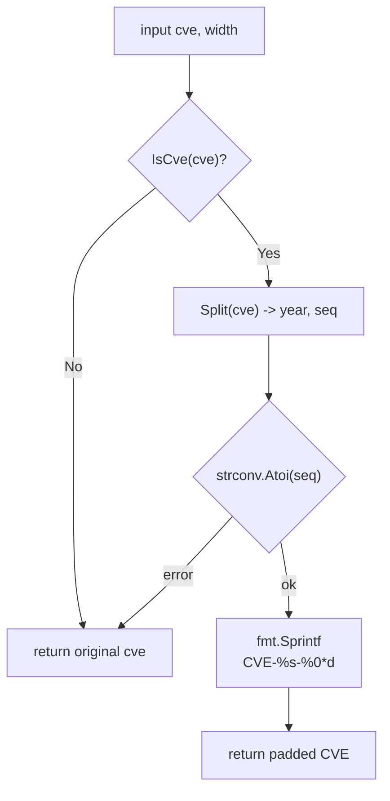

# FormatSeq

:::tip 📂 View Source
[`base.go:79`](https://github.com/scagogogo/cve-skills/blob/main/base.go#L79-L90) — open the implementation on GitHub (lines L79–L90).
:::

`FormatSeq` zero-pads a CVE's sequence number to a fixed width, producing a uniformly wide identifier such as `CVE-2022-000123`.

:::tip 📌 Scenarios
- Normalize CVE identifiers to a consistent display width across reports and dashboards
- Guarantee fixed-length sequence numbers before database storage or indexing
- Align CVE columns in tabular terminal output for readability
:::

## Function Signature

```go
func FormatSeq(cve string, width int) string
```

## Parameters

- `cve` (string): The CVE identifier string to format (e.g. `CVE-2022-123`)
- `width` (int): The target width of the sequence number; the sequence is left-padded with zeros when it is shorter than `width` (e.g. `width=6` turns `123` into `000123`)

## Return Values

- `string`: The CVE with its sequence number zero-padded to the given width. If the input is not a valid CVE format, the original input is returned unchanged.

## Behavior

- First validates the input with `IsCve`; invalid input is returned as-is without any padding
- Splits the CVE into year and sequence via `Split`, which internally calls `Format` — so surrounding whitespace is trimmed and letters are upper-cased before padding (e.g. `" cve-2022-123 "` is treated as `CVE-2022-123`)
- Converts the sequence part to an integer with `strconv.Atoi`; if parsing fails the original input is returned
- Reassembles the result with `fmt.Sprintf("CVE-%s-%0*d", year, width, seqInt)` — the `%0*d` verb produces zero-padded output of exactly `width` digits
- If the sequence already has more digits than `width`, the original sequence length is preserved (zero-padding only adds digits, never truncates)

## Flowchart



## Example

```go
package main

import (
	"fmt"

	"github.com/scagogogo/cve-skills"
)

func main() {
	// Pads a short sequence to width 6 -> "CVE-2022-000123"
	fmt.Println(cve.FormatSeq("CVE-2022-123", 6)) // CVE-2022-000123

	// Pads a 5-digit sequence to width 6 -> "CVE-2022-012345"
	fmt.Println(cve.FormatSeq("CVE-2022-12345", 6)) // CVE-2022-012345

	// Lowercase and surrounding whitespace are normalized via Split/Format
	fmt.Println(cve.FormatSeq(" cve-2022-7 ", 4)) // CVE-2022-0007

	// A sequence wider than width keeps its own length (no truncation)
	fmt.Println(cve.FormatSeq("CVE-2022-1234567", 4)) // CVE-2022-1234567

	// Invalid input is returned unchanged
	fmt.Println(cve.FormatSeq("not-a-cve", 6)) // not-a-cve

	// Typical normalization before storage
	standardized := cve.FormatSeq("CVE-2022-123", 6)
	fmt.Println(standardized) // CVE-2022-000123
}
```

## Use Cases

- Normalize CVE identifiers to a consistent display width across reports and dashboards
- Guarantee fixed-length sequence numbers before database storage or indexing
- Align CVE columns in tabular terminal output for readability
- Pre-process CVEs before sorting so lexical order matches numeric order within the same width

## Notes

- `width` only sets the **minimum** digit count — sequences with more digits than `width` are returned at their natural length, never truncated
- Because `Split` (and thus `Format`) is called internally, the returned CVE is always uppercase and whitespace-trimmed, even when the input was lowercase or padded with spaces
- Invalid input is returned **unchanged** (not an error, not an empty string) — callers wanting strict validation should pre-check with `IsCve` or `ValidateCve`
- `width <= 0` is technically accepted by `%0*d` and yields the sequence at its natural width (no padding); pass a positive `width` for predictable output
- Compare with `Format`: `Format` only trims and upper-cases; `FormatSeq` additionally zero-pads the sequence to a fixed width

## Internal Implementation

`FormatSeq` (base.go L79-L90) is a short pipeline that guards, decomposes, then rebuilds the identifier:

- **Guard with `IsCve`** (L80-L82): the very first check is `if !IsCve(cve) { return cve }`. Any input that does not fully match the CVE regex is returned untouched, so the function never attempts to split or pad garbage — this is the single source of the "invalid input is returned unchanged" contract.
- **Decompose with `Split`** (L83): `year, seq := Split(cve)` splits on `-`. `Split` internally calls `Format`, meaning the string is `strings.ToUpper(strings.TrimSpace(...))` before splitting, so surrounding whitespace and lowercase letters are normalized here, not in `FormatSeq` itself.
- **Numeric coercion** (L84-L87): `seqInt, err := strconv.Atoi(seq)` converts the sequence to an integer. If `seq` is non-numeric (which can only happen when `IsCve` passed but the regex still captured non-digits — e.g. edge inputs), the function bails out by returning the original `cve`, preserving the "no error, return as-is" behavior rather than panicking.
- **Reassembly via `fmt.Sprintf`** (L88): the result is rebuilt with `fmt.Sprintf("CVE-%s-%0*d", year, width, seqInt)`. The `%0*d` verb takes `width` as its first argument and `seqInt` as the second, producing zero-padded output of exactly `width` digits when `seqInt` is shorter, and the natural length of `seqInt` when it already exceeds `width` (Go's `%0*d` never truncates).
- **Design intent**: the function is deliberately non-destructive on failure and non-truncating on success — it only ever *adds* leading zeros, so callers can use it as a safe normalizer that never corrupts a valid identifier.

## Complexity

| Resource | Cost | Reason |
|---|---|---|
| Time | O(n) | `IsCve` regex match, `Split` (with `Format`'s `ToUpper`/`TrimSpace`), `strconv.Atoi`, and `fmt.Sprintf` each scan the input of length `n` once; no loops over the input scale with `n` |
| Space | O(n) | the returned string plus the intermediate upper-cased/trimmed copy inside `Split` are each proportional to the input length; `width` contributes a constant upper bound on the padded sequence length |

Both bounds are linear in the size of the input CVE string; `width` is a fixed-width constant and does not change the asymptotic class.

## Edge Cases

| Input | Behavior | Return |
|---|---|---|
| `FormatSeq("not-a-cve", 6)` | `IsCve` fails, function returns early at L81 | `"not-a-cve"` (unchanged) |
| `FormatSeq("", 6)` | `IsCve` fails on empty string | `""` (unchanged) |
| `FormatSeq("CVE-2022-ABC", 6)` | `IsCve` regex rejects non-digit sequence, early return | `"CVE-2022-ABC"` (unchanged) |
| `FormatSeq(" cve-2022-7 ", 4)` | `Split`/`Format` trims whitespace and upper-cases, then pads | `"CVE-2022-0007"` |
| `FormatSeq("CVE-2022-7", 4)` | sequence `7` (1 digit) padded to width 4 | `"CVE-2022-0007"` |
| `FormatSeq("CVE-2022-1234567", 4)` | sequence wider than `width`; `%0*d` does not truncate | `"CVE-2022-1234567"` |
| `FormatSeq("CVE-2022-7", 0)` | `width <= 0`; `%0*d` yields natural width, no padding | `"CVE-2022-7"` |
| `FormatSeq("CVE-2022-7", -1)` | negative `width` behaves like `0` under `%0*d` | `"CVE-2022-7"` |
| Duplicate-width input `FormatSeq("CVE-2022-0007", 4)` | sequence already at width 4; padding adds nothing | `"CVE-2022-0007"` |

## Data Flow

```text
+----------------------+
| input: cve, width    |
| e.g. " cve-2022-7 ", 4 |
+----------+-----------+
           |
           v
+----------------------+
| IsCve(cve) ?         |
| regex ^\s*CVE-...$   |
+----+------------+----+
     | No        | Yes
     v           v
+---------+  +---------------------------+
| return  |  | Split(cve) -> year, seq   |
| cve     |  | (Format: trim + upper)    |
| as-is   |  | year="2022", seq="7"      |
+---------+  +-------------+-------------+
                           |
                           v
              +---------------------------+
              | seqInt, err = Atoi(seq)   |
              | seqInt = 7                |
              +----+----------------+-----+
                   | err           | ok
                   v               v
              +---------+  +---------------------------+
              | return  |  | fmt.Sprintf(               |
              | cve     |  |   "CVE-%s-%0*d",           |
              | as-is   |  |   year, width, seqInt)     |
              +---------+  | -> "CVE-2022-0007"         |
                           +-------------+-------------+
                                         |
                                         v
                              +-----------------------+
                              | return padded CVE     |
                              | "CVE-2022-0007"       |
                              +-----------------------+
```

## Related Functions

- [Format](/api/functions/format) — standardize a CVE to uppercase, trimmed form (no padding)
- [Split](/api/functions/split) — split a CVE into year and sequence
- [IsCve](/api/functions/is-cve) — validate the CVE format before formatting
- [ValidateCve](/api/functions/validate-cve) — full validation (format + year range + positive sequence)
- [Format & Validate category](/api/format-validate)
