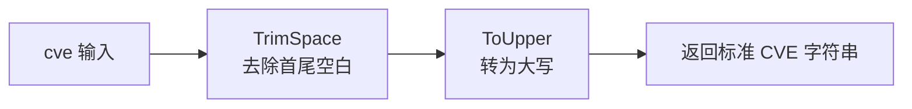

# Format

:::tip 📂 View Source
[`base.go:45`](https://github.com/scagogogo/cve-skills/blob/main/base.go#L45-L48) — open the implementation on GitHub (lines L45–L48).
:::

`Format` normalizes a CVE identifier to its canonical form: uppercase, with leading and trailing whitespace removed.

:::tip 📌 Scenarios
- Standardize user input or imported data before storing or comparing CVE identifiers
- Normalize mixed-case or whitespace-padded CVEs so that downstream matching is reliable
- Produce a consistent display form for reports, logs, or database keys
:::

## Function Signature

```go
func Format(cve string) string
```

## Parameters

- `cve` (string): The CVE identifier string to format, e.g. `"cve-2022-12345"` or `" CVE-2022-12345 "`

## Return Values

- `string`: The standardized CVE identifier, always uppercase with no surrounding whitespace, e.g. `"CVE-2022-12345"`

## Behavior

- Returns `strings.ToUpper(strings.TrimSpace(cve))` — trim first, then upper-case
- `TrimSpace` removes leading and trailing whitespace (spaces, tabs, newlines), so `" CVE-2022-12345 "` becomes `"CVE-2022-12345"`
- `ToUpper` converts the entire trimmed string to uppercase, so `"cve-2022-12345"` becomes `"CVE-2022-12345"`
- Performs no format validation — any string is accepted and returned trimmed and uppercased; pass it through `IsCve` or `ValidateCve` if you need to verify it is a real CVE
- Idempotent: calling `Format` on an already-canonical CVE returns it unchanged

## Flowchart



## Example

```go
package main

import (
	"fmt"

	"github.com/scagogogo/cve-skills"
)

func main() {
	// 源码注释中的示例
	// 输入: " cve-2022-12345 "  输出: "CVE-2022-12345"
	// 输入: "cve-2021-44228"    输出: "CVE-2021-44228"
	testCases := []struct {
		input    string
		expected string
		reason   string
	}{
		{" cve-2022-12345 ", "CVE-2022-12345", "source example: leading/trailing space + lowercase"},
		{"cve-2021-44228", "CVE-2021-44228", "source example: lowercase, no spaces"},
		{"CVE-2022-12345", "CVE-2022-12345", "already canonical, unchanged (idempotent)"},
		{"CvE-2022-12345", "CVE-2022-12345", "mixed case uppercased"},
		{"\tCVE-2023-99999\n", "CVE-2023-99999", "tab and newline trimmed as whitespace"},
		{"not-a-cve", "NOT-A-CVE", "no validation: non-CVE input is still uppercased"},
		{"", "", "empty string stays empty"},
	}

	for _, tc := range testCases {
		result := cve.Format(tc.input)
		status := "✅"
		if result != tc.expected {
			status = "❌"
		}
		fmt.Printf("%s %-22q -> %q  (%s)\n", status, tc.input, result, tc.reason)
	}

	// Typical normalization before storage / comparison
	raw := " cve-2021-44228 "
	standardCve := cve.Format(raw)
	fmt.Printf("standardized: %q\n", standardCve)
}
```

## Use Cases

- Standardize CVE identifiers before comparison or storage
- Ensure all CVE identifiers in the system share a consistent format
- Normalize user input from forms, API parameters, or CLI arguments
- Produce stable keys for deduplication, sorting, or indexing

## Notes

- ⚠️ `Format` does **not** validate the input — `"not-a-cve"` becomes `"NOT-A-CVE"`. Use `IsCve` or `ValidateCve` to check validity when needed
- ✅ Order matters: whitespace is trimmed before upper-casing, so internal characters are unaffected and only surrounding whitespace is removed
- 🔍 Internal whitespace (e.g. `"CVE-2022-123 45"`) is preserved and uppercased as-is — `Format` does not repair malformed input
- Idempotent and side-effect free; safe to call repeatedly and from multiple goroutines

## Internal Implementation

The entire body of `Format` is a single expression (`base.go:46`): `return strings.ToUpper(strings.TrimSpace(cve))`. The design intent is broken down below.

### Step 1 — Trim surrounding whitespace

`strings.TrimSpace(cve)` (Go standard library) removes leading and trailing Unicode whitespace characters, including spaces, tabs (`\t`), newlines (`\n`), and carriage returns (`\r`). Internal whitespace is left untouched. This runs first so that the subsequent upper-casing operates only on the meaningful payload.

### Step 2 — Uppercase the trimmed string

`strings.ToUpper` then converts every rune in the already-trimmed string to uppercase. The `CVE-` prefix is the only alphabetic segment in a canonical identifier, so in practice this normalizes `cve-` / `Cve-` / `CVE-` to `CVE-`. Digits and hyphens are unaffected.

### Step 3 — Return without validation

There is no regex check, no `IsCve` call, and no allocation of intermediate slices — the function deliberately accepts any `string` and returns it trimmed and uppercased. Validation is left to `IsCve` / `ValidateCve`, keeping `Format` cheap and side-effect free.

### Design intent

- **Idempotency**: `ToUpper(TrimSpace(x))` is a fixed point — applying it again to the result yields the same string, so callers can safely re-normalize.
- **Composability**: `Format` is invoked at the top of `extractYear`, `Split`, and inside `FilterValidCves` to normalize before further parsing, guaranteeing a single canonical entry point.
- **Order sensitivity**: trimming before upper-casing avoids the (theoretical) case where a whitespace character's uppercase form differs; in practice it just keeps the two transforms independent and predictable.

## Complexity

| Dimension | Cost | Rationale |
|---|---|---|
| Time | O(n) | Both `TrimSpace` and `ToUpper` scan the input once, where n is the length of `cve` |
| Space | O(n) | A new string is allocated for the result; no additional data structures are used |
| Allocations | 1–2 | `TrimSpace` may return the original string when nothing is trimmed; `ToUpper` allocates a new string only when characters change |

Because the cost is linear in the input length and there are no loops over external collections, `Format` is effectively constant-time for typical CVE identifiers (a few dozen characters).

## Edge Cases

| Input | Behavior | Return |
|---|---|---|
| `" CVE-2022-12345 "` (leading/trailing spaces) | Whitespace trimmed, then uppercased | `"CVE-2022-12345"` |
| `"cve-2022-12345"` (lowercase) | No whitespace to trim, all lowercased letters uppercased | `"CVE-2022-12345"` |
| `"CvE-2022-12345"` (mixed case) | Each rune uppercased individually | `"CVE-2022-12345"` |
| `"\tCVE-2023-99999\n"` (tab/newline) | Tab and newline treated as whitespace and removed | `"CVE-2023-99999"` |
| `"CVE-2022-12345"` (already canonical) | Idempotent — no characters change | `"CVE-2022-12345"` |
| `""` (empty string) | Nothing to trim or uppercase | `""` |
| `"   "` (only whitespace) | All whitespace trimmed, leaving empty string | `""` |
| `"not-a-cve"` (non-CVE) | No validation performed; uppercased as-is | `"NOT-A-CVE"` |
| `"CVE-2022-123 45"` (internal space) | Internal whitespace preserved and uppercased | `"CVE-2022-123 45"` |
| `"cve-2022-12345-extra"` (extra segment) | Not parsed; simply trimmed and uppercased | `"CVE-2022-12345-EXTRA"` |

## Data Flow

```text
+--------------------------+
| Input: cve string        |
| e.g. " cve-2022-12345 "  |
+------------+-------------+
             |
             v
+--------------------------+
| strings.TrimSpace(cve)   |   <-- removes leading & trailing
|  "cve-2022-12345"        |       whitespace (space/tab/newline)
+------------+-------------+
             |
             v
+--------------------------+
| strings.ToUpper(trimmed) |   <-- uppercases every rune
|  "CVE-2022-12345"        |       (digits & hyphens unchanged)
+------------+-------------+
             |
             v
+--------------------------+
| Return: canonical string |
|  "CVE-2022-12345"        |
+--------------------------+
```

## Related Functions

- [IsCve](/api/functions/is-cve) — strict format check for a CVE identifier
- [ValidateCve](/api/functions/validate-cve) — full validation (format + year range + positive sequence)
- [Split](/api/functions/split) — split a CVE into year and sequence (normalizes via `Format` internally)
- [FormatSeq](/api/functions/format-seq) — pad the CVE sequence number to a fixed width
- [Format & Validate category](/api/format-validate)
