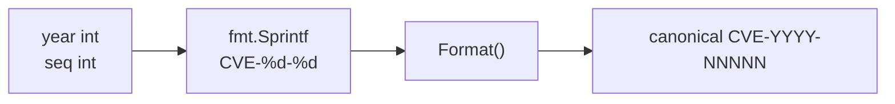

# GenerateCve

:::tip 📂 View Source
[`generate.go:58`](https://github.com/scagogogo/cve-skills/blob/main/generate.go#L58-L61) — open the implementation on GitHub (lines L58–L61).
:::

`GenerateCve` builds a canonical CVE identifier from a year and a sequence number, returning the standard `CVE-YYYY-NNNNN` form in uppercase.

:::tip 📌 Scenarios
- Dynamically construct a CVE identifier from structured fields (year + sequence) extracted elsewhere
- Create new CVE identifiers during data normalization or pipeline processing
- Combine with extraction helpers to reyear or resequence an existing CVE into a new one
:::

## Function Signature

```go
func GenerateCve(year int, seq int) string
```

## Parameters

- `year` (int): The CVE year, as an integer such as `2022`
- `seq` (int): The CVE sequence number, as an integer such as `12345`

## Return Values

- `string`: The generated canonical CVE identifier, such as `"CVE-2022-12345"`

## Behavior

- Internally formats the inputs as `CVE-%d-%d` via `fmt.Sprintf`, then passes the result through `Format` to guarantee the canonical uppercase form
- The returned CVE is always uppercase — `Format` normalizes the `cve` prefix to `CVE`
- No validation is performed on the year — it is not checked against the 1999..current-year range, so values like `0` or `9999` pass through untouched
- The sequence is not length-constrained — any `int` is accepted, including single-digit values and very large numbers

## Flowchart



## Example

```go
package main

import (
	"fmt"

	"github.com/scagogogo/cve-skills"
)

func main() {
	// Basic generation — matches the source-code examples
	fmt.Println(cve.GenerateCve(2022, 12345))  // CVE-2022-12345
	fmt.Println(cve.GenerateCve(2021, 44228))  // CVE-2021-44228

	// Single-digit and large sequences are accepted (no length constraint)
	fmt.Println(cve.GenerateCve(2023, 1))      // CVE-2023-1
	fmt.Println(cve.GenerateCve(2024, 999999)) // CVE-2024-999999

	// The year is not range-validated; unrealistic years pass through
	fmt.Println(cve.GenerateCve(0, 100))       // CVE-0-100
	fmt.Println(cve.GenerateCve(9999, 7))      // CVE-9999-7

	// Combine with extraction: take the sequence from one CVE and reyear it
	year := 2023
	seq := cve.ExtractCveSeqAsInt("CVE-2022-67890")
	newCve := cve.GenerateCve(year, seq) // CVE-2023-67890
	fmt.Println(newCve)
}
```

## Use Cases

- Dynamically generate a CVE identifier from structured fields
- Create new CVE identifiers during normalization or migration
- Recombine a year and a sequence extracted from other CVEs into a fresh identifier

## Notes

- This function does **not** validate whether the year is reasonable (e.g. whether it falls after 1999); use `ValidateCve` if you need full semantic validation
- The sequence can be any integer — there is no digit-count restriction
- Because the result passes through `Format`, the output is always uppercase and trimmed, regardless of how the inputs were represented
- For a no-argument fake CVE suitable for tests and placeholders, use `GenerateFakeCve` (which calls this function with the current year and a random sequence)

## Internal Implementation

`GenerateCve` is a single-expression function (`generate.go:58-61`) that delegates all work to two existing primitives:

- **String assembly via `fmt.Sprintf`** (L59): the inputs are interpolated into the literal template `CVE-%d-%d`, producing an intermediate lowercase-leaning string such as `CVE-2022-12345`. Because `%d` only accepts integers, the year and sequence are embedded directly with no padding or length normalization — a sequence of `1` stays `1`, not `00001`.
- **Canonicalization via `Format`** (L59): the assembled string is immediately passed through `Format`, which uppercases the `cve` prefix and trims surrounding whitespace. This is why the function never has to uppercase anything itself — the responsibility is centralized in `Format`.
- **No branching, no validation**: there are no `if` statements, no error returns, and no range checks. Every code path converges on the same `return`, making the function total (defined for every `int` pair) and trivially deterministic.
- **Design intent — composition over reimplementation**: by reusing `Format` rather than re-implementing uppercasing, the package keeps a single source of truth for the canonical form. Any future change to the canonicalization rule in `Format` is automatically inherited by `GenerateCve`.
- **Integer-driven, not string-driven**: taking `year` and `seq` as `int` (rather than parsing strings) avoids an entire class of input-parsing failures and lets callers compose directly with extracted numeric fields from `ExtractCveYearAsInt` / `ExtractCveSeqAsInt`.

## Complexity

| Resource | Cost | Driver |
|---|---|---|
| Time | O(L) where L is the length of the formatted string | `fmt.Sprintf` builds the string, `Format` scans/uppercases/trims it — both linear in output length |
| Space | O(L) | A single intermediate string from `Sprintf` plus the canonicalized result from `Format` |
| Aux. allocations | 1 intermediate string | The `Sprintf` result is temporary; only the `Format` output is returned |

- The function performs no loops, no sorting, and no collection allocation, so there is no hidden super-linear behavior.
- Complexity is bounded by the digit count of the two inputs, which for realistic CVEs (year ≤ 4 digits, seq ≤ 7 digits) is effectively constant.

## Edge Cases

| Input | Behavior | Return |
|---|---|---|
| `GenerateCve(2022, 12345)` | Normal path — `Sprintf` then `Format` | `"CVE-2022-12345"` |
| `GenerateCve(2023, 1)` | Single-digit sequence, no zero-padding | `"CVE-2023-1"` |
| `GenerateCve(0, 100)` | Year not range-checked; `0` is formatted as-is | `"CVE-0-100"` |
| `GenerateCve(9999, 7)` | Unrealistic year and short seq pass through | `"CVE-9999-7"` |
| `GenerateCve(-1, 5)` | Negative year rendered by `%d` (no guard) | `"CVE--1-5"` (invalid CVE form, not validated here) |
| `GenerateCve(2022, -3)` | Negative sequence rendered by `%d` (no guard) | `"CVE-2022--3"` (invalid CVE form, not validated here) |
| Duplicate/zero seq (`GenerateCve(2022, 0)`) | No de-duplication or positivity check | `"CVE-2022-0"` |
| Uppercase concern | Inputs are `int`, so case is irrelevant; `Format` still uppercases the prefix | canonical uppercase |

## Data Flow

```text
+-------------+   +-------------+
| year (int)  |   | seq  (int)  |
+------+------+   +------+------+
       |                 |
       +--------+--------+
                |
                v
       +----------------------+       fmt.Sprintf("CVE-%d-%d", year, seq)
       | intermediate string  |       e.g. "CVE-2022-12345"
       +----------+-----------+
                  |
                  v
         +----------------+
         |  Format(s)     |   uppercase prefix + trim whitespace
         +-------+--------+
                 |
                 v
      +---------------------------+
      | canonical CVE-YYYY-NNNNN  |   always uppercase
      +---------------------------+
```

## Related Functions

- [Format](/api/functions/format) — standardize a CVE to uppercase, trimmed form (used internally)
- [GenerateFakeCve](/api/functions/generate-fake-cve) — generate a fake CVE with the current year and a random sequence
- [ExtractCveSeqAsInt](/api/functions/extract-cve-seq-as-int) — extract the sequence number as an int for recombination
- [ValidateCve](/api/functions/validate-cve) — full validation (format + year range + positive sequence)
- [Generate category](/api/generate)
