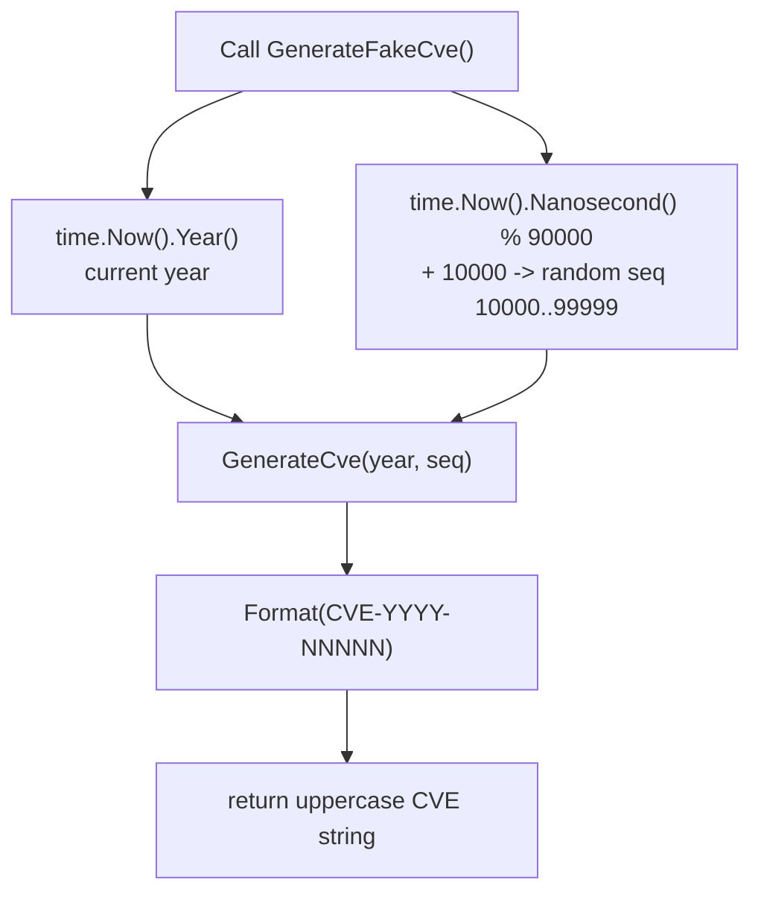

# GenerateFakeCve

:::tip 📂 View Source
[`generate.go:100`](https://github.com/scagogogo/cve-skills/blob/main/generate.go#L100-L105) — open the implementation on GitHub (lines L100–L105).
:::

`GenerateFakeCve` generates a fake CVE identifier with no arguments — it automatically uses the current system year and a random sequence number, ideal for tests, examples, and placeholder data.

:::tip 📌 Scenarios
- Generate placeholder CVE identifiers for unit tests or sample data sets
- Populate mock security datasets during development
- Quickly create randomized CVEs for demos and documentation examples
:::

## Function Signature

```go
func GenerateFakeCve() string
```

## Parameters

- None

## Return Values

- `string`: A standard-format CVE identifier, e.g. `"CVE-2023-54321"`

## Behavior

- Uses the current system year (from `time.Now().Year()`) as the CVE year
- Generates a random sequence number in the range `10000` to `99999` (inclusive), computed as `10000 + nanosecond % 90000`
- Delegates final formatting to [`GenerateCve`](/api/functions/generate-cve), which produces the canonical uppercase `CVE-YYYY-NNNNN` form
- The result is always uppercase because `GenerateCve` routes through `Format`

## Flowchart



## Example

```go
package main

import (
	"fmt"

	"github.com/scagogogo/cve-skills"
)

func main() {
	// Single fake CVE
	// Output is similar to: "CVE-2026-12345" (year follows the system clock)
	fakeCve := cve.GenerateFakeCve()
	fmt.Printf("Generated: %s\n", fakeCve)

	// Generate multiple random CVEs for a test set
	// Note: collisions are possible because uniqueness is not guaranteed
	var testCves []string
	for i := 0; i < 5; i++ {
		testCves = append(testCves, cve.GenerateFakeCve())
	}
	fmt.Println("Test set:")
	for i, id := range testCves {
		fmt.Printf("  %d: %s\n", i+1, id)
	}

	// Pair with IsCve to confirm the output is a valid CVE format
	fmt.Printf("IsCve(%s) = %t\n", fakeCve, cve.IsCve(fakeCve))
}
```

## Use Cases

- Generate placeholder CVE identifiers for tests and examples
- Quickly create mock CVE data during development
- Populate sample datasets for demos and documentation

## Notes

- ⚠️ The sequence number is derived from `time.Now().Nanosecond()`, so its randomness is limited and **not cryptographically secure** — never use it for security-sensitive purposes
- ⚠️ Uniqueness is **not guaranteed**: rapid successive calls within the same nanosecond window can return identical values — de-duplicate or track a set if you need distinct identifiers
- ✅ The output always satisfies the `CVE-YYYY-NNNNN` format and passes `IsCve`, but it is a fabricated value — it does **not** correspond to any real-world CVE entry
- 🔍 Compare with [`GenerateCve`](/api/functions/generate-cve): `GenerateCve` requires an explicit year and sequence; `GenerateFakeCve` auto-fills both with the current year and a random sequence
- 📊 The random sequence is constrained to `10000..99999` (5 digits); if you need a different range, call `GenerateCve` directly

## Internal Implementation

The function body (`generate.go:100`–`105`) is only three statements and intentionally delegates all formatting work to [`GenerateCve`](/api/functions/generate-cve):

- **Year source (L101)** — `currentYear := time.Now().Year()` reads the wall clock once. The year is taken verbatim from the system time and is **not** range-checked (a misconfigured clock can produce a year such as `1999` or `9999`); `GenerateCve` itself performs no year validation either.
- **Sequence derivation (L102)** — `randomSeq := 10000 + time.Now().Nanosecond()%90000`. A second `time.Now()` call obtains the nanosecond component (an `int` in `0..999999999`); the modulo `%90000` projects it into `0..89999`, and the `10000` offset shifts the window to `10000..99999`, guaranteeing a 5-digit value. Note this is a fresh `time.Now()` call, not a reuse of the L101 value.
- **Delegation (L103)** — `return GenerateCve(currentYear, randomSeq)` hands the two ints to `GenerateCve`, which runs `fmt.Sprintf("CVE-%d-%d", year, seq)` and then `Format` to upper-case and trim. `GenerateFakeCve` itself does no string concatenation.
- **Design intent** — by reusing `GenerateCve`/`Format`, the function inherits the canonical `CVE-YYYY-NNNNN` form and uppercase guarantee for free, so the fake output is indistinguishable in shape from a real CVE and always passes `IsCve`. The only invented part is the input pair `(year, seq)`.
- **No error path** — the function signature returns only `string` (no `error`). Every code path produces a well-formed string, so callers need no nil/empty check on the result.

## Complexity

| Metric | Value | Reason |
| --- | --- | --- |
| Time | O(1) | Two `time.Now()` reads, one modulo/add, one `fmt.Sprintf`, one `Format` — all constant-time |
| Space | O(1) | Only the returned string (`CVE-YYYY-NNNNN`, ~14 bytes) is allocated; no slices or maps |
| Allocations | O(1) | A single short string from `fmt.Sprintf`, plus whatever `Format` returns |

The function is deterministic with respect to a given instant: for the same nanosecond it always returns the same value, which is why collisions are possible in tight loops.

## Edge Cases

| Input / Situation | Behavior | Return |
| --- | --- | --- |
| Normal call | Reads system clock, computes 5-digit seq | `"CVE-YYYY-NNNNN"` (e.g. `"CVE-2026-12345"`) |
| System clock set to an unusual year | Year used verbatim, no validation | `"CVE-0001-12345"` or `"CVE-9999-12345"` |
| Two calls in the same nanosecond | Same `Year()` and same `Nanosecond()` → same `randomSeq` | Identical strings (collision) |
| Very rapid loop | Likely repeated nanosecond values | Repeated values; caller must de-duplicate |
| Nanosecond = 0 | `0 % 90000 = 0` → seq `10000` | `"CVE-YYYY-10000"` (minimum seq) |
| Nanosecond = 999999999 | `999999999 % 90000 = 99999` → seq `99999` | `"CVE-YYYY-99999"` (maximum seq) |
| No parameters | Nothing to validate; always succeeds | A valid-format string, never `""` |

## Data Flow

```text
+--------------------------+
|  GenerateFakeCve() call  |
+------------+-------------+
             |
             v
+--------------------------+   +------------------------------+
| time.Now().Year() -> Y   |   | time.Now().Nanosecond() -> n |
+------------+-------------+   +---------------+--------------+
             |                                 |
             |                                 v
             |                 +-------------------------------+
             |                 | randomSeq = 10000 + n % 90000 |
             |                 | (range 10000..99999)          |
             |                 +---------------+---------------+
             |                                 |
             +----------------+----------------+
                              |
                              v
               +------------------------------+
               | GenerateCve(Y, randomSeq)    |
               |  fmt.Sprintf("CVE-%d-%d",..) |
               |  -> Format (upper + trim)    |
               +--------------+---------------+
                              |
                              v
                +-----------------------------+
                | "CVE-YYYY-NNNNN" (uppercase)|
                +-----------------------------+
```

## Related Functions

- [GenerateCve](/api/functions/generate-cve) — generate a CVE from an explicit year and sequence
- [Format](/api/functions/format) — standardize a CVE to uppercase, trimmed form
- [IsCve](/api/functions/is-cve) — check whether a string is a valid CVE format
- [Generate category](/api/generate)
