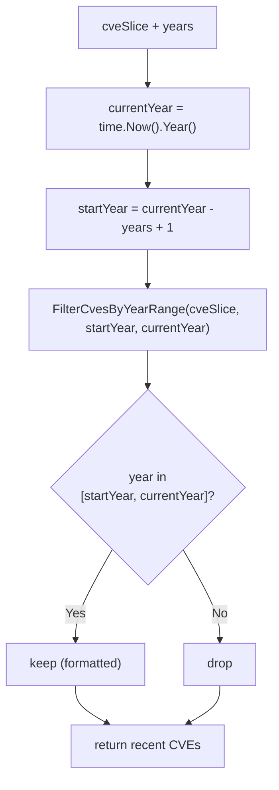

# GetRecentCves

:::tip 📂 View Source
[`filter.go:187`](https://github.com/scagogogo/cve-skills/blob/main/filter.go#L187-L191) — open the implementation on GitHub (lines L187–L191).
:::

`GetRecentCves` filters a CVE list down to those published within the most recent `n` years (relative to the current year) — a convenience wrapper around `FilterCvesByYearRange`.

:::tip 📌 Scenarios
- Surface only recently published CVEs when triaging a fresh vulnerability feed
- Generate a "latest threats" report covering the past N years
- Prune stale CVEs from a dashboard so only current-year context remains
:::

## Function Signature

```go
func GetRecentCves(cveSlice []string, years int) []string
```

## Parameters

- `cveSlice` ([]string): The CVE list to filter
- `years` (int): The trailing range in years — e.g. `2` means the most recent two years (current year and the previous year)

## Return Values

- []string: CVEs whose year falls in the recent range, already standardized via `Format`; returns an empty slice if nothing matches

## Behavior

- Computes the current year from `time.Now().Year()` at call time, so the result depends on when it runs
- Range rule: covers `(currentYear - years + 1)` through `currentYear` inclusive — e.g. with `years=2` in 2023, the window is `2022..2023`
- Delegates to `FilterCvesByYearRange`, which formats each CVE (uppercase) and compares the extracted year numerically
- Input order is preserved for matching items; items outside the window are dropped
- No matches → empty (nil) slice, not an error

## Flowchart



## Example

```go
package main

import (
	"fmt"

	"github.com/scagogogo/cve-skills"
)

func main() {
	// NOTE: the "current year" below is 2023 (as in the source comment).
	// With years=2 the window is 2022..2023.
	cveList := []string{
		"CVE-2020-1111",
		"CVE-2021-2222",
		"CVE-2022-3333",
		"CVE-2023-4444",
	}

	// Most recent 2 years -> 2022 and 2023
	recentTwoYears := cve.GetRecentCves(cveList, 2)
	fmt.Println(recentTwoYears)
	// Output: [CVE-2022-3333 CVE-2023-4444]

	// Most recent 1 year -> only the current year (2023)
	recentOneYear := cve.GetRecentCves(cveList, 1)
	fmt.Println(recentOneYear)
	// Output: [CVE-2023-4444]

	// When no CVE falls in the current year, an empty slice is returned
	onlyOld := []string{"CVE-2020-1111", "CVE-2021-2222"}
	fmt.Println(cve.GetRecentCves(onlyOld, 1))
	// Output: []
}
```

## Use Cases

- Focus on CVEs published in the last few years when reviewing a vulnerability feed
- Build a "latest security threats" report spanning the past N years
- Trim a long backlog so dashboards only show current, relevant CVEs

## Notes

- Results are **time-dependent** — the same input yields different results across years because the window is anchored to `time.Now().Year()`. Make this explicit in tests or pin the year via `FilterCvesByYearRange` for deterministic behavior
- `years` should be a positive integer; `years=1` narrows the window to the current year only, while very large values effectively return the whole list (every year from a low bound up to the current year)
- The range is **inclusive** on both ends: `currentYear-years+1` and `currentYear` are both kept
- Each CVE is normalized via `Format` (uppercase, trimmed) before the year comparison, so mixed-case input like `cve-2023-4444` is handled correctly
- For a fixed, year-agnostic window, call `FilterCvesByYearRange` directly with explicit `startYear`/`endYear`

## Internal Implementation

`GetRecentCves` is a thin convenience wrapper (3 statements) that anchors a year window to the present, then delegates all the heavy lifting to `FilterCvesByYearRange`. The design intent is ergonomics — callers say "the last N years" instead of computing explicit bounds.

- **Current year lookup** — `currentYear := time.Now().Year()` (L188) reads the system clock at call time. There is no caching, so every invocation re-derives the anchor; this is the root cause of the time-dependence called out in Notes.
- **Range arithmetic** — the call passes `currentYear-years+1` as `startYear` and `currentYear` as `endYear` (L189). The `+1` makes `years=1` mean "current year only" and `years=2` mean "current year plus the previous one", matching the documented inclusive semantics.
- **Full delegation** — the return value is `FilterCvesByYearRange(cveSlice, ...)` returned directly (L189). All formatting (`Format`, uppercasing), year extraction (`ExtractCveYearAsInt`), the `>= startYear && <= endYear` comparison, and order preservation happen inside that callee; see its page for the per-CVE mechanics.
- **No local state** — the wrapper allocates no map or slice. Memory and ordering behavior are entirely inherited from `FilterCvesByYearRange`, which builds a fresh `result []string` and appends matching formatted CVEs in input order.
- **Edge-value handling** — because the boundary math is `currentYear-years+1`, a `years` of `0` or a negative value produces a window whose start is *after* the end (e.g. `currentYear+1 .. currentYear`); `FilterCvesByYearRange` then keeps nothing, yielding an empty slice rather than an error. Callers are expected to pass a positive `years`.

## Complexity

The wrapper itself is O(1); the figures below describe the inherited work from `FilterCvesByYearRange`, which iterates the whole input once.

| Metric | Complexity | Basis |
|---|---|---|
| Time | O(n) | One pass over `cveSlice` of length n; each iteration does O(1) `Format` + year extraction + comparison |
| Space | O(k) | A result slice holding k matching CVEs; worst case k = n, so O(n) |
| Auxiliary | O(1) | No map or set is allocated by the wrapper; the callee also avoids maps (pure append) |

Where n = `len(cveSlice)` and k = number of CVEs whose year falls inside the window.

## Edge Cases

| Input | Behavior | Return |
|---|---|---|
| Empty slice `[]`, any `years` | No items to iterate | `[]` (nil) |
| All CVEs older than the window, e.g. `["CVE-2020-1"]` with `years=1` in 2026 | Each CVE's year < `startYear`, dropped | `[]` (nil) |
| CVEs in the current year only, `years=1` | `startYear == currentYear`; only same-year CVEs match | CVEs of the current year, formatted |
| Mixed case, e.g. `cve-2023-4444` | `Format` uppercases to `CVE-2023-4444` inside `FilterCvesByYearRange` before year comparison | Matched, returned as `CVE-2023-4444` |
| Whitespace-padded, e.g. `" CVE-2023-4444 "` | `Format` trims; year extraction then succeeds | Matched, returned trimmed/uppercased |
| Invalid CVE string, e.g. `"CVE-99-bad"` | `ExtractCveYearAsInt` returns `0` (no valid year); `0 < startYear`, so it is dropped | Not present in result |
| Duplicate CVEs in input | No de-duplication here; each copy is appended independently if it matches | Duplicates preserved (use `RemoveDuplicateCves` to dedupe) |
| `years = 0` or negative | `startYear = currentYear-years+1 > currentYear`; window is empty/inverted | `[]` (nil) |
| Very large `years`, e.g. `years = 9999` | `startYear` is a strongly negative number; every valid CVE year `>= startYear` | Effectively the whole list (formatted) |

## Data Flow

```text
+--------------------+
| cveSlice []string  |
| years int          |
+---------+----------+
          |
          v
+-----------------------+
| currentYear =         |  <-- time.Now().Year()  (L188)
|   time.Now().Year()   |
+---------+-------------+
          |
          v
+------------------------------+
| startYear = currentYear      |  (L189)
|            - years + 1       |
| endYear   = currentYear      |
+---------+--------------------+
          |
          v
+--------------------------------------+
| FilterCvesByYearRange(               |  (L189, full delegation)
|   cveSlice, startYear, endYear)      |
+---------+----------------------------+
          |
          v
   for each cve in cveSlice:
   +-------------------------------+
   | formatted = Format(cve)       |  uppercase + trim
   | y = ExtractCveYearAsInt(...)  |
   | keep if startYear <= y <=     |
   |            endYear            |
   +---------------+---------------+
                   |
        +----------+----------+
        |                     |
     keep                   drop
        |                     |
        v                     v
+--------------+      (discarded)
| result slice |
| (formatted,  |
|  in order)   |
+------+-------+
       |
       v
+-------------------------+
| return []string         |  recent CVEs (possibly empty)
+-------------------------+
```

## Related Functions

- [FilterCvesByYearRange](/api/functions/filter-cves-by-year-range) — filter CVEs by an explicit year range (inclusive)
- [FilterCvesByYear](/api/functions/filter-cves-by-year) — filter CVEs for a single specific year
- [GroupByYear](/api/functions/group-by-year) — group a CVE list into year buckets
- [CountByYear](/api/functions/count-by-year) — count CVEs per year
- [YearRange](/api/functions/year-range) — get the earliest and latest year in a CVE list
- [Filter & Group category](/api/filter-group)
