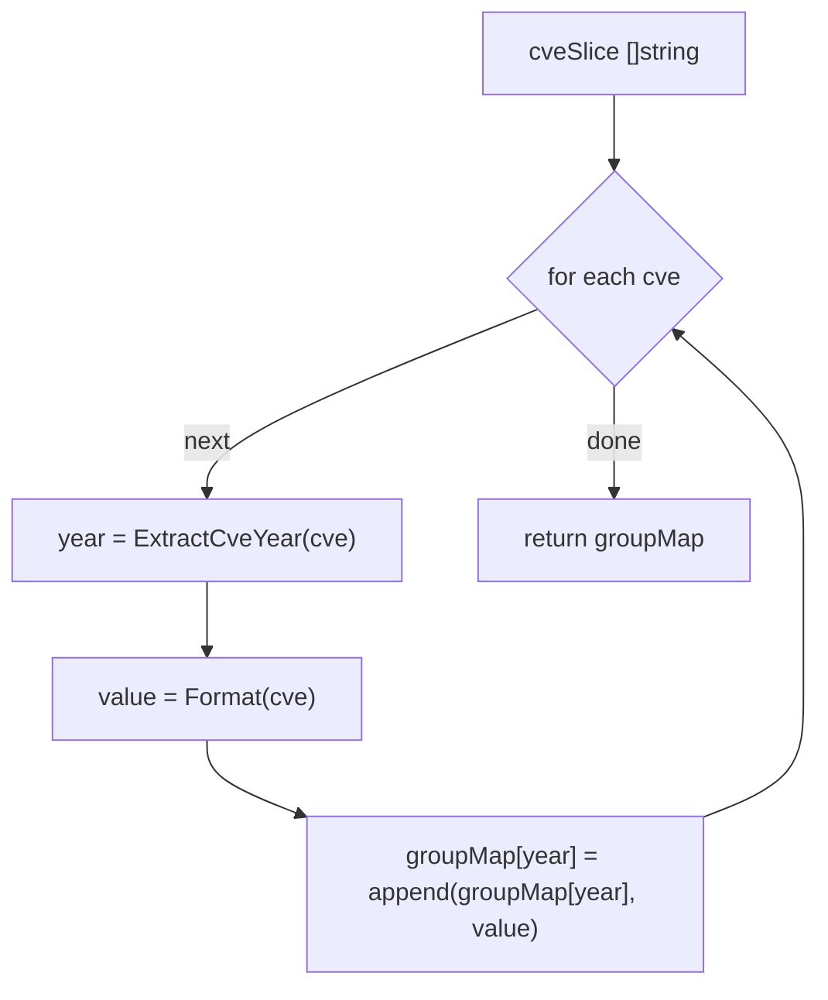

# GroupByYear

:::tip 📂 View Source
[`filter.go:46`](https://github.com/scagogogo/cve-skills/blob/main/filter.go#L46-L54) — open the implementation on GitHub (lines L46–L54).
:::

`GroupByYear` groups a list of CVE identifiers by their year, returning a map keyed by year string with each year's CVEs collected into a slice.

:::tip 📌 Scenarios
- Organize and display multiple CVEs by year when generating an annual vulnerability report
- Analyze the trend of CVE distribution over time
- Bucket a raw CVE feed before per-year downstream processing
:::

## Function Signature

```go
func GroupByYear(cveSlice []string) map[string][]string
```

## Parameters

- `cveSlice` ([]string): The list of CVE identifiers to be grouped

## Return Values

- `map[string][]string`: The grouping result — keys are year strings (e.g. `"2021"`) and values are slices of CVE identifiers for that year, each standardized to uppercase trimmed form

## Behavior

- Iterates each CVE in `cveSlice`, derives the year via `ExtractCveYear(cve)` (which calls `Split`), and uses that year string as the map key
- Each appended value is normalized through `Format(cve)` — `strings.ToUpper(strings.TrimSpace(cve))` — so mixed-case or padded inputs come back uppercase, e.g. `cve-2021-3333` becomes `CVE-2021-3333`
- Insertion order within a year group follows the original slice order; the map itself (being a Go `map`) has no guaranteed key iteration order
- Input that is not a valid CVE format yields an empty year string from `ExtractCveYear`, so malformed entries collapse under the `""` key (they are still formatted, since `Format` does not validate format — it only uppercases and trims)
- Time complexity: O(n), where n is the slice length; space complexity: O(n)

## Flowchart



## Example

```go
package main

import (
	"fmt"

	"github.com/scagogogo/cve-skills"
)

func main() {
	// Mixed years and mixed case — values are standardized to uppercase
	cveList := []string{"CVE-2021-1111", "cve-2022-2222", "CVE-2021-3333"}
	yearGroups := cve.GroupByYear(cveList)
	for year, cves := range yearGroups {
		fmt.Printf("%s: %v\n", year, cves)
	}
	// Expected output (key order may vary):
	//   2021: [CVE-2021-1111 CVE-2021-3333]
	//   2022: [CVE-2022-2222]

	// A single year collapses to one key
	oneYear := []string{"CVE-2021-1111", "cve-2021-3333"}
	groups := cve.GroupByYear(oneYear)
	fmt.Printf("keys: %v\n", groups) // keys: map[2021:[CVE-2021-1111 CVE-2021-3333]]

	// Empty input returns an empty, non-nil map
	empty := cve.GroupByYear(nil)
	fmt.Printf("empty == nil: %t, len: %d\n", empty == nil, len(empty)) // empty == nil: false, len: 0

	// Malformed entries land under the "" key (still formatted by ToUpper/TrimSpace)
	mixed := []string{"CVE-2021-1111", "not-a-cve"}
	mGroups := cve.GroupByYear(mixed)
	fmt.Printf("malformed group: %v\n", mGroups) // malformed group: map[:[NOT-A-CVE] 2021:[CVE-2021-1111]]
}
```

## Use Cases

- Organize and display multiple CVEs by year, e.g. when generating an annual vulnerability report
- Analyze the trend of CVE distribution over time
- Pre-bucket a raw CVE feed before per-year downstream processing

## Notes

- The map key is the **raw year string** extracted by `ExtractCveYear`, not a zero-padded or validated year — `Split` returns whatever sits between `CVE-` and the sequence, so a malformed entry produces a `""` key rather than raising an error
- `Format` only uppercases and trims; it does **not** validate the CVE format. That is why `not-a-cve` survives (as `NOT-A-CVE`) instead of being rejected — `GroupByYear` does not filter invalid input
- Go maps have non-deterministic iteration order; if you need a stable, year-sorted traversal, collect the keys and sort them (or use `SortCves` on each group's slice)
- Within a single year group, the relative order of CVEs matches their order in the input slice
- Compare with `FilterCvesByYear`: `GroupByYear` returns all years at once as a map; `FilterCvesByYear` returns only the slice for one specified year
- Compare with `CountByYear`: `CountByYear` collapses each year to a count; `GroupByYear` keeps the actual CVE identifiers

## Internal Implementation

The function body is a single short loop that delegates the two interesting bits to other helpers:

- **L47 — map init**: `groupMap := make(map[string][]string, 0)`. The map is pre-allocated (the `0` size hint is symbolic; Go grows it as needed) so the return value is always a non-nil map, even for empty input. This is why `GroupByYear(nil)` yields `map[]` rather than `nil`.
- **L48 — single pass**: `for _, cve := range cveSlice` iterates the input exactly once. There is no nested loop, no sort, and no deduplication — the original slice order is preserved within each year group because `append` is the only insertion path.
- **L49 — key extraction**: `year := ExtractCveYear(cve)`. The year comes from `Split`, which slices the substring between `CVE-` and the sequence number. Whatever that substring is becomes the key, so a malformed entry yields `""` rather than an error — the function never validates.
- **L50 — value normalization + append**: `groupMap[year] = append(groupMap[year], Format(cve))`. `Format` (`strings.ToUpper(strings.TrimSpace(cve))`) is applied to the value but not to the key, which is why `cve-2021-3333` lands under key `2021` with value `CVE-2021-3333`. `append` on a nil slice (`groupMap[year]` for a new key) transparently allocates, so no per-key initialization is needed.
- **L52 — return**: the populated map is returned directly. Because the loop is the only mutation and Go maps are not safe for concurrent use, callers requiring parallel access must add their own synchronization.

### Design intent

`GroupByYear` is deliberately a thin, allocation-only aggregator: it pushes parsing into `ExtractCveYear` and normalization into `Format`, keeping itself free of format knowledge. The cost is that malformed input is silently bucketed under `""` instead of being rejected; the benefit is that the function never panics and never drops entries.

## Complexity

| Dimension | Bound | Reasoning |
|---|---|---|
| Time | O(n) | One pass over the slice of length n; each iteration does constant-work map lookup + `append` + two string scans in `ExtractCveYear`/`Format` |
| Space | O(n) | Every input element is stored exactly once in the map; in the worst case (all distinct years) the map holds n keys and n slices of length 1 |
| Auxiliary | O(1) | No recursion, no temporary buffers beyond the map being built |

Note: the `make(map, 0)` hint does not pre-size the map, so growth happens incrementally; the asymptotic bounds are unaffected.

## Edge Cases

| Input | Behavior | Return |
|---|---|---|
| `nil` slice | Loop body never executes; pre-allocated map returned | `map[]` (non-nil, len 0) |
| Empty slice `[]string{}` | Same as nil — no iterations | `map[]` (non-nil, len 0) |
| Malformed `"not-a-cve"` | `ExtractCveYear` returns `""`; `Format` uppercases to `NOT-A-CVE` and appends under key `""` | Entry survives under the `""` key |
| Lowercase `"cve-2021-3333"` | Key `2021` from `ExtractCveYear`; value `CVE-2021-3333` from `Format` | Grouped under `2021`, value normalized to uppercase |
| Whitespace-padded `"  CVE-2021-3333  "` | `Format` trims, so value is `CVE-2021-3333`; key is still `2021` | Grouped under `2021`, trimmed |
| Duplicate `"CVE-2021-1111"` twice | No dedup — both appended to `groupMap["2021"]` | `2021: [CVE-2021-1111 CVE-2021-1111]` |
| Mixed years | Each year becomes its own key | One entry per distinct year |
| Concurrent access | Not synchronized — Go maps are unsafe for concurrent read/write | Caller must add a mutex |

## Data Flow

```text
+------------------------+
| cveSlice []string      |
| (raw, mixed case/yr)   |
+----------+-------------+
           |
           v
+------------------------+
| for _, cve := range    |  single pass, order preserved
+----------+-------------+
           |
           v
+------------------------+        +------------------------+
| year = ExtractCveYear  | -----> | key in groupMap        |
| (Split: CVE-<YEAR>-seq)|        | "2021", "2022", or ""  |
+----------+-------------+        | for malformed entries  |
           |                      +------------------------+
           v
+------------------------+
| value = Format(cve)    |  ToUpper + TrimSpace
| "cve-2021-3333" ->     |
| "CVE-2021-3333"        |
+----------+-------------+
           |
           v
+------------------------+
| groupMap[year] =       |  append to (possibly nil) slice
|   append(..., value)   |
+----------+-------------+
           |
           v
+------------------------+
| return groupMap        |  map[string][]string
| (non-nil, never nil)   |
+------------------------+
```

## Related Functions

- [ExtractCveYear](/api/functions/extract-cve-year) — extract the year string used as the map key
- [Format](/api/functions/format) — normalize each CVE to uppercase trimmed form
- [FilterCvesByYear](/api/functions/filter-cves-by-year) — return only the CVEs of a single specified year
- [CountByYear](/api/functions/count-by-year) — count CVEs per year instead of collecting them
- [SubByYear](/api/functions/sub-by-year) — set-difference helper grouped by year
- [SortCves](/api/functions/sort-cves) — sort a CVE slice, useful for stable per-group ordering
- [Filter & Group category](/api/filter-group)
