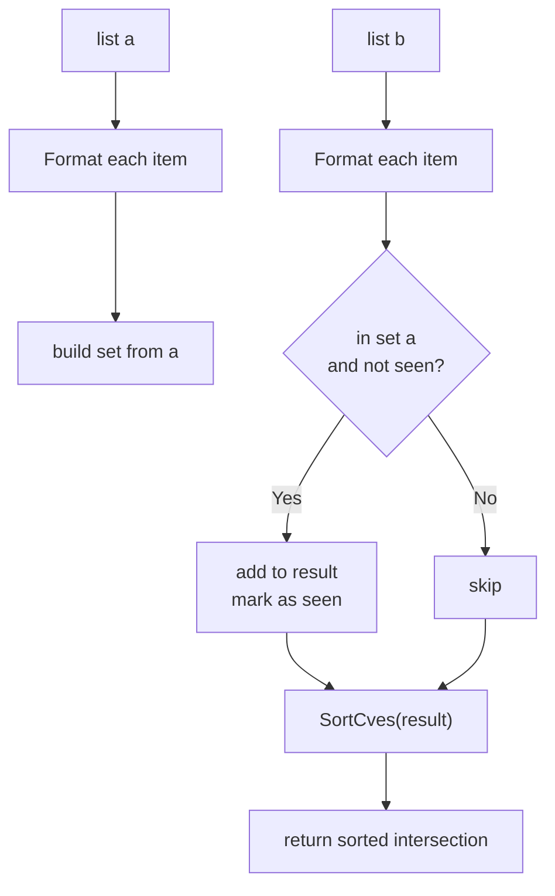

# IntersectCves

:::tip 📂 View Source
[`filter.go:229`](https://github.com/scagogogo/cve-skills/blob/main/filter.go#L229-L249) — open the implementation on GitHub (lines L229–L249).
:::

`IntersectCves` returns the CVE identifiers that appear in **both** input lists, deduplicated, upper-cased, and sorted by year then sequence number.

:::tip 📌 Scenarios
- Cross-reference CVE feeds from multiple sources (NVD, vendor advisories, internal scans) to find common entries
- Reconcile two vulnerability reports and surface only the overlap
- Confirm which CVEs from a watchlist are also present in a freshly published advisory
:::

## Function Signature

```go
func IntersectCves(a, b []string) []string
```

## Parameters

- `a` ([]string): The first CVE list
- `b` ([]string): The second CVE list

## Return Values

- []string: The CVE identifiers common to both lists, deduplicated, normalized to uppercase, and sorted

## Behavior

- Builds an internal set from list `a` after applying `Format` to each entry, so membership comparison is case-insensitive (e.g. `cve-2022-2222` and `CVE-2022-2222` are treated as the same CVE)
- Iterates list `b`, again formatting each entry; an entry is kept only if its formatted form already exists in the set built from `a`
- A second `seen` set guards against duplicates contributed by `b` — each common CVE appears in the result exactly once
- The final slice is passed through `SortCves`, so the output is ordered by year (ascending) and then by sequence number (ascending)
- Returns `nil` (empty slice) when the two lists share no CVEs — safe to range over with `for _, c := range result`

## Flowchart



## Example

```go
package main

import (
	"fmt"

	"github.com/scagogogo/cve-skills"
)

func main() {
	// Source: filter.go doc example
	list1 := []string{"CVE-2022-1111", "CVE-2022-2222"}
	list2 := []string{"CVE-2022-2222", "CVE-2022-3333"}
	common := cve.IntersectCves(list1, list2)
	fmt.Println(common) // [CVE-2022-2222]

	// No overlap -> empty result
	onlyA := []string{"CVE-2022-1111"}
	onlyB := []string{"CVE-2023-2222"}
	fmt.Println(cve.IntersectCves(onlyA, onlyB)) // []

	// Case-insensitive + dedup + sorted output
	messy1 := []string{"cve-2022-2222", "CVE-2021-1111"}
	messy2 := []string{"CVE-2022-2222", "cve-2022-2222", "CVE-2021-1111"}
	fmt.Println(cve.IntersectCves(messy1, messy2)) // [CVE-2021-1111 CVE-2022-2222]

	// Reconcile a watchlist against an advisory feed
	watchlist := []string{"CVE-2021-44228", "CVE-2022-22222", "CVE-2023-99999"}
	advisory := []string{"CVE-2021-44228", "CVE-2023-99999", "CVE-2024-00001"}
	hits := cve.IntersectCves(watchlist, advisory)
	fmt.Println(hits) // [CVE-2021-44228 CVE-2023-99999]
}
```

## Use Cases

- Cross-source CVE data reconciliation — find entries shared by NVD, vendor advisories, and internal scanners
- Identify vulnerabilities common to multiple security reports
- Confirm which items on a watchlist appear in a newly published advisory

## Notes

- Comparison is **case-insensitive** because every entry is normalized via `Format` before it touches a set; the returned CVEs are always uppercase
- The result is **sorted** by `SortCves` (year asc, then sequence asc), not preserved in input order — contrast this with `DiffCves`, which also sorts but returns items unique to `a`
- Order of arguments matters only conceptually: intersection is symmetric, so `IntersectCves(a, b)` and `IntersectCves(b, a)` produce the same set (and the same sorted slice)
- Time complexity is O(n+m) with O(min(n,m)) auxiliary space — efficient for large lists
- Inputs are not mutated; a new slice is always returned

## Internal Implementation

The function is split into three phases — build a lookup set, scan the second list, then sort:

- **Build a set from `a` (L230-L233):** `set := make(map[string]struct{}, len(a))` pre-sizes the map to the length of `a`, avoiding rehashing. Each entry is run through `Format(cve)` before being stored as a map key, so `cve-2022-2222` and `CVE-2022-2222` collapse to the same key. `struct{}` is used as the value type because it carries no data and allocates zero bytes per entry.
- **Scan `b` with a second `seen` guard (L235-L245):** `result` is declared as a nil slice and grown via `append`. For each element of `b`, the formatted form is looked up in `set` (membership test against `a`); if present, the `seen` map is consulted to avoid emitting the same CVE twice when `b` itself contains duplicates. Only first-time hits are appended.
- **Sort before returning (L247):** `return SortCves(result)` normalizes the output order so callers always see year-ascending, then sequence-ascending output, regardless of the input order in `a` or `b`.
- **Design intent — symmetric and stable:** because membership is keyed on the *formatted* string and the result is sorted, `IntersectCves(a, b)` and `IntersectCves(b, a)` produce identical slices. Building the set from `a` (rather than the smaller list) keeps the implementation simple; the O(n+m) cost is dominated by the two linear passes.
- **No input mutation:** `a` and `b` are only read; `result` is a freshly allocated slice, so callers can safely retain the inputs.

## Complexity

| Metric | Bound | Derivation |
|---|---|---|
| Time | O(n + m + k log k) | One linear pass over `a` (n), one linear pass over `b` (m), plus `SortCves` over the k-sized result (k log k). Since k <= min(n, m), this simplifies to O(n + m) when k is small. |
| Auxiliary space | O(n + min(n, m)) | `set` holds up to n formatted keys; `seen` holds up to min(n, m) keys (bounded by the size of the intersection); `result` holds k entries. |
| Map operations | O(1) average | `make` pre-sizing plus amortized O(1) insert/lookup on Go's built-in map. |

where `n = len(a)`, `m = len(b)`, and `k` is the size of the intersection.

## Edge Cases

| Input | Behavior | Return |
|---|---|---|
| `a` or `b` is `nil` | Ranging over a nil slice is a no-op; `Format` is never called on a missing element | Empty (nil) slice — safe to range over |
| `a` or `b` is empty (`[]string{}`) | One of the passes contributes nothing; intersection is empty | `nil` |
| No common CVEs between `a` and `b` | `set` lookups all miss; `result` stays nil | `nil` |
| Duplicate CVEs in `a` | Map insertion deduplicates them; `set` keeps one key | Unaffected — same intersection |
| Duplicate CVEs in `b` | The `seen` guard (L240) suppresses the second occurrence | Each common CVE appears exactly once |
| Mixed case (`cve-2022-2222` vs `CVE-2022-2222`) | `Format` normalizes to uppercase before any set operation | Treated as identical; returned as `CVE-2022-2222` |
| Leading/trailing whitespace in entries | `Format` trims whitespace, so `" CVE-2022-2222 "` matches `CVE-2022-2222` | Normalized form in output |
| Invalid CVE strings (not matching the CVE pattern) | `Format` is still called and the resulting string is used as the key; invalid entries simply never match valid ones | No intersection for those entries |

## Data Flow

```text
+-------------------+        +-------------------+
| input: list a     |        | input: list b     |
| []string (n items) |       | []string (m items) |
+---------+---------+        +---------+---------+
          |                            |
          v                            v
   +------+-------+            +-------+------+
   | Format(each) |            | Format(each) |
   | L232         |            | L238         |
   +------+-------+            +-------+------+
          |                            |
          v                            |
   +------+-------+                    |
   | build set    |                    |
   | map[string]  |                    |
   | struct{}     |                    |
   | L230-L233    |                    |
   +------+-------+                    |
          |                            |
          |  +-------------------------+
          |  |
          v  v
   +------+--------+
   | in set a AND  |     no  +--------+
   | not in seen?  |------->| skip   |
   +------+--------+        +--------+
          | yes
          v
   +------+--------+
   | append to     |
   | result; mark  |
   | seen L240-242 |
   +------+--------+
          |
          v
   +------+--------+
   | SortCves      |
   | result L247   |
   +------+--------+
          |
          v
+--------------------+
| output: sorted     |
| intersection       |
| []string (k items) |
+--------------------+
```

## Related Functions

- [UnionCves](/api/functions/union-cves) — union of two CVE lists (deduplicated, sorted)
- [DiffCves](/api/functions/diff-cves) — CVEs in `a` that are not in `b`
- [RemoveDuplicateCves](/api/functions/remove-duplicate-cves) — deduplicate a single list
- [SortCves](/api/functions/sort-cves) — sort CVEs by year then sequence
- [Format](/api/functions/format) — normalize a CVE to uppercase trimmed form
- [Set Operations category](/api/set-operations)
