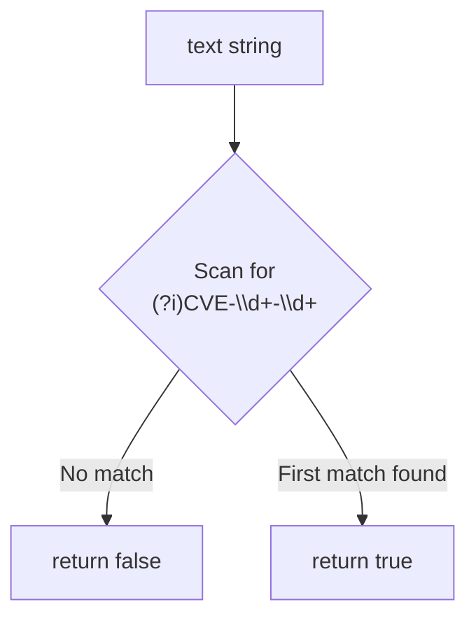

# IsContainsCve

:::tip 📂 View Source
[`base.go:151`](https://github.com/scagogogo/cve-skills/blob/main/base.go#L151-L171) — open the implementation on GitHub (lines L151–L171).
:::

`IsContainsCve` checks whether a piece of text contains at least one CVE-format identifier anywhere inside it — the CVE does not have to be the whole string, unlike `IsCve`.

:::tip 📌 Scenarios
- Quickly decide whether a security report, email, or log line mentions any CVE before running the heavier `ExtractCve` extraction
- Pre-filter large text corpora so only CVE-bearing documents are processed further
- Trigger conditional logic (alerting, tagging, routing) based on the mere presence of a CVE reference
:::

## Function Signature

```go
func IsContainsCve(text string) bool
```

## Parameters

- `text` (string): The text content to check for an embedded CVE identifier

## Return Values

- `bool`: Returns `true` if at least one CVE-format substring is found anywhere in the text; returns `false` otherwise

## Behavior

- Matches against the pre-compiled regular expression `(?i)CVE-\d+-\d+`
- `(?i)` makes the match case-insensitive — `cve-2022-12345`, `CVE-2022-12345`, and `CvE-2022-12345` are all detected
- The pattern is **not** anchored — it scans the whole string, so a CVE embedded in surrounding prose (e.g. `"System affected by CVE-2021-44228, please patch"`) returns `true`
- `\d+-\d+` requires both the year and the sequence to be numeric — `"CVE-2022-ABCD"` does not match
- Short-circuits on the first match found, returning `true` immediately; it does not collect or count all occurrences
- Returns `false` for an empty string or text with no CVE-format substring
- Pure presence check only — it does not validate the year range, sequence value, or deduplicate; for full validation use `ValidateCve`, and for extraction use `ExtractCve`

## Flowchart



## Example

```go
package main

import (
	"fmt"

	"github.com/scagogogo/cve-skills"
)

func main() {
	testCases := []struct {
		input    string
		expected bool
		reason   string
	}{
		{"这个漏洞的编号是CVE-2022-12345", true, "CVE embedded in surrounding text"},
		{"System affected by CVE-2021-44228 and CVE-2022-12345", true, "multiple CVEs present"},
		{"cve-2022-12345在文本中", true, "lowercase CVE still detected (case-insensitive)"},
		{"Primary CVE-2022-1 is single-digit", true, "single-digit sequence still matches the pattern"},
		{"这个文本不包含任何CVE", false, "no CVE-format substring"},
		{"CVE格式错误CVE-22-123", true, "22 and 123 are digits, so it matches (see notes)"},
		{"CVE-2022-ABCD mentioned here", false, "sequence is not a number"},
		{"2022-12345 without prefix", false, "missing CVE prefix"},
		{"", false, "empty string"},
	}

	for _, tc := range testCases {
		result := cve.IsContainsCve(tc.input)
		status := "✅"
		if result != tc.expected {
			status = "❌"
		}
		fmt.Printf("%s %-55s -> %t  (%s)\n", status, tc.input, result, tc.reason)
	}

	// Typical pre-filter usage before extraction
	report := "系统受到CVE-2021-44228的影响，建议立即修复"
	if cve.IsContainsCve(report) {
		cveList := cve.ExtractCve(report)
		fmt.Printf("Extracted CVEs: %v\n", cveList)
	} else {
		fmt.Println("No CVE found, skip extraction")
	}
}
```

## Use Cases

- Detect whether an article, advisory, or report mentions any CVE
- Pre-filter documents before running the more expensive `ExtractCve` extraction
- Trigger alerting, tagging, or routing based on the mere presence of a CVE reference
- Scan logs or emails for CVE-related content

## Notes

- `IsContainsCve` is a **presence** check; it does not return the matched CVEs — use `ExtractCve` (all matches), `ExtractFirstCve`, or `ExtractLastCve` to retrieve them
- Compare with `IsCve`: `IsCve` requires the **entire** string to be the CVE (whitespace aside); `IsContainsCve` only checks whether the string **contains** a CVE anywhere
- `\d+` accepts one or more digits, so technically `CVE-22-123` matches even though `22` is not a realistic 4-digit year — the year-range check is delegated to `IsCveYearOk` / `ValidateCve`
- Matching is case-insensitive but the result is only a boolean — call `ExtractCve` (which formats matches to uppercase) if you need the canonical CVE strings
- The regex is pre-compiled into the package-level `containsCveRegex` variable at init time, so repeated calls are cheap and concurrency-safe
- The regex is unanchored, so the same CVE appearing multiple times still yields a single `true`; it does not deduplicate or count

## Internal Implementation

The function body is a single line at `base.go:152` that delegates to a package-level pre-compiled regex:

```go
return containsCveRegex.MatchString(text)
```

- The regex is constructed once at package init via `regexp.MustCompile(`(?i)CVE-\d+-\d+`)` and stored in the package-level variable `containsCveRegex` (declared at `base.go:16`). This avoids re-compiling the pattern on every call, so the per-call cost is only the `MatchString` scan
- `MatchString` reports whether the regex matches **anywhere** in the string — the pattern is unanchored (no `^`/`$`), which is what makes this a "contains" check rather than an "equals" check
- The `(?i)` inline flag flips the match to case-insensitive mode, so the literal `CVE` prefix matches `cve`, `Cve`, etc. without normalizing the input first
- `\d+-\d+` requires one or more digits on each side of the dash; because Go's `regexp` is greedy but unanchored, the engine stops as soon as the first overall match is found (short-circuit on first hit)
- The function holds no state, allocates no map or slice, and performs no sorting, formatting, or validation — every piece of behavior (case-insensitivity, anchoring, numeric fields) comes from the regex itself, not from runtime logic

## Complexity

| Dimension | Complexity | Reason |
|---|---|---|
| Time | O(n) where n = len(`text`) | `MatchString` performs a single linear scan over the input; the regex has no backtracking quantifiers that cause exponential blow-up |
| Space | O(1) extra | No slices, maps, or buffers are allocated by the function; the regex engine uses a bounded amount of working state |
| Per-call setup | O(1) | The pattern is compiled once at init (`containsCveRegex`), so each call pays only the match cost, not a compile cost |
| Concurrency | Safe | The pre-compiled `*regexp.Regexp` is immutable and safe for concurrent `MatchString` use |

## Edge Cases

| Input | Behavior | Return |
|---|---|---|
| Empty string `""` | No characters to scan, pattern cannot match | `false` |
| `nil`-equivalent (empty) | Same as empty string | `false` |
| `cve-2022-12345` (lowercase) | `(?i)` makes the prefix case-insensitive | `true` |
| `CvE-2022-12345` (mixed case) | `(?i)` matches mixed-case prefix | `true` |
| `CVE-2022-ABCD` (non-digit sequence) | `\d+` fails to match `ABCD` | `false` |
| `CVE-22-123` (2-digit year) | `\d+` accepts any run of digits, so it matches even though the year is not realistic | `true` |
| `2022-12345` (no `CVE` prefix) | Prefix literal missing | `false` |
| Same CVE repeated, e.g. `CVE-2022-1 CVE-2022-1` | Unanchored regex short-circuits on the first hit; no counting | `true` |
| CVE embedded in prose, e.g. `see CVE-2021-44228 ASAP` | Unanchored scan finds the substring | `true` |
| Very long text with no CVE | One full linear pass, no match | `false` |

## Data Flow

```text
+----------------------+      +---------------------------------+      +---------------------+
|  text (string)       |----->|  containsCveRegex.MatchString   |----->|  bool               |
|  e.g. "see cve-2022  |      |  (?i)CVE-\d+-\d+                |      |  true / false       |
|  -1 now"             |      |  (pre-compiled at init)         |      |                     |
+----------------------+      +---------------------------------+      +---------------------+
                                     |
                                     | unanchored, case-insensitive scan
                                     v
                              +-----------------------------+
                              |  scan left -> right         |
                              |  stop at first match (short |
                              |  circuit) or end of string  |
                              +-----------------------------+
                                     |
                        +------------+------------+
                        |                         |
                  first match found          end of string, no match
                        |                         |
                        v                         v
                   return true              return false
```

## Related Functions

- [IsCve](/api/functions/is-cve) — require the entire string to be a CVE
- [ExtractCve](/api/functions/extract-cve) — extract all CVEs from text
- [ExtractFirstCve](/api/functions/extract-first-cve) — extract the first CVE from text
- [ExtractLastCve](/api/functions/extract-last-cve) — extract the last CVE from text
- [ValidateCve](/api/functions/validate-cve) — full validation (format + year range + positive sequence)
- [Format & Validate category](/api/format-validate)
