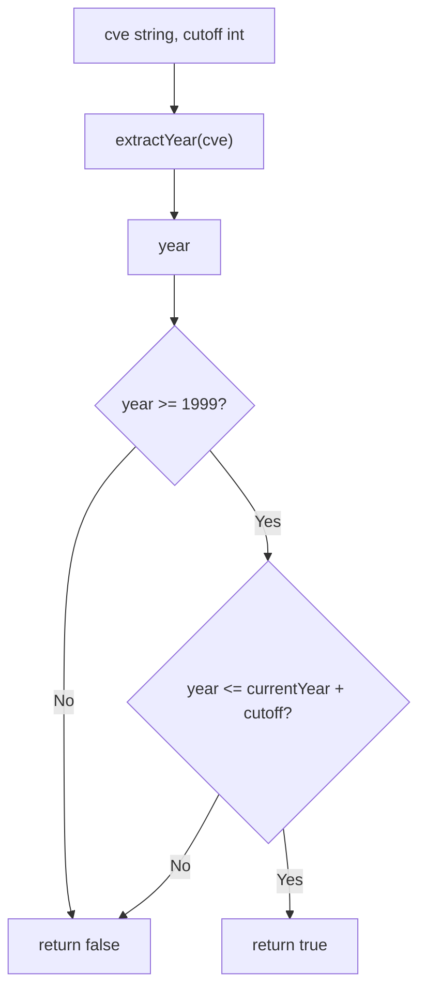

# IsCveYearOkWithCutoff

:::tip 📂 View Source
[`base.go:231`](https://github.com/scagogogo/cve-skills/blob/main/base.go#L231-L235) — open the implementation on GitHub (lines L231–L235).
:::

`IsCveYearOkWithCutoff` checks whether the year embedded in a CVE identifier falls within a reasonable time range, with a configurable `cutoff` offset that widens the upper bound to accept future-year CVEs.

:::tip 📌 Scenarios
- Validate reserved or pre-published CVE identifiers whose year may extend slightly into the future
- Apply a custom tolerance window when ingesting third-party vulnerability feeds
- Reuse the underlying range check behind `IsCveYearOk` (which passes `cutoff = 0`)
:::

## Function Signature

```go
func IsCveYearOkWithCutoff(cve string, cutoff int) bool
```

## Parameters

- `cve` (string): The CVE identifier whose year should be checked
- `cutoff` (int): The year offset allowed beyond the current year, in years; widens the upper bound to `currentYear + cutoff`

## Return Values

- `bool`: Returns `true` if the year is in the valid range; returns `false` otherwise

## Behavior

- Extracts the year via the internal `extractYear` helper, which first calls `Format` to trim/uppercase the input, then splits on `-` and parses the middle segment as an integer
- Lower bound is fixed: the year must satisfy `year >= 1999` (CVE numbering started in 1999)
- Upper bound is dynamic: the year must satisfy `year <= time.Now().Year() + cutoff`, so `cutoff` extends the acceptable window into the future
- When the input is not a valid CVE format, `extractYear` returns `0`, which is `&lt; 1999`, so the function returns `false` — no panic or error is raised for malformed input
- `cutoff` may be `0` (no future-year tolerance, equivalent to `IsCveYearOk`) or negative (tighten the upper bound below the current year)
- This is a **year-range** check only; it does not validate the sequence value or the full CVE format — combine with `IsCve` / `ValidateCve` for full validation

## Flowchart



## Example

```go
package main

import (
	"fmt"

	"github.com/scagogogo/cve-skills"
)

func main() {
	// Source-derived examples (assume currentYear = 2023):
	//   "CVE-2022-12345", 5 -> true
	//   "CVE-1998-12345", 5 -> false (1998 < 1999)
	//   "CVE-2030-12345", 5 -> true (2030 <= 2023+5)
	//   "CVE-2030-12345", 2 -> false (2030 > 2023+2)
	testCases := []struct {
		cve     string
		cutoff  int
		reason  string
	}{
		{"CVE-2022-12345", 5, "within current year, always ok"},
		{"CVE-1998-12345", 5, "1998 is before 1999 -> false"},
		{"CVE-2030-12345", 5, "2030 <= 2023+5 -> true"},
		{"CVE-2030-12345", 2, "2030 > 2023+2 -> false"},
		{"CVE-2025-12345", 2, "future year within cutoff window"},
		{"not-a-cve", 5, "malformed input: extractYear returns 0 -> false"},
	}

	for _, tc := range testCases {
		result := cve.IsCveYearOkWithCutoff(tc.cve, tc.cutoff)
		fmt.Printf("IsCveYearOkWithCutoff(%-18s, %d) -> %t  (%s)\n", tc.cve, tc.cutoff, result, tc.reason)
	}

	// Typical usage: allow future-year CVEs with a 2-year tolerance
	if cve.IsCveYearOkWithCutoff("CVE-2025-12345", 2) {
		fmt.Println("Accepted: year within 1999..currentYear+2")
	} else {
		fmt.Println("Rejected: year out of range")
	}
}
```

## Use Cases

- Validate CVE year validity while allowing a configurable tolerance for future years
- Process pre-published or reserved CVE identifiers whose year may exceed the current year
- Reuse as the engine behind `IsCveYearOk` (which calls this with `cutoff = 0`)

## Notes

- The lower bound `1999` is fixed and not affected by `cutoff`; only the upper bound shifts
- `cutoff` is in **years**, not days or months — it directly adds to `time.Now().Year()`
- A negative `cutoff` tightens the upper bound (e.g. `-1` rejects the current year's CVEs if the year has not rolled over yet in your data context), but cannot lower the bound below `1999`
- For malformed input the function silently returns `false` (via `extractYear` returning `0`); pair with `IsCve` first when you need to distinguish "bad format" from "bad year"
- The upper bound depends on `time.Now()`, so results for the same input may change across runs as the wall-clock year advances — do not cache results long-term
- Compare with `IsCveYearOk`: identical logic with `cutoff = 0`; compare with `ValidateCve`: full validation (format + year range with `cutoff = 0` + positive sequence)

## Internal Implementation

The function body is only two lines (`base.go:231`-`235`), delegating the heavy lifting to helpers:

- **Year extraction via `extractYear`** (L232): `year := extractYear(cve)` reuses the shared helper that first calls `Format` to trim whitespace and uppercase the input, then splits on `-` and parses the middle segment as an integer. This keeps parsing consistent with every other year-aware API.
- **Fixed lower bound** (L233, left operand): `year >= 1999` encodes the CVE program's inception year (1999) as a compile-time constant. It is intentionally not parameterized — no CVE exists before 1999.
- **Dynamic upper bound** (L233, right operand): `year <= time.Now().Year()+cutoff` reads the wall-clock year at call time and shifts it by `cutoff`. Reading `time.Now()` per call (rather than caching) guarantees the window tracks the real date, at the cost of being non-deterministic across runs.
- **Short-circuit `&&`**: Go evaluates left-to-right and stops at the first `false`, so an out-of-range-low year never pays for the `time.Now()` call. Invalid inputs (where `extractYear` returns `0`) fail fast on the lower bound.
- **No error path**: malformed input flows through `extractYear` returning `0`, which fails `>= 1999` and yields `false` — the function is total and never panics, which is why callers must pair it with `IsCve` to distinguish "bad format" from "bad year".

## Complexity

| Dimension | Cost | Reason |
|---|---|---|
| Time | O(n) | `extractYear` scans the (short) CVE string once via `Format` + split + parse; the two comparisons are O(1) |
| Space | O(1) | Only a single `int` (`year`) is allocated; no slices, maps, or recursion |
| `time.Now()` | O(1) | One syscall-free call to the runtime clock per invocation |

Because the input is bounded by CVE length, the function is effectively constant in practice, but the linear bound on string parsing keeps it honest for arbitrary-length inputs.

## Edge Cases

| Input | Behavior | Return |
|---|---|---|
| `"CVE-2022-12345"`, cutoff `0` | Year `2022` within `[1999, now]` | `true` |
| `"CVE-1998-12345"`, cutoff `5` | `1998 < 1999`, fails lower bound | `false` |
| `"CVE-2030-12345"`, cutoff `2` (now=2023) | `2030 > 2023+2`, fails upper bound | `false` |
| `""` (empty string) | `extractYear` returns `0`, `0 < 1999` | `false` |
| `"not-a-cve"`, cutoff `5` | No parseable year segment, returns `0` | `false` |
| `"cve-2022-12345"` (lowercase) | `Format` uppercases first, parses fine | `true` |
| `"  CVE-2022-12345  "` (whitespace) | `Format` trims, then parses | `true` |
| `"CVE-2022-12345"`, cutoff `-5` | Upper bound tightened below current year; `2022 > now-5` may reject | depends on `now` |
| `"CVE-0000-12345"` | Year `0`, `0 < 1999` | `false` |
| `nil`-equivalent / very long string | Still single-pass parse; no panic | `false` if unparseable |

## Data Flow

```text
+---------------------------+      +-----------------------+
| Input: cve string,        |      | Input: cutoff int     |
|        cutoff int         |      | (year offset, may be  |
+-------------+-------------+      | 0 or negative)        |
              |                    +-----------+-----------+
              v                                |
+-----------------------------+                |
| extractYear(cve)            |                |
|  - Format(cve): trim+upper  |                |
|  - split on '-'             |                |
|  - Atoi(middle segment)     |                |
+-------------+---------------+                |
              | year (int, 0 on failure)      |
              v                                v
+-----------------------------------------------------+
| year >= 1999  &&  year <= time.Now().Year()+cutoff  |
|  (left: fixed lower bound; right: dynamic upper)    |
+----------------------+------------------------------+
                       |
          +------------+------------+
          |  short-circuit &&:      |
          |  false at any operand   |
          |  => result is false     |
          +------------+------------+
                       |
                       v
            +----------+----------+
            |  true  |   false   |
            +--------+-----------+
                    |
                    v
        +-----------+-----------+
        | Output: bool          |
        +-----------------------+
```

## Related Functions

- [IsCveYearOk](/api/functions/is-cve-year-ok) — year-range check with no future-year offset (cutoff = 0)
- [ValidateCve](/api/functions/validate-cve) — full validation (format + year range + positive sequence)
- [IsCve](/api/functions/is-cve) — pure format check
- [Split](/api/functions/split) — split a CVE into year and sequence
- [Format](/api/functions/format) — standardize a CVE to uppercase, trimmed form
- [Format & Validate category](/api/format-validate)
