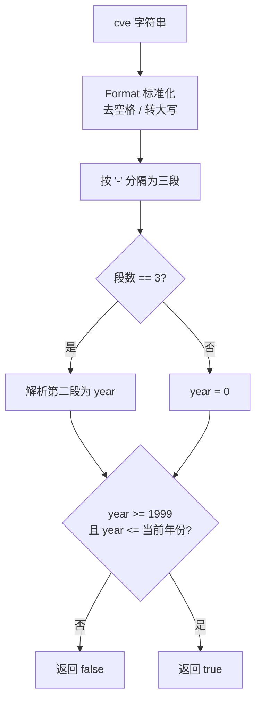

# IsCveYearOk

:::tip 📂 View Source
[`base.go:199`](https://github.com/scagogogo/cve-skills/blob/main/base.go#L199-L202) — open the implementation on GitHub (lines L199–L202).
:::

判断 CVE 编号的年份是否在合理的时间范围内（1999 至当前年份）。

:::tip 📌 Scenarios
- 在导入或入库前快速过滤掉年份异常的 CVE（早于 1999 或晚于当前年份）
- 对用户输入或外部数据源提交的 CVE 做轻量级合理性校验
- 在批量清洗流水线中作为 `IsCve` 之后的第二道年份过滤关卡
:::

## 函数签名

```go
func IsCveYearOk(cve string) bool
```

## 参数

- `cve` (string): 需要验证年份的 CVE 编号，大小写不敏感，允许两侧有空白字符

## 返回值

- `bool`: 如果年份在有效范围内（`1999 <= year <= 当前年份`）则返回 `true`，否则返回 `false`

## 行为说明

- `IsCveYearOk` 是 `IsCveYearOkWithCutoff(cve, 0)` 的简写，等价于不携带任何未来年份偏移
- 内部先调用 `extractYear` 提取年份：先用 `Format` 标准化（去空格、转大写），再按 `-` 分隔；若分隔后不是三段，则年份取 `0`
- 下限固定为 `1999`（CVE 编号体系启用的年份），早于 1999 的年份直接判为 `false`
- 上限为 `time.Now().Year()`，即运行时的当前年份；晚于当前年份的判为 `false`
- 由于年份为 `0` 时 `0 >= 1999` 不成立，因此格式无效的输入会直接返回 `false`，不会误判为合法
- 该函数只校验年份，不校验序列号；如需同时校验格式、年份与序列号，请使用 `ValidateCve`

## 流程图



## 示例

```go
package main

import (
	"fmt"
	"time"

	"github.com/scagogogo/cve-skills"
)

func main() {
	currentYear := time.Now().Year()
	fmt.Printf("当前年份: %d\n\n", currentYear)

	testCases := []struct {
		input    string
		expected bool
		reason   string
	}{
		{"CVE-2022-12345", true, "年份在 1999 至当前年份之间"},
		{"cve-1999-1", true, "1999 是下限，包含在内"},
		{"CVE-1998-12345", false, "1998 < 1999，早于 CVE 体系启用"},
		{"CVE-2030-12345", false, "2030 超过当前年份（无偏移）"},
		{" CVE-2022-12345 ", true, "允许两侧空白字符"},
		{"cVe-2022-12345", true, "大小写不敏感"},
		{"CVE-22-12345", false, "格式异常，年份解析为 0"},
		{"not-a-cve", false, "非 CVE 格式，年份解析为 0"},
		{"", false, "空字符串，年份解析为 0"},
	}

	for _, tc := range testCases {
		result := cve.IsCveYearOk(tc.input)
		status := "✅"
		if result != tc.expected {
			status = "❌"
		}
		fmt.Printf("%s %-20s -> %t  (%s)\n", status, tc.input, result, tc.reason)
	}

	// 等价性演示：IsCveYearOk(cve) == IsCveYearOkWithCutoff(cve, 0)
	cveId := "CVE-2022-12345"
	fmt.Printf("\nIsCveYearOk(%q)          = %t\n", cveId, cve.IsCveYearOk(cveId))
	fmt.Printf("IsCveYearOkWithCutoff(%q, 0) = %t\n", cveId, cve.IsCveYearOkWithCutoff(cveId, 0))
}
```

预期输出（假设运行时当前年份为 2026）：

```bash
当前年份: 2026

✅ CVE-2022-12345       -> true  (年份在 1999 至当前年份之间)
✅ cve-1999-1           -> true  (1999 是下限，包含在内)
✅ CVE-1998-12345       -> false  (1998 < 1999，早于 CVE 体系启用)
✅ CVE-2030-12345       -> false  (2030 超过当前年份（无偏移））
✅  CVE-2022-12345      -> true  (允许两侧空白字符)
✅ cVe-2022-12345       -> true  (大小写不敏感)
✅ CVE-22-12345         -> false  (格式异常，年份解析为 0)
✅ not-a-cve            -> false  (非 CVE 格式，年份解析为 0)
✅                      -> false  (空字符串，年份解析为 0)

IsCveYearOk("CVE-2022-12345")          = true
IsCveYearOkWithCutoff("CVE-2022-12345", 0) = true
```

## 使用场景

- 在数据导入流水线中过滤掉年份异常的 CVE 记录
- 对用户提交的 CVE 做合理性校验，提醒明显错误的年份
- 与 `IsCve` 组合使用：先验格式，再验年份
- 作为 `ValidateCve` 的轻量替代，只关注年份维度时调用更直接

## 注意事项

- ⚠️ 该函数依赖 `time.Now().Year()`，结果会随运行时当前年份变化；同一个输入在不同年份运行可能得到不同结果（例如 `CVE-2030-12345` 在 2030 年运行时为 `true`）
- ⚠️ 下限 `1999` 是硬编码的，对应 CVE 编号体系正式启用的年份，不可配置
- ⚠️ 该函数只校验年份，不校验序列号是否为正整数；需要全面校验请使用 `ValidateCve`
- ⚠️ 格式无效的输入（如 `not-a-cve`）会因年份解析为 `0` 而返回 `false`，但这不代表该字符串是"年份非法的 CVE"——它根本不是 CVE
- 🔍 如需容忍未来年份（如处理预发布或预留的 CVE 编号），请改用 `IsCveYearOkWithCutoff` 并传入正数 `cutoff`
- 🛠️ `IsCveYearOk(cve)` 完全等价于 `IsCveYearOkWithCutoff(cve, 0)`

## Internal Implementation

`IsCveYearOk` is a thin wrapper that delegates entirely to `IsCveYearOkWithCutoff` (line 200: `return IsCveYearOkWithCutoff(cve, 0)`). The real work happens across two helpers:

- `IsCveYearOkWithCutoff` (base.go L231-L234) — first calls `extractYear(cve)` to obtain an integer year, then evaluates a single boolean expression: `year >= 1999 && year <= time.Now().Year()+cutoff`. Since `cutoff` is `0` here, the upper bound collapses to the runtime current year.
- `extractYear` (base.go L162-L170) — normalizes the input via `Format(cve)` (trim + uppercase), then `strings.Split(cve, "-")`. If the result does not have exactly 3 segments it short-circuits with `year = 0`; otherwise it runs `strconv.Atoi(split[1])` and returns the parsed integer. The `Atoi` error is intentionally discarded (`year, _ := strconv.Atoi(split[1])`), so a non-numeric second segment silently yields `0`.
- Because the guard is `year >= 1999`, a `0` year (from any malformed input) always fails the lower bound, so format errors naturally fall out as `false` without a separate format check.
- `time.Now().Year()` is evaluated at call time on every invocation — there is no caching, so the upper bound drifts forward as the wall clock advances.
- Design intent: keep `IsCveYearOk` as a zero-config entry point while routing configurable behavior (future-year tolerance) through `IsCveYearOkWithCutoff`, avoiding duplicated parsing logic.

## Complexity

| Aspect | Complexity | Reason |
|---|---|---|
| Time | O(n) | `Format` scans the string once (O(n)); `strings.Split` and `strconv.Atoi` over the year segment are O(n) in the input length n. |
| Space | O(n) | `Format` allocates a normalized copy; `strings.Split` allocates a slice of substrings, all linear in n. |
| Amortized | — | No caching; each call re-runs `time.Now()` and parsing. |

No sorting or nested loops are involved, so the function stays linear in the size of the input string.

## Edge Cases

| Input | Behavior | Return |
|---|---|---|
| `"CVE-2022-12345"` (current year >= 2022) | Parsed to year 2022, within `[1999, now]` | `true` |
| `"cve-1999-1"` | Year 1999 equals the lower bound (inclusive) | `true` |
| `"CVE-1998-12345"` | Year 1998 < 1999 | `false` |
| `"CVE-2030-12345"` (run before 2030, cutoff 0) | Year 2030 > current year | `false` |
| `" CVE-2022-12345 "` | `Format` trims surrounding spaces before split | `true` |
| `"cVe-2022-12345"` | `Format` uppercases, then split/parse unaffected by case | `true` |
| `"CVE-22-12345"` | Split yields 3 segments; `Atoi("22")` = 22, which is < 1999 | `false` |
| `"CVE-ABCD-12345"` | 3 segments; `Atoi("ABCD")` fails, error discarded, year = 0 | `false` |
| `"not-a-cve"` | Split yields fewer than 3 segments, year = 0 | `false` |
| `""` (empty) | `Format` yields `""`, split yields 1 segment, year = 0 | `false` |
| `"CVE-2022"` | Split yields 2 segments (!= 3), year = 0 | `false` |
| `"CVE-2022-12345-678"` | Split yields 4 segments (!= 3), year = 0 | `false` |

## Data Flow

```text
+---------------------------+
| input: cve string         |
|  e.g. "CVE-2022-12345"    |
+------------+--------------+
             |
             v
+---------------------------+
| Format(cve)               |  trim spaces + uppercase
|  -> "CVE-2022-12345"      |
+------------+--------------+
             |
             v
+---------------------------+
| strings.Split(cve, "-")   |
|  -> ["CVE","2022","12345"]|
+------------+--------------+
             |
             v
+---------------------------+
| len(split) == 3 ?         |
+--+---------------------+--+
   |yes                  |no
   v                     v
+--------------+  +-------------+
| Atoi(split[1])| | year = 0    |
| year = 2022  |  +------+------+
+------+------+         |
       |                |
       v                |
+-------------------------+
| year >= 1999 ?          |
| year <= now + cutoff ?  |  (cutoff = 0)
+--+---------------------+--+
   |true                 |false
   v                     v
+-------------+   +--------------+
| return true |   | return false |
+-------------+   +--------------+
```

## 相关函数

- [IsCveYearOkWithCutoff](/api/functions/is-cve-year-ok-with-cutoff): 带未来年份偏移量的版本，可容忍预发布 CVE
- [ValidateCve](/api/functions/validate-cve): 全面校验（格式 + 年份 + 序列号），是更严格的校验入口
- [IsCve](/api/functions/is-cve): 仅校验 CVE 格式，不涉及年份范围
- [Split](/api/functions/split): 将 CVE 拆分为年份与序列号
- [格式化与验证分类入口](/api/format-validate)
