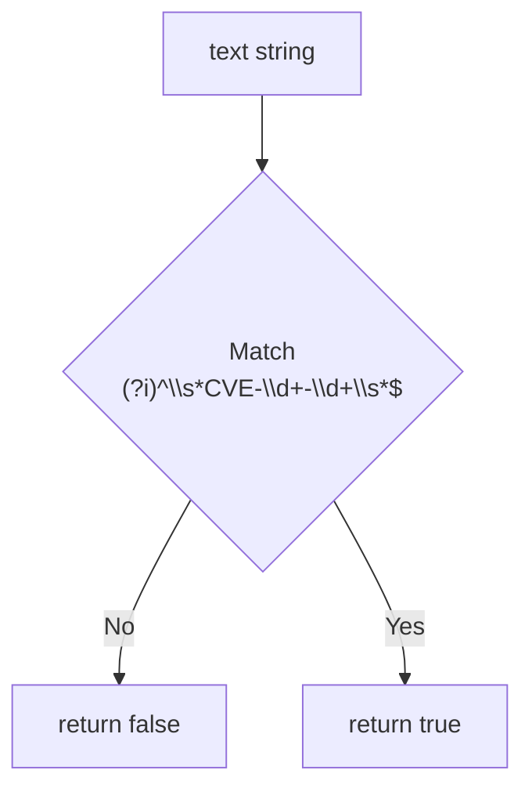

# IsCve

:::tip 📂 View Source
[`base.go:119`](https://github.com/scagogogo/cve-skills/blob/main/base.go#L119-L123) — open the implementation on GitHub (lines L119–L123).
:::

`IsCve` determines whether a string is a valid CVE identifier in the strict `CVE-YYYY-NNNNN` form — the entire string (after allowing surrounding whitespace) must match the CVE pattern.

:::tip 📌 Scenarios
- Validate user input from a form or CLI argument before further processing
- Guard downstream parsing logic (`Split`, `FormatSeq`, `ValidateCve`) against malformed input
- Quick format screening during data import or ETL pipelines
:::

## Function Signature

```go
func IsCve(text string) bool
```

## Parameters

- `text` (string): The string to validate as a CVE identifier

## Return Values

- `bool`: Returns `true` if the entire string matches the CVE format (surrounding whitespace tolerated); returns `false` otherwise

## Behavior

- Matches against the pre-compiled regular expression `(?i)^\s*CVE-\d+-\d+\s*$`
- `(?i)` makes the match case-insensitive — `cve-2022-12345`, `CVE-2022-12345`, and `CvE-2022-12345` are all accepted
- `^\s*` and `\s*$` allow leading/trailing whitespace, so `" CVE-2022-12345 "` is valid
- `\d+-\d+` requires both the year and the sequence to be numeric — `CVE-2022-ABCD` and `CVE-2022-` fail
- The pattern is anchored end-to-end; any extra non-whitespace characters surrounding the CVE cause a `false` result (e.g. `"see CVE-2022-12345 here"` returns `false`)
- Pure format check only — does not validate the year range or sequence value; use `ValidateCve` for full semantic validation

## Flowchart



## Example

```go
package main

import (
	"fmt"

	"github.com/scagogogo/cve-skills"
)

func main() {
	testCases := []struct {
		input    string
		expected bool
		reason   string
	}{
		{"CVE-2022-12345", true, "standard format"},
		{" CVE-2022-12345 ", true, "surrounding whitespace allowed"},
		{"cve-2022-12345", true, "lowercase accepted (case-insensitive)"},
		{"CvE-2022-12345", true, "mixed case accepted"},
		{"CVE-2022-1", true, "single-digit sequence still matches the pattern"},
		{"包含CVE-2022-12345的文本", false, "extra surrounding text"},
		{"CVE-2022-ABCD", false, "sequence is not a number"},
		{"CVE-22-12345", false, "year not a 4-digit number (still matches \\d+, see notes)"},
		{"2022-12345", false, "missing CVE prefix"},
		{"CVE-2022-12345-extra", false, "extra segment after the sequence"},
		{"", false, "empty string"},
	}

	for _, tc := range testCases {
		result := cve.IsCve(tc.input)
		status := "✅"
		if result != tc.expected {
			status = "❌"
		}
		fmt.Printf("%s %-30s -> %t  (%s)\n", status, tc.input, result, tc.reason)
	}

	// Typical guard usage before parsing
	userInput := " CVE-2021-44228 "
	if cve.IsCve(userInput) {
		fmt.Printf("Accepted, standardized form: %s\n", cve.Format(userInput))
	} else {
		fmt.Println("Rejected: not a valid CVE format")
	}
}
```

## Use Cases

- Validate user input from a form, API parameter, or CLI argument
- Guard downstream parsing logic (`Split`, `FormatSeq`, `ExtractCveYear`) against malformed input
- Quick format screening during data import or ETL pipelines
- Pre-filter before the more expensive `ValidateCve` semantic check

## Notes

- `IsCve` is a **format** check only; it does not verify the year is within a sensible range or that the sequence is positive. Use `ValidateCve` for full validation (format + year range + positive sequence)
- `\d+` accepts one or more digits, so technically `CVE-22-12345` matches the regex even though `22` is not a realistic 4-digit year — the year-range check is delegated to `IsCveYearOk` / `ValidateCve`
- Compare with `IsContainsCve`: `IsCve` requires the **entire** string to be the CVE (whitespace aside); `IsContainsCve` only checks whether the string **contains** a CVE anywhere
- The regex is pre-compiled into the package-level `exactCveRegex` variable at init time, so repeated calls are cheap and concurrency-safe
- Surrounding whitespace is tolerated but not normalized — call `Format` if you need the canonical uppercase, trimmed form

## Internal Implementation

The function body is a single line that delegates all work to a pre-compiled regular expression:

- **Single-expression delegation (L121)**: `return exactCveRegex.MatchString(text)` — there is no parsing, trimming, or branching in the function itself. All validation policy lives in the regex pattern, so the function is trivially correct as long as the pattern is correct.
- **Pre-compiled package variable**: `exactCveRegex` is initialized once at package load time (via `regexp.MustCompile`), not recompiled per call. This keeps every `IsCve` call to a single regex match with no allocation overhead for the pattern itself.
- **Concurrency safety**: `*regexp.Regexp` documents its methods as safe for concurrent use, so the shared package-level value is safe to call from many goroutines without a mutex.
- **Anchored, case-insensitive pattern**: the pattern `(?i)^\s*CVE-\d+-\d+\s*$` combines the `(?i)` flag (case-insensitivity), `^...$` anchors (full-string match), and `\s*` padding (whitespace tolerance) into one expression — the comment on L120 ("允许两侧有空白字符，但是不允许有除空白字符以外的其他字符") is enforced entirely by these anchors.
- **No normalization side-effect**: the function only returns a `bool`; it never mutates `text`. Callers needing the canonical form must call `Format` separately, keeping validation and transformation cleanly separated.

## Complexity

| Dimension | Cost | Reason |
|---|---|---|
| Time | O(n) | `MatchString` scans the input string of length n once; the pattern has no backtracking quantifiers |
| Space | O(1) | No allocations proportional to input size; the regex state machine is fixed and reused across calls |
| Per-call setup | O(1) | Pattern is pre-compiled at init time, so each call pays only the match cost |

## Edge Cases

| Input | Behavior | Return |
|---|---|---|
| `""` (empty string) | `\s*` matches empty, but `CVE-\d+-\d+` cannot match nothing | `false` |
| `"   "` (whitespace only) | `\s*` consumes all input, leaving nothing for the CVE body | `false` |
| `" CVE-2022-12345 "` | `^\s*` and `\s*$` absorb the surrounding spaces; body matches | `true` |
| `"cve-2022-12345"` / `"CvE-..."` | `(?i)` makes the prefix case-insensitive | `true` |
| `"CVE-2022-1"` | `\d+` accepts a single-digit sequence | `true` |
| `"CVE-22-12345"` | `\d+` accepts `22` as the year (no 4-digit enforcement) | `true` |
| `"CVE-2022-ABCD"` | `\d+` cannot match `ABCD` | `false` |
| `"CVE-2022-"` | Second `\d+` requires at least one digit | `false` |
| `"see CVE-2022-12345 here"` | `^...$` anchors reject any surrounding non-whitespace text | `false` |
| `"CVE-2022-12345-extra"` | Trailing `-extra` violates `\s*$` | `false` |
| `"2022-12345"` | Missing `CVE-` prefix | `false` |

## Data Flow

```text
+-------------------+
|  text: string     |
|  (caller input)   |
+---------+---------+
          |
          v
+-------------------+    pre-compiled at init time
| exactCveRegex     | <- (?i)^\s*CVE-\d+-\d+\s*$
| (package-level    |
|  *regexp.Regexp)  |
+---------+---------+
          |
          | MatchString(text)
          v
   +------+------+
   | regex scan  |
   | over text   |
   +------+------+
          |
     match?
     /      \
   yes       no
    |         |
    v         v
+-------+ +--------+
| true  | | false  |
+-------+ +--------+
          |
          v
   (caller: use Format
    to normalize before
    further processing)
```

## Related Functions

- [Format](/api/functions/format) — standardize a CVE to uppercase, trimmed form
- [IsContainsCve](/api/functions/is-contains-cve) — check whether text contains a CVE anywhere
- [ValidateCve](/api/functions/validate-cve) — full validation (format + year range + positive sequence)
- [IsCveYearOk](/api/functions/is-cve-year-ok) — check the year is within 1999..current year
- [Split](/api/functions/split) — split a CVE into year and sequence
- [Format & Validate category](/api/format-validate)
