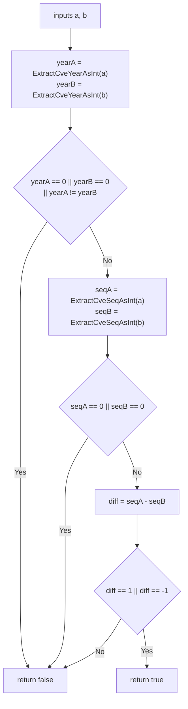

# IsCvesConsecutive

:::tip 📂 View Source
[`generate.go:207`](https://github.com/scagogogo/cve-skills/blob/main/generate.go#L207-L220) — open the implementation on GitHub (lines L207–L220).
:::

`IsCvesConsecutive` checks whether two CVE identifiers are consecutive — that is, they share the same year and their sequence numbers differ by exactly 1.

:::tip 📌 Scenarios
- Decide whether two CVEs can be merged into a single range expression
- Detect continuity in a sorted CVE list to spot adjacent identifiers
- Validate adjacency before building `to` / `..` range strings from pairs
:::

## Function Signature

```go
func IsCvesConsecutive(a, b string) bool
```

## Parameters

- `a` (string): The first CVE identifier
- `b` (string): The second CVE identifier

## Return Values

- `bool`: Returns `true` if both CVEs share the same year and their sequence numbers differ by 1; returns `false` otherwise

## Behavior

- Extracts the year of each CVE via `ExtractCveYearAsInt`; if either year is `0` (unparseable input) or the two years differ, it returns `false`
- Extracts the sequence of each CVE via `ExtractCveSeqAsInt`; if either sequence is `0` (unparseable input), it returns `false`
- Computes `diff := seqA - seqB` and returns `true` only when `diff == 1 || diff == -1` — order of `a` and `b` does not matter
- The check is directional on the sequence difference but symmetric overall: `IsCvesConsecutive(a, b)` equals `IsCvesConsecutive(b, a)`
- Invalid or malformed inputs never panic — they short-circuit to `false`

## Flowchart



## Example

```go
package main

import (
	"fmt"

	"github.com/scagogogo/cve-skills"
)

func main() {
	pairs := []struct {
		a, b     string
		expected bool
		reason   string
	}{
		{"CVE-2022-12345", "CVE-2022-12346", true, "same year, sequence diff = 1"},
		{"CVE-2022-12346", "CVE-2022-12345", true, "order does not matter"},
		{"CVE-2022-12345", "CVE-2022-12347", false, "sequence diff > 1"},
		{"CVE-2022-12345", "CVE-2023-12345", false, "different year"},
		{"CVE-2022-12345", "CVE-2022-12345", false, "identical, diff = 0"},
		{"CVE-2022-12345", "not-a-cve", false, "second input is unparseable"},
		{"", "CVE-2022-12346", false, "first input is empty"},
	}

	for _, p := range pairs {
		result := cve.IsCvesConsecutive(p.a, p.b)
		status := "✅"
		if result != p.expected {
			status = "❌"
		}
		fmt.Printf("%s %-22s %-22s -> %t  (%s)\n", status, p.a, p.b, result, p.reason)
	}

	// Typical usage: decide whether a pair can form a range
	a := "CVE-2022-12345"
	b := "CVE-2022-12346"
	if cve.IsCvesConsecutive(a, b) {
		fmt.Printf("%s and %s are consecutive — can be written as a range\n", a, b)
	}
}
```

## Use Cases

- Decide whether two CVEs can be merged into a single range expression
- Detect continuity in a sorted CVE list to spot adjacent identifiers
- Validate adjacency before building `to` / `..` range strings from pairs

## Notes

- The function only checks **adjacency** (difference of 1), not general ordering — it returns `false` for `CVE-2022-12345` and `CVE-2022-12347` even though they belong to the same year
- Equality is not consecutiveness: `IsCvesConsecutive("CVE-2022-12345", "CVE-2022-12345")` returns `false` (diff is 0)
- It depends on `ExtractCveYearAsInt` and `ExtractCveSeqAsInt`, so inputs that fail extraction (year or sequence `0`) yield `false` rather than an error
- To expand a range of more than two CVEs, use `ParseCveRange` instead — `IsCvesConsecutive` is for the pairwise case

## Internal Implementation

The function body (`generate.go` L207–L220) is a sequence of guard-then-compute steps over the two CVE strings:

- **Year extraction (L208–L209):** Calls `ExtractCveYearAsInt(a)` and `ExtractCveYearAsInt(b)` to parse the year component of each CVE into an `int`. Year is the first guard because a year mismatch already rules out consecutiveness — two CVEs from different years can never be adjacent.
- **Year guard (L210–L212):** Returns `false` if either year is `0` (extraction failed → unparseable input) or the two years differ. This triple condition combines "invalid input" and "different year" into one short-circuit, avoiding wasted sequence extraction.
- **Sequence extraction (L213–L214):** Only when the year guard passes does it call `ExtractCveSeqAsInt(a)` and `ExtractCveSeqAsInt(b)`. Deferring these calls is a minor efficiency: malformed-year inputs never pay the cost of parsing the sequence.
- **Sequence guard (L215–L217):** Returns `false` if either sequence is `0`. This mirrors the year guard and ensures the subsequent subtraction operates on two valid numbers, so `diff` is meaningful.
- **Difference check (L218–L219):** Computes `diff := seqA - seqB` and returns `true` only when `diff == 1 || diff == -1`. Using the signed difference with a two-armed comparison keeps the predicate symmetric — `a` and `b` can be supplied in either order.

The design intent is fail-safe: every malformed or non-adjacent case collapses to a single `false` return with no panics and no error value, making the function safe to call inside filters and sort comparators.

## Complexity

The function delegates parsing to `ExtractCveYearAsInt` / `ExtractCveSeqAsInt`, so its own logic is constant-time; the table below reflects the source-level cost.

| Dimension | Cost | Reason |
|---|---|---|
| Time | O(n) | Each `Extract*AsInt` call scans the CVE string once (length n) to locate and parse the year/sequence fields; at most two scans per argument |
| Space | O(1) | Only a handful of `int` locals (`yearA`, `yearB`, `seqA`, `seqB`, `diff`) are allocated; no slices or maps are constructed |
| Calls | 4 extractions + 1 subtraction | Two year extractions, two sequence extractions, one `int` subtraction — no loops, no sorting |

## Edge Cases

| Input | Behavior | Return |
|---|---|---|
| `("", "CVE-2022-12346")` or any empty string | Year extraction yields `0`, year guard triggers | `false` |
| `("not-a-cve", "CVE-2022-12346")` | Unparseable first argument → year `0` | `false` |
| `("CVE-2022-12345", "CVE-2023-12345")` | Years differ → year guard triggers | `false` |
| `("CVE-2022-12345", "CVE-2022-12345")` | Same year, sequences equal → `diff == 0` | `false` |
| `("CVE-2022-12345", "CVE-2022-12347")` | Same year, `diff == -2` → not ±1 | `false` |
| `("CVE-2022-12345", "CVE-2022-12346")` | Same year, `diff == -1` | `true` |
| `("CVE-2022-12346", "CVE-2022-12345")` | Same year, `diff == 1` (order swapped) | `true` |
| Lowercase `("cve-2022-12345", ...)` | Behavior follows `ExtractCveYearAsInt`; if it accepts lowercase the result stands, otherwise extraction fails and returns `false` | depends on extractor |
| Sequence with leading zeros (`CVE-2022-00001`) | Extractor parses the numeric portion normally; compared as integers | depends on parsed value |

## Data Flow

```text
+----------------------+   +----------------------+
| input a (string)     |   | input b (string)     |
+----------+-----------+   +----------+-----------+
           |                          |
           v                          v
   +-----------------------+   +-----------------------+
   | ExtractCveYearAsInt(a)|   | ExtractCveYearAsInt(b)|
   | -> yearA (int)        |   | -> yearB (int)        |
   +-----------+-----------+   +-----------+-----------+
               |                           |
               +-------------+-------------+
                             |
                             v
              +------------------------------+
              | yearA==0||yearB==0||yearA!=yearB|
              +--------------+---------------+
                  | Yes             | No
                  v                 v
            return false   +----------------------------+
                          | ExtractCveSeqAsInt(a)      |
                          | ExtractCveSeqAsInt(b)      |
                          | -> seqA, seqB (int)        |
                          +-------------+--------------+
                                        |
                                        v
                          +------------------------------+
                          | seqA==0 || seqB==0 ?        |
                          +--------------+---------------+
                              | Yes            | No
                              v                v
                        return false   +----------------------+
                                       | diff := seqA - seqB   |
                                       +----------+-----------+
                                                  |
                                                  v
                                    +-----------------------------+
                                    | diff == 1 || diff == -1 ?  |
                                    +---------+---------+---------+
                                      | Yes          | No
                                      v              v
                                return true    return false
```

## Related Functions

- [ParseCveRange](/api/functions/parse-cve-range) — expand a range expression into all CVEs in the interval
- [ExtractCveYearAsInt](/api/functions/extract-cve-year-as-int) — extract the year of a CVE as an integer
- [ExtractCveSeqAsInt](/api/functions/extract-cve-seq-as-int) — extract the sequence of a CVE as an integer
- [IsCve](/api/functions/is-cve) — validate whether a string is a well-formed CVE
- [Range & Pattern category](/api/range-pattern)
```
