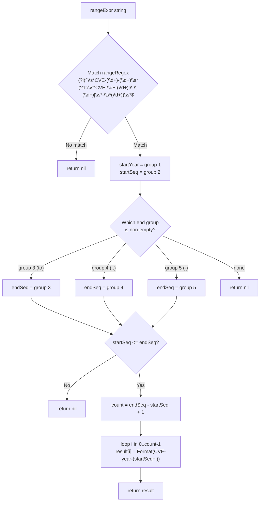

# ParseCveRange

:::tip 📂 View Source
[`generate.go:143`](https://github.com/scagogogo/cve-skills/blob/main/generate.go#L143-L180) — open the implementation on GitHub (lines L143–L180).
:::

`ParseCveRange` parses a CVE range expression and returns every CVE identifier within that range as a slice.

:::tip 📌 Scenarios
- Expand a CVE range written in a security advisory into an explicit list for batch processing
- Normalize the various range notations (`to`, `..`, `-`) found across different data sources into one canonical list
- Build a contiguous CVE dataset for scanning, deduplication, or reporting
:::

## Function Signature

```go
func ParseCveRange(rangeExpr string) []string
```

## Parameters

- `rangeExpr` (string): The CVE range expression to parse. Supports three notations: `CVE-YYYY-NNNNN to CVE-YYYY-NNNNN`, `CVE-YYYY-NNNNN..NNNNN`, and `CVE-YYYY-NNNNN-NNNNN`

## Return Values

- `[]string`: A slice of all CVE identifiers in the closed range `[start, end]`, each in the standardized uppercase form. Returns `nil` when the expression does not match any supported notation or when the range is invalid

## Behavior

- Matching is driven by the pre-compiled `rangeRegex`: `(?i)^\s*CVE-(\d+)-(\d+)\s*(?:to\s*CVE-\d+-(\d+)|\.\.(\d+)|\s*-\s*(\d+))\s*$`
- `(?i)` makes the match case-insensitive, and surrounding whitespace is tolerated
- The year is taken from the **start** segment only — the start and end are expected to be in the same year; the end segment's year is not validated against the start
- The end sequence number is read from whichever alternative matched: the `to` group, the `..` group, or the `-` group
- If `startSeq > endSeq`, the range is invalid and the function returns `nil`
- The range is a **closed interval** — both the start and end CVEs are included, producing `endSeq - startSeq + 1` entries
- Each generated CVE is passed through `Format`, so the result is always uppercase and trimmed

## Flowchart



## Example

```go
package main

import (
	"fmt"

	"github.com/scagogogo/cve-skills"
)

func main() {
	// 1) "to" notation — closed interval, both ends included
	cves1 := cve.ParseCveRange("CVE-2022-12345 to CVE-2022-12350")
	fmt.Printf("to notation  -> %v (len=%d)\n", cves1, len(cves1))
	// Output: [CVE-2022-12345 CVE-2022-12346 CVE-2022-12347 CVE-2022-12348 CVE-2022-12349 CVE-2022-12350] (len=6)

	// 2) Double-dot notation — end is just the sequence number
	cves2 := cve.ParseCveRange("CVE-2022-12345..12347")
	fmt.Printf("dot notation -> %v (len=%d)\n", cves2, len(cves2))
	// Output: [CVE-2022-12345 CVE-2022-12346 CVE-2022-12347] (len=3)

	// 3) Dash notation — end is just the sequence number
	cves3 := cve.ParseCveRange("CVE-2022-12345-12347")
	fmt.Printf("dash notation-> %v (len=%d)\n", cves3, len(cves3))
	// Output: [CVE-2022-12345 CVE-2022-12346 CVE-2022-12347] (len=3)

	// 4) Single-element range — start equals end, returns one entry
	cves4 := cve.ParseCveRange("CVE-2022-12345 to CVE-2022-12345")
	fmt.Printf("single range -> %v (len=%d)\n", cves4, len(cves4))
	// Output: [CVE-2022-12345] (len=1)

	// 5) Invalid: startSeq > endSeq -> nil
	cves5 := cve.ParseCveRange("CVE-2022-12350 to CVE-2022-12345")
	fmt.Printf("reversed     -> %v (len=%d)\n", cves5, len(cves5))
	// Output: [] (len=0)

	// 6) Invalid: unsupported notation -> nil
	cves6 := cve.ParseCveRange("CVE-2022-12345~12347")
	fmt.Printf("bad notation -> %v (len=%d)\n", cves6, len(cves6))
	// Output: [] (len=0)

	// 7) Case-insensitive, surrounding whitespace tolerated
	cves7 := cve.ParseCveRange("  cve-2022-1000 to CVE-2022-1003  ")
	fmt.Printf("lenient fmt  -> %v (len=%d)\n", cves7, len(cves7))
	// Output: [CVE-2022-1000 CVE-2022-1001 CVE-2022-1002 CVE-2022-1003] (len=4)
}
```

## Use Cases

- Expand a CVE range from a security advisory into an explicit list for batch validation or scanning
- Normalize heterogeneous range notations (`to` / `..` / `-`) from multiple data feeds into one canonical slice
- Build a contiguous CVE dataset for deduplication, gap detection, or reporting
- Pre-materialize a range before passing each entry to `ValidateCve` for full semantic checks

## Notes

- The returned slice uses the **closed interval** — both endpoints are included, so the length is `endSeq - startSeq + 1`
- Only the start year is captured and reused; the function does **not** verify that the `to` notation's end year matches the start year. Always supply the same year on both sides of a `to` expression
- The dash notation `CVE-YYYY-NNNNN-NNNNN` is ambiguous with a single CVE that has extra segments — `rangeRegex` resolves this by requiring the trailing group to be purely numeric, but be careful when the input source is ambiguous
- Returns `nil` (not an empty non-nil slice) on any failure: no regex match, no end group matched, a non-numeric end group, or `startSeq > endSeq`. A `nil` return therefore has length 0 but is distinct from a successfully parsed single-element slice
- Large ranges (e.g. spanning tens of thousands of sequence numbers) will allocate a proportionally large slice — validate the bound before parsing untrusted input
- For checking whether two CVEs are adjacent rather than expanding a full range, use `IsCvesConsecutive`

## Internal Implementation

The function is a single-pass, allocation-bounded parser built on top of the pre-compiled `rangeRegex`. The design intent is to accept three notations through one regex rather than three separate parsers, then materialize the closed range in one pre-sized slice.

- **Regex dispatch (L144).** `matches := rangeRegex.FindStringSubmatch(rangeExpr)` runs the anchored pattern `(?i)^\s*CVE-(\d+)-(\d+)\s*(?:to\s*CVE-\d+-(\d+)|\.\.(\d+)|\s*-\s*(\d+))\s*$` once. The alternation `(?:to…|…|…)` captures the end sequence into exactly one of groups 3/4/5, so the three notations collapse into "whichever group is non-empty". `FindStringSubmatch` returns `nil` on no match, which is the first bail-out at L145-147.
- **Start segment parsing (L150-154).** `startYear` is kept as the raw string from group 1, while `startSeq` is parsed with `strconv.Atoi(matches[2])`. A parse error (e.g. overflow on an absurdly long digit run) returns `nil` rather than panicking.
- **End segment selection (L157-167).** A `switch` with three `case` arms checks `matches[3]`, `matches[4]`, `matches[5]` in order and assigns `endSeq` from the first non-empty group. The `default` arm returns `nil` — this is the guard against a structurally-matched expression where, defensively, no end group populated (the regex makes this unreachable in practice, but it keeps the compiler satisfied about `endSeq` being defined).
- **Bound validation (L168-170).** A single consolidated check `if err != nil || startSeq > endSeq { return nil }` rejects both a non-numeric end group and a reversed range. Note the year of the end segment is never compared to `startYear` — the `to` notation's end year is captured by the regex but discarded.
- **Materialization (L172-178).** `count := endSeq - startSeq + 1` pre-sizes the slice with `make([]string, count)`, then the loop writes `result[i] = Format(fmt.Sprintf("CVE-%d-%d", year, startSeq+i))` for `i` in `0..count-1`. Because `year` is re-derived from `strconv.Atoi(startYear)` once (L174) and the format string is rebuilt per iteration, every entry passes through `Format` for canonical uppercase/trimmed output. There is no `sort` step and no map/dedup — the closed interval is already monotonic by construction.

## Complexity

| Dimension | Cost | Driver |
|---|---|---|
| Time (regex) | O(n) | `FindStringSubmatch` scans the input once against `rangeRegex`; n = `len(rangeExpr)` |
| Time (parse) | O(1) | Two `strconv.Atoi` calls on the captured digit groups |
| Time (build) | O(count) | One loop of `count = endSeq - startSeq + 1` iterations, each doing a `Sprintf` + `Format` |
| Time (total) | O(n + count) | Linear in input length plus output size |
| Space | O(count) | `make([]string, count)` plus the `[]string` returned; the match slice is O(1) groups and short-lived |
| Allocations | count + overhead | One backing slice plus one transient string per iteration (the `Sprintf` intermediate before `Format`) |

Because there is no `sort` and no map, the asymptotic floor is set purely by the output size — a range of `k` entries costs O(k) time and space.

## Edge Cases

| Input | Behavior | Return |
|---|---|---|
| `""` (empty) | Regex anchored with `^\s*…\s*$` does not match an empty/whitespace-only string | `nil` |
| `"CVE-2022-12345~12347"` | `~` is none of `to` / `..` / `-`; no alternation matches | `nil` |
| `"CVE-2022-12350 to CVE-2022-12345"` | Both groups parse, but `startSeq (12350) > endSeq (12345)` | `nil` |
| `"cve-2022-1000 to cve-2022-1003"` | `(?i)` makes the match case-insensitive; output re-uppercased via `Format` | `[CVE-2022-1000 … CVE-2022-1003]` (4 items) |
| `"  CVE-2022-1000 to CVE-2022-1002  "` | Leading/trailing whitespace tolerated by `\s*` | `[CVE-2022-1000 CVE-2022-1001 CVE-2022-1002]` (3 items) |
| `"CVE-2022-12345 to CVE-2022-12345"` | Closed interval with `startSeq == endSeq`, `count = 1` | `[CVE-2022-12345]` (1 item) |
| `"CVE-2022-12345..12347"` | `..` group (4) matches; end year implicit from start | `[CVE-2022-12345 CVE-2022-12346 CVE-2022-12347]` |
| `"CVE-2022-12345-12347"` | `-` group (5) matches; ambiguous with a multi-segment single CVE but resolved by the trailing-numeric requirement | `[CVE-2022-12345 CVE-2022-12346 CVE-2022-12347]` |
| `"CVE-2022-12345 to CVE-2023-12347"` (cross-year) | End year (2023) is captured by the regex but **ignored**; only `startYear` (2022) is used | `[CVE-2022-12345 … CVE-2022-12347]` (all stamped 2022) |
| Very large span (e.g. `1..99999999`) | `count` becomes huge; `make` allocates proportionally and may exhaust memory | `[]string` of `count` items, or OOM |

## Data Flow

```text
+--------------------------+
| rangeExpr (string)       |
|  e.g. "CVE-2022-1000     |
|        to CVE-2022-1003" |
+-----------+--------------+
            |
            v
+--------------------------+        no match
| rangeRegex.FindStringSub |-------------------> return nil
| match (groups 1..5)      |
+-----------+--------------+
            | match ok
            v
+--------------------------+
| startYear = group 1      |
| startSeq  = Atoi(group2) |   err -> return nil
+-----------+--------------+
            |
            v
+--------------------------+
| switch on first non-empty|   none  -> return nil
| of groups 3 / 4 / 5      |
| -> endSeq                |
+-----------+--------------+
            |
            v
+--------------------------+
| check: err || startSeq > |   bad   -> return nil
| endSeq                   |
+-----------+--------------+
            | ok
            v
+--------------------------+
| count = endSeq-startSeq+1|
| result = make([]string,  |
|            count)        |
+-----------+--------------+
            |
            v
+--------------------------+
| for i in 0..count-1:     |
|   result[i] =            |
|     Format(Sprintf(      |
|       "CVE-%d-%d",       |
|        year, startSeq+i))|
+-----------+--------------+
            |
            v
+--------------------------+
| return result            |
|  [CVE-2022-1000,         |
|   CVE-2022-1001,         |
|   CVE-2022-1002,         |
|   CVE-2022-1003]         |
+--------------------------+
```

## Related Functions

- [Format](/api/functions/format) — standardize each generated CVE to uppercase, trimmed form
- [GenerateCve](/api/functions/generate-cve) — build a single CVE from a year and sequence
- [IsCvesConsecutive](/api/functions/is-cves-consecutive) — check whether two CVEs are adjacent within the same year
- [ExtractCveSeqAsInt](/api/functions/extract-cve-seq-as-int) — extract the sequence number as an integer
- [Range & Pattern category](/api/range-pattern)
