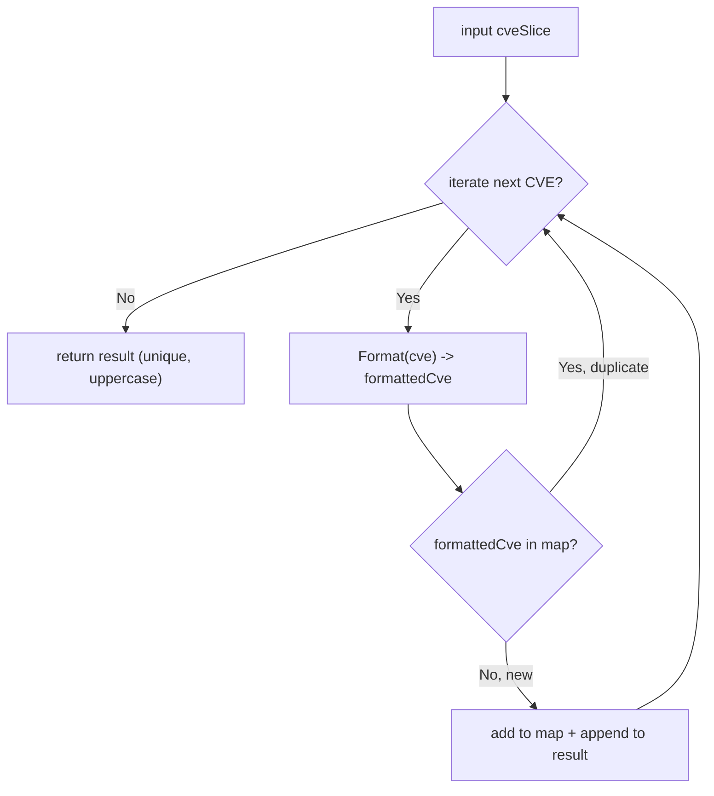

# RemoveDuplicateCves

:::tip 📂 View Source
[`filter.go:401`](https://github.com/scagogogo/cve-skills/blob/main/filter.go#L401-L415) — open the implementation on GitHub (lines L401–L415).
:::

`RemoveDuplicateCves` removes duplicate CVE identifiers from a slice, keeping only the unique CVE numbers — the comparison is case-insensitive and every returned CVE is in the standardized uppercase form.

:::tip 📌 Scenarios
- Merge CVE lists coming from multiple sources (scanner, advisory, ticket) and deduplicate them
- Pre-process large CVE datasets before aggregation, statistics, or reporting
- Normalize mixed-case input (`cve-2022-1111` vs `CVE-2022-1111`) into a single canonical, duplicate-free list
:::

## Function Signature

```go
func RemoveDuplicateCves(cveSlice []string) []string
```

## Parameters

- `cveSlice` ([]string): A slice of CVE identifiers that may contain duplicates

## Return Values

- []string: A deduplicated slice of CVE identifiers, all in the standardized format (uppercase)

## Behavior

- Comparison is case-insensitive: `CVE-2022-1111` and `cve-2022-1111` are treated as duplicates
- Only the first occurrence of each CVE is kept; later duplicates are dropped
- Every returned CVE is passed through `Format`, so the output is uniformly uppercase (and trimmed)
- A `map[string]struct{}` tracks seen normalized forms — lookups are O(1), giving O(n) overall time
- An empty or nil input yields a non-nil empty slice-friendly accumulation (the `result` slice stays empty, no panic)

## Flowchart



## Example

```go
package main

import (
	"fmt"

	"github.com/scagogogo/cve-skills"
)

func main() {
	// Source example from filter.go:
	//   input:  ["CVE-2022-1111", "cve-2022-1111", "CVE-2022-2222"]
	//   output: ["CVE-2022-1111", "CVE-2022-2222"]
	cveList := []string{"CVE-2022-1111", "cve-2022-1111", "CVE-2022-2222"}
	uniqueCves := cve.RemoveDuplicateCves(cveList)
	// uniqueCves is ["CVE-2022-1111", "CVE-2022-2222"]
	fmt.Println(uniqueCves)

	// All-duplicates case from filter.go:
	//   input:  ["CVE-2022-1111", "CVE-2022-1111", "CVE-2022-1111"]
	//   output: ["CVE-2022-1111"]
	allDup := []string{"CVE-2022-1111", "CVE-2022-1111", "CVE-2022-1111"}
	fmt.Println(cve.RemoveDuplicateCves(allDup))
	// -> [CVE-2022-1111]

	// Mixed case + order: only the first occurrence is kept, output is uppercase
	mixed := []string{"cve-2021-44228", "CVE-2021-44228", "CvE-2021-44228", "CVE-2022-12345"}
	fmt.Println(cve.RemoveDuplicateCves(mixed))
	// -> [CVE-2021-44228 CVE-2022-12345]

	// Merging multiple sources before reporting
	scanner := []string{"CVE-2022-1111", "cve-2022-3333"}
	advisory := []string{"CVE-2022-2222", "cve-2022-1111"}
	merged := append(scanner, advisory...)
	fmt.Println(cve.RemoveDuplicateCves(merged))
	// -> [CVE-2022-1111 CVE-2022-3333 CVE-2022-2222]
}
```

## Use Cases

- Merge CVE lists from multiple sources (scanner output, security advisories, internal tickets) and deduplicate them
- Pre-process large CVE datasets before aggregation, statistics, or reporting
- Normalize mixed-case input into a single canonical, duplicate-free list before further filtering

## Notes

- Deduplication is **case-insensitive** because each CVE is normalized via `Format` before the map lookup — `cve-2022-1111` and `CVE-2022-1111` collapse to one entry
- The **first occurrence** wins; subsequent duplicates are silently dropped, so the relative order of first appearances is preserved
- Time complexity is O(n) where n is the slice length; space complexity is O(n) for the seen-set and result slice
- The output is always uppercase because `Format` uppercases the result — pair with `SortCves` if you also need sorted output
- This function does **not** sort the result; for sorted, unique output use the set-operation helpers that combine dedup with sorting
- Invalid CVE strings are not filtered out here — they are passed through `Format` and deduplicated like any other entry; validate first with `ValidateCves` if you need to drop malformed input

## Internal Implementation

The function is a compact single-pass deduplication loop backed by a map-based seen-set. Key code points (see [`filter.go:401`](https://github.com/scagogogo/cve-skills/blob/main/filter.go#L401-L415)):

- **Seen-set allocation** (`cveMap := make(map[string]struct{})`, L402): a `map[string]struct{}` records every normalized CVE already emitted. `struct{}` carries zero storage cost, so the map is purely a presence set — the natural Go idiom for O(1) membership tests without the memory overhead of a `map[string]bool`.
- **Result accumulator** (`var result []string`, L403): a nil slice that grows via `append`. Because the only writes happen when a CVE is new, `result` ends up with exactly one entry per unique CVE in first-occurrence order — no post-hoc compaction is needed.
- **Normalization at the boundary** (`formattedCve := Format(cve)`, L406): every CVE is routed through `Format` *before* the map lookup. This is what makes deduplication case-insensitive — `cve-2022-1111`, `CvE-2022-1111`, and `CVE-2022-1111` all collapse to the same map key `CVE-2022-1111`, so they are correctly treated as one entry.
- **Lookup-then-insert** (`if _, exists := cveMap[formattedCve]; !exists`, L407): the comma-ok idiom checks presence first; only on a miss does the function write to the map (`cveMap[formattedCve] = struct{}{}`, L408) and append the formatted form to `result` (L409). On a hit the loop body is a no-op, so later duplicates are silently dropped.
- **Order preservation**: because iteration is in input order and the only writes are first-occurrence writes, the returned slice preserves the relative order of first appearances. Note the function does **not** call `sort.Slice` — for sorted output, pair it with `SortCves`.

## Complexity

| Dimension | Bound | Reasoning (from the source comment) |
|---|---|---|
| Time | O(n) | One linear scan over the n-element `cveSlice`; each iteration does one `Format` call and one amortized O(1) map lookup/insert. |
| Space | O(n) | Worst case (all entries unique) the `cveMap` seen-set and the `result` slice each hold n entries. |
| Auxiliary | O(n) | Both the seen-set and the result slice scale with the number of *unique* inputs (≤ n). |

The source comment on L388-L390 documents exactly these bounds: `O(n)` time, `O(n)` space.

## Edge Cases

| Input | Behavior | Return |
|---|---|---|
| `nil` slice | Loop body never executes; `result` stays nil | `[]string{}` (nil, len 0) |
| Empty slice `[]string{}` | Zero iterations | `[]string{}` (nil, len 0) |
| All unique, single case `["CVE-2022-1111", "CVE-2022-2222"]` | Every CVE is a miss → all appended | `["CVE-2022-1111", "CVE-2022-2222"]` (order preserved) |
| All duplicates `["CVE-2022-1111", "CVE-2022-1111", "CVE-2022-1111"]` | First appended, rest are map hits → dropped | `["CVE-2022-1111"]` |
| Mixed case duplicates `["cve-2022-1111", "CVE-2022-1111"]` | Both `Format` to `CVE-2022-1111`; second is a hit | `["CVE-2022-1111"]` (uppercase, first form normalized) |
| Invalid string `"not-a-cve"` | Passed through `Format` unchanged-ish, deduplicated like any other entry | Whatever `Format` yields, deduplicated |
| Leading/trailing whitespace `" CVE-2022-1111 "` | `Format` trims before lookup | `["CVE-2022-1111"]` |

## Data Flow

```text
+--------------------------+      +---------------------------+
| input cveSlice []string  |      | cveMap map[string]struct{}|
| e.g. ["CVE-2022-1111",   |      | (seen-set, starts empty)  |
|       "cve-2022-1111",   |      +---------------------------+
|       "CVE-2022-2222"]   |                  ^
+-----------+--------------+                  |
            |                                 |
            v                                 |
   +-------------------+                      |
   | for each cve in   |                      |
   |     cveSlice      |                      |
   +---------+---------+                      |
             |                                 |
             v                                 |
   +-------------------+                      |
   | Format(cve)       |   "cve-2022-1111"    |
   | -> formattedCve   |.---> "CVE-2022-1111" |
   +---------+---------+                      |
             |                                 |
             v                                 |
   +---------------------------+               |
   | formattedCve in cveMap ?  |               |
   +-----+---------------+-----+               |
         |               |                     |
    yes  |               | no (new)            |
         v               v                     |
   +-----------+   +-----------------------+   |
   | drop, go  |   | cveMap[fmt]=struct{} |---+
   | to next   |   | result=append(result,|
   +-----------+   |              fmt)    |
                   +-----------+-----------+
                               |
                               v
                   +-------------------------+
                   | return result []string  |
                   | (unique, uppercase,     |
                   |  first-occurrence order)|
                   +-------------------------+
```

## Related Functions

- [Format](/api/functions/format) — standardize a single CVE to uppercase, trimmed form (used internally)
- [ValidateCves](/api/functions/validate-cves) — filter out invalid CVE entries before deduplication
- [SortCves](/api/functions/sort-cves) — sort CVEs in ascending order
- [Set-Operations category](/api/set-operations)
