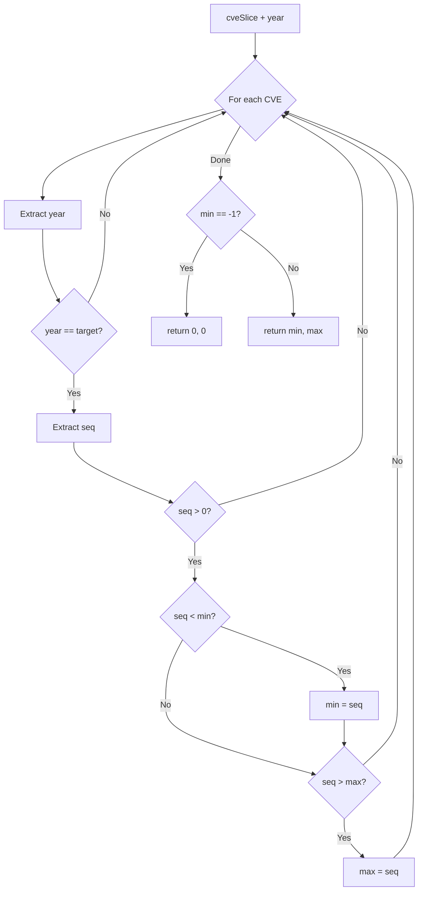

# SeqRange

:::tip 📂 View Source
[`filter.go:532`](https://github.com/scagogogo/cve-skills/blob/main/filter.go#L532-L555) — open the implementation on GitHub (lines L532–L555).
:::

`SeqRange` returns the minimum and maximum sequence numbers among CVEs that belong to a specified year — useful for understanding the allocation range of CVE IDs within a given year.

:::tip 📌 Scenarios
- Understand the allocation range of CVE sequence numbers for a given year
- Provide auxiliary information for estimating CVE density
- Summarize the span of assigned IDs in a year-end security report
:::

## Function Signature

```go
func SeqRange(cveSlice []string, year int) (min, max int)
```

## Parameters

- `cveSlice` ([]string): The CVE ID array to inspect
- `year` (int): The target year, e.g. `2022`

## Return Values

- `min` (int): The minimum sequence number for that year; returns `0` if no matching CVE is found
- `max` (int): The maximum sequence number for that year; returns `0` if no matching CVE is found

## Behavior

- Iterates over `cveSlice` and keeps only CVEs whose year (extracted via `ExtractCveYearAsInt`) equals the target `year`
- For each matching CVE, extracts the sequence number via `ExtractCveSeqAsInt`; entries with a sequence `<= 0` are skipped
- Tracks the smallest and largest valid sequence numbers encountered
- `min` is initialized to `-1` as a sentinel; if no valid sequence is found, both `min` and `max` are returned as `0`
- Input case and surrounding whitespace are handled by the underlying extractors — `cve-2022-1111` and `" CVE-2022-1111 "` are treated the same as `CVE-2022-1111`

## Flowchart



## Example

```go
package main

import (
	"fmt"

	"github.com/scagogogo/cve-skills"
)

func main() {
	// Source example 1: mixed years, returns the seq range for 2022
	list1 := []string{"CVE-2022-1111", "CVE-2022-5555", "CVE-2022-3333", "CVE-2021-9999"}
	minSeq, maxSeq := cve.SeqRange(list1, 2022)
	fmt.Printf("2022 seq range: min=%d, max=%d\n", minSeq, maxSeq)
	// Output: 2022 seq range: min=1111, max=5555

	// Source example 2: no CVE matches the target year, returns 0, 0
	list2 := []string{"CVE-2022-1111"}
	minSeq2, maxSeq2 := cve.SeqRange(list2, 2023)
	fmt.Printf("2023 seq range: min=%d, max=%d\n", minSeq2, maxSeq2)
	// Output: 2023 seq range: min=0, max=0

	// Case-insensitive and whitespace-tolerant input
	list3 := []string{"cve-2022-2222", " CVE-2022-8888 ", "CVE-2022-1"}
	minSeq3, maxSeq3 := cve.SeqRange(list3, 2022)
	fmt.Printf("2022 seq range (mixed case/whitespace): min=%d, max=%d\n", minSeq3, maxSeq3)
	// Output: 2022 seq range (mixed case/whitespace): min=1, max=8888

	// Empty input returns 0, 0
	minSeq4, maxSeq4 := cve.SeqRange([]string{}, 2022)
	fmt.Printf("empty input: min=%d, max=%d\n", minSeq4, maxSeq4)
	// Output: empty input: min=0, max=0
}
```

## Use Cases

- Understand the sequence-number allocation range for CVEs of a given year
- Provide auxiliary information for estimating CVE density within a year
- Summarize the span of assigned CVE IDs in a year-end security report

## Notes

- The return value `0, 0` is ambiguous: it can mean either "no matching CVE" or "an empty input slice" — distinguish by checking the slice length first if needed
- Only CVEs whose extracted year **exactly equals** `year` are considered; CVEs from other years are silently skipped
- Entries with a non-positive sequence (`<= 0`) are skipped, so malformed IDs never distort the range
- The function does **not** count how many CVEs fall in the range — use `CountByYear` for counts, or `YearRange` for the year-level min/max across the whole slice
- This is a read-only inspection; it does not sort, deduplicate, or format the input

## Internal Implementation

- **Sentinel initialization**: `min` is set to `-1` (line 533) as a sentinel meaning "no valid sequence seen yet"; `max` defaults to `0` via the named return. This pair lets the function detect the "nothing matched" case without an extra boolean flag.
- **Single linear pass**: the `for _, cve := range cveSlice` loop (line 534) walks the slice once. Year filtering happens first via `ExtractCveYearAsInt` (line 535) with an early `continue` on mismatch (lines 536–538), so non-matching years are skipped before any sequence work.
- **Defensive sequence guard**: `ExtractCveSeqAsInt` (line 539) extracts the sequence, and entries with `seq <= 0` are skipped (lines 540–542). This prevents malformed or zero/negative sequence numbers from corrupting the range.
- **Inline min/max tracking**: the first valid sequence replaces the `-1` sentinel (`min == -1 || seq < min`, lines 543–545); subsequent values update `max` only when larger (lines 546–548). Both comparisons run in the same pass — no separate sort or second scan.
- **Sentinel resolution**: after the loop, if `min` is still `-1` (line 551) the function returns `0, 0` (line 552), normalizing the "no match" output; otherwise it returns the tracked `min, max` (line 554).

## Complexity

| Dimension | Complexity | Rationale |
|---|---|---|
| Time | O(n) | Single pass over the slice; each element does constant-time year/sequence extraction and comparisons |
| Space | O(1) | Only `min`, `max`, and loop-local `cveYear`/`seq` scalars are allocated — no extra collections |
| Per-element work | O(1) amortized | `ExtractCveYearAsInt` and `ExtractCveSeqAsInt` each scan a fixed-length CVE string |

- The function deliberately avoids sorting (which would be O(n log n)) because the min/max can be tracked during iteration.
- When the slice contains CVEs from many years, the effective work on non-matching entries is still O(1) each — the year check short-circuits before sequence extraction is meaningful.

## Edge Cases

| Input | Behavior | Return |
|---|---|---|
| Empty slice `[]string{}` | Loop body never runs; `min` stays `-1` | `0, 0` |
| No CVE matches the target year | All entries hit `continue` at the year check | `0, 0` |
| Matching CVEs but all sequences `<= 0` | Each is skipped at the sequence guard | `0, 0` |
| Single matching CVE | It becomes both `min` and `max` | `seq, seq` |
| Duplicate sequence numbers | Duplicates update neither bound (not `< min`, not `> max`) | unchanged range |
| Lowercase `cve-2022-1111` | `ExtractCveYearAsInt`/`ExtractCveSeqAsInt` normalize case | treated as `CVE-2022-1111` |
| Leading/trailing whitespace `" CVE-2022-1111 "` | Underlying extractors trim whitespace | treated as `CVE-2022-1111` |
| Negative or zero year argument | No `cveYear` will equal it | `0, 0` |

## Data Flow

```text
+---------------------------+      +-----------------------------+
| Input: cveSlice []string  |      | Input: year int             |
| e.g. CVE-2022-1111, ...   |      | e.g. 2022                   |
+---------------------------+      +-----------------------------+
              |                                  |
              v                                  v
       +------+------------------------------------+
       | for each cve in cveSlice                |
       |   cveYear = ExtractCveYearAsInt(cve)    |
       +-------------------+---------------------+
                           |
                           v
                +----------+----------+
                | cveYear == year ?   |
                +----------+----------+
                  | No             | Yes
                  v                v
              continue   +-----------------------+
                         | seq = ExtractCveSeqAsInt(cve)
                         +-----------+-----------+
                                     |
                                     v
                          +----------+----------+
                          | seq > 0 ?           |
                          +----------+----------+
                            | No             | Yes
                            v                v
                        continue   +-----------------------+
                                   | if min==-1 or seq<min |
                                   |     min = seq         |
                                   | if seq > max          |
                                   |     max = seq         |
                                   +-----------+-----------+
                                               |
                                               v
                                    (loop back to next cve)
                                               |
                                               v
                                  +------------+------------+
                                  | min == -1 ?             |
                                  +------------+------------+
                                    | Yes            | No
                                    v                v
                              return 0, 0      return min, max
```

## Related Functions

- [YearRange](/api/functions/year-range) — get the earliest and latest years across a CVE list
- [CountByYear](/api/functions/count-by-year) — count CVEs per year
- [ExtractCveYearAsInt](/api/functions/extract-cve-year-as-int) — extract the year as an integer
- [ExtractCveSeqAsInt](/api/functions/extract-cve-seq-as-int) — extract the sequence number as an integer
- [Statistics category](/api/statistics)
