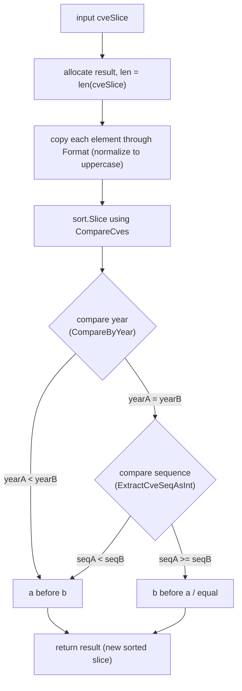

# SortCves

:::tip 📂 View Source
[`compare.go:165`](https://github.com/scagogogo/cve-skills/blob/main/compare.go#L165-L176) — open the implementation on GitHub (lines L165–L176).
:::

`SortCves` sorts a slice of CVE identifiers by year and sequence number, normalizing each to the canonical uppercase form, and returns a brand-new sorted slice.

:::tip 📌 Scenarios
- Display or process a batch of CVEs in chronological order (earliest first)
- Sort CVEs when generating vulnerability reports so they read in release order
- Deduplicate-by-order pipelines where a stable, canonical ordering is required
:::

## Function Signature

```go
func SortCves(cveSlice []string) []string
```

## Parameters

- `cveSlice` ([]string): The slice of CVE identifiers to be sorted

## Return Values

- []string: A new slice of CVE identifiers sorted by year then sequence, every element normalized to the canonical format (uppercase)

## Behavior

- Allocates a new `result` slice with the same length as the input and copies each element through `Format`, so every CVE is uppercased/normalized before comparison — the original input slice is never mutated
- Uses `sort.Slice` with `CompareCves` as the less-than predicate: first compares the year (via `CompareByYear`), and when years are equal compares the sequence number (via `ExtractCveSeqAsInt`)
- Sort order is ascending — earlier years come first, and within the same year smaller sequence numbers come first
- Invalid CVE inputs are not rejected: `Format` and the extractors treat unparseable CVEs as year `0` / sequence `0`, so malformed entries bubble to the front of the sorted result
- The returned slice is independent of the input; callers can safely modify either after the call

## Flowchart



## Example

```go
package main

import (
	"fmt"

	"github.com/scagogogo/cve-skills"
)

func main() {
	// Case 1: mixed years and sequences, output ordered by year then sequence
	cveList := []string{"CVE-2022-2222", "cve-2020-1111", "CVE-2022-1111"}
	sortedList := cve.SortCves(cveList)
	// sortedList -> ["CVE-2020-1111", "CVE-2022-1111", "CVE-2022-2222"]
	fmt.Println(sortedList)

	// Case 2: lowercase input is normalized to uppercase
	lowerList := []string{"cve-2022-2222", "CVE-2022-1111"}
	fmt.Println(cve.SortCves(lowerList))
	// output -> ["CVE-2022-1111", "CVE-2022-2222"]

	// Case 3: the original slice is not mutated
	original := []string{"CVE-2022-3333", "CVE-2020-0001"}
	_ = cve.SortCves(original)
	fmt.Println(original) // still ["CVE-2022-3333", "CVE-2020-0001"]

	// Case 4: invalid CVEs sort as year 0 / sequence 0 and land at the front
	mixed := []string{"CVE-2022-1111", "not-a-cve", "CVE-2020-1111"}
	fmt.Println(cve.SortCves(mixed))
	// "not-a-cve" is treated as year 0 / seq 0 -> sorts before valid CVEs
}
```

## Use Cases

- Display a batch of CVEs in chronological order (earliest first)
- Sort CVEs by release order when generating vulnerability reports
- Normalize a heterogeneous CVE list (mixed case) into a canonical, ordered dataset
- Pre-sort before range/group operations that benefit from a stable ordering

## Notes

- ⚠️ The return value is a **new** slice; the input slice is never modified in place
- ⚠️ Invalid CVE formats are not filtered out — they are normalized via `Format` and compared using extracted year/sequence defaults of `0`, so they tend to collect at the front of the sorted output. Pre-filter with `IsCve` / `ValidateCve` if you need only valid CVEs
- ✅ Time complexity is O(n log n) from `sort.Slice`; space complexity is O(n) because a new slice is allocated
- 🔍 Sorting uses `CompareCves`, which compares **year first, then sequence** — this matches the natural release-order ordering of CVE identifiers
- 📊 For comparing only two CVEs without sorting, call [CompareCves](/api/functions/compare-cves) directly; for a pure year comparison use [CompareByYear](/api/functions/compare-by-year)

## Internal Implementation

The function body (`compare.go:165-176`) is intentionally small and delegates the heavy lifting to two helpers:

- **Allocate a fresh result slice** (L166): `result := make([]string, len(cveSlice))` creates a new slice with the same length as the input. This is the foundation of the "never mutate the input" guarantee — every subsequent write goes to `result`, never back to `cveSlice`.
- **Normalize while copying** (L167-169): the `for i, cve := range cveSlice` loop writes `Format(cve)` into `result[i]`. Calling `Format` here means the comparison step never sees raw, mixed-case, or whitespace-padded input — ordering is always over the canonical uppercase form, so `cve-2022-1111` and `CVE-2022-1111` are guaranteed to compare equal rather than relying on string byte order.
- **Sort with a comparator** (L171-173): `sort.Slice(result, func(i, j int) bool { return CompareCves(result[i], result[j]) < 0 })` reorders `result` in place. The closure delegates to `CompareCves`, which itself delegates to `CompareByYear` and then `ExtractCveSeqAsInt` — so the sort key is (year, sequence), not lexicographic string order. Using `< 0` (rather than `<= 0`) makes the predicate a strict less-than, which is what `sort.Slice` expects.
- **Return the new slice** (L175): `return result` hands back the independent, normalized, sorted slice. Because `result` was allocated locally and only `result` was reordered, the caller's original slice is untouched.
- **Design intent**: by splitting the work into `Format` (normalization) + `CompareCves` (ordering) + `sort.Slice` (algorithm), each concern is testable in isolation and the sort routine stays a thin composition rather than reimplementing parsing or comparison logic.

## Complexity

| Metric | Cost | Reason |
|---|---|---|
| Time | O(n log n) | `sort.Slice` is an adaptive, mostly-quick-sort with O(n log n) average/worst comparisons; each comparison calls `CompareCves`, which itself does O(1) `Format`/extract work |
| Space | O(n) | `make([]string, len(cveSlice))` allocates a new slice of the same length; `sort.Slice` sorts in place on that slice, so no second O(n) buffer is created |

Note: each comparison re-parses year/sequence from the formatted string via `CompareCves` rather than caching parsed keys, so the constant factor per comparison is non-trivial — but the asymptotic bound remains O(n log n) comparisons times O(1) per comparison.

## Edge Cases

| Input | Behavior | Return |
|---|---|---|
| `nil` slice | `make([]string, 0)` produces an empty, non-nil slice; the loop and sort are no-ops | `[]string{}` (len 0, non-nil) |
| Empty slice `[]string{}` | Length-0 `result` allocated; loop body never runs; `sort.Slice` over zero elements is a no-op | `[]string{}` (len 0) |
| All-lowercase entries (`cve-2022-1`) | Each is uppercased by `Format` before comparison and in the output | Sorted slice, all uppercase (`CVE-2022-1`) |
| Mixed case (`CVE-...`, `cve-...`) | `Format` canonicalizes both to the same uppercase form, so they compare by year/seq, not byte order | Stable canonical ordering |
| Duplicate CVEs | Duplicates are preserved (no dedup); equal elements keep an arbitrary but stable-enough relative order under `sort.Slice` | Slice of the same length as input, duplicates included |
| Invalid entries (`not-a-cve`) | Not rejected; `Format`/extractors yield year `0` / seq `0`, so the entry sorts before every valid CVE | Invalid entries bubble to the front |
| Single element `[x]` | Length-1 `result`; one `Format` call; `sort.Slice` over one element is a no-op | `[Format(x)]` |
| Already-sorted input | Still runs the full normalize + sort path; no fast-path short-circuit | New slice, identical order, canonicalized |

## Data Flow

```text
+---------------------+
| input: cveSlice      |
| ["cve-2020-1111",    |
|  "CVE-2022-2222",    |
|  "CVE-2022-1111"]    |
+---------------------+
          |
          v
+-----------------------------+
| make([]string, len=3)       |  L166  -> result = ["", "", ""]
+-----------------------------+
          |
          v
+-----------------------------+
| for i, cve := range         |  L167-169
|   result[i] = Format(cve)   |  normalize to uppercase
+-----------------------------+
          |
          v
+-----------------------------+
| result = ["CVE-2020-1111",  |
|           "CVE-2022-2222",  |
|           "CVE-2022-1111"]  |
+-----------------------------+
          |
          v
+-----------------------------+
| sort.Slice(result, cmp)     |  L171-173
|   cmp = CompareCves < 0     |
|     -> CompareByYear        |
|     -> ExtractCveSeqAsInt   |
+-----------------------------+
          |
          v
+-----------------------------+
| result = ["CVE-2020-1111",  |
|           "CVE-2022-1111",  |
|           "CVE-2022-2222"]  |
+-----------------------------+
          |
          v
+---------------------+
| return result        |  L175  (new slice, input untouched)
+---------------------+
```

## Related Functions

- [CompareCves](/api/functions/compare-cves) — compare two CVEs by year then sequence (the predicate used by `SortCves`)
- [CompareByYear](/api/functions/compare-by-year) — compare two CVEs by year only
- [Format](/api/functions/format) — normalize a single CVE to uppercase, trimmed form
- [ExtractCveSeqAsInt](/api/functions/extract-cve-seq-as-int) — extract the sequence number as an int
- [IsCve](/api/functions/is-cve) — format check, useful for pre-filtering invalid entries before sorting
- [Compare & Sort category](/api/compare-sort)
