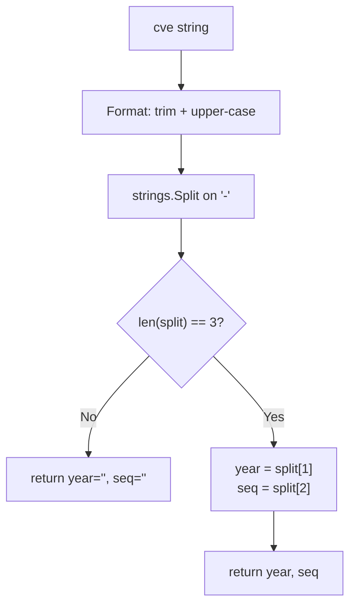

# Split

:::tip 📂 View Source
[`base.go:265`](https://github.com/scagogogo/cve-skills/blob/main/base.go#L265-L282) — open the implementation on GitHub (lines L265–L282).
:::

`Split` breaks a CVE identifier into its year and sequence components — the two numeric pieces that sit between the two dashes of a `CVE-YYYY-NNNNN` form.

:::tip 📌 Scenarios
- Decompose a CVE when you need to operate on the year or sequence independently (sorting, grouping, padding)
- Feed structured `(year, seq)` pairs into custom comparison or storage logic
- Pre-step for `FormatSeq` and other helpers that consume the year or sequence in isolation
:::

## Function Signature

```go
func Split(cve string) (year string, seq string)
```

## Parameters

- `cve` (string): The CVE identifier to split, e.g. `"CVE-2022-12345"`

## Return Values

- `year` (string): The year portion of the CVE, e.g. `"2022"`
- `seq` (string): The sequence portion of the CVE, e.g. `"12345"`
- If the input is not a valid 3-segment CVE format, both `year` and `seq` are empty strings (`""`)

## Behavior

- The input is first normalized with `Format` — trimmed of surrounding whitespace and upper-cased — so `" cve-2022-12345 "` is handled the same as `"CVE-2022-12345"`
- The normalized string is split on the `-` separator; a valid CVE must yield exactly 3 segments (`["CVE", "2022", "12345"]`)
- When the split produces exactly 3 segments, the second segment is returned as `year` and the third as `seq`
- When the split does not produce 3 segments (e.g. missing prefix, extra dashes, no dashes), the named return values `year` and `seq` remain at their zero value — empty strings
- Purely structural — it does not validate that `year` is a number, that the year is in range, or that `seq` is a positive integer; combine with `ValidateCve` for full semantic validation

## Flowchart



## Example

```go
package main

import (
	"fmt"

	"github.com/scagogogo/cve-skills"
)

func main() {
	testCases := []struct {
		input string
		year  string
		seq   string
	}{
		{"CVE-2022-12345", "2022", "12345"},
		{"cve-2022-12345", "2022", "12345"},          // lowercased, still split after Format
		{" CVE-2022-12345 ", "2022", "12345"},        // surrounding whitespace tolerated
		{"CVE-2021-44228", "2021", "44228"},
		{"CVE-2022-1", "2022", "1"},                  // single-digit sequence
		{"not-a-cve", "", ""},                        // not a 3-segment CVE
		{"CVE-2022", "", ""},                         // only 2 segments
		{"CVE-2022-12345-extra", "", ""},             // 4 segments
		{"2022-12345", "", ""},                       // missing CVE prefix
		{"", "", ""},                                 // empty string
	}

	for _, tc := range testCases {
		year, seq := cve.Split(tc.input)
		status := "✅"
		if year != tc.year || seq != tc.seq {
			status = "❌"
		}
		fmt.Printf("%s %-28s -> year=%q, seq=%q\n", status, tc.input, year, seq)
	}

	// Typical use: decompose before custom processing
	year, seq := cve.Split("CVE-2022-12345")
	fmt.Printf("year: %s, seq: %s\n", year, seq)
	// output: year: 2022, seq: 12345
}
```

## Use Cases

- Decompose a CVE when you need the year or sequence on its own (e.g. group by year, sort by numeric sequence)
- Provide structured `(year, seq)` pairs to comparison, padding, or storage logic
- Pre-step for helpers such as `FormatSeq` that consume the sequence in isolation
- Extract raw components before running additional numeric validation

## Notes

- `Split` is a **structural** split only — it returns whatever sits in the year/sequence positions without checking they are numeric, that the year is in range, or that the sequence is positive; use `ValidateCve` for full validation
- The empty-string return on invalid input is the zero value of the named return values — there is no error type; callers must check `year == ""` (or call `IsCve` first) when input validity is uncertain
- Case and surrounding whitespace are normalized away by `Format` before splitting, so callers do not need to pre-trim or upper-case the input
- A CVE with extra dashes (`CVE-2022-12345-extra`) yields 4 segments and is rejected with empty strings — exactly 3 segments are required
- Compare with `extractYear`: the unexported `extractYear` returns the year as an `int` (0 on failure), while `Split` returns both year and sequence as raw strings

## Internal Implementation

The function is a thin, allocation-light wrapper around two stdlib calls plus a length guard. Step by step against the source:

- **Line 266 — `cve = Format(cve)`:** the input is first routed through `Format`, which trims surrounding whitespace and upper-cases the string. This is why `" cve-2022-12345 "` and `"cve-2022-12345"` are accepted identically — normalization happens *before* splitting, not after.
- **Line 267 — `split := strings.Split(cve, "-")`:** the normalized string is cut on every `-`. `strings.Split` returns a `[]string`; for a well-formed `CVE-2022-12345` this is `["CVE", "2022", "12345"]`, and any extra dashes simply produce more elements.
- **Line 268–270 — `if len(split) != 3 { return }`:** a single guard checks for exactly 3 segments. The bare `return` relies on the named return values (`year`, `seq`) still holding their zero value (`""`), so there is no need to spell out `return "", ""`. This is the only branching point in the function.
- **Line 271 — `return split[1], split[2]`:** on the happy path the second and third segments are returned directly as raw strings — no numeric parsing, no validation. The `"CVE"` prefix (`split[0]`) is intentionally discarded; `Split` only cares about the payload.
- **Design intent:** the whole function is structural, not semantic. By delegating normalization to `Format` and validation to callers (`IsCve` / `ValidateCve`), `Split` stays a pure decomposition primitive that is cheap to compose into other helpers such as `FormatSeq`.

## Complexity

| Dimension | Cost | Reason |
|---|---|---|
| Time | O(n) | `Format` scans the string once (trim + upper-case), and `strings.Split` scans it once more to cut on `-`; both are linear in the input length n. The length check and two slice reads are O(1). |
| Space | O(n) | `Format` may allocate a new normalized string, and `strings.Split` allocates a `[]string` of at most (dashes+1) elements plus the subslices — all bounded by O(n). No maps, no sorts. |
| Allocations | 2 typical | One for the `Format` result, one for the `split` slice (and its backing strings). On the rejection path only the `Format` allocation survives. |

## Edge Cases

| Input | Behavior | Return |
|---|---|---|
| `"CVE-2022-12345"` (canonical) | Format no-ops, split → 3 segments | `("2022", "12345")` |
| `"cve-2022-12345"` (lowercase) | Format upper-cases to `CVE-2022-12345`, split → 3 segments | `("2022", "12345")` |
| `" CVE-2022-12345 "` (surrounding spaces) | Format trims spaces, split → 3 segments | `("2022", "12345")` |
| `"CVE-2022-1"` (single-digit seq) | 3 segments, no numeric check | `("2022", "1")` |
| `"CVE-2022"` (only 2 segments) | `len(split) == 2`, guard fires | `("", "")` |
| `"CVE-2022-12345-extra"` (4 segments) | `len(split) == 4`, guard fires | `("", "")` |
| `"2022-12345"` (missing prefix) | 2 segments, guard fires | `("", "")` |
| `"not-a-cve"` (2 dashes, 3 segments but non-CVE) | Passes the 3-segment guard, returns position 1 and 2 verbatim | `("a", "cve")` — structural only, no semantic check |
| `""` (empty string) | `strings.Split("")` → `[""]`, len 1, guard fires | `("", "")` |
| `"CVE-2022-ABC"` (non-numeric payload) | 3 segments, returned as-is | `("2022", "ABC")` — no numeric validation |

## Data Flow

```text
+---------------------+
|  input: cve string  |
|  e.g. " cve-22-9 "  |
+----------+----------+
           |
           v
+---------------------+
|  Format(cve)        |  trim + upper-case
|  -> "CVE-22-9"      |  (delegated normalization)
+----------+----------+
           |
           v
+---------------------+
|  strings.Split      |  cut on every '-'
|  cve, "-"           |
+----------+----------+
           |
           v
+---------------------+
|  []string split     |
|  ["CVE","22","9"]   |
+----------+----------+
           |
           v
+---------------------+
|  len(split) == 3 ?  |
+--+---------------+--+
   | No            | Yes
   v               v
+----------+ +---------------------+
| return   | | year = split[1]     |
| "", ""   | | seq  = split[2]     |
| (zero)   | +----------+----------+
+----------+            |
                        v
          +-----------------------------+
          |  return year, seq           |
          |  e.g. ("22", "9")           |
          +-----------------------------+
```

## Related Functions

- [Format](/api/functions/format) — standardize a CVE to uppercase, trimmed form (called internally by `Split`)
- [IsCve](/api/functions/is-cve) — validate the CVE format before splitting
- [ValidateCve](/api/functions/validate-cve) — full validation (format + year range + positive sequence)
- [FormatSeq](/api/functions/format-seq) — zero-pad the sequence to a fixed width (uses `Split` internally)
- [IsCveYearOk](/api/functions/is-cve-year-ok) — check the year is within 1999..current year
- [Format & Validate category](/api/format-validate)
