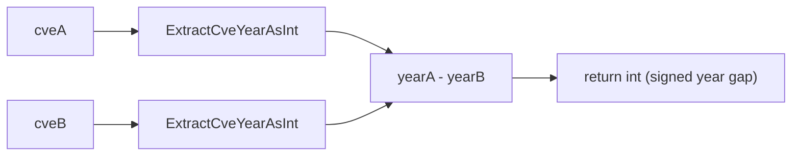

# SubByYear

:::tip 📂 View Source
[`compare.go:72`](https://github.com/scagogogo/cve-skills/blob/main/compare.go#L72-L75) — open the implementation on GitHub (lines L72–L75).
:::

`SubByYear` subtracts two CVE identifiers by year, returning the signed difference between the year of `cveA` and the year of `cveB`.

:::tip 📌 Scenarios
- Compute the year gap between two CVEs to measure how far apart they were published
- Analyze the temporal distribution of security vulnerabilities across years
- Build year-based deltas for trend reporting or aging analysis of CVE inventories
:::

## Function Signature

```go
func SubByYear(cveA, cveB string) int
```

## Parameters

- `cveA` (string): The first CVE identifier
- `cveB` (string): The second CVE identifier

## Return Values

- `int`: The year difference (`year of cveA` minus `year of cveB`); negative when `cveA` is earlier, positive when later, zero when both share the same year

## Behavior

- Internally delegates to `CompareByYear`, which itself computes `ExtractCveYearAsInt(cveA) - ExtractCveYearAsInt(cveB)` — so `SubByYear` is functionally identical to `CompareByYear`, only named to emphasize the "subtraction" intent
- The return value is the actual numeric year gap, not a sign-normalized `-1 / 0 / 1` tri-state — a difference of 2 means exactly two years apart
- Invalid or non-CVE input is not rejected: the year is extracted via `ExtractCveYearAsInt`, and any unparseable CVE is treated as year `0`
- Because invalid inputs collapse to year `0`, mixing a valid CVE with an invalid one yields a difference equal to the valid CVE's year (e.g. `SubByYear("CVE-2022-1", "garbage")` returns `2022`)

## Flowchart



## Example

```go
package main

import (
	"fmt"

	"github.com/scagogogo/cve-skills"
)

func main() {
	// Cases taken verbatim from the source-level documentation.
	fmt.Println(cve.SubByYear("CVE-2020-1111", "CVE-2022-2222")) // -2
	fmt.Println(cve.SubByYear("CVE-2022-1111", "CVE-2020-2222")) // 2
	fmt.Println(cve.SubByYear("CVE-2022-1111", "CVE-2022-2222")) // 0

	// Invalid input is treated as year 0, so the difference equals the valid year.
	fmt.Println(cve.SubByYear("CVE-2022-1111", "not-a-cve")) // 2022
	fmt.Println(cve.SubByYear("garbage", "CVE-2020-2222"))   // -2020
	fmt.Println(cve.SubByYear("garbage", "also-garbage"))    // 0

	// Typical usage: measure the year gap between two CVEs.
	yearDiff := cve.SubByYear("CVE-2022-1111", "CVE-2020-2222")
	// yearDiff is 2, meaning the first CVE was published 2 years later than the second
	if yearDiff > 0 {
		fmt.Printf("first CVE is %d years newer\n", yearDiff)
	} else if yearDiff < 0 {
		fmt.Printf("first CVE is %d years older\n", -yearDiff)
	} else {
		fmt.Println("both CVEs share the same year")
	}
}
```

## Use Cases

- Compute the year interval between two CVEs
- Evaluate the temporal distribution of security vulnerabilities
- Build year-delta features for trend reporting or aging analysis of CVE inventories

## Notes

- ⚠️ `SubByYear` is functionally identical to `CompareByYear` — both return the raw signed year gap. Use `SubByYear` when you want to express "subtraction" intent, and `CompareByYear` when you want to express "comparison" intent
- ⚠️ Invalid input is silently coerced to year `0` rather than producing an error. If you need strict validation, call `IsCve` / `ValidateCve` first
- 🔍 The return is a true numeric difference, not the `-1 / 0 / 1` tri-state returned by `CompareCves`. For a full year-and-sequence comparison, use `CompareCves` instead
- 📊 Only the year is considered; two CVEs from the same year always yield `0` regardless of sequence number

## Internal Implementation

`SubByYear` is a thin semantic wrapper over `CompareByYear`. Its body (compare.go L72-L75) is a single statement, so the real work happens one layer down:

- **Direct delegation (L73):** the function body is `return CompareByYear(cveA, cveB)`. There is no local parsing, branching, or guard — every input is handed straight to `CompareByYear`, which keeps behavior identical to that function.
- **Year extraction via `ExtractCveYearAsInt` (L41):** `CompareByYear` computes `ExtractCveYearAsInt(cveA) - ExtractCveYearAsInt(cveB)`. Each CVE string is parsed into its 4-digit year component as an integer; the surrounding `CVE-` prefix and the sequence number are ignored for this operation.
- **Integer subtraction as the result (L41):** the returned `int` is the literal arithmetic difference of the two years, not a sign-normalized tri-state. This is why a 2-year gap surfaces as `2`, distinguishing `SubByYear`/`CompareByYear` from `CompareCves` which clamps to `-1 / 0 / 1`.
- **No error path:** invalid input never short-circuits the function. `ExtractCveYearAsInt` degrades unparseable input to year `0`, so the subtraction proceeds with `0` substituted for the bad side, producing a numeric result rather than an error.
- **Naming as intent, not behavior:** because the implementation is identical to `CompareByYear`, the separate name exists purely to express subtraction intent at call sites; the Go compiler inlines nothing special — the distinction is for human readers and API ergonomics.

## Complexity

| Metric | Cost | Reason |
|---|---|---|
| Time | O(n) where n is the length of each CVE string | `ExtractCveYearAsInt` scans/parses each input string once; two calls plus one integer subtraction |
| Space | O(1) | No slices, maps, or buffers are allocated; only a couple of stack `int` values |

Both inputs are bounded-length CVE strings, so in practice the cost is effectively constant. The function avoids the `sort.Slice` and `Format` allocations used by `SortCves` (which is O(n log n) time and O(n) space), making `SubByYear` the cheapest year-difference path in the package.

## Edge Cases

| Input | Behavior | Return |
|---|---|---|
| `SubByYear("CVE-2022-1111", "CVE-2020-2222")` | Both years parsed normally; `2022 - 2020` | `2` |
| `SubByYear("CVE-2020-1111", "CVE-2022-2222")` | `2020 - 2022` | `-2` |
| `SubByYear("CVE-2022-1111", "CVE-2022-2222")` | Same year, sequence ignored | `0` |
| `SubByYear("CVE-2022-1", "garbage")` | `cveB` unparseable → year `0`; `2022 - 0` | `2022` |
| `SubByYear("garbage", "CVE-2020-2222")` | `cveA` unparseable → year `0`; `0 - 2020` | `-2020` |
| `SubByYear("garbage", "also-garbage")` | Both unparseable → `0 - 0` | `0` |
| `SubByYear("cve-2022-1111", "CVE-2022-2222")` | Lowercase prefix tolerated by extractor; both years `2022` | `0` |
| `SubByYear("", "CVE-2022-2222")` | Empty string is invalid → year `0`; `0 - 2022` | `-2022` |
| `SubByYear("CVE-2022-1111", "CVE-2022-1111")` | Identical inputs | `0` |
| `SubByYear("CVE-9999-9999", "CVE-0001-0001")` | Valid format, extreme years; `9999 - 1` | `9998` |

## Data Flow

```text
  +-----------+                              +-----------+
  |  cveA     |                              |  cveB     |
  | (string)  |                              | (string)  |
  +-----+-----+                              +-----+-----+
        |                                          |
        v                                          v
  +-------------------+                    +-------------------+
  | ExtractCveYear    |                    | ExtractCveYear    |
  | AsInt(cveA)       |                    | AsInt(cveB)       |
  +---------+---------+                    +---------+---------+
            |                                        |
            |   yearA (int)                          |   yearB (int)
            |   (invalid -> 0)                       |   (invalid -> 0)
            v                                        v
            \                                        /
             \                                      /
              +------------+   +-------------------+
                           |   |
                           v   v
                    +--------------+
                    |  yearA - yearB   <-- CompareByYear body (L41)
                    +-------+------+
                            |
                            v
                    +-----------------+
                    | return int      |   signed year gap
                    | (SubByYear L73) |   (NOT -1/0/1)
                    +-----------------+
```

## Related Functions

- [CompareByYear](/api/functions/compare-by-year) — compare two CVEs by year (functionally identical to `SubByYear`)
- [CompareCves](/api/functions/compare-cves) — full comparison by year then sequence, returning `-1 / 0 / 1`
- [ExtractCveYearAsInt](/api/functions/extract-cve-year-as-int) — extract the year of a CVE as an integer
- [SortCves](/api/functions/sort-cves) — sort a CVE slice by year then sequence
- [Compare & Sort category](/api/compare-sort)
