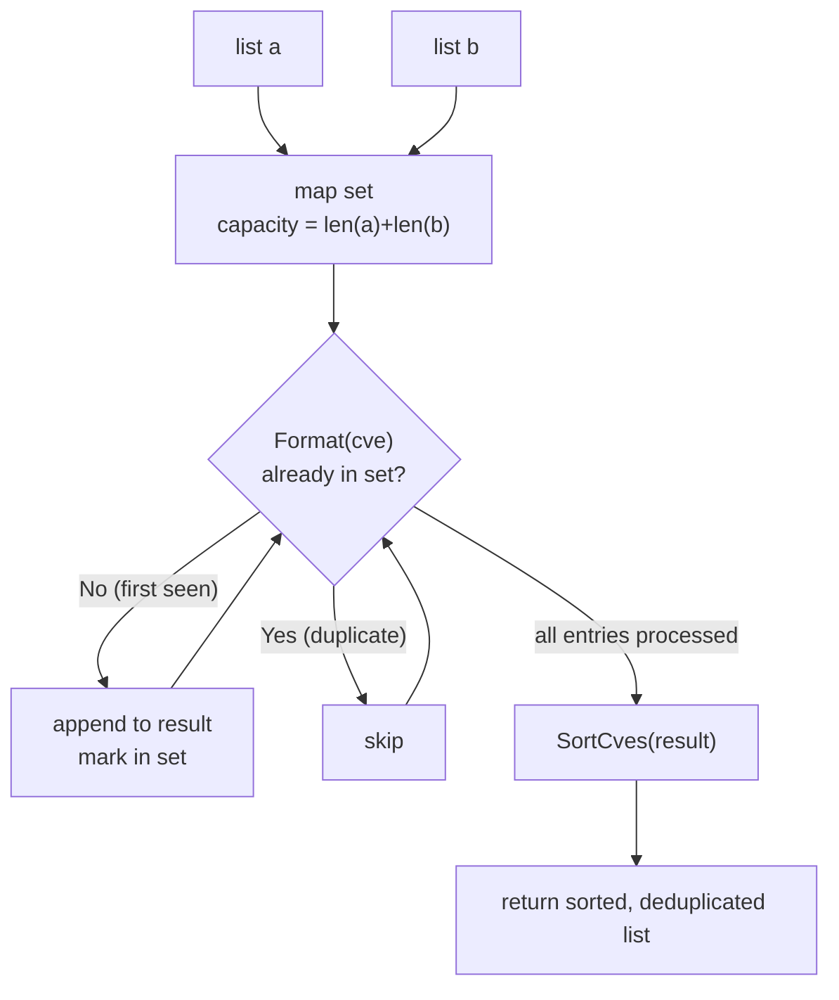

# UnionCves

:::tip 📂 View Source
[`filter.go:284`](https://github.com/scagogogo/cve-skills/blob/main/filter.go#L284-L306) — open the implementation on GitHub (lines L284–L306).
:::

`UnionCves` merges two CVE lists into a single deduplicated set, returning every CVE that appears in either list — standardized to uppercase and sorted.

:::tip 📌 Scenarios
- Merge CVE lists collected from multiple security advisories or feeds
- Combine vulnerability inventories from different teams before deduplication
- Build a master CVE dataset for downstream analysis or reporting
:::

## Function Signature

```go
func UnionCves(a, b []string) []string
```

## Parameters

- `a` ([]string): The first CVE list
- `b` ([]string): The second CVE list

## Return Values

- []string: All CVE identifiers from both lists (deduplicated), sorted in ascending order by year and sequence number

## Behavior

- Each input CVE is normalized with `Format` (uppercase, trimmed) before comparison, so `cve-2022-1111` and `CVE-2022-1111` are treated as the same CVE
- A `map[string]struct{}` seeded with capacity `len(a)+len(b)` tracks which CVEs have already been collected; a CVE is appended only on its first occurrence
- List `a` is walked first, then list `b` — duplicates that already appeared in `a` are skipped when encountered again in `b`
- The collected result is passed to `SortCves` before returning, so the output is ordered by year and then by sequence number (not by insertion order)
- Invalid or malformed entries are still passed through `Format`; only genuine duplicates (case-insensitively equal) are removed

## Flowchart



## Example

```go
package main

import (
	"fmt"

	"github.com/scagogogo/cve-skills"
)

func main() {
	list1 := []string{"CVE-2022-1111", "CVE-2022-2222"}
	list2 := []string{"CVE-2022-2222", "CVE-2022-3333"}
	all := cve.UnionCves(list1, list2)
	// all is ["CVE-2022-1111", "CVE-2022-2222", "CVE-2022-3333"]
	fmt.Println(all)

	// Case-insensitive deduplication — the lowercase duplicate is dropped
	mixedA := []string{"cve-2022-1111", "CVE-2022-2222"}
	mixedB := []string{"CVE-2022-1111", "cve-2022-3333"}
	fmt.Println(cve.UnionCves(mixedA, mixedB))
	// output: [CVE-2022-1111 CVE-2022-2222 CVE-2022-3333]

	// Empty lists are handled gracefully
	fmt.Println(cve.UnionCves(nil, []string{"CVE-2021-44228"}))
	// output: [CVE-2021-44228]

	// Result is sorted by year then sequence, not by input order
	unorderedA := []string{"CVE-2022-3333", "CVE-2021-1111"}
	unorderedB := []string{"CVE-2021-2222"}
	fmt.Println(cve.UnionCves(unorderedA, unorderedB))
	// output: [CVE-2021-1111 CVE-2021-2222 CVE-2022-3333]
}
```

## Use Cases

- Merge CVE lists collected from multiple sources (NVD, vendor advisories, internal scanners)
- Integrate vulnerability information from multiple security reports into one master list
- Combine per-team CVE inventories before producing a consolidated report
- Preprocess a deduplicated input set for trend analysis or year-based statistics

## Notes

- Comparison is case-insensitive thanks to `Format`; every returned entry is in the canonical uppercase form
- The output is **sorted**, not insertion-ordered — call `RemoveDuplicateCves` instead if you want to preserve first-occurrence order from a single list
- Duplicates are removed across both lists (a CVE appearing in `a` and again in `b` is kept only once); intra-list duplicates within `a` or `b` are also collapsed
- Time complexity is O(n+m) with O(n+m) space, where n and m are the lengths of the two lists — efficient for large feeds
- Malformed strings that survive `Format` are kept verbatim (only case-insensitive equality deduplicates); validate inputs beforehand with `IsCve` or `ValidateCve` if you need strict filtering

## Internal Implementation

The body of `UnionCves` (filter.go L284-L306) walks both lists into a single deduplicated, sorted slice. The key steps:

- **Pre-sized set allocation (L285)**: `set := make(map[string]struct{}, len(a)+len(b))` preallocates the dedup map to the worst-case union size, avoiding rehashing as entries accumulate. `struct{}` is used as the value type because it carries no data and consumes zero bytes.
- **Two-pass collection (L288-L302)**: List `a` is iterated first, then `b`. Each entry is passed through `Format` (L289, L297) to produce a canonical uppercase key; a `map` lookup at L290/L298 decides whether this is the first sighting. Only first-seen entries are appended to `result` (L292, L300), so cross-list and intra-list duplicates collapse to their first occurrence.
- **Delegation to `SortCves` (L304)**: After collection the unsorted `result` slice is handed to `SortCves`, which orders entries by year and then sequence number. The function therefore returns a sorted set rather than insertion order.
- **Design intent — single canonical key**: By normalizing before the `map` probe, the same CVE written in different cases (`cve-2022-1111` vs `CVE-2022-1111`) resolves to one key, giving case-insensitive deduplication for free without a separate comparator.
- **No early invalidity filtering**: `Format` is the only transformation; entries that are not well-formed CVEs but happen to format distinctly are preserved. Strict validation is left to the caller, keeping `UnionCves` a pure set-union primitive.

## Complexity

| Resource | Cost | Notes |
| --- | --- | --- |
| Time — collection | O(n+m) | Each element of `a` and `b` is visited once; `Format` and the `map` lookup are O(1) average |
| Time — sorting | O(k log k) | `SortCves` sorts the deduplicated result of size k ≤ n+m |
| Time — overall | O(n+m) + O(k log k) | Dominated by collection for large inputs; the source comment summarizes this as O(n+m) |
| Space — map | O(n+m) | The `set` map holds at most n+m distinct formatted keys |
| Space — result | O(n+m) | The `result` slice holds at most n+m entries before sorting |

Where `n = len(a)`, `m = len(b)`, and `k` is the count of distinct CVEs after deduplication (k ≤ n+m).

## Edge Cases

| Input | Behavior | Return |
| --- | --- | --- |
| `a` and `b` both `nil`/empty | Both loops iterate zero times; `result` stays `nil`; `SortCves(nil)` returns `nil` | `nil` |
| `a` empty, `b` non-empty | First loop is a no-op; entries from `b` populate the set and `result` | `b` deduplicated and sorted |
| Case variants of the same CVE (`cve-2022-1111` and `CVE-2022-1111`) | Both `Format` to `CVE-2022-1111`; the second lookup hits the set and is skipped | Single `CVE-2022-1111` entry |
| Duplicate within one list (`a = ["CVE-2022-1", "CVE-2022-1"]`) | Second occurrence finds the key already in the set and is skipped | One `CVE-2022-1` entry |
| Cross-list duplicate (in both `a` and `b`) | Added during the `a` pass; skipped during the `b` pass | Single entry |
| Malformed string surviving `Format` | Kept verbatim; only deduplicated against case-insensitively equal strings | String preserved as-is |
| Unordered inputs | Insertion order is discarded by `SortCves` | Sorted by year then sequence |

## Data Flow

```text
+----------+        +----------+
|  list a  |        |  list b  |
|  []str   |        |  []str   |
+----+-----+        +----+-----+
     |                   |
     |  iterate first    |  iterate second
     v                   v
+----------------------------------+
|  for cve in a, then b:           |
|    formatted = Format(cve)       |  <-- canonical uppercase key
|    if formatted not in set:      |
|      set[formatted] = {}         |  <-- mark seen
|      result = append(result,     |
|                     formatted)   |
+---------------+------------------+
                |
                v
        +--------------+
        | result []str |  (deduped, unsorted)
        +------+-------+
               |
               v
        +----------------+
        | SortCves(result)|  <-- sort by year, then sequence
        +--------+-------+
                 |
                 v
        +--------------------+
        | sorted, deduped    |
        | []string output    |
        +--------------------+
```

## Related Functions

- [IntersectCves](/api/functions/intersect-cves) — return CVEs common to both lists
- [DiffCves](/api/functions/diff-cves) — return CVEs in `a` but not in `b`
- [RemoveDuplicateCves](/api/functions/remove-duplicate-cves) — deduplicate a single list, preserving first-occurrence order
- [SortCves](/api/functions/sort-cves) — sort a CVE list by year and sequence
- [Format](/api/functions/format) — standardize a CVE to uppercase, trimmed form
- [Set Operations category](/api/set-operations)
