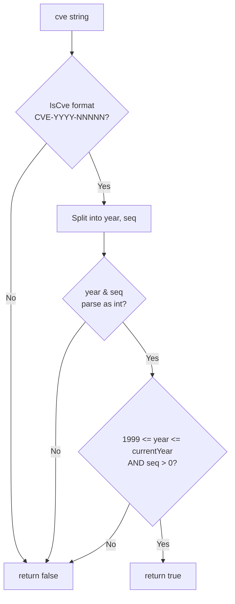

# ValidateCve

:::tip 📂 View Source
[`base.go:445`](https://github.com/scagogogo/cve-skills/blob/main/base.go#L445-L460) — open the implementation on GitHub (lines L445–L460).
:::

`ValidateCve` performs full semantic validation of a single CVE identifier — it checks the format, the year range (1999..current year), and that the sequence is a positive integer.

:::tip 📌 Scenarios
- Validate a CVE entered by a user before persisting it or calling an external API
- Final gate during data import after a cheap `IsCve` format screen
- Reject reserved/future or pre-history identifiers that pass the format check but are semantically invalid
:::

## Function Signature

```go
func ValidateCve(cve string) bool
```

## Parameters

- `cve` (string): The CVE identifier to validate

## Return Values

- `bool`: Returns `true` only if the CVE passes format, year-range, and positive-sequence checks; returns `false` otherwise

## Behavior

- First delegates to `IsCve(cve)` — if the format does not match `CVE-YYYY-NNNNN` (case-insensitive, surrounding whitespace tolerated), returns `false` immediately
- Splits the identifier via `Split` into year and sequence strings, then parses both with `strconv.Atoi`; a parse failure on either part returns `false`
- Enforces the year range `1999 <= year <= time.Now().Year()` — years before 1999 or after the current year are rejected
- Requires the sequence to be a positive integer (`seqInt > 0`), so `CVE-2022-0` returns `false`
- The current-year upper bound is evaluated at call time using `time.Now().Year()`, so the accepted range shifts each calendar year

## Flowchart



## Example

```go
package main

import (
	"fmt"

	"github.com/scagogogo/cve-skills"
)

func main() {
	// Inputs are taken verbatim from the source-code doc comments.
	// The current-year examples assume the current year is 2023.
	testCases := []struct {
		input    string
		expected bool
		reason   string
	}{
		{"CVE-2022-12345", true, "standard format, valid year and positive sequence"},
		{"CVE-1998-12345", false, "year < 1999"},
		{"CVE-2030-12345", false, "year > current year (when current year is 2023)"},
		{"CVE-2022-ABC", false, "sequence is not a number"},
		{"CVE-2022-0", false, "sequence is not a positive integer"},
	}

	for _, tc := range testCases {
		result := cve.ValidateCve(tc.input)
		status := "✅"
		if result != tc.expected {
			status = "❌"
		}
		fmt.Printf("%s %-20s -> %t  (%s)\n", status, tc.input, result, tc.reason)
	}

	// Typical guard usage before further processing
	isValid := cve.ValidateCve("CVE-2022-12345")
	if isValid {
		fmt.Println("Accepted: proceed with processing...")
	} else {
		fmt.Println("Rejected: handle invalid CVE...")
	}
}
```

## Use Cases

- Validate a CVE submitted via form, API parameter, or CLI argument before storing it
- Final validation gate during data import after a cheap `IsCve` format screen
- Reject pre-history (before 1999) or future-year identifiers that pass the format check
- Guard downstream operations (`Split`, `FormatSeq`, sorting, filtering) against semantically invalid input

## Notes

- `ValidateCve` is a **semantic** check; `IsCve` is a **format** check only. `IsCve` accepts `CVE-22-12345` (since `\d+` matches `22`), but `ValidateCve` rejects it because `22 < 1999`
- The current-year upper bound uses `time.Now().Year()` evaluated at call time, so an identifier that is valid today may still be valid next year — but a future-dated identifier will become valid once the calendar catches up
- Unlike `IsCveYearOkWithCutoff`, `ValidateCve` offers **no** future-year tolerance; for reserved/pre-released CVEs with future years, use `IsCveYearOkWithCutoff` with a `cutoff` instead
- Surrounding whitespace is tolerated (inherited from `IsCve`) but not normalized — call `Format` if you need the canonical uppercase, trimmed form
- For batch validation with per-item failure reasons, use `ValidateCves` (returns `[]CveValidationResult`); for just the valid subset, use `FilterValidCves` (which internally calls `ValidateCve`)

## Internal Implementation

The function body at `base.go:445-460` runs four cheap, ordered gates, returning `false` at the first failure and `true` only if all pass:

- **Format gate (L446-448)** — delegates to `IsCve(cve)`. This is the cheapest test and rejects most malformed input before any allocation or parsing. `IsCve` tolerates surrounding whitespace and is case-insensitive, so `" cve-2022-12345 "` is accepted at this stage.
- **Split + parse (L450-452)** — calls `Split(cve)` to obtain the year and sequence as strings, then runs `strconv.Atoi` on each. Two independent error values (`yearErr`, `seqErr`) are produced; neither value is otherwise used except for the truthiness check, keeping the fast-path branch-free.
- **Parse-failure gate (L454-456)** — `if yearErr != nil || seqErr != nil` short-circuits: if either part is non-numeric (e.g. `CVE-2022-ABC`), the function returns `false` without ever evaluating the range predicate.
- **Semantic gate (L459)** — the single return expression `yearInt >= 1999 && yearInt <= time.Now().Year() && seqInt > 0` combines three invariants: year not before the CVE system's inaugural year (1999), year not beyond the current calendar year (evaluated live via `time.Now().Year()`), and sequence strictly positive. The design intent is a pure, stateless, O(1) predicate that can be safely inlined into filters and batch loops.

## Complexity

| Dimension | Cost | Reason |
|---|---|---|
| Time | O(n) | `IsCve` scans the input once over its length n; `Split`, `strconv.Atoi`, and the integer comparisons are O(n) or better, so the overall cost is dominated by the single linear scan. No sorting or allocation. |
| Space | O(1) | A handful of local variables (`year`, `seq`, `yearInt`, `seqInt`, two errors); `Split` returns substrings that share the input's backing array, so no copy proportional to n is made. |

## Edge Cases

| Input | Behavior | Return |
|---|---|---|
| `"CVE-2022-12345"` (canonical) | Passes format, parses to year=2022 seq=12345, all predicates true | `true` |
| `" cve-2022-12345 "` (whitespace, lowercase) | `IsCve` tolerates whitespace and case; parses fine | `true` |
| `"CVE-1998-12345"` (year < 1999) | Format OK, parses, but `yearInt >= 1999` fails | `false` |
| `"CVE-2030-12345"` (future year) | Format OK, parses, but `yearInt <= time.Now().Year()` fails | `false` |
| `"CVE-22-12345"` (short year, regex-valid) | `IsCve` accepts (`\d+`), parses to 22, `22 < 1999` fails | `false` |
| `"CVE-2022-ABC"` (non-numeric seq) | Format OK, `strconv.Atoi(seq)` fails → `seqErr != nil` | `false` |
| `"CVE-2022-0"` (zero seq) | Format OK, parses to seqInt=0, `seqInt > 0` fails | `false` |
| `""` / `"not-a-cve"` / `nil`-equivalent empty | `IsCve` rejects immediately | `false` |
| `"CVE-2022-12345"` repeated calls | No memoization; `time.Now().Year()` re-evaluated each call | `true` (idempotent) |

## Data Flow

```text
+----------------------+
|  input: cve string   |
|  e.g. "CVE-2022-12345"|
+----------+-----------+
           |
           v
+----------------------+
|  IsCve(cve)          |
|  regex CVE-YYYY-NNNNN|
|  (case-insensitive,  |
|   whitespace tolerated)|
+----------+-----------+
           |
     fail? |---+---> return false
           |   |
           v   ^
+----------------------+
|  Split(cve)          |
|  -> year="2022"      |
|  -> seq  ="12345"    |
+----------+-----------+
           |
           v
+----------------------+
|  strconv.Atoi(year)  |
|  strconv.Atoi(seq)   |
|  -> yearInt, seqInt  |
+----------+-----------+
           |
   err?    |---+---> return false
           |   |
           v   ^
+----------------------+
|  yearInt >= 1999     |
|  && yearInt <=       |
|     time.Now().Year()|
|  && seqInt > 0       |
+----------+-----------+
           |
   false?  |---+---> return false
           |   |
           v   ^
+----------------------+
|  return true         |
+----------------------+
```

## Related Functions

- [IsCve](/api/functions/is-cve) — format-only check (no year range or positive sequence)
- [ValidateCves](/api/functions/validate-cves) — batch validation returning per-item reasons
- [FilterValidCves](/api/functions/filter-valid-cves) — keep only the valid CVEs from a list
- [IsCveYearOk](/api/functions/is-cve-year-ok) — year-range check (1999..current year) without the sequence check
- [IsCveYearOkWithCutoff](/api/functions/is-cve-year-ok-with-cutoff) — year-range check with future-year tolerance
- [Split](/api/functions/split) — split a CVE into year and sequence
- [Format](/api/functions/format) — standardize a CVE to uppercase, trimmed form
- [Format & Validate category](/api/format-validate)
