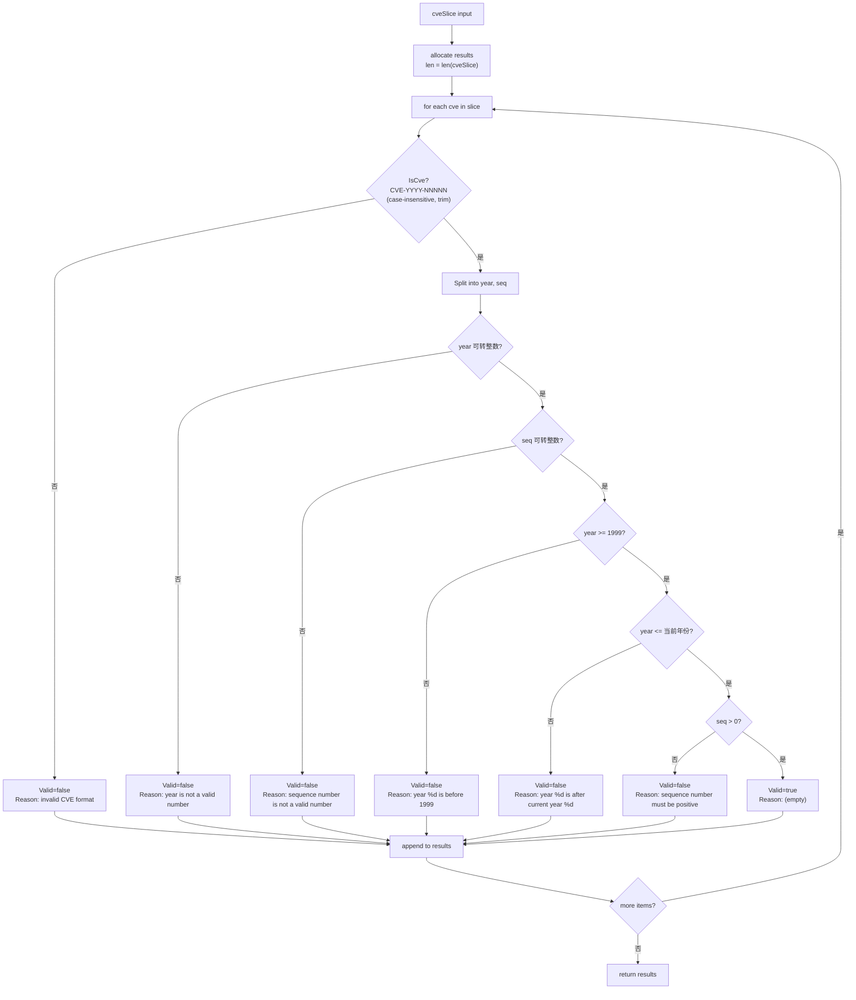

# ValidateCves

:::tip 📂 View Source
[`base.go:319`](https://github.com/scagogogo/cve-skills/blob/main/base.go#L319-L375) — open the implementation on GitHub (lines L319–L375).
:::

Validate a batch of CVE identifiers at once, returning a detailed per-item result with the failure reason for each invalid entry.

:::tip 📌 Scenarios
- Quality-checking a list of CVEs before bulk importing into a database or vulnerability tracker
- Producing a data-quality report that records not only which CVEs failed but also why
- Validating CVEs parsed from external feeds where invalid entries are expected and must be reported, not silently dropped
:::

## Function Signature

```go
func ValidateCves(cveSlice []string) []CveValidationResult
```

The returned `CveValidationResult` is defined in the same package:

```go
type CveValidationResult struct {
    Cve    string // the original CVE identifier passed in
    Valid  bool   // whether it is valid
    Reason string // failure reason; empty string when valid
}
```

## Parameters

- `cveSlice` (`[]string`): Slice of CVE identifier strings to validate. Each element is validated independently. May be `nil` or empty.

## Return Value

- `[]CveValidationResult`: A result slice whose length equals `len(cveSlice)`. Each element corresponds positionally to the input element and carries the original input string, a `Valid` flag, and a `Reason` string. The returned slice is always non-nil (even for empty input, it is an allocated slice of length 0).

## Behavior

- Iterates over `cveSlice` and validates each entry through the internal `validateSingleCve` helper. It does **not** delegate to `ValidateCve`, so it can produce precise failure reasons rather than a bare `bool`.
- The result slice is pre-allocated to the input length, so positional alignment between input and result is guaranteed.
- Validation order (short-circuits on the first failure):
  1. Format must match `CVE-YYYY-NNNNN` (case-insensitive, leading/trailing whitespace allowed) — checked by `IsCve`. Failure reason: `"invalid CVE format"`.
  2. Year must be parseable as an integer. Failure reason: `"year is not a valid number"`.
  3. Sequence number must be parseable as an integer. Failure reason: `"sequence number is not a valid number"`.
  4. Year must be `>= 1999`. Failure reason: `"year %d is before 1999"`.
  5. Year must be `<= current year` (from `time.Now().Year()`). Failure reason: `"year %d is after current year %d"`.
  6. Sequence number must be `> 0`. Failure reason: `"sequence number must be positive"`.
- The `Cve` field of each result preserves the **original** input string verbatim — including surrounding whitespace and original letter case. It is not normalized.
- An empty/`nil` input slice yields a non-nil empty result slice (no panic).

## Flowchart



## Example

```go
package main

import (
    "fmt"

    "github.com/scagogogo/cve-skills"
)

func main() {
    // A mixed list: valid, format-invalid, year-too-early, year-too-late, sequence-not-a-number
    input := []string{
        "CVE-2022-12345",     // valid
        "CVE-1998-12345",     // year before 1999
        "not-a-cve",          // invalid format
        "cve-2022-0001",      // valid (lowercase, leading zeros)
        " CVE-2022-0 ",       // sequence not positive
        "CVE-2022-ABC",       // sequence not a number
    }

    results := cve.ValidateCves(input)

    fmt.Printf("%-20s %-8s %s\n", "CVE", "Valid", "Reason")
    fmt.Println("------------------------------------------------------------")
    for _, r := range results {
        fmt.Printf("%-20s %-8t %s\n", r.Cve, r.Valid, r.Reason)
    }

    // Collect only the valid ones, preserving the original input where it passed
    var valid []string
    for _, r := range results {
        if r.Valid {
            valid = append(valid, r.Cve)
        }
    }
    fmt.Printf("\nValid CVEs: %v\n", valid)

    // Empty/nil input handling
    empty := cve.ValidateCves(nil)
    fmt.Printf("nil input -> len=%d, results==nil? %t\n", len(empty), empty == nil)
}
```

Expected output (assuming the current year is 2026):

```text
CVE                  Valid    Reason
------------------------------------------------------------
CVE-2022-12345       true
CVE-1998-12345       false    year 1998 is before 1999
not-a-cve            false    invalid CVE format
cve-2022-0001        true
 CVE-2022-0          false    sequence number must be positive
CVE-2022-ABC         false    sequence number is not a valid number

Valid CVEs: [CVE-2022-12345 cve-2022-0001]
nil input -> len=0, results==nil? false
```

## Use Cases

- Bulk pre-import quality checks for CVE data feeds
- Generating data-quality reports that record both the failing entries and their failure reasons
- Validating CVE lists parsed from external documents ( advisories, spreadsheets, CSV exports ) before downstream processing
- Audit logging of malformed CVEs encountered in production data pipelines

## Notes

- The `Cve` field is the **original** input, not normalized — whitespace and case are preserved as-is. If you need a standardized form, apply `Format` to the input or to `r.Cve` yourself.
- Unlike `ValidateCve` (which returns only a `bool`), `ValidateCves` returns a structured reason for every failure, making it the better choice when you need to report or log why each entry was rejected.
- Year validation uses `time.Now().Year()` at call time, so the upper bound depends on the actual current year when the function runs.
- Duplicates are **not** removed or merged — each input element produces exactly one result element, including repeats.
- The function does not mutate `cveSlice`. The input slice remains unchanged.
- For simply filtering a list down to valid CVEs (without reasons), `FilterValidCves` is a more concise alternative.

## Internal Implementation

`ValidateCves` (base.go:319–325) is a thin batch driver; the real per-item work lives in the unexported helper `validateSingleCve` (base.go:328–374).

- **Pre-allocated result slice.** `results := make([]CveValidationResult, len(cveSlice))` allocates the output with exactly the input length, then the loop writes `results[i] = validateSingleCve(cve)` by index. This avoids any `append` growth/reslice and guarantees positional alignment between input and output without a separate index-tracking variable.
- **Delegation to a dedicated helper.** Each element is validated via `validateSingleCve(cve)` rather than `ValidateCve`. The helper returns the structured `CveValidationResult` (with `Reason`), whereas `ValidateCve` collapses the outcome to a bare `bool`, so the batch function gains precise failure reasons for free by sharing the helper.
- **Independent, side-effect-free iteration.** The `for i, cve := range cveSlice` loop validates each entry in isolation; there is no deduplication, no early termination of the whole batch on the first failure, and no mutation of `cveSlice`. A bad entry only short-circuits its own result (via the `return` statements inside `validateSingleCve`), not the surrounding loop.
- **Short-circuit ordering inside the helper.** `validateSingleCve` constructs `result := CveValidationResult{Cve: cve}` first to preserve the original input verbatim, then chains `IsCve` → `Split` → `strconv.Atoi(year)` → `strconv.Atoi(seq)` → `yearInt < 1999` → `yearInt > currentYear` → `seqInt <= 0`, returning on the first failing predicate. This ordering puts the cheapest structural check first and the `time.Now()` call as late as possible.
- **Original input preserved, not normalized.** `result.Cve` is set to the raw `cve` argument before any normalization (none is applied), so whitespace and original case survive into the result. `IsCve` itself tolerates leading/trailing whitespace and case via its regex, but the stored string is the untouched input.

## Complexity

Let `n = len(cveSlice)` and let `L` be the maximum length of any single CVE string in the slice.

| Dimension | Cost | Basis in source |
|---|---|---|
| Time | `O(n)` for the batch loop; each element is `O(L)` dominated by the `IsCve` regex/trim, so total `O(n * L)` | `for i, cve := range cveSlice` (L321) plus per-call `IsCve`/`Split` |
| Space | `O(n)` auxiliary | `make([]CveValidationResult, len(cveSlice))` (L320) — one result struct per input element, no recursion, no extra buffers |
| Allocation | exactly one slice header + `n` struct slots, allocated up front | pre-sized `make`, no `append` growth |
| Per-element short-circuit | best case `O(1)` after `IsCve` fails | early `return` statements inside `validateSingleCve` (L331–L369) |

The function does not sort, hash, or otherwise reorder data, so there is no `O(n log n)` or `O(n+m)` component here. The `time.Now().Year()` call (L359) is `O(1)` and only reached on the happy path past the format and parse checks.

## Edge Cases

| Input | Behavior | Return |
|---|---|---|
| `nil` slice | `make([]CveValidationResult, 0)` produces an empty, non-nil slice; loop body never executes | `[]` with `len == 0`, `!= nil` |
| empty slice `[]string{}` | same as `nil` — allocated length-0 slice | `[]` with `len == 0`, `!= nil` |
| `"not-a-cve"` (bad format) | `IsCve` returns false at L331 | `{Cve: "not-a-cve", Valid: false, Reason: "invalid CVE format"}` |
| `"CVE-1998-12345"` (year < 1999) | passes format/parse, fails `yearInt < 1999` at L353 | `{Cve: "CVE-1998-12345", Valid: false, Reason: "year 1998 is before 1999"}` |
| `"CVE-2099-12345"` (year > current) | fails `yearInt > currentYear` at L360 | `{Cve: ..., Valid: false, Reason: "year 2099 is after current year YYYY"}` |
| `"CVE-2022-ABC"` (seq not numeric) | `strconv.Atoi(seq)` errors at L339 | `{Cve: ..., Valid: false, Reason: "sequence number is not a valid number"}` |
| `"CVE-2022-0"` (seq not positive) | parses to `0`, fails `seqInt <= 0` at L366 | `{Cve: ..., Valid: false, Reason: "sequence number must be positive"}` |
| `"cve-2022-0001"` (lowercase) | `IsCve` is case-insensitive | `{Cve: "cve-2022-0001", Valid: true, Reason: ""}` — original lowercase preserved |
| `" CVE-2022-0001 "` (surrounding spaces) | `IsCve` trims; result stores raw input | `{Cve: " CVE-2022-0001 ", Valid: true, Reason: ""}` — spaces preserved |
| duplicate entries | no dedup; each produces its own result | `n` results for `n` inputs, duplicates included |
| very long valid string | regex/parse scale with `L` | valid result; time `O(L)` for that element |

## Data Flow

```text
                +-----------------------------+
   cveSlice ----> make([]CveValidationResult, |
  []string      |          len(cveSlice))     |
                +--------------+--------------+
                               |
                               v
                +--------------+--------------+
                | for i, cve := range cveSlice|
                +--------------+--------------+
                               |
                               v
          +--------------------+--------------------+
          |  validateSingleCve(cve)                 |
          |  result := CveValidationResult{Cve:cve} |
          +--------------------+--------------------+
                               |
                               v
                +--------------+--------------+
                | IsCve(cve)? format check   |
                +--+--------+--------+--------+
                   | no     | yes
                   v        v
        +----------+---+    +--+----------------------+
        | invalid CVE  |    | Split -> year, seq      |
        | format       |    | Atoi(year), Atoi(seq)   |
        +------+-------+    +------+--------+---------+
               |                   | no     | yes
               |                   v        v
               |        +----------+---+    +--+-------------+
               |        | year/seq not  |    | year < 1999 ? |
               |        | a number      |    +--+-----+------+
               |        +------+--------+       | no  | yes
               |               |                v     v
               |               |   +------------+--+  +-----+
               |               |   | year > now ?  |  | too |
               |               |   +--+-----+------+  | old |
               |               |      | no  | yes     +--+--+
               |               |      v     v            |
               |               |   +--+-----+--+         |
               |               |   | seq <= 0 ?|         |
               |               |   +--+--+--+--+         |
               |               |      |no |yes           |
               |               |      v   v               |
               |               |   +--+---+--+           |
               |               |   | Valid=  |           |
               |               |   | true    |           |
               |               |   +----+----+           |
               |               |        |                |
               +---------------+--------+----------------+
                               |
                               v
                +--------------+--------------+
                | results[i] = result        |
                +--------------+--------------+
                               |
                               v
                +--------------+--------------+
                | more elements in slice?    |
                +--+-------------------------+
                   | yes        | no
                   v            v
              (loop back)   +----+----+
                             | return  |
                             | results |
                             +---------+
```

## Related Functions

- [ValidateCve](/api/functions/validate-cve) — single-CVE full validation, returns a `bool`
- [FilterValidCves](/api/functions/filter-valid-cves) — filter a slice down to valid CVEs (standardized to uppercase)
- [IsCve](/api/functions/is-cve) — lightweight format check used internally as the first validation step
- [Batch Validation category](/api/batch-validation) — overview of all batch validation functions
