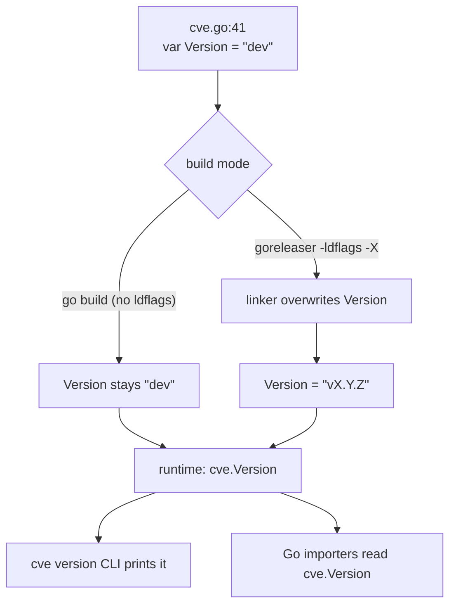

# Version

:::tip 📂 View Source
[`cve.go:41`](https://github.com/scagogogo/cve-skills/blob/main/cve.go#L41-L41) — open the declaration on GitHub (line L41).
:::

`Version` is the package-level version string of the `cve` library — a `var` (not a `const`) deliberately declared so that goreleaser can overwrite it at link time via `-ldflags`. It is the **only** piece of mutable package-level state in the entire library, and it exists solely to be injected by the build toolchain.

:::tip 📌 Scenarios
- Report which version of the library your binary linked against, at runtime, from Go code
- Gate behavior on a known version (e.g. warn if running against `"dev"` in production)
- Let the `cve version` CLI subcommand print the release tag without re-implementing version discovery
:::

## Declaration

```go
// Version 表示当前包的版本号
var Version = "dev"
```

## Type and default

- **Type**: `string`
- **Default value**: `"dev"` — the sentinel returned by a plain `go build` with no ldflags injection
- **Visibility**: exported (capitalized `V`), readable and writable by any importer
- **Mutability**: `var`, not `const` — this is load-bearing, see [Why `var`, not `const`](#why-var-not-const)

## Behavior

- At source-build time (no ldflags), `Version` holds the literal string `"dev"`. This is the expected sentinel, not a bug — it means the binary was built directly from the working tree without a release tag.
- At release-build time, goreleaser passes `-ldflags "-X github.com/scagogogo/cve-skills.Version=vX.Y.Z"` to the linker, which overwrites the `var` with the released semver tag (e.g. `"v1.2.3"`). The default `"dev"` is never seen by users of a released binary.
- The variable is a plain `string` with no accessor, no getter function, and no method. Callers read it directly as `cve.Version`.
- There is no validation on the injected value — whatever string the linker writes is what `cve.Version` reports. goreleaser is trusted to write a well-formed semver tag.
- The variable is read by the CLI's `version` subcommand (`fmt.Println(cve.Version)` in `cmd/version.go`) and may be read the same way by any Go importer.

## Why `var`, not `const`

This is the single most important design constraint on `Version`, and the doc comment in `cve.go` explicitly warns against changing it:

- The Go linker's `-X` flag (`-X importpath.name=value`) can only overwrite a **package-level `var` of type `string`**. It cannot overwrite a `const`.
- If `Version` were declared `const`, the `-ldflags "-X ...Version=v1.2.3"` invocation would **silently no-op** — the build would succeed, the tag would not be injected, and every release binary would report the compile-time default forever. This is a silent failure: no error, no warning, just wrong versions shipped.
- Declaring it `var Version = "dev"` makes the default explicit (`"dev"` for source builds) while leaving the symbol injectable. The `"dev"` default is a deliberate signal: if a user sees `dev` from a release binary, they know the ldflags step was skipped.



## Example

```go
package main

import (
	"fmt"

	"github.com/scagogogo/cve-skills"
)

func main() {
	// Read the linked version at runtime
	fmt.Println("linked against cve-skills", cve.Version)
	// A source build prints:  linked against cve-skills dev
	// A release build prints: linked against cve-skills v1.2.3

	// Gate behavior on the sentinel — useful in CI or startup checks
	if cve.Version == "dev" {
		fmt.Println("warning: running an untagged build")
	}
}
```

Injecting a version at link time from your own build:

```bash
# Build the CLI with a specific version injected
go build -ldflags "-X github.com/scagogogo/cve-skills.Version=v9.9.9" -o cve ./cmd/cve
./cve version
# stdout: v9.9.9

# A plain build with no ldflags keeps the default sentinel
go build -o cve ./cmd/cve
./cve version
# stdout: dev
```

## Use Cases

- **Runtime version reporting** from Go code that imports the library — surface `cve.Version` in your own `--version` flag, startup log line, or health endpoint.
- **Sentinel detection** — branch on `cve.Version == "dev"` to warn when an untagged build is running in a context that expects a release.
- **CLI version output** — the `cve version` subcommand prints `cve.Version` directly; no separate version-discovery mechanism is needed.
- **Reproducible CI logs** — capture `$(cve version)` at the top of a pipeline step so the run is attributable to a specific library version later.

## Notes

- `Version` is the **only** mutable package-level state in the `cve` package. Every other symbol is a stateless top-level function. This is a deliberate design choice — see [Library Design](/guide/library-design).
- The default `"dev"` is a sentinel, not an error. A source build reporting `dev` is behaving correctly; it does not indicate a broken build.
- The injected value is not validated. If a malformed tag is passed via `-ldflags -X`, `cve.Version` will report that malformed string verbatim.
- Changing the declaration from `var` to `const` silently breaks release version injection — the doc comment at `cve.go:26-40` warns against this explicitly.
- There is no build-commit or build-date metadata in `Version`. If you need richer build info, layer it on in your own build script; `Version` carries the semver tag and nothing else.

## Internal Implementation

`Version` is declared at `cve.go:41` as a single-line package-level `var` of type `string`, with the default literal `"dev"`:

- **`var`, not `const`** (L41): the declaration is `var Version = "dev"`. This is the load-bearing choice — the Go linker's `-X` flag can only overwrite a package-level `string` `var`, never a `const`. The doc comment above the declaration (L26–40) explains this and explicitly warns against changing it to `const`.
- **Default `"dev"`** (L41): the initializer is the string literal `"dev"`. For a plain `go build` with no ldflags, this is the value seen at runtime. It is a sentinel meaning "built from source, no release tag injected".
- **Doc comment** (L26–40): a multi-line comment explains the semver format (`vX.Y.Z`), the goreleaser/ldflags injection mechanism (`-X github.com/scagogogo/cve-skills.Version=v1.2.3`), and the `var`-not-`const` constraint. This comment is the source of truth for why the declaration looks the way it does.
- **No accessor**: there is no `GetVersion()` function or method. Callers read `cve.Version` directly — the symbol is exported (capital `V`), so it is visible to any importer.
- **Read site** (`cmd/version.go`): the CLI's `version` subcommand prints `cve.Version` via `fmt.Println(cve.Version)`, which is the only place in the codebase that consumes the variable for output. Library importers read it the same way.

## Complexity

| Resource | Cost | Driver |
|---|---|---|
| Time (read) | O(1) | Reading a package-level `string` var is a single memory load |
| Space | O(len(s)) | One string header; the bytes themselves are interned by the linker at the injected value |
| Initialization | link-time | The value is fixed at link time by `-ldflags -X`, not at runtime — there is no `init()` that touches `Version` |

- There is no per-call cost: `Version` is read as a global, not computed.
- The `"dev"` default and any injected tag are both string literals/constant data baked into the binary by the linker; no allocation happens at read time.

## Edge Cases

| Situation | Behavior | Reported value |
|---|---|---|
| Plain `go build` (no ldflags) | Default initializer is used | `"dev"` |
| `go build -ldflags "-X ...Version=v1.2.3"` | Linker overwrites the `var` with `v1.2.3` | `"v1.2.3"` |
| Released binary (goreleaser) | goreleaser passes the git tag via `-X` | the released tag, e.g. `"v1.2.3"` |
| Malformed ldflags value (`-X ...Version=garbage`) | No validation; linker writes the literal string | `"garbage"` |
| Declaration changed to `const` (do not do this) | `-X` silently no-ops; default is baked as a constant | `"dev"` forever, even for releases |
| Reading `cve.Version` from a Go test of the library itself | No ldflags in `go test`, so the default applies | `"dev"` |
| Empty `-X ...Version=` (empty value) | Linker writes the empty string | `""` |

## Data Flow

```text
+---------------------------+        +---------------------------+
|  cve.go:41                |        |  build toolchain          |
|  var Version = "dev"      |        |  (goreleaser / go build)  |
+-------------+-------------+        +-------------+-------------+
              |                                  |
              |  default initializer             |  -ldflags "-X ...Version=vX.Y.Z"
              |  (string literal "dev")          |  (linker overwrites the var)
              v                                  v
       +---------------------------------------------------+
       |            linked binary .data segment            |
       |   cve.Version = "dev"  OR  cve.Version = "vX.Y.Z" |
       +-----------------------+---------------------------+
                               |
                               |  runtime read (O(1) global load)
                               v
            +----------------------------------------+
            |  consumers                            |
            |  - cmd/version.go: fmt.Println(...)   |
            |  - any Go importer: cve.Version       |
            +----------------------------------------+
```

## Related

- [cve version CLI command](/cli/commands/version) — prints `cve.Version` to stdout
- [Library Design](/guide/library-design) — why `Version` is the only mutable package-level state
- [CLI Conventions](/reference/cli-conventions) — how the CLI reports its version
- [Download & Install](/download) — prebuilt binaries ship with the injected release tag
