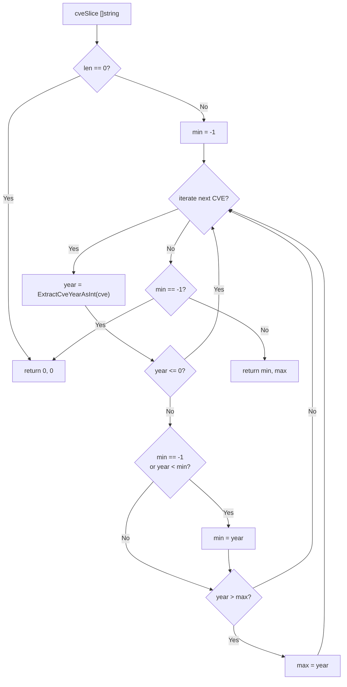

# YearRange

:::tip 📂 View Source
[`filter.go:479`](https://github.com/scagogogo/cve-skills/blob/main/filter.go#L479-L503) — open the implementation on GitHub (lines L479–L503).
:::

`YearRange` scans a list of CVE identifiers and returns the earliest (minimum) and latest (maximum) year present, describing the time span covered by the input.

:::tip 📌 Scenarios
- Determine the time span of a CVE dataset for a security report
- Build a "CVEs from YYYY to YYYY" range description for dashboards
- Validate that imported CVE data falls within an expected historical window
:::

## Function Signature

```go
func YearRange(cveSlice []string) (min, max int)
```

## Parameters

- `cveSlice` ([]string): A slice of CVE identifier strings to be scanned for year boundaries

## Return Values

- `min` (int): The earliest year (minimum) found among valid CVEs; returns `0` if the slice is empty or no valid CVE is present
- `max` (int): The latest year (maximum) found among valid CVEs; returns `0` if the slice is empty or no valid CVE is present

## Behavior

- An empty slice short-circuits immediately and returns `0, 0`
- Internally uses a sentinel `min = -1` to detect the first valid year, then tightens `min`/`max` as it iterates
- Each CVE's year is extracted via `ExtractCveYearAsInt`; entries whose year is `<= 0` (unparseable or invalid) are skipped and do not affect the result
- If no valid CVE is found after the full scan (`min` still `-1`), the function returns `0, 0` so callers can treat `0` as the "no data" signal

## Flowchart



## Example

```go
package main

import (
	"fmt"

	"github.com/scagogogo/cve-skills"
)

func main() {
	// Source-cited example: mixed years produce min=2020, max=2022
	cves := []string{"CVE-2020-1111", "CVE-2022-2222", "CVE-2021-3333"}
	min, max := cve.YearRange(cves)
	fmt.Printf("input: %v -> min=%d, max=%d\n", cves, min, max) // min=2020, max=2022

	// Empty slice: returns 0, 0
	empty := []string{}
	min, max = cve.YearRange(empty)
	fmt.Printf("empty -> min=%d, max=%d\n", min, max) // min=0, max=0

	// Invalid entries are skipped; only valid CVEs contribute
	mixed := []string{"not-a-cve", "", "CVE-2019-9999", "CVE-2018-1"}
	min, max = cve.YearRange(mixed)
	fmt.Printf("mixed -> min=%d, max=%d\n", min, max) // min=2018, max=2019

	// All-invalid input: no valid year found, returns 0, 0
	allInvalid := []string{"garbage", "CVE-YYYY-NNNN", ""}
	min, max = cve.YearRange(allInvalid)
	fmt.Printf("allInvalid -> min=%d, max=%d\n", min, max) // min=0, max=0

	// Single-element slice: min == max
	single := []string{"CVE-2024-12345"}
	min, max = cve.YearRange(single)
	fmt.Printf("single -> min=%d, max=%d\n", min, max) // min=2024, max=2024
}
```

## Use Cases

- Determine the time span of a CVE dataset for trend analysis or reporting
- Generate a "CVEs span from YYYY to YYYY" description for dashboards and summaries
- Sanity-check imported CVE data against an expected historical window
- Provide boundaries for year-bucketed visualizations alongside `CountByYear`

## Notes

- `0` is the sentinel for "no data" — both an empty slice and an all-invalid slice return `0, 0`, so callers should treat `min == 0` as the empty/no-valid-CVE signal rather than a real year
- Year extraction is delegated to `ExtractCveYearAsInt`; entries that fail to parse a positive year are silently skipped, so the range reflects only valid CVEs
- The result is purely descriptive — `YearRange` does not validate whether the years fall within the realistic 1999..current-year window; pair with `IsCveYearOk` for that check
- For a per-year breakdown rather than just the boundaries, use `CountByYear`; for ordered output use `SortCves`
- Complexity is O(n) over the slice with a single pass, and the function is concurrency-safe (read-only)

## Internal Implementation

The function body (L479-L503) is a single-pass scan built around a sentinel value, with no sorting or auxiliary data structure:

- **Empty guard (L480-L482)**: `if len(cveSlice) == 0 { return 0, 0 }` short-circuits before any iteration, so a nil or empty slice never touches the sentinel logic and returns the canonical "no data" pair `0, 0`.
- **Sentinel init (L484)**: `min = -1` uses `-1` (an impossible real year) as the "no valid year seen yet" marker. Because `max` is the zero value `0`, only `min` needs a sentinel to distinguish "first valid year" from "tighten an existing minimum".
- **Per-element extraction (L486)**: `year := ExtractCveYearAsInt(cve)` delegates parsing entirely to the shared extractor, so `YearRange` inherits whatever normalization (digits, sign, error) that helper applies, keeping year-parsing logic in one place.
- **Skip-invalid (L487-L489)**: `if year <= 0 { continue }` drops unparseable or non-positive years without affecting `min`/`max`, so garbage entries are invisible to the result rather than corrupting the boundaries.
- **Tighten bounds (L490-L495)**: `if min == -1 || year < min { min = year }` seeds the minimum on the first valid year and updates it on any smaller one; `if year > max { max = year }` tracks the running maximum. The two comparisons are independent, so a single new CVE can update either or both bounds in one iteration.
- **Final sentinel check (L498-L500)**: `if min == -1 { return 0, 0 }` maps the "scanned everything but found no valid year" case back to the same `0, 0` signal as the empty case, giving callers one branch to test for "no data".

## Complexity

| Dimension | Cost | Reason |
|---|---|---|
| Time | O(n) | One forward pass over the `n`-element slice; each element does a constant amount of work (one `ExtractCveYearAsInt` call plus up to two comparisons) |
| Space | O(1) | Only the two named return values `min`, `max` and the loop-local `year`/`cve` are held; no slice, map, or recursion is allocated |
| Auxiliary calls | O(n) × `ExtractCveYearAsInt` | Each element triggers one extractor call; the extractor itself is independent of this function's complexity |

Notes: the scan is read-only and side-effect-free, so it is safe for concurrent use across goroutines sharing the same input slice. Worst case (all entries invalid) still terminates in O(n) and returns the sentinel `0, 0`.

## Edge Cases

| Input | Behavior | Return |
|---|---|---|
| `nil` or `[]` (empty slice) | `len == 0` guard fires immediately, no iteration | `0, 0` |
| All entries invalid (`"garbage"`, `""`, `"CVE-YYYY-NNNN"`) | Every `year <= 0`, all skipped; `min` stays `-1`; final check returns `0, 0` | `0, 0` |
| Mixed valid + invalid (`"not-a-cve", "CVE-2019-9999"`) | Invalid entries skipped via `continue`; only valid years seed/update bounds | `(min, max)` of valid years only |
| Single valid CVE (`"CVE-2024-12345"`) | First valid year seeds both `min` and `max` (since `year > 0 == max`) | `year, year` |
| Duplicate years (`"CVE-2020-1", "CVE-2020-2"`) | Second equal year fails `year < min` and `year > max`, bounds unchanged | `2020, 2020` |
| Case variation in input strings | Handed to `ExtractCveYearAsInt`; this function does no case-folding itself — tolerance depends on the extractor | Per extractor behavior |
| Years out of realistic window (e.g. `CVE-0001-1`, `CVE-9999-1`) | Not validated here — any positive integer is accepted as a boundary | `(1, 9999)` (pair with `IsCveYearOk` to reject) |

## Data Flow

```text
+---------------------+
| cveSlice []string   |
|  (input CVE list)   |
+----------+----------+
           |
           v
   +-------+-------+
   | len == 0 ?    |
   +-------+-------+
      |        |
   Yes|        |No
      v        v
+----+----+ +--+------+
| return  | | min = -1|
| 0, 0    | | max = 0 |
+---------+ +----+----+
                 |
                 v
          +------+------+
          | for each cve|
          |  in slice   |
          +------+------+
                 |
                 v
          +------+----------------+
          | year = ExtractCveYear |
          |        AsInt(cve)      |
          +------+----------------+
                 |
                 v
          +------+------+
          | year <= 0 ?  |
          +------+------+
            |        |
          Yes|        |No
            v        v
     +------+--+ +---+----------------+
     | continue | | min == -1         |
     | (skip)   | | or year < min ?   |
     +---------+ +---+----------------+
                    |           |
                  Yes|           |No
                    v           v
              +----+----+ +----+--------------+
              | min =   | | year > max ?      |
              |  year   | +----+--------------+
              +----+----+   |          |
                    |     Yes|          |No
                    |        v          |
                    |  +----+----+      |
                    |  | max =   |      |
                    |  |  year   |      |
                    |  +----+----+      |
                    |        |          |
                    +--------+----------+
                             |
                             v
                      (next iteration)
                             |
                  (slice exhausted)
                             |
                             v
                   +---------+---------+
                   | min == -1 ?       |
                   +---------+---------+
                      |             |
                    Yes|             |No
                      v              v
                +-----+----+   +-----+--------+
                | return   |   | return       |
                | 0, 0     |   | min, max     |
                +----------+   +--------------+
```

## Related Functions

- [CountByYear](/api/functions/count-by-year) — group CVEs by year and count each
- [ExtractCveYearAsInt](/api/functions/extract-cve-year-as-int) — extract the year as an integer used internally
- [SortCves](/api/functions/sort-cves) — sort CVEs chronologically
- [GetRecentCves](/api/functions/get-recent-cves) — fetch the most recent CVEs by year
- [Statistics category](/api/statistics)
