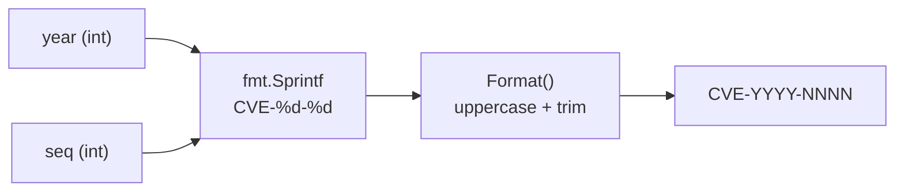
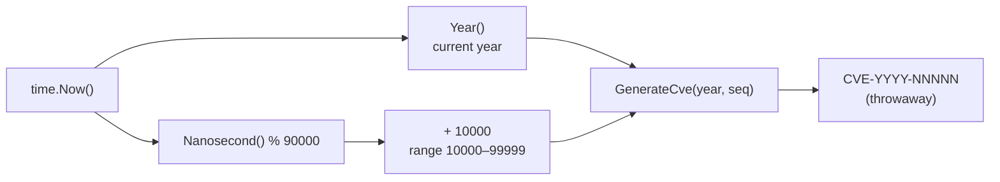
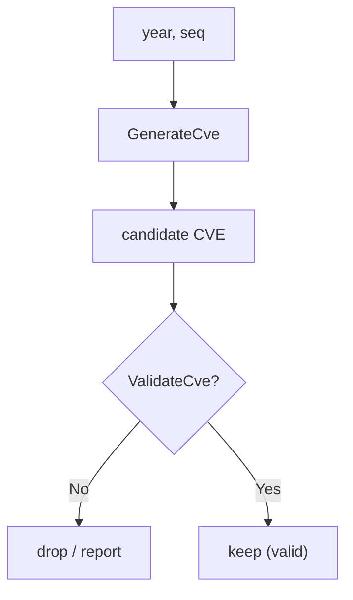

# Generation & Construction

This category of functions generates new CVE identifiers, mainly for testing, simulation, and dynamic creation of CVE IDs.

## GenerateCve

Generate a standard-format CVE identifier from a year and sequence number.

### Function Signature

```go
func GenerateCve(year int, seq int) string
```

### Parameters

- `year` (int): CVE year
- `seq` (int): CVE sequence number

### Return Value

- `string`: Generated standard-format CVE identifier

### Description

The `GenerateCve` function creates a standard CVE identifier from the given year and sequence number:
- Automatically formats to the standard `CVE-YYYY-NNNN` format
- Does **not** validate the year or sequence number
- Uses the `Format` function internally to ensure the standard format

The two inputs flow straight into `Format` with no validation in between:



### Example

```go
func main() {
    // Basic usage
    cveId := cve.GenerateCve(2022, 12345)
    fmt.Printf("Generated CVE: %s\n", cveId)
    // Output: CVE-2022-12345

    // Batch generation
    fmt.Println("\nBatch generation example:")
    for i := 1; i <= 5; i++ {
        cveId := cve.GenerateCve(2024, i)
        fmt.Printf("CVE #%d: %s\n", i, cveId)
    }

    // Different years
    years := []int{2020, 2021, 2022, 2023, 2024}
    fmt.Println("\nDifferent years:")
    for _, year := range years {
        cveId := cve.GenerateCve(year, 1000)
        fmt.Printf("%d: %s\n", year, cveId)
    }

    // Different sequence lengths
    sequences := []int{1, 10, 100, 1000, 10000, 100000}
    fmt.Println("\nDifferent sequence lengths:")
    for _, seq := range sequences {
        cveId := cve.GenerateCve(2024, seq)
        fmt.Printf("Sequence %6d: %s\n", seq, cveId)
    }
}
```

### Use Cases

- **Test data generation**: Create CVE data for unit tests
- **Simulation and demos**: Generate sample CVEs for demonstration
- **Data population**: Create test data for development environments
- **CVE ID pre-allocation**: Generate placeholders before formal assignment
- **Batch data generation**: Create large volumes of test CVEs

### Caveats

- This function does not validate the reasonableness of the year or sequence
- It can generate invalid CVEs (e.g., a negative year)
- Use it together with a validation function
- Generated CVEs may collide with real CVEs

## GenerateFakeCve

Generate a CVE with the current year and a random sequence number, mainly for testing and demos.

### Function Signature

```go
func GenerateFakeCve() string
```

### Return Value

- `string`: A CVE for the current year with a random sequence in the range `10000`–`99999`

### Description

`GenerateFakeCve` uses `time.Now().Year()` as the year and derives the sequence from the current nanosecond, so successive calls generally differ. It is a convenience wrapper over `GenerateCve`, intended only for generating throwaway test data — never use it for real CVE assignment.



### Example

```go
fake := cve.GenerateFakeCve()
fmt.Println(fake) // e.g. CVE-2023-42137

// Build a batch of test CVEs
var testCves []string
for i := 0; i < 5; i++ {
    testCves = append(testCves, cve.GenerateFakeCve())
}
```

::: tip
When you need to zero-pad the sequence for alignment, combine with [`FormatSeq`](/api/format-validate#formatseq):
`cve.FormatSeq(cve.GenerateCve(2022, 123), 6)` → `CVE-2022-000123`.
:::

## Real-World Examples

### 1. Test Data Generator

```go
// CVE test data generator
type CveGenerator struct {
    BaseYear     int
    YearRange    int
    MaxSequence  int
    MinSequence  int
}

func NewCveGenerator() *CveGenerator {
    return &CveGenerator{
        BaseYear:    2020,
        YearRange:   5,     // 2020-2024
        MaxSequence: 99999,
        MinSequence: 1,
    }
}

func (g *CveGenerator) GenerateRandom(count int) []string {
    var cves []string

    for i := 0; i < count; i++ {
        year := g.BaseYear + rand.Intn(g.YearRange)
        seq := g.MinSequence + rand.Intn(g.MaxSequence-g.MinSequence+1)

        cveId := cve.GenerateCve(year, seq)
        cves = append(cves, cveId)
    }

    return cves
}

func (g *CveGenerator) GenerateSequential(year, startSeq, count int) []string {
    var cves []string

    for i := 0; i < count; i++ {
        seq := startSeq + i
        cveId := cve.GenerateCve(year, seq)
        cves = append(cves, cveId)
    }

    return cves
}

func (g *CveGenerator) GenerateByYear(yearCounts map[int]int) []string {
    var cves []string

    for year, count := range yearCounts {
        for i := 1; i <= count; i++ {
            cveId := cve.GenerateCve(year, i)
            cves = append(cves, cveId)
        }
    }

    return cves
}

func main() {
    generator := NewCveGenerator()

    // Generate random CVEs
    randomCves := generator.GenerateRandom(10)
    fmt.Printf("Random (%d): %v\n", len(randomCves), randomCves)

    // Generate a sequential series
    sequential := generator.GenerateSequential(2024, 1000, 5)
    fmt.Printf("Sequential: %v\n", sequential)

    // Generate by year
    yearCounts := map[int]int{
        2022: 3,
        2023: 5,
        2024: 2,
    }
    byYear := generator.GenerateByYear(yearCounts)
    fmt.Printf("By year: %v\n", byYear)
}
```

### 2. Unit Test Helpers

```go
// Test helper
func createTestCves(years []int, seqsPerYear int) []string {
    var testCves []string

    for _, year := range years {
        for seq := 1; seq <= seqsPerYear; seq++ {
            cveId := cve.GenerateCve(year, seq)
            testCves = append(testCves, cveId)
        }
    }

    return testCves
}

func createMixedFormatCves(year, count int) []string {
    var cves []string

    for i := 1; i <= count; i++ {
        cveId := cve.GenerateCve(year, i)

        // Randomly vary the format for testing
        switch i % 3 {
        case 0:
            cves = append(cves, strings.ToLower(cveId)) // lowercase
        case 1:
            cves = append(cves, " "+cveId+" ")          // add spaces
        default:
            cves = append(cves, cveId)                  // standard format
        }
    }

    return cves
}

// Usage
func TestCveProcessing(t *testing.T) {
    // Create test data
    testYears := []int{2020, 2021, 2022}
    testCves := createTestCves(testYears, 3)

    // Test sorting
    sorted := cve.SortCves(testCves)
    if len(sorted) != len(testCves) {
        t.Errorf("Length mismatch after sort")
    }

    // Test grouping
    grouped := cve.GroupByYear(testCves)
    if len(grouped) != len(testYears) {
        t.Errorf("Group count mismatch")
    }

    // Test format handling
    mixedCves := createMixedFormatCves(2024, 6)
    unique := cve.RemoveDuplicateCves(mixedCves)
    if len(unique) != 6 {
        t.Errorf("Dedup result incorrect")
    }
}
```

### 3. Performance Test Data Generation

```go
func generatePerformanceTestData(size int) []string {
    fmt.Printf("Generating %d CVEs for performance testing...\n", size)

    var cves []string
    startTime := time.Now()

    // Generate a large volume of CVE data
    for i := 0; i < size; i++ {
        year := 2020 + (i % 5)        // cycle 2020-2024
        seq := i + 1

        cveId := cve.GenerateCve(year, seq)
        cves = append(cves, cveId)
    }

    duration := time.Since(startTime)
    fmt.Printf("Done, took: %v\n", duration)

    return cves
}

func benchmarkCveOperations(cves []string) {
    fmt.Println("=== CVE operation performance test ===")

    // Test sort performance
    start := time.Now()
    sorted := cve.SortCves(cves)
    sortDuration := time.Since(start)
    fmt.Printf("Sort %d CVEs took: %v\n", len(cves), sortDuration)

    // Test dedup performance
    start = time.Now()
    unique := cve.RemoveDuplicateCves(sorted)
    dedupDuration := time.Since(start)
    fmt.Printf("Dedup %d CVEs took: %v\n", len(sorted), dedupDuration)

    // Test group performance
    start = time.Now()
    grouped := cve.GroupByYear(unique)
    groupDuration := time.Since(start)
    fmt.Printf("Group %d CVEs took: %v\n", len(unique), groupDuration)

    fmt.Printf("Group result: %d years\n", len(grouped))
}

func main() {
    // Generate test data at different scales
    sizes := []int{1000, 10000, 100000}

    for _, size := range sizes {
        fmt.Printf("\n=== Scale: %d ===\n", size)
        testData := generatePerformanceTestData(size)
        benchmarkCveOperations(testData)
    }
}
```

### 4. Simulate a Real Scenario

```go
// Simulate a vulnerability discovery scenario
type VulnerabilitySimulator struct {
    CurrentYear int
    NextSeq     map[int]int // next sequence per year
}

func NewVulnerabilitySimulator() *VulnerabilitySimulator {
    return &VulnerabilitySimulator{
        CurrentYear: time.Now().Year(),
        NextSeq:     make(map[int]int),
    }
}

func (vs *VulnerabilitySimulator) DiscoverVulnerability(year int) string {
    if vs.NextSeq[year] == 0 {
        vs.NextSeq[year] = 1
    }

    cveId := cve.GenerateCve(year, vs.NextSeq[year])
    vs.NextSeq[year]++

    return cveId
}

func (vs *VulnerabilitySimulator) SimulateYear(year int, count int) []string {
    var discoveries []string

    for i := 0; i < count; i++ {
        cveId := vs.DiscoverVulnerability(year)
        discoveries = append(discoveries, cveId)
    }

    return discoveries
}

func (vs *VulnerabilitySimulator) GetStatistics() map[int]int {
    stats := make(map[int]int)
    for year, nextSeq := range vs.NextSeq {
        stats[year] = nextSeq - 1 // minus 1 because nextSeq is the next sequence to assign
    }
    return stats
}

func main() {
    simulator := NewVulnerabilitySimulator()

    // Simulate years of vulnerability discovery
    fmt.Println("=== Vulnerability discovery simulation ===")

    allDiscoveries := []string{}

    // Simulate discovery across 2022-2024
    yearlyCount := map[int]int{
        2022: 15,
        2023: 25,
        2024: 10,
    }

    for year, count := range yearlyCount {
        discoveries := simulator.SimulateYear(year, count)
        allDiscoveries = append(allDiscoveries, discoveries...)
        fmt.Printf("%d: %d vulnerabilities found: %v\n", year, count, discoveries[:3]) // show first 3 only
    }

    // Statistics
    stats := simulator.GetStatistics()
    fmt.Println("\nStatistics:")
    for year, count := range stats {
        fmt.Printf("%d: %d vulnerabilities\n", year, count)
    }

    // Analyze the generated data
    fmt.Printf("\nTotal generated: %d CVEs\n", len(allDiscoveries))
    grouped := cve.GroupByYear(allDiscoveries)
    fmt.Printf("Spread across %d years\n", len(grouped))
}
```

### 5. CVE ID Validator

```go
func validateGeneratedCves(cves []string) (valid, invalid []string) {
    for _, cveId := range cves {
        if cve.ValidateCve(cveId) {
            valid = append(valid, cveId)
        } else {
            invalid = append(invalid, cveId)
        }
    }
    return
}

func generateAndValidate(year, count int) {
    fmt.Printf("=== Generate and validate %d CVEs for year %d ===\n", count, year)

    // Generate CVEs
    var generated []string
    for i := 1; i <= count; i++ {
        cveId := cve.GenerateCve(year, i)
        generated = append(generated, cveId)
    }

    // Validate the generated CVEs
    valid, invalid := validateGeneratedCves(generated)

    fmt.Printf("Generated: %d\n", len(generated))
    fmt.Printf("Valid: %d\n", len(valid))
    fmt.Printf("Invalid: %d\n", len(invalid))

    if len(invalid) > 0 {
        fmt.Printf("Invalid CVEs: %v\n", invalid)
    }

    // Test edge cases
    fmt.Println("\nEdge case tests:")

    // Test invalid year
    invalidYear := cve.GenerateCve(-1, 1)
    fmt.Printf("Negative year: %s (valid: %t)\n", invalidYear, cve.ValidateCve(invalidYear))

    // Test zero sequence
    zeroSeq := cve.GenerateCve(2024, 0)
    fmt.Printf("Zero sequence: %s (valid: %t)\n", zeroSeq, cve.ValidateCve(zeroSeq))

    // Test large sequence
    largeSeq := cve.GenerateCve(2024, 999999)
    fmt.Printf("Large sequence: %s (valid: %t)\n", largeSeq, cve.ValidateCve(largeSeq))
}

func main() {
    generateAndValidate(2024, 5)
}
```

Because `GenerateCve` performs no validation, the recommended pattern is to generate then validate, dropping any invalid results:



## Best Practices

### 1. Pair with a Validation Function

```go
func generateValidCve(year, seq int) (string, error) {
    cveId := cve.GenerateCve(year, seq)

    if !cve.ValidateCve(cveId) {
        return "", fmt.Errorf("generated CVE is invalid: %s", cveId)
    }

    return cveId, nil
}
```

### 2. Batch Generation Optimization

```go
func generateCveBatch(year, startSeq, count int) []string {
    cves := make([]string, count)

    for i := 0; i < count; i++ {
        cves[i] = cve.GenerateCve(year, startSeq+i)
    }

    return cves
}
```

### 3. Avoid Collisions

```go
func generateUniqueCves(existingCves []string, year, count int) []string {
    existing := make(map[string]bool)
    for _, cveId := range existingCves {
        existing[cveId] = true
    }

    var newCves []string
    seq := 1

    for len(newCves) < count {
        candidate := cve.GenerateCve(year, seq)
        if !existing[candidate] {
            newCves = append(newCves, candidate)
            existing[candidate] = true
        }
        seq++
    }

    return newCves
}
```

## Performance Notes

- `GenerateCve` is highly performant; the main cost is string formatting
- For batch generation, pre-allocate slice capacity
- For large-scale generation, consider parallelizing with goroutines
- Memory usage scales linearly with the number of generated CVEs

## Caveats

1. **No validity check**: `GenerateCve` does not check the reasonableness of the year or sequence
2. **Possible collisions**: Generated CVEs may collide with real CVEs
3. **Test use only**: Must not be used for real CVE assignment in production
4. **Format guaranteed**: Always produces standard-format CVE identifiers
