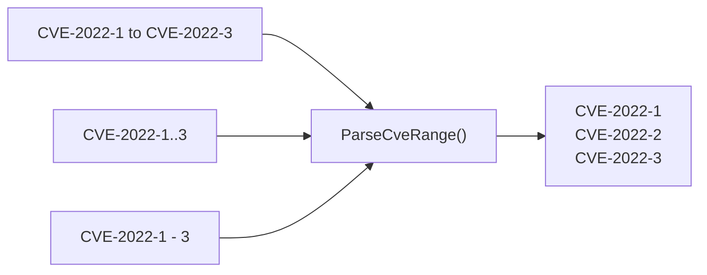

# Range & Pattern

This category of functions provides CVE range parsing, wildcard pattern matching, and consecutive CVE checking.

`ParseCveRange` accepts three separator syntaxes, all expanding to the same list:



## ParseCveRange

Parse a CVE range expression and expand it into a list of individual CVE identifiers.

### Function Signature

```go
func ParseCveRange(rangeExpr string) []string
```

### Parameters

- `rangeExpr` (string): Range expression in one of the supported formats

### Return Value

- `[]string`: All CVE identifiers within the range; nil if the expression is invalid

### Supported Formats

- `CVE-2022-12345 to CVE-2022-12350` (keyword "to")
- `CVE-2022-12345..12350` (double dots)
- `CVE-2022-12345-12350` (dash separator)

### Description

The `ParseCveRange` function parses CVE range expressions commonly found in security bulletins and expands them into individual CVE identifiers. Both the start and end must be within the same year.

### Example

```go
cves := cve.ParseCveRange("CVE-2022-12345 to CVE-2022-12348")
fmt.Println(cves)
// Output: [CVE-2022-12345 CVE-2022-12346 CVE-2022-12347 CVE-2022-12348]
```

## IsCvesConsecutive

Check if two CVE identifiers are consecutive (same year, adjacent sequence numbers).

### Function Signature

```go
func IsCvesConsecutive(a, b string) bool
```

### Parameters

- `a` (string): First CVE identifier
- `b` (string): Second CVE identifier

### Return Value

- `bool`: true if the two CVEs have the same year and their sequence numbers differ by exactly 1

### Example

```go
fmt.Println(cve.IsCvesConsecutive("CVE-2022-12345", "CVE-2022-12346"))
// Output: true
fmt.Println(cve.IsCvesConsecutive("CVE-2022-12345", "CVE-2022-12347"))
// Output: false
```

## FilterCvesByPattern

Filter CVE identifiers by wildcard pattern.

### Function Signature

```go
func FilterCvesByPattern(cveSlice []string, pattern string) []string
```

### Parameters

- `cveSlice` ([]string): CVE identifiers to filter
- `pattern` (string): Wildcard pattern (e.g., `CVE-2022-*`, `CVE-*-1111`, `CVE-2022-1*`)

### Return Value

- `[]string`: CVEs matching the pattern, formatted and sorted; nil if no matches

### Description

The `FilterCvesByPattern` function supports simple wildcard matching with `*` matching any sequence of characters. Pattern is case-insensitive. Special characters like `.`, `+`, `[` etc. are auto-escaped.

### Example

```go
cves := []string{"CVE-2022-1111", "CVE-2022-2222", "CVE-2023-1111", "CVE-2023-2222"}

cves2022 := cve.FilterCvesByPattern(cves, "CVE-2022-*")
fmt.Println(cves2022)
// Output: [CVE-2022-1111 CVE-2022-2222]

cve1111 := cve.FilterCvesByPattern(cves, "CVE-*-1111")
fmt.Println(cve1111)
// Output: [CVE-2022-1111 CVE-2023-1111]
```

::: tip Related
Need to normalize sequence-number width for aligned output? See [`FormatSeq`](/api/format-validate#formatseq) under Format & Validation.
:::
