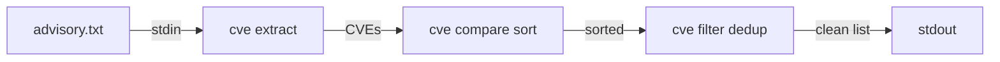

# CLI Reference

The `cve` command-line tool exposes the full library as composable, deterministic
subcommands. It is designed to be driven by **AI agents and shell pipelines**:
every command reads from arguments *or* stdin, writes plain lines to stdout, and
uses a stable exit code — no interactive prompts, no colors, no surprises.

## Install

See the [Download & Install](/download) page for prebuilt binaries and package
managers. The quickest options:

```bash
# Prebuilt binary, no Go toolchain required
curl -fsSL https://raw.githubusercontent.com/scagogogo/cve-skills/main/scripts/install.sh | bash

# Or via Go
go install github.com/scagogogo/cve-skills/cmd/cve@latest
```

Verify:

```bash
cve version
```

## I/O conventions

These rules hold for every subcommand, which is what makes the tool safe to
script against:

| Aspect | Behavior |
|--------|-----------|
| **Input** | Positional arguments, **or** stdin (one item per line) when no args are given. |
| **List inputs** | Commands taking `<cve-list>` accept comma-separated values *and* multiple args/lines. |
| **Output** | One result per line on stdout. Multi-field rows are `\t`-separated. |
| **Booleans** | Printed literally as `true` / `false`. |
| **Empty result** | No stdout lines (exit code still `0`). |
| **Errors** | Message on stderr, exit code `1`. Usage/errors are silenced from stdout. |
| **`-q, --quiet`** | Global flag to suppress non-essential output. |

Because input falls back to stdin, commands chain naturally:

```bash
cat advisory.txt | cve extract | cve compare sort | cve filter dedup
```

Each stage reads the previous stage's stdout, one CVE per line:



## Command tree

```text
cve
├── format <cve...>                     Format to standard uppercase
├── format-seq <width> <cve>            Zero-pad the sequence number
├── validate <cve...>                   Full validation (format + year + seq)
│   ├── is-cve <text...>                Is the text exactly a CVE?
│   ├── contains-cve <text...>          Does the text contain a CVE?
│   └── year-ok <cve...> [--cutoff N]   Is the year in range 1999..now(+N)?
├── validate-batch <cve-list>          Per-item validation with reasons
├── filter-valid <cve-list>            Keep only valid CVEs
├── extract <text...>                   Extract all CVEs from text
│   ├── first <text...>                 First CVE only
│   ├── last <text...>                  Last CVE only
│   ├── year <cve...>                   Year part
│   ├── seq <cve...>                    Sequence part
│   └── split <cve...>                  year<TAB>seq
├── compare <a> <b>                     -1 / 0 / 1
│   ├── by-year <a> <b>                 Compare by year only
│   └── sort <cve...>                   Sort ascending
├── filter                              (group; see subcommands)
│   ├── by-year --year Y <cve...>       Keep a single year
│   ├── by-year-range --start --end     Keep an inclusive year range
│   ├── recent --years N <cve...>       Keep the most recent N years
│   ├── group-by-year <cve...>          Group, printed per year
│   └── dedup <cve...>                  Remove duplicates (case-insensitive)
├── filter-pattern <pattern> <list>     Wildcard filter, e.g. "CVE-2022-*"
├── intersect <list1> <list2>           Set intersection
├── union <list1> <list2>               Set union
├── diff <list1> <list2>                Set difference (list1 - list2)
├── parse-range <range-expr>            Expand a range into individual CVEs
├── is-consecutive <a> <b>              Are two CVEs adjacent?
├── count-by-year <cve-list>            Count per year
├── year-range <cve-list>              Earliest/latest year + span
├── seq-range <year> <cve-list>        Min/max sequence for a year
├── generate                            (group; see subcommands)
│   ├── cve --year Y --seq S            Build one CVE
│   └── fake                            Random current-year CVE (testing)
└── version                             Print the version
```

## Format & Validation

### `format`

Normalize CVE identifiers to standard uppercase (trims whitespace, upper-cases
the `CVE` prefix).

```bash
$ cve format cve-2022-12345 " CVE-2021-44228 "
CVE-2022-12345
CVE-2021-44228
```

### `format-seq`

Zero-pad the sequence number to a fixed width. Arguments: `<width> <cve>`.

```bash
$ cve format-seq 7 CVE-2022-123
CVE-2022-0000123
```

### `validate`

Full validation — checks format, year range (1999 to the current year) and a
positive sequence number. Output is `formatted-cve<TAB>bool`.

```bash
$ cve validate CVE-2022-12345 CVE-1998-12345
CVE-2022-12345	true
CVE-1998-12345	false
```

#### `validate is-cve`

Is the whole input string *exactly* a CVE identifier? Output: `input<TAB>bool`.

```bash
$ cve validate is-cve CVE-2022-12345 "text CVE-2022-1"
CVE-2022-12345	true
text CVE-2022-1	false
```

#### `validate contains-cve`

Does the input contain at least one CVE anywhere? Output: `true` / `false`.

```bash
$ cve validate contains-cve "affected by CVE-2021-44228"
true
```

#### `validate year-ok`

Is the CVE's year within `1999..currentYear`? Pass `--cutoff N` (`-c`) to allow
up to `N` years into the future. Output: `formatted-cve<TAB>bool`.

```bash
$ cve validate year-ok CVE-2022-1 CVE-1998-1
CVE-2022-1	true
CVE-1998-1	false
```

### `validate-batch`

Validate a list and print a per-item verdict with a reason on failure.

```bash
$ cve validate-batch "CVE-2022-12345,CVE-1998-1,not-a-cve"
✓ CVE-2022-12345
✗ CVE-1998-1 — year 1998 is before 1999
✗ not-a-cve — invalid CVE format
```

### `filter-valid`

Filter a list down to only the valid CVEs.

```bash
$ cve filter-valid "CVE-2022-12345,bad,CVE-2021-44228"
CVE-2022-12345
CVE-2021-44228
```

## Extraction

### `extract`

Extract every CVE found in free text.

```bash
$ cve extract "System affected by CVE-2021-44228 and CVE-2022-12345"
CVE-2021-44228
CVE-2022-12345
```

Subcommands narrow the result:

```bash
$ cve extract first "CVE-2021-44228 and CVE-2022-12345"   # → CVE-2021-44228
$ cve extract last  "CVE-2021-44228 and CVE-2022-12345"   # → CVE-2022-12345
$ cve extract year  CVE-2022-12345                        # → 2022
$ cve extract seq   CVE-2022-12345                        # → 12345
```

### `extract split`

Split into year and sequence, tab-separated (`year<TAB>seq`).

```bash
$ cve extract split CVE-2022-12345
2022	12345
```

## Comparison & Sorting

### `compare`

Compare two CVEs by year *and* sequence. Output: `-1` (a < b), `0` (equal),
`1` (a > b).

```bash
$ cve compare CVE-2021-44228 CVE-2022-12345
-1
```

### `compare by-year`

Compare by year only (sign indicates order, magnitude is the year delta).

```bash
$ cve compare by-year CVE-2022-1 CVE-2021-9
1
```

### `compare sort`

Sort a list ascending by year then sequence.

```bash
$ cve compare sort CVE-2022-2222 CVE-2020-1111 CVE-2022-1111
CVE-2020-1111
CVE-2022-1111
CVE-2022-2222
```

## Filtering & Grouping

### `filter by-year`

Keep only CVEs of a given year (`--year`, `-y`, required).

```bash
$ cve filter by-year --year 2022 CVE-2021-1111 CVE-2022-2222 CVE-2022-3333
CVE-2022-2222
CVE-2022-3333
```

### `filter by-year-range`

Keep CVEs within an inclusive year range (`--start`/`-s`, `--end`/`-e`).

```bash
$ cve filter by-year-range --start 2021 --end 2022 CVE-2020-1 CVE-2021-2 CVE-2022-3 CVE-2023-4
CVE-2021-2
CVE-2022-3
```

### `filter recent`

Keep CVEs from the most recent `N` years (`--years`, `-n`, required). The window
is `[currentYear - N + 1, currentYear]`.

```bash
$ cve filter recent --years 2 CVE-2020-1 CVE-2025-2 CVE-2026-3
CVE-2025-2
CVE-2026-3
```

### `filter group-by-year`

Group by year, printed as `year:` headers with indented members (years sorted).

```bash
$ cve filter group-by-year CVE-2021-1111 CVE-2022-2222 CVE-2021-3333
2021:
  CVE-2021-1111
  CVE-2021-3333
2022:
  CVE-2022-2222
```

### `filter dedup`

Remove duplicates (case-insensitive), preserving first-seen order.

```bash
$ cve filter dedup CVE-2022-1111 cve-2022-1111 CVE-2022-2222
CVE-2022-1111
CVE-2022-2222
```

### `filter-pattern`

Wildcard filter using `*`. Arguments: `<pattern> <cve-list>`.

```bash
$ cve filter-pattern "CVE-2022-*" "CVE-2021-1,CVE-2022-2,CVE-2022-3"
CVE-2022-2
CVE-2022-3
```

## Set Operations

Each takes two comma-separated lists.

```bash
$ cve intersect "CVE-2021-1,CVE-2022-2" "CVE-2022-2,CVE-2023-3"
CVE-2022-2

$ cve union "CVE-2021-1,CVE-2022-2" "CVE-2022-2,CVE-2023-3"
CVE-2021-1
CVE-2022-2
CVE-2023-3

$ cve diff "CVE-2021-1,CVE-2022-2" "CVE-2022-2,CVE-2023-3"
CVE-2021-1
```

## Range & Pattern

### `parse-range`

Expand a range expression into individual CVEs. Three separator syntaxes are
supported:

| Syntax | Right-hand side | Example |
|--------|-----------------|---------|
| `to` | full CVE | `CVE-2022-1 to CVE-2022-3` |
| `..` | sequence only | `CVE-2022-1..4` |
| `-` | sequence only | `CVE-2022-1 - 3` |

```bash
$ cve parse-range "CVE-2022-1..4"
CVE-2022-1
CVE-2022-2
CVE-2022-3
CVE-2022-4
```

### `is-consecutive`

Check whether two CVEs share a year and have adjacent sequence numbers.

```bash
$ cve is-consecutive CVE-2022-1 CVE-2022-2
CVE-2022-1 and CVE-2022-2 are consecutive
```

## Statistics

### `count-by-year`

Count CVEs per year.

```bash
$ cve count-by-year "CVE-2021-1,CVE-2022-2,CVE-2021-3"
2021: 2
2022: 1
```

### `year-range`

Report the earliest and latest year plus the span.

```bash
$ cve year-range "CVE-2019-1,CVE-2022-2,CVE-2025-3"
Year range: 2019 - 2025 (span: 6 years)
```

### `seq-range`

Report the min/max sequence for a specific year. Arguments: `<year> <cve-list>`.

```bash
$ cve seq-range 2022 "CVE-2022-100,CVE-2022-5000,CVE-2022-42"
Year 2022 sequence range: 42 - 5000
```

## Generation

### `generate cve`

Build one CVE from `--year` (`-y`) and `--seq` (`-s`).

```bash
$ cve generate cve --year 2022 --seq 12345
CVE-2022-12345
```

### `generate fake`

Emit a random CVE for the current year (testing/demo only).

```bash
$ cve generate fake
CVE-2026-56291
```

## Version

```bash
$ cve version
```

Prints the build version (injected at release time via goreleaser; a source
build reports `dev`).

## See also

- [API Reference](/api/) — the same operations as typed Go functions.
- [Download & Install](/download) — all platforms and package formats.
