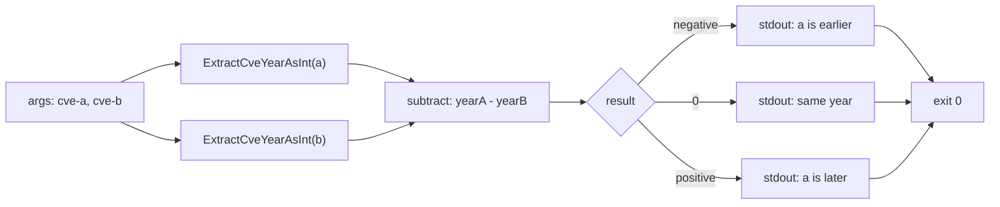

# cve compare by-year

:::tip 📂 View Source
[`cmd/compare.go:48`](https://github.com/scagogogo/cve-skills/blob/main/cmd/compare.go#L48-L62) — open the cobra command definition on GitHub (lines L48–L62).
:::

Compare two CVE identifiers by **year only** and print the signed year difference — negative when the first is earlier, zero when they share a year, positive when the first is later.

:::tip 🖥️ When to use
- Ordering or bucketing CVEs by publication year when the sequence number is irrelevant.
- Computing the year gap between two advisories (e.g. "how many years apart are these?").
- A lightweight year-based predicate inside a shell pipeline, where only the sign of the result matters.
:::

## Command syntax

```bash
cve compare by-year <cve-a> <cve-b>
```

The command takes exactly two positional arguments and writes a single integer to stdout. Unlike list-taking subcommands, it does **not** fall back to stdin — both CVEs must be supplied as arguments.

## Arguments and options

- `<cve-a>` (positional, required): The first CVE identifier, e.g. `CVE-2021-44228`.
- `<cve-b>` (positional, required): The second CVE identifier, e.g. `CVE-2022-12345`.
- This command defines **no flags** of its own. The global `-q, --quiet` flag is inherited from the root command.
- Argument count is enforced by `cobra.ExactArgs(2)`: supplying fewer or more than two arguments exits with code `1` and a usage error on stderr.

## Examples

The first CVE is one year earlier, so the result is `-1`:

```bash
$ cve compare by-year CVE-2021-44228 CVE-2022-12345
-1
```

Same year, different sequence — the sequence is ignored, so the result is `0`:

```bash
$ cve compare by-year CVE-2022-1 CVE-2022-99999
0
```

The first CVE is later; the magnitude is the year gap (here `2023 - 2021 = 2`):

```bash
$ cve compare by-year CVE-2023-1111 CVE-2021-2222
2
```

Use the sign in a shell conditional to branch on recency:

```bash
$ if [ "$(cve compare by-year CVE-2024-1 CVE-2021-1)" -gt 0 ]; then echo "newer"; fi
newer
```

## How it works



## Corresponding Go API

This command is a thin wrapper around [`CompareByYear`](/api/functions/compare-by-year), which returns `ExtractCveYearAsInt(cveA) - ExtractCveYearAsInt(cveB)`. The return value is therefore the **signed year difference**, not the `-1 / 0 / 1` tri-state produced by [`CompareCves`](/api/functions/compare-cves) (used by `cve compare`). The CLI simply prints that integer. Use the Go function directly when you need the numeric delta in code rather than printed text.

## Exit codes and output

- Exit code `0`: the command ran to completion and printed one integer to stdout.
- Exit code `1`: the argument count was not exactly two. The error `accepts 2 arg(s), received N` is printed to stderr.
- stdout: a single line containing the signed integer `yearA - yearB`.
- stderr: only the argument-count error above. The comparison result never goes to stderr.

## Notes

- The output is the **year difference**, not a clamped sign. `CVE-2025-1` vs `CVE-2020-1` prints `5`, not `1`. If you need a pure `-1 / 0 / 1` ordering, use `cve compare` instead.
- Sequence numbers are **ignored** entirely — `CVE-2022-1` and `CVE-2022-99999` compare as equal.
- An invalid CVE is treated as year `0` by `ExtractCveYearAsInt`. Comparing a malformed input against `CVE-2022-1` therefore yields `-2022`, and two malformed inputs yield `0`. Validate inputs first with `cve validate` if this matters.
- Year extraction is purely textual; there is no check that the year falls in `1999..currentYear`. A hypothetical `CVE-1800-1` parses to year `1800` without error.
- Letter case and surrounding whitespace are not normalized before comparison — pass already-formatted identifiers, or run `cve format` first.

## Internal Implementation

The `compareByYearCmd` cobra command (`cmd/compare.go:48-L62`) is a minimal positional-args command. Its `Run` logic is four lines:

- **Argument reception**: the command declares `Use: "by-year [cve-a] [cve-b]"` and validates the count with `Args: cobra.ExactArgs(2)`, so `args[0]` and `args[1]` are guaranteed to exist before `Run` executes.
- **No flags read in `Run`**: the function never calls `cmd.Flags()`. It ignores the inherited global `-q/--quiet` flag and operates purely on the two positional arguments.
- **Library call**: it delegates the actual work to `cvepkg.CompareByYear(args[0], args[1])`, which returns `ExtractCveYearAsInt(args[0]) - ExtractCveYearAsInt(args[1])` as a signed integer. No parsing, normalization, or validation happens in the CLI layer.
- **Output formatting**: the single integer returned is handed straight to `fmt.Println(result)`, writing the number plus a trailing newline to stdout. There is no templating, no color, and no extra output.

## Argument Flow

```text
+--------------------------+
| CLI: cve compare by-year |
|   args[0] = cve-a        |
|   args[1] = cve-b        |
+-----------+--------------+
            |
            v
+--------------------------+
| cobra.ExactArgs(2) check |
|  count == 2 ?            |
+-----+--------------+-----+
      |no            |yes
      v              v
+-----------+   +-----------------------------+
| stderr:   |   | cvepkg.CompareByYear(a, b)  |
| accepts 2 |   |  yA = ExtractCveYearAsInt(a)|
| arg(s)... |   |  yB = ExtractCveYearAsInt(b)|
| exit 1    |   |  return yA - yB             |
+-----------+   +--------------+--------------+
                               |
                               v
                  +--------------------------+
                  | fmt.Println(result)      |
                  |   stdout: "<int>\n"      |
                  +------------+-------------+
                               |
                               v
                  +--------------------------+
                  | exit 0                   |
                  +--------------------------+
```

## Edge Cases

| Input | Behavior | Exit code / output |
| --- | --- | --- |
| No arguments (`cve compare by-year`) | `cobra.ExactArgs(2)` rejects the call before `Run` | Exit `1`; stderr `accepts 2 arg(s), received 0` |
| One argument | Same arity guard | Exit `1`; stderr `accepts 2 arg(s), received 1` |
| Three or more arguments | Same arity guard; extras never reach `Run` | Exit `1`; stderr `accepts 2 arg(s), received N` |
| Stdin (piped input, no args) | Not consumed — stdin is ignored entirely | Exit `1`; stderr arity error (stdin is **not** a fallback) |
| Two well-formed CVEs, same year | Years subtract to zero; sequence ignored | Exit `0`; stdout `0` |
| Two well-formed CVEs, year gap N | Prints the signed gap `yearA - yearB` | Exit `0`; stdout the integer (e.g. `-1`, `5`) |
| Malformed CVE string as an argument | `ExtractCveYearAsInt` treats it as year `0`; subtraction still runs | Exit `0`; stdout e.g. `-2022` (no error raised) |
| Two malformed arguments | `0 - 0 = 0` | Exit `0`; stdout `0` |
| Extra leading/trailing whitespace in an arg | Not trimmed; year extraction may fall back to `0` | Exit `0`; stdout reflects parsed (likely `0`) year |

## Exit Codes

- **Exit `0`**: the normal path. `Run` is reached (exactly two arguments were supplied), `CompareByYear` returns without panicking, and `fmt.Println` writes the integer to stdout. The command does not call `os.Exit` itself — Go's default exit code after a clean `main` return is `0`.
- **Exit `1`**: triggered solely by `cobra.ExactArgs(2)` when the argument count is not two. Cobra prints `accepts 2 arg(s), received N` to stderr, followed by the command usage, and returns a non-nil error that the root executor translates into exit `1`.
- **stderr output**: only the cobra arity error (and usage text) is ever written to stderr. The comparison result, including the year `0` fallback for malformed inputs, always goes to stdout — there is no code path that prints an error from `Run`.

## Related commands

- [cve compare](/cli/commands/compare) — full comparison by year **and** sequence, returning `-1 / 0 / 1`.
- [cve compare sort](/cli/commands/compare-sort) — sort a list ascending by year then sequence.
- [cve filter by-year](/cli/commands/filter-by-year) — keep only CVEs of a given year.
- [cve count-by-year](/cli/commands/count-by-year) — tally CVEs per year.
- [CLI Reference](/cli) — full command tree and I/O conventions.
